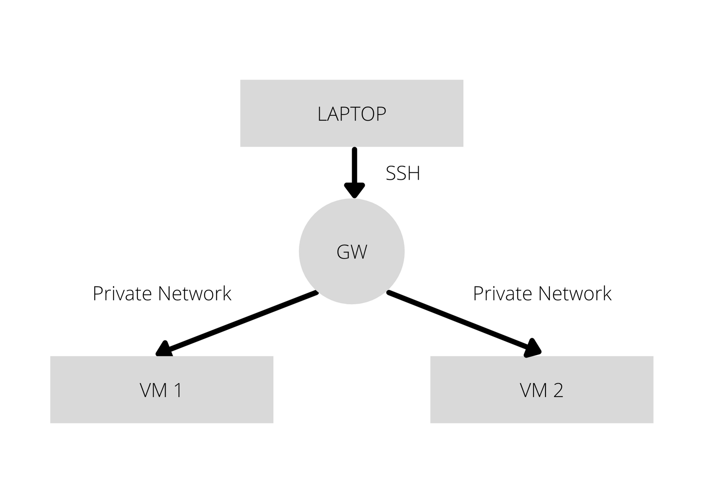

# Accelerating Ceph Cloud Storage with D4N
**Team members:** Daniel Paganelli, Khai Evdaev, Mandy Yao, Samarah Uriarte
**Mentors:** Ali Maredia, Amin Mosayyebzadeh, Mark Kogan, Matt Benjamin, Emine Ugur Kaynar
---
### Project Overview
With data volumes growing exponentially, a highly scalable storage that preserves and records digital content for ongoing or future company operations is a paramount solution to any successful business. Red Hat Ceph, an open-source software that facilitates distributed object, block, and file storage, emerged as a massively scalable storage solution for modern data pipelines to store and streamline important digital information. One of the key components in Ceph is the Reliable Autonomic Distributed Object Store (RADOS), an object-based storage system that provides a self-healing and self managing storage of unstructured data for applications. As a highly available system with no single point of failure, RADOS lays as a foundation for Ceph’s important features such as Ceph Object Gateway, Ceph Block Device and Ceph File System. 

Ceph consists of three main components that allow for a high degree of scaling: Metadata Servers (Ceph-MDs), Object Storage Devices (Ceph-OSDs), and the client. MDs dominate the metadata portion of the database and track data through a pseudo random hashing process called Controlled Replication Under Scalable Hashing (CRUSH). CRUSH is an algorithm that uses CRUSH Map as an allocation table and determines the distribution of OSDs in a given node or a network with connected computers. 

To access stored data in Ceph, one can achieve this in three ways: radosgw (RGW), librados, and RADOS block device (RBD). With RGW gateway, data can be accessed using HTTP Internet protocol. Radosgw daemon provides interfaces compatible with Amazon S3 and OpenStack Swift. On the other hand, librados is a native access which allows utilization of librados software libraries through APIs in programming languages such as C/C++, Python, Java, Ruby, and PHP. Lastly, RBD works in a way that requires a lower level integration using virtual systems like KVM/QEMU or block storage through kernel modules. 

The current version of Ceph is paired with Datacenter-Data-Delivery Network (D3N), a multi-layer cache infrastructure for data centers. Its goal is to speed up performance of big data analytics by caching commonly accessed data on computing clusters connected to a larger data lake.

This project intends to build a functioning prototype of Ceph with an improved caching system, D4N. Compared to D3N, D4N introduces a Write Back cache and a Distributed Directory that allows the program to have an accurate and efficient method of locating cached data on both a cluster’s local cache or on nearby caches based on locality. D4N functions on an old research branch of Ceph, and this project is an attempt to create a Ceph Cluster with the beneficial functionality of D4N incorporated into the modern code base. The team will incorporate blocks of D4N code, primarily the directory functionality, into D3N and modify the functions, classes, pathways, or Ceph proper to implement the directory.

---
### Goals
The goal of this project is to incorporate D4N, an upgrade to the D3N caching architecture, in Ceph’s RADOS gateway (RGW), integrate it into the upstream open source repositories and make it available to the greater Ceph community. More specifically, this project aims to expand D4N to a global stage and synchronize D4N agents or servers into a single entity which will make the hybrid model accessible. Through a collaboration between researchers at BU, NEU and Red Hat, D4N with modified RGW servers can be distributed around the datacenter, allowing data to be cached in solid state storage (SSDs) near computer clusters to reduce load on the data center network and improve performance. This project attempts but not limited to the following:

1. Make D4N start up in vstart.sh.
2. Work with Red Hat and the research team to select components of D4N and rebase them on master.
3. Developing a set of unit tests for each of those components. 
4. Develop documentation and run reviews for new introduced APIs.
5. Performance testing for different synchronization mechanisms.
6. Develop testing methodology to raise race conditions of complex distributed systems, e.g., write back while the object is being deleted - develop new interfaces to make race conditions deterministic.
7. Integrate testing into Teuthology.

---
### Requirements
This project requires three separate Virtual Machines (VMs), which the team is currently requesting from OpenStack and the Mass Open Cloud. These machines have the following specifications:

- VM One serves as a gateway and is less powerful than its fellow computers. It will run with 4 cores, 8 gigabytes of RAM, and a 64 gigabyte disk.

- VMs Two and Three act as the Ceph cluster that the team will be modifying. Each VM will have 16 cores, 32 gigabytes of RAM, and 250 gigabyte disk, along with their own floating IP addresses. All three machines will be accessed through an OpenStack Terminal. To have machines on the OpenStack, the team requires accounts for the system, which are pending.

	

<strong>Figure 1.</strong> Three VMs should be set up in total, with one acting as a gateway and the other two running the Ceph cluster.

The team will use the current Ceph source code as a target to modify the D4N code. The D4N source code is vital to the project and has its own repository. The team’s repository for modifications, improvements, and general work is available here.

---
### Business Value
This project is intended to be used by the existing Ceph community, which consists of start up companies, research institutes, and large entities such as those that already have used the storage system. Examples of previous users are the University of Kentucky, The Minnesota Supercomputing Institute, and the United States Airforce.

Users will access Ceph through the client portion of the program and benefit from the caching upgrades of D4N through accessing metadata functions and file I/O.
	
The current cloud computing trend is an increase in the use of cache storage. Implementation of D4N will allow for larger caches that place less pressure on oversubscribed cloud networks. Furthermore, D4N is intended to improve the positioning of data in caches closer to the physical access point, saving on network bandwidth. For a program such as Ceph that is designed to scale nearly infinitely, it is key that the growing distance between clients and servers is addressed.

---
### High-Level Design
Both D4N and D3N implementations in Ceph make heavy use of SSD or VRAM-based caching. The key limitation of D3N that this project addresses is the inability to access caches that are not part of the local computing cluster.

D4N solves this problem by introducing a directory (a Redis key store) that uses consistent value hashing to place important data in both a network cluster’s local cache and other neighboring caches. Upon a request for a data object’s location from a client, the RGW will access the directory for the data’s key and metadata, searching first through the local cache and then any nearby caches for the data. If these are all misses, then the program will access the primary data lake.

In our project, the four students will be split into two groups of two students. One team will focus on the implementation of the directory in our D3N Ceph cluster. The other group will work in parallel on the I/O side to ensure that cluster RGW’s can properly interact with nonlocal caches, the directory, and the data lake.

As noted above, D4N is already functioning on a non-upstream variant of Ceph. Since the project’s initial creation, Ceph has seen significant refactoring of classes, abstractions, and pathways. It will be up to each team to retool either the introduced D4N code or the base Ceph code to address these issues.

---
### Acceptance Criteria
This project’s base goals are threefold. Our Ceph cluster must be able to access the D4N style directory to get or store keys and metadata for all data stored in cache. The second minimum goal is the implementation of full non-local cache access. That is, when the client queries to write or read data, the RGW will search its own cache. If the object is not in a local cache, the directory will be called to obtain the file’s location by searching neighboring caches and then finally, the Ceph data lake. Finally, the RGW must be able to write in the Write Back Cache to be stored.

---
### Milestones and Timeline
The timeline for this project is limited in precision until the team can begin a full examination of the Ceph, D3N, and D4N code and set up the VMs. However, with contributions from the team’s mentors, a general plan of the project has been developed.

| Item | Time Estimation (Hr) | Comments  | 
|---------------------------------------------|:-----------:|:---------:|
| Week 1 09/20/21-09/26/21 |
| Team meetings with mentors | 3 | Mentors and students come together to discuss the project’s goals, structure, and nuances. | 
| Project familiarization | 5 | Team spends time learning about Ceph, D3N, and D4N. | 
| Request for environment | 1 | A requisition for three Virtual Machines on OpenStack is created. | 
| Project proposal | 5 | Due Friday 09/24 |
| Week 2 09/27/21-10/03/21 |
| Set up environment | 5 | Virtual Machines are running and have both modern Ceph and the D4N research branch installed and functioning. | 
| Code review on D4N  | 10 | Students work with mentors to thoroughly examine the D4N code. Additional meetings with Ceph developers intended. | 
| Start of D4N code writeup & team focus split | 5 | A draft of the D4N Code Writeup is started.
Team splits into two smaller subteams, focused on either the D4N directory or the background rerouting integration. |
| Week 3 10/04/21-10/10/21 |
| D4N code writeup finalized | 10 | Mentors and students come together to discuss the project’s goals, structure, and nuances. |
| Week 4 10/11/21-10/17/21 |
| Modification of D4N code | 15 | Team’s time is dedicated to work, consisting of modifying the D4N code to function on the main Ceph branch, as well as producing and implementing testing. |
| Week 5 10/18/21-10/24/21 |
| Modification of D4N code | 15 | Team’s time is dedicated to work, consisting of modifying the D4N code to function on the main Ceph branch, as well as producing and implementing testing. |
| Week 6 10/25/21-10/31/21 |
| Modification of D4N code | 15 | Team’s time is dedicated to work, consisting of modifying the D4N code to function on the main Ceph branch, as well as producing and implementing testing. |
| Week 7 11/01/21-11/07/21 |
| Modification of D4N code | 15 | Team’s time is dedicated to work, consisting of modifying the D4N code to function on the main Ceph branch, as well as producing and implementing testing. |
| Week 8 11/08/21-11/14/21 |
| Modification of D4N code | 15 | Team’s time is dedicated to work, consisting of modifying the D4N code to function on the main Ceph branch, as well as producing and implementing testing. |
| Week 9 11/15/21-11/21/21 |
| Modification of D4N code | 15 | Team’s time is dedicated to work, consisting of modifying the D4N code to function on the main Ceph branch, as well as producing and implementing testing. The bulk of the work should be completed at this time. |
| Week 10 11/22/21-11/28/21 |
| Thanksgiving break |  |  |
| Week 11 11/29/21-12/05/21 |
| Wrapping up code | 10 | Wrapping up any work not completed previously. Small-scale modifications should be occuring. |
| Transitioning and documenting | 10 | Finish writing ReadMe, transitioning documents for mentors, and final report. |
| Week 12 12/06/21-12/12/21 |
| Prepare final presentation | 10 | Create the presentation, practice presenting, and prepare for questions. |
| Week 13 12/13/21-12/15/21 |
| Project due |  |  |

---
### References
1. Batra, Aman. “D4N S3 Select Caching and the Addition of Arrow Columnar Format.” YouTube, YouTube, 7 Aug. 2021, https://www.youtube.com/watch?v=X4-s978FCtM.
2. CS6620-S21. “CS6620-S21/D4N-s3select-Caching.” GitHub, https://github.com/CS6620-S21/D4N-S3Select-Caching.
3. “Current Projects.” Current Projects - MOC Documentation, https://docs.massopen.cloud/en/latest/home.html#openstack.
4. DeCandia, Giuseppe, et al. “Dynamo: Amazon’s Highly Available Key-Value Store.” All Things Distributed, Association for Computing Machinery, 14 Oct. 2007, https://www.allthingsdistributed.com/files/amazon-dynamo-sosp2007.pdf.
5. Howard, John H., et al. “Scale and Performance in a Distributed File System .” Carnegie Mellon University School of Computer Science, ACM Transactions on Computer Systems, Feb. 1988, https://www.cs.cmu.edu/~satya/docdir/howard-tocs-afs-1988.pdf. 
6. E. U. Kaynar et al., "D3N: A multi-layer cache for the rest of us," 2019 IEEE International Conference on Big Data (Big Data), 2019, pp. 327-338, doi: 10.1109/BigData47090.2019.9006396.
7. Mosayyebzadeh, Amin, et al. “D4N: Directory Based D3N.” https://docs.google.com/presentation/d/1FiEtu3biXWdSehOekR1VGr6B6AWvRtauWu0j6KL5u-I/edit#slide=id.p. 
8. “OpenStack Tutorial Index.” OpenStack Tutorial Index - MOC Documentation, https://docs.massopen.cloud/en/latest/openstack/OpenStack-Tutorial-Index.html.
9. Platz, Carol. “Ceph Storage [A Complete Explanation].” Lightbits, 3 Sept. 2021, https://www.lightbitslabs.com/blog/ceph-storage/.
10. Request a Project.” Mass Open Cloud, https://massopen.cloud/request-an-account/.
11. Weil, Sage A., et al. “Ceph: A Scalable, High-Performance Distributed File System.” Storage Systems Research Center, USENIX Association, Nov. 2006, https://www.ssrc.ucsc.edu/media/pubs/6ebbf2736ae06c66f1293b5e431082410f41f83f.pdf.
