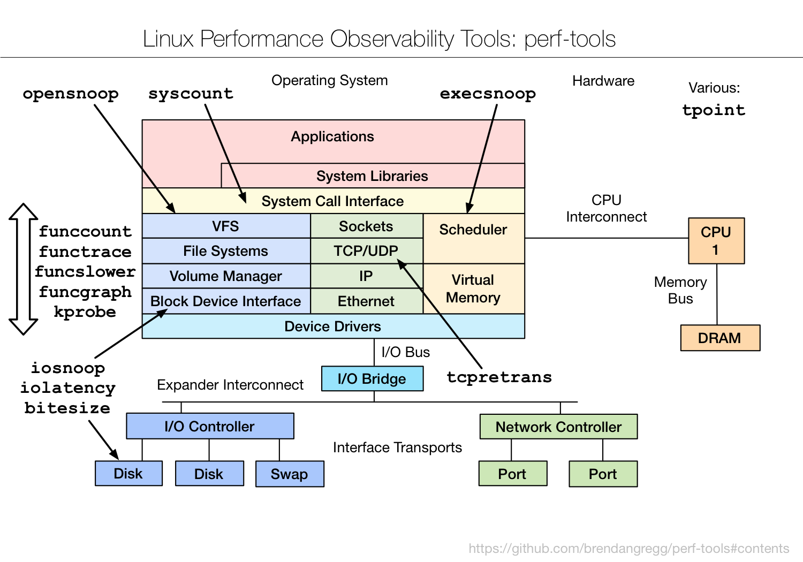

perf-tools
==========

A miscellaneous collection of in-development and unsupported performance analysis tools for Linux ftrace and perf_events (aka the "perf" command). Both ftrace and perf are core Linux tracing tools, included in the kernel source. Your system probably has ftrace already, and perf is often just a package add (see Prerequisites).

These tools are designed to be easy to install (fewest dependencies), provide advanced performance observability, and be simple to use: do one thing and do it well. This collection was created by Brendan Gregg (author of the DTraceToolkit).

Many of these tools employ workarounds so that functionality is possible on existing Linux kernels. Because of this, many tools have caveats (see man pages), and their implementation should be considered a placeholder until future kernel features, or new tracing subsystems, are added.

These are intended for Linux 3.2 and newer kernels. For Linux 2.6.x, see Warnings.

## Presentation

These tools were introduced in the USENIX LISA 2014 presentation: Linux Performance Analysis: New Tools and Old Secrets

- slides: http://www.slideshare.net/brendangregg/linux-performance-analysis-new-tools-and-old-secrets
- video: https://www.usenix.org/conference/lisa14/conference-program/presentation/gregg

## Contents
<center><a href="images/perf-tools_2016.png"></a></center>

Using ftrace:

- [iosnoop](iosnoop): trace disk I/O with details including latency. [Examples](examples/iosnoop_example.txt).
- [iolatency](iolatency): summarize disk I/O latency as a histogram. [Examples](examples/iolatency_example.txt).
- [execsnoop](execsnoop): trace process exec() with command line argument details. [Examples](examples/execsnoop_example.txt).
- [opensnoop](opensnoop): trace open() syscalls showing filenames. [Examples](examples/opensnoop_example.txt).
- [killsnoop](killsnoop): trace kill() signals showing process and signal details. [Examples](examples/killsnoop_example.txt).
- fs/[cachestat](fs/cachestat): basic cache hit/miss statistics for the Linux page cache. [Examples](examples/cachestat_example.txt).
- net/[tcpretrans](net/tcpretrans): show TCP retransmits, with address and other details. [Examples](examples/tcpretrans_example.txt).
- system/[tpoint](system/tpoint): trace a given tracepoint. [Examples](examples/tpoint_example.txt).
- kernel/[funccount](kernel/funccount): count kernel function calls, matching a string with wildcards. [Examples](examples/funccount_example.txt).
- kernel/[functrace](kernel/functrace): trace kernel function calls, matching a string with wildcards. [Examples](examples/functrace_example.txt).
- kernel/[funcslower](kernel/funcslower): trace kernel functions slower than a threshold. [Examples](examples/funcslower_example.txt).
- kernel/[funcgraph](kernel/funcgraph): trace a graph of kernel function calls, showing children and times. [Examples](examples/funcgraph_example.txt).
- kernel/[kprobe](kernel/kprobe): dynamically trace a kernel function call or its return, with variables. [Examples](examples/kprobe_example.txt).
- user/[uprobe](user/uprobe): dynamically trace a user-level function call or its return, with variables. [Examples](examples/uprobe_example.txt).
- tools/[reset-ftrace](tools/reset-ftrace): reset ftrace state if needed. [Examples](examples/reset-ftrace_example.txt).

Using perf_events:

- misc/[perf-stat-hist](misc/perf-stat-hist): power-of aggregations for tracepoint variables. [Examples](examples/perf-stat-hist_example.txt).
- [syscount](syscount): count syscalls by syscall or process. [Examples](examples/syscount_example.txt).
- disk/[bitesize](disk/bitesize): histogram summary of disk I/O size. [Examples](examples/bitesize_example.txt).

Using eBPF:

- As a preview of things to come, see the bcc tracing [Tools section](https://github.com/iovisor/bcc/blob/master/README.md#tracing). These use [bcc](https://github.com/iovisor/bcc), a front end for using [eBPF](http://www.brendangregg.com/blog/2015-05-15/ebpf-one-small-step.html). bcc+eBPF will allow some of these tools to be rewritten and improved, and additional tools to be created.

## Screenshots

Showing new processes and arguments:

<pre># <b>./execsnoop</b> 
Tracing exec()s. Ctrl-C to end.
   PID   PPID ARGS
 22898  22004 man ls
 22905  22898 preconv -e UTF-8
 22908  22898 pager -s
 22907  22898 nroff -mandoc -rLL=164n -rLT=164n -Tutf8
 22906  22898 tbl
 22911  22910 locale charmap
 22912  22907 groff -mtty-char -Tutf8 -mandoc -rLL=164n -rLT=164n
 22913  22912 troff -mtty-char -mandoc -rLL=164n -rLT=164n -Tutf8
 22914  22912 grotty
</pre>

Measuring block device I/O latency from queue insert to completion:

<pre># <b>./iolatency -Q</b>
Tracing block I/O. Output every 1 seconds. Ctrl-C to end.

  &gt;=(ms) .. &lt;(ms)   : I/O      |Distribution                          |
       0 -> 1       : 1913     |######################################|
       1 -> 2       : 438      |#########                             |
       2 -> 4       : 100      |##                                    |
       4 -> 8       : 145      |###                                   |
       8 -> 16      : 43       |#                                     |
      16 -> 32      : 43       |#                                     |
      32 -> 64      : 1        |#                                     |

[...]
</pre>

Tracing the block:block_rq_insert tracepoint, with kernel stack traces, and only for reads:

<pre># <b>./tpoint -s block:block_rq_insert 'rwbs ~ "*R*"'</b>
   cksum-11908 [000] d... 7269839.919098: block_rq_insert: 202,1 R 0 () 736560 + 136 [cksum]
   cksum-11908 [000] d... 7269839.919107: <stack trace>
 => __elv_add_request
 => blk_flush_plug_list
 => blk_finish_plug
 => __do_page_cache_readahead
 => ondemand_readahead
 => page_cache_async_readahead
 => generic_file_read_iter
 => new_sync_read
 => vfs_read
 => SyS_read
 => system_call_fastpath

[...]
</pre>

Count kernel function calls beginning with "bio_", summarize every second:

<pre># <b>./funccount -i 1 'bio_*'</b>
Tracing "bio_*"... Ctrl-C to end.

FUNC                              COUNT
bio_attempt_back_merge               26
bio_get_nr_vecs                     361
bio_alloc                           536
bio_alloc_bioset                    536
bio_endio                           536
bio_free                            536
bio_fs_destructor                   536
bio_init                            536
bio_integrity_enabled               536
bio_put                             729
bio_add_page                       1004

[...]
</pre>

There are many more examples in the [examples](examples) directory. Also see the [man pages](man/man8).

## Prerequisites

The intent is as few as possible. Eg, a Linux 3.2 server without debuginfo. See the tool man page for specifics.

### ftrace

FTRACE configured in the kernel. You may already have this configured and available in your kernel version, as FTRACE was first added in 2.6.27. This requires CONFIG_FTRACE and other FTRACE options depending on the tool. Some tools (eg, funccount) require CONFIG_FUNCTION_PROFILER.

### perf_events

Requires the "perf" command to be installed. This is in the linux-tools-common package. After installing that, perf may tell you to install an additional linux-tools package (linux-tools-_kernel_version_). perf can also be built under tools/perf in the kernel source. See [perf_events Prerequisites](http://www.brendangregg.com/perf.html#Prerequisites) for more details about getting perf_events to work fully.

### debugfs

Requires a kernel with CONFIG_DEBUG_FS option enabled. As with FTRACE, this may already be enabled (debugfs was added in 2.6.10-rc3). The debugfs also needs to be mounted:

```
# mount -t debugfs none /sys/kernel/debug
```

### awk

Many of there scripts use awk, and will try to use either mawk or gawk depending on the desired behavior: mawk for buffered output (because of its speed), and gawk for synchronous output (as fflush() works, allowing more efficient grouping of writes).

## Install

These are just scripts. Either grab everything:

```
git clone --depth 1 https://github.com/brendangregg/perf-tools
```

Or use the raw links on github to download individual scripts. Eg:

```
wget https://raw.githubusercontent.com/brendangregg/perf-tools/master/iosnoop
```

This preserves tabs (which copy-n-paste can mess up).

## Warnings

Ftrace was first added to Linux 2.6.27, and perf_events to Linux 2.6.31. These early versions had kernel bugs, and lockups and panics have been reported on 2.6.32 series kernels. This includes CentOS 6.x. If you must analyze older kernels, these tools may only be useful in a fault-tolerant environment, such as a lab with simulated issues. These tools have been primarily developed on Linux 3.2 and later kernels.

Depending on the tool, there may also be overhead incurred. See the next section.

## Internals and Overhead

perf_events is evolving. This collection began development circa Linux 3.16, with Linux 3.2 servers as the main target, at a time when perf_events lacks certain programmatic capabilities (eg, custom in-kernel aggregations). It's possible these will be added in a forthcoming kernel release. Until then, many of these tools employ workarounds, tricks, and hacks in order to work. Some of these tools pass event data to user space for post-processing, which costs much higher overhead than in-kernel aggregations. The overhead of each tool is described in its man page.

__WARNING__: In _extreme_ cases, your target application may run 5x slower when using these tools. Depending on the tool and kernel version, there may also be the risk of kernel panics. Read the program header for warnings, and test before use.

If the overhead is a problem, these tools can be improved. If a tool doesn't already, it could be rewritten in C to use perf_events_open() and mmap() for the trace buffer. It could also implement frequency counts in C, and operate on mmap() directly, rather than using awk/Perl/Python. Additional improvements are possible for ftrace-based tools, such as use of snapshots and per-instance buffers.

Some of these tools are intended as short-term workarounds until more kernel capabilities exist, at which point they can be substantially rewritten. Older versions of these tools will be kept in this repository, for older kernel versions.

As my main target is a fleet of Linux 3.2 servers that do not have debuginfo, these tools try not to require it. At times, this makes the tool more brittle than it needs to be, as I'm employing workarounds (that may be kernel version and platform specific) instead of using debuginfo information (which can be generic). See the man page for detailed prerequisites for each tool.

I've tried to use perf_events ("perf") where possible, since that interface has been developed for multi-user use. For various reasons I've often needed to use ftrace instead. ftrace is surprisingly powerful (thanks Steven Rostedt!), and not all of its features are exposed via perf, or in common usage. This tool collection is in some ways a demonstration of hidden Linux features using ftrace.

Since things are changing, it's very possible you may find some tools don't work on your Linux kernel version. Some expertise and assembly will be required to fix them.

## Links

A case study and summary:

- 13 Aug 2014: http://lwn.net/Articles/608497 Ftrace: The hidden light switch

Related articles:

- 28 Jun 2015: http://www.brendangregg.com/blog/2015-06-28/linux-ftrace-uprobe.html
- 31 Dec 2014: http://www.brendangregg.com/blog/2014-12-31/linux-page-cache-hit-ratio.html
- 06 Sep 2014: http://www.brendangregg.com/blog/2014-09-06/linux-ftrace-tcp-retransmit-tracing.html
- 28 Jul 2014: http://www.brendangregg.com/blog/2014-07-28/execsnoop-for-linux.html
- 25 Jul 2014: http://www.brendangregg.com/blog/2014-07-25/opensnoop-for-linux.html
- 23 Jul 2014: http://www.brendangregg.com/blog/2014-07-23/linux-iosnoop-latency-heat-maps.html
- 16 Jul 2014: http://www.brendangregg.com/blog/2014-07-16/iosnoop-for-linux.html
- 10 Jul 2014: http://www.brendangregg.com/blog/2014-07-10/perf-hacktogram.html
