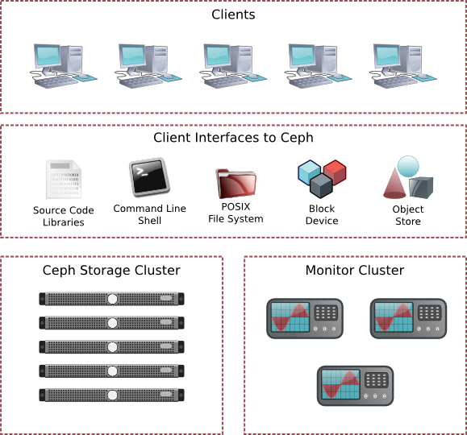

==============
 Architecture
==============

:term:`Ceph` uniquely delivers **object, block, and file storage** in one
unified system. Ceph is highly reliable, easy to manage, and free. The power of
Ceph can transform your company's IT infrastructure and your ability to manage
vast amounts of data. Ceph delivers extraordinary scalability–thousands of
clients accessing petabytes to exabytes of data. A :term:`Ceph Node` leverages
commodity hardware and intelligent daemons, and a :term:`Ceph Storage Cluster`
accommodates large numbers of nodes, which communicate with each other to
replicate and redistribute data dynamically.

The Ceph Storage Cluster
========================

Ceph provides an infinitely scalable :term:`Ceph Storage Cluster` based upon
:abbr:`RADOS (Reliable Autonomic Distributed Object Store)`, which you can read
about in `RADOS - A Scalable, Reliable Storage Service for Petabyte-scale
Storage Clusters`_.

A Ceph Storage Cluster consists of two types of daemons:

- :term:`Ceph Monitor`
- :term:`Ceph OSD Daemon`

.. ditaa::  +---------------+ +---------------+
            |      OSDs     | |    Monitors   |
            +---------------+ +---------------+

A Ceph Monitor maintains a master copy of the cluster map. A cluster of Ceph
monitors ensures high availability should a monitor daemon fail. Storage cluster
clients retrieve a copy of the cluster map from the Ceph Monitor.

A Ceph OSD Daemon checks its own state and the state of other OSDs and reports 
back to monitors.

Storage cluster clients and each :term:`Ceph OSD Daemon` use the CRUSH algorithm
to efficiently compute information about data location, instead of having to
depend on a central lookup table. Ceph's high-level features include providing a
native interface to the Ceph Storage Cluster via ``librados``, and a number of
service interfaces built on top of ``librados``.

Storing Data
------------

The Ceph Storage Cluster receives data from :term:`Ceph Clients`--whether it
comes through a :term:`Ceph Block Device`, :term:`Ceph Object Storage`, the
:term:`Ceph Filesystem` or a custom implementation you create using
``librados``--and it stores the data as objects. Each object corresponds to a
file in a filesystem, which is stored on an :term:`Object Storage Device`. Ceph
OSD Daemons handle the read/write operations on the storage disks.

.. ditaa:: /-----\       +-----+       +-----+
           | obj |------>| {d} |------>| {s} |
           \-----/       +-----+       +-----+
   
            Object         File         Disk

Ceph OSD Daemons store all data as objects in a flat namespace (e.g., no
hierarchy of directories). An object has an identifier, binary data, and
metadata consisting of a set of name/value pairs. The semantics are completely
up to :term:`Ceph Clients`. For example, CephFS uses metadata to store file
attributes such as the file owner, created date, last modified date, and so
forth.

.. ditaa:: /------+------------------------------+----------------\
           | ID   | Binary Data                  | Metadata       |
           +------+------------------------------+----------------+
           | 1234 | 0101010101010100110101010010 | name1 = value1 | 
           |      | 0101100001010100110101010010 | name2 = value2 |
           |      | 0101100001010100110101010010 | nameN = valueN |
           \------+------------------------------+----------------/    

.. note:: An object ID is unique across the entire cluster, not just the local
   filesystem.

.. index:: architecture; high availability, scalability

Scalability and High Availability
---------------------------------

In traditional architectures, clients talk to a centralized component (e.g., a
gateway, broker, API, facade, etc.), which acts as a single point of entry to a
complex subsystem. This imposes a limit to both performance and scalability,
while introducing a single point of failure (i.e., if the centralized component
goes down, the whole system goes down, too).

Ceph eliminates the centralized gateway to enable clients to interact with 
Ceph OSD Daemons directly. Ceph OSD Daemons create object replicas on other
Ceph Nodes to ensure data safety and high availability. Ceph also uses a cluster
of monitors to ensure high availability. To eliminate centralization, Ceph 
uses an algorithm called CRUSH.

.. index:: CRUSH; architecture

CRUSH Introduction
~~~~~~~~~~~~~~~~~~

Ceph Clients and Ceph OSD Daemons both use the :abbr:`CRUSH (Controlled
Replication Under Scalable Hashing)` algorithm to efficiently compute
information about object location, instead of having to depend on a
central lookup table. CRUSH provides a better data management mechanism compared
to older approaches, and enables massive scale by cleanly distributing the work
to all the clients and OSD daemons in the cluster. CRUSH uses intelligent data
replication to ensure resiliency, which is better suited to hyper-scale storage.
The following sections provide additional details on how CRUSH works. For a
detailed discussion of CRUSH, see `CRUSH - Controlled, Scalable, Decentralized
Placement of Replicated Data`_.

.. index:: architecture; cluster map

Cluster Map
~~~~~~~~~~~

Ceph depends upon Ceph Clients and Ceph OSD Daemons having knowledge of the
cluster topology, which is inclusive of 5 maps collectively referred to as the
"Cluster Map":

#. **The Monitor Map:** Contains the cluster ``fsid``, the position, name 
   address and port of each monitor. It also indicates the current epoch, 
   when the map was created, and the last time it changed. To view a monitor
   map, execute ``ceph mon dump``.   
   
#. **The OSD Map:** Contains the cluster ``fsid``, when the map was created and
   last modified, a list of pools, replica sizes, PG numbers, a list of OSDs
   and their status (e.g., ``up``, ``in``). To view an OSD map, execute
   ``ceph osd dump``. 
   
#. **The PG Map:** Contains the PG version, its time stamp, the last OSD
   map epoch, the full ratios, and details on each placement group such as
   the PG ID, the `Up Set`, the `Acting Set`, the state of the PG (e.g., 
   ``active + clean``), and data usage statistics for each pool.

#. **The CRUSH Map:** Contains a list of storage devices, the failure domain
   hierarchy (e.g., device, host, rack, row, room, etc.), and rules for 
   traversing the hierarchy when storing data. To view a CRUSH map, execute
   ``ceph osd getcrushmap -o {filename}``; then, decompile it by executing
   ``crushtool -d {comp-crushmap-filename} -o {decomp-crushmap-filename}``.
   You can view the decompiled map in a text editor or with ``cat``. 

#. **The MDS Map:** Contains the current MDS map epoch, when the map was 
   created, and the last time it changed. It also contains the pool for 
   storing metadata, a list of metadata servers, and which metadata servers
   are ``up`` and ``in``. To view an MDS map, execute ``ceph mds dump``.

Each map maintains an iterative history of its operating state changes. Ceph
Monitors maintain a master copy of the cluster map including the cluster
members, state, changes, and the overall health of the Ceph Storage Cluster.

.. index:: high availability; monitor architecture

High Availability Monitors
~~~~~~~~~~~~~~~~~~~~~~~~~~

Before Ceph Clients can read or write data, they must contact a Ceph Monitor
to obtain the most recent copy of the cluster map. A Ceph Storage Cluster
can operate with a single monitor; however, this introduces a single 
point of failure (i.e., if the monitor goes down, Ceph Clients cannot
read or write data).

For added reliability and fault tolerance, Ceph supports a cluster of monitors.
In a cluster of monitors, latency and other faults can cause one or more
monitors to fall behind the current state of the cluster. For this reason, Ceph
must have agreement among various monitor instances regarding the state of the
cluster. Ceph always uses a majority of monitors (e.g., 1, 2:3, 3:5, 4:6, etc.)
and the `Paxos`_ algorithm to establish a consensus among the monitors about the
current state of the cluster.

For details on configuring monitors, see the `Monitor Config Reference`_.

.. index:: architecture; high availability authentication

High Availability Authentication
~~~~~~~~~~~~~~~~~~~~~~~~~~~~~~~~

To identify users and protect against man-in-the-middle attacks, Ceph provides
its ``cephx`` authentication system to authenticate users and daemons.

.. note:: The ``cephx`` protocol does not address data encryption in transport 
   (e.g., SSL/TLS) or encryption at rest.

Cephx uses shared secret keys for authentication, meaning both the client and
the monitor cluster have a copy of the client's secret key. The authentication
protocol is such that both parties are able to prove to each other they have a
copy of the key without actually revealing it. This provides mutual
authentication, which means the cluster is sure the user possesses the secret
key, and the user is sure that the cluster has a copy of the secret key.

A key scalability feature of Ceph is to avoid a centralized interface to the
Ceph object store, which means that Ceph clients must be able to interact with
OSDs directly. To protect data, Ceph provides its ``cephx`` authentication
system, which authenticates users operating Ceph clients. The ``cephx`` protocol
operates in a manner with behavior similar to `Kerberos`_. 

A user/actor invokes a Ceph client to contact a monitor. Unlike Kerberos, each
monitor can authenticate users and distribute keys, so there is no single point
of failure or bottleneck when using ``cephx``. The monitor returns an
authentication data structure similar to a Kerberos ticket that contains a
session key for use in obtaining Ceph services.  This session key is itself
encrypted with the user's permanent  secret key, so that only the user can
request services from the Ceph monitor(s). The client then uses the session key
to request its desired services from the monitor, and the monitor provides the
client with a ticket that will authenticate the client to the OSDs that actually
handle data. Ceph monitors and OSDs share a secret, so the client can use the
ticket provided by the monitor with any OSD or metadata server in the cluster.
Like Kerberos, ``cephx`` tickets expire, so an attacker cannot use an expired
ticket or session key obtained surreptitiously. This form of authentication will
prevent attackers with access to the communications medium from either creating
bogus messages under another user's identity or altering another user's
legitimate messages, as long as the user's secret key is not divulged before it
expires.

To use ``cephx``, an administrator must set up users first. In the following
diagram, the ``client.admin`` user invokes  ``ceph auth get-or-create-key`` from
the command line to generate a username and secret key. Ceph's ``auth``
subsystem generates the username and key, stores a copy with the monitor(s) and
transmits the user's secret back to the ``client.admin`` user. This means that 
the client and the monitor share a secret key.

.. note:: The ``client.admin`` user must provide the user ID and 
   secret key to the user in a secure manner. 

.. ditaa:: +---------+     +---------+
           | Client  |     | Monitor |
           +---------+     +---------+
                |  request to   |
                | create a user |
                |-------------->|----------+ create user
                |               |          | and                 
                |<--------------|<---------+ store key
                | transmit key  |
                |               |

To authenticate with the monitor, the client passes in the user name to the
monitor, and the monitor generates a session key and encrypts it with the secret
key associated to the user name. Then, the monitor transmits the encrypted
ticket back to the client. The client then decrypts the payload with the shared
secret key to retrieve the session key. The session key identifies the user for
the current session. The client then requests a ticket on behalf of the user
signed by the session key. The monitor generates a ticket, encrypts it with the
user's secret key and transmits it back to the client. The client decrypts the
ticket and uses it to sign requests to OSDs and metadata servers throughout the
cluster.

.. ditaa:: +---------+     +---------+
           | Client  |     | Monitor |
           +---------+     +---------+
                |  authenticate |
                |-------------->|----------+ generate and
                |               |          | encrypt                
                |<--------------|<---------+ session key
                | transmit      |
                | encrypted     |
                | session key   |
                |               |             
                |-----+ decrypt |
                |     | session | 
                |<----+ key     |              
                |               |
                |  req. ticket  |
                |-------------->|----------+ generate and
                |               |          | encrypt                
                |<--------------|<---------+ ticket
                | recv. ticket  |
                |               |             
                |-----+ decrypt |
                |     | ticket  | 
                |<----+         |              

The ``cephx`` protocol authenticates ongoing communications between the client
machine and the Ceph servers. Each message sent between a client and server,
subsequent to the initial authentication, is signed using a ticket that the
monitors, OSDs and metadata servers can verify with their shared secret.

.. ditaa:: +---------+     +---------+     +-------+     +-------+
           |  Client |     | Monitor |     |  MDS  |     |  OSD  |
           +---------+     +---------+     +-------+     +-------+
                |  request to   |              |             |
                | create a user |              |             |               
                |-------------->| mon and      |             |
                |<--------------| client share |             |
                |    receive    | a secret.    |             |
                | shared secret |              |             |
                |               |<------------>|             |
                |               |<-------------+------------>|
                |               | mon, mds,    |             |
                | authenticate  | and osd      |             |  
                |-------------->| share        |             |
                |<--------------| a secret     |             |
                |  session key  |              |             |
                |               |              |             |
                |  req. ticket  |              |             |
                |-------------->|              |             |
                |<--------------|              |             |
                | recv. ticket  |              |             |
                |               |              |             |
                |   make request (CephFS only) |             |
                |----------------------------->|             |
                |<-----------------------------|             |
                | receive response (CephFS only)             |
                |                                            |
                |                make request                |
                |------------------------------------------->|  
                |<-------------------------------------------|
                               receive response

The protection offered by this authentication is between the Ceph client and the
Ceph server hosts. The authentication is not extended beyond the Ceph client. If
the user accesses the Ceph client from a remote host, Ceph authentication is not
applied to the connection between the user's host and the client host.

For configuration details, see `Cephx Config Guide`_. For user management 
details, see `User Management`_.

.. index:: architecture; smart daemons and scalability

Smart Daemons Enable Hyperscale
~~~~~~~~~~~~~~~~~~~~~~~~~~~~~~~

In many clustered architectures, the primary purpose of cluster membership is 
so that a centralized interface knows which nodes it can access. Then the
centralized interface provides services to the client through a double
dispatch--which is a **huge** bottleneck at the petabyte-to-exabyte scale.

Ceph eliminates the bottleneck: Ceph's OSD Daemons AND Ceph Clients are cluster
aware. Like Ceph clients, each Ceph OSD Daemon knows about other Ceph OSD
Daemons in the cluster.  This enables Ceph OSD Daemons to interact directly with
other Ceph OSD Daemons and Ceph monitors. Additionally, it enables Ceph Clients
to interact directly with Ceph OSD Daemons.

The ability of Ceph Clients, Ceph Monitors and Ceph OSD Daemons to interact with
each other means that Ceph OSD Daemons can utilize the CPU and RAM of the Ceph
nodes to easily perform tasks that would bog down a centralized server. The
ability to leverage this computing power leads to several major benefits:

#. **OSDs Service Clients Directly:** Since any network device has a limit to 
   the number of concurrent connections it can support, a centralized system 
   has a low physical limit at high scales. By enabling Ceph Clients to contact 
   Ceph OSD Daemons directly, Ceph increases both performance and total system 
   capacity simultaneously, while removing a single point of failure. Ceph 
   Clients can maintain a session when they need to, and with a particular Ceph 
   OSD Daemon instead of a centralized server.

#. **OSD Membership and Status**: Ceph OSD Daemons join a cluster and report 
   on their status. At the lowest level, the Ceph OSD Daemon status is ``up`` 
   or ``down`` reflecting whether or not it is running and able to service 
   Ceph Client requests. If a Ceph OSD Daemon is ``down`` and ``in`` the Ceph 
   Storage Cluster, this status may indicate the failure of the Ceph OSD 
   Daemon. If a Ceph OSD Daemon is not running (e.g., it crashes), the Ceph OSD 
   Daemon cannot notify the Ceph Monitor that it is ``down``. The Ceph Monitor 
   can ping a Ceph OSD Daemon periodically to ensure that it is running. 
   However, Ceph also empowers Ceph OSD Daemons to determine if a neighboring 
   OSD is ``down``, to update the cluster map and to report it to the Ceph 
   monitor(s). This means that Ceph monitors can remain light weight processes. 
   See `Monitoring OSDs`_ and `Heartbeats`_ for additional details.
   
#. **Data Scrubbing:** As part of maintaining data consistency and cleanliness, 
   Ceph OSD Daemons can scrub objects within placement groups. That is, Ceph 
   OSD Daemons can compare object metadata in one placement group with its 
   replicas in placement groups stored on other OSDs. Scrubbing (usually 
   performed daily) catches bugs or filesystem errors. Ceph OSD Daemons also 
   perform deeper scrubbing by comparing data in objects bit-for-bit. Deep 
   scrubbing (usually performed weekly) finds bad sectors on a drive that 
   weren't apparent in a light scrub. See `Data Scrubbing`_ for details on 
   configuring scrubbing.

#. **Replication:** Like Ceph Clients, Ceph OSD Daemons use the CRUSH 
   algorithm, but the Ceph OSD Daemon uses it to compute where replicas of 
   objects should be stored (and for rebalancing). In a typical write scenario, 
   a client uses the CRUSH algorithm to compute where to store an object, maps 
   the object to a pool and placement group, then looks at the CRUSH map to 
   identify the primary OSD for the placement group.
   
   The client writes the object to the identified placement group in the 
   primary OSD. Then, the primary OSD with its own copy of the CRUSH map 
   identifies the secondary and tertiary OSDs for replication purposes, and 
   replicates the object to the appropriate placement groups in the secondary 
   and tertiary OSDs (as many OSDs as additional replicas), and responds to the
   client once it has confirmed the object was stored successfully.

.. ditaa:: 
             +----------+
             |  Client  |
             |          |
             +----------+
                 *  ^
      Write (1)  |  |  Ack (6)
                 |  |
                 v  *
            +-------------+
            | Primary OSD |
            |             |
            +-------------+
              *  ^   ^  *
    Write (2) |  |   |  |  Write (3)
       +------+  |   |  +------+
       |  +------+   +------+  |
       |  | Ack (4)  Ack (5)|  | 
       v  *                 *  v
 +---------------+   +---------------+
 | Secondary OSD |   | Tertiary OSD  |
 |               |   |               |
 +---------------+   +---------------+

With the ability to perform data replication, Ceph OSD Daemons relieve Ceph
clients from that duty, while ensuring high data availability and data safety.

Dynamic Cluster Management
--------------------------

In the `Scalability and High Availability`_ section, we explained how Ceph uses
CRUSH, cluster awareness and intelligent daemons to scale and maintain high
availability. Key to Ceph's design is the autonomous, self-healing, and
intelligent Ceph OSD Daemon. Let's take a deeper look at how CRUSH works to
enable modern cloud storage infrastructures to place data, rebalance the cluster
and recover from faults dynamically.

.. index:: architecture; pools

About Pools
~~~~~~~~~~~

The Ceph storage system supports the notion of 'Pools', which are logical
partitions for storing objects.

Ceph Clients retrieve a `Cluster Map`_ from a Ceph Monitor, and write objects to
pools. The pool's ``size`` or number of replicas, the CRUSH ruleset and the
number of placement groups determine how Ceph will place the data.

.. ditaa:: 
            +--------+  Retrieves  +---------------+
            | Client |------------>|  Cluster Map  |
            +--------+             +---------------+
                 |
                 v      Writes
              /-----\
              | obj |
              \-----/
                 |      To
                 v
            +--------+           +---------------+
            |  Pool  |---------->| CRUSH Ruleset |
            +--------+  Selects  +---------------+
                 

Pools set at least the following parameters:

- Ownership/Access to Objects
- The Number of Placement Groups, and 
- The CRUSH Ruleset to Use.

See `Set Pool Values`_ for details.

.. index: architecture; placement group mapping

Mapping PGs to OSDs
~~~~~~~~~~~~~~~~~~~

Each pool has a number of placement groups. CRUSH maps PGs to OSDs dynamically.
When a Ceph Client stores objects, CRUSH will map each object to a placement
group.

Mapping objects to placement groups creates a layer of indirection between the
Ceph OSD Daemon and the Ceph Client. The Ceph Storage Cluster must be able to
grow (or shrink) and rebalance where it stores objects dynamically. If the Ceph
Client "knew" which Ceph OSD Daemon had which object, that would create a tight
coupling between the Ceph Client and the Ceph OSD Daemon. Instead, the CRUSH
algorithm maps each object to a placement group and then maps each placement
group to one or more Ceph OSD Daemons. This layer of indirection allows Ceph to
rebalance dynamically when new Ceph OSD Daemons and the underlying OSD devices
come online. The following diagram depicts how CRUSH maps objects to placement
groups, and placement groups to OSDs.

.. ditaa:: 
           /-----\  /-----\  /-----\  /-----\  /-----\
           | obj |  | obj |  | obj |  | obj |  | obj |
           \-----/  \-----/  \-----/  \-----/  \-----/
              |        |        |        |        |
              +--------+--------+        +---+----+
              |                              |
              v                              v
   +-----------------------+      +-----------------------+
   |  Placement Group #1   |      |  Placement Group #2   |
   |                       |      |                       |
   +-----------------------+      +-----------------------+
               |                              |
               |      +-----------------------+---+
        +------+------+-------------+             |
        |             |             |             |
        v             v             v             v
   /----------\  /----------\  /----------\  /----------\ 
   |          |  |          |  |          |  |          |
   |  OSD #1  |  |  OSD #2  |  |  OSD #3  |  |  OSD #4  |
   |          |  |          |  |          |  |          |
   \----------/  \----------/  \----------/  \----------/  

With a copy of the cluster map and the CRUSH algorithm, the client can compute
exactly which OSD to use when reading or writing a particular object.

.. index:: architecture; calculating PG IDs

Calculating PG IDs
~~~~~~~~~~~~~~~~~~

When a Ceph Client binds to a Ceph Monitor, it retrieves the latest copy of the
`Cluster Map`_. With the cluster map, the client knows about all of the monitors,
OSDs, and metadata servers in the cluster. **However, it doesn't know anything
about object locations.** 

.. epigraph:: 

	Object locations get computed.

The only input required by the client is the object ID and the pool.
It's simple: Ceph stores data in named pools (e.g., "liverpool"). When a client
wants to store a named object (e.g., "john," "paul," "george," "ringo", etc.)
it calculates a placement group using the object name, a hash code, the
number of PGs in the pool and the pool name. Ceph clients use the following
steps to compute PG IDs.

#. The client inputs the pool ID and the object ID. (e.g., pool = "liverpool" 
   and object-id = "john")
#. Ceph takes the object ID and hashes it.
#. Ceph calculates the hash modulo the number of PGs. (e.g., ``58``) to get 
   a PG ID.
#. Ceph gets the pool ID given the pool name (e.g., "liverpool" = ``4``)
#. Ceph prepends the pool ID to the PG ID (e.g., ``4.58``).

Computing object locations is much faster than performing object location query
over a chatty session. The :abbr:`CRUSH (Controlled Replication Under Scalable
Hashing)` algorithm allows a client to compute where objects *should* be stored,
and enables the client to contact the primary OSD to store or retrieve the
objects.

.. index:: architecture; PG Peering

Peering and Sets
~~~~~~~~~~~~~~~~

In previous sections, we noted that Ceph OSD Daemons check each others
heartbeats and report back to the Ceph Monitor. Another thing Ceph OSD daemons
do is called 'peering', which is the process of bringing all of the OSDs that
store a Placement Group (PG) into agreement about the state of all of the
objects (and their metadata) in that PG. In fact, Ceph OSD Daemons `Report
Peering Failure`_ to the Ceph Monitors. Peering issues  usually resolve
themselves; however, if the problem persists, you may need to refer to the
`Troubleshooting Peering Failure`_ section.

.. Note:: Agreeing on the state does not mean that the PGs have the latest contents.

The Ceph Storage Cluster was designed to store at least two copies of an object
(i.e., ``size = 2``), which is the minimum requirement for data safety. For high
availability, a Ceph Storage Cluster should store more than two copies of an object
(e.g., ``size = 3`` and ``min size = 2``) so that it can continue to run in a 
``degraded`` state while maintaining data safety.

Referring back to the diagram in `Smart Daemons Enable Hyperscale`_, we do not 
name the Ceph OSD Daemons specifically (e.g., ``osd.0``, ``osd.1``, etc.), but 
rather refer to them as *Primary*, *Secondary*, and so forth. By convention, 
the *Primary* is the first OSD in the *Acting Set*, and is responsible for 
coordinating the peering process for each placement group where it acts as 
the *Primary*, and is the **ONLY** OSD that that will accept client-initiated 
writes to objects for a given placement group where it acts as the *Primary*.

When a series of OSDs are responsible for a placement group, that series of
OSDs, we refer to them as an *Acting Set*. An *Acting Set* may refer to the Ceph
OSD Daemons that are currently responsible for the placement group, or the Ceph
OSD Daemons that were responsible  for a particular placement group as of some
epoch.

The Ceph OSD daemons that are part of an *Acting Set* may not always be  ``up``.
When an OSD in the *Acting Set* is ``up``, it is part of the  *Up Set*. The *Up
Set* is an important distinction, because Ceph can remap PGs to other Ceph OSD
Daemons when an OSD fails. 

.. note:: In an *Acting Set* for a PG containing ``osd.25``, ``osd.32`` and 
   ``osd.61``, the first OSD, ``osd.25``, is the *Primary*. If that OSD fails,
   the Secondary, ``osd.32``, becomes the *Primary*, and ``osd.25`` will be 
   removed from the *Up Set*.

.. index:: architecture; Rebalancing

Rebalancing
~~~~~~~~~~~

When you add a Ceph OSD Daemon to a Ceph Storage Cluster, the cluster map gets
updated with the new OSD. Referring back to `Calculating PG IDs`_, this changes
the cluster map. Consequently, it changes object placement, because it changes
an input for the calculations. The following diagram depicts the rebalancing
process (albeit rather crudely, since it is substantially less impactful with
large clusters) where some, but not all of the PGs migrate from existing OSDs
(OSD 1, and OSD 2) to the new OSD (OSD 3). Even when rebalancing, CRUSH is
stable. Many of the placement groups remain in their original configuration,
and each OSD gets some added capacity, so there are no load spikes on the 
new OSD after rebalancing is complete.

.. ditaa:: 
           +--------+     +--------+
   Before  |  OSD 1 |     |  OSD 2 |
           +--------+     +--------+
           |  PG #1 |     | PG #6  |
           |  PG #2 |     | PG #7  |
           |  PG #3 |     | PG #8  |
           |  PG #4 |     | PG #9  |
           |  PG #5 |     | PG #10 |
           +--------+     +--------+

           +--------+     +--------+     +--------+
    After  |  OSD 1 |     |  OSD 2 |     |  OSD 3 |
           +--------+     +--------+     +--------+
           |  PG #1 |     | PG #7  |     |  PG #3 |
           |  PG #2 |     | PG #8  |     |  PG #6 |
           |  PG #4 |     | PG #10 |     |  PG #9 |
           |  PG #5 |     |        |     |        |
           |        |     |        |     |        |
           +--------+     +--------+     +--------+

.. index:: architecture; Data Scrubbing

Data Consistency
~~~~~~~~~~~~~~~~

As part of maintaining data consistency and cleanliness, Ceph OSDs can also
scrub objects within placement groups. That is, Ceph OSDs can compare object
metadata in one placement group with its replicas in placement groups stored in
other OSDs. Scrubbing (usually performed daily) catches OSD bugs or filesystem
errors.  OSDs can also perform deeper scrubbing by comparing data in objects
bit-for-bit.  Deep scrubbing (usually performed weekly) finds bad sectors on a
disk that weren't apparent in a light scrub.

See `Data Scrubbing`_ for details on configuring scrubbing.

.. index:: erasure coding

Erasure Coding
--------------

An erasure coded pool stores each object as ``K+M`` chunks. It is divided into
``K`` data chunks and ``M`` coding chunks. The pool is configured to have a size
of ``K+M`` so that each chunk is stored in an OSD in the acting set. The rank of
the chunk is stored as an attribute of the object.

For instance an erasure coded pool is created to use five OSDs (``K+M = 5``) and
sustain the loss of two of them (``M = 2``).

Reading and Writing Encoded Chunks
~~~~~~~~~~~~~~~~~~~~~~~~~~~~~~~~~~

When the object **NYAN** containing ``ABCDEFGHI`` is written to the pool, the erasure
encoding function splits the content into three data chunks simply by dividing
the content in three: the first contains ``ABC``, the second ``DEF`` and the
last ``GHI``. The content will be padded if the content length is not a multiple
of ``K``. The function also creates two coding chunks: the fourth with ``YXY``
and the fifth with ``GQC``. Each chunk is stored in an OSD in the acting set.
The chunks are stored in objects that have the same name (**NYAN**) but reside
on different OSDs. The order in which the chunks were created must be preserved
and is stored as an attribute of the object (``shard_t``), in addition to its
name. Chunk 1 contains ``ABC`` and is stored on **OSD5** while chunk 4 contains
``YXY`` and is stored on **OSD3**.

.. ditaa::
                            +-------------------+
                       name |       NYAN        |
                            +-------------------+
                    content |     ABCDEFGHI     |
                            +--------+----------+
                                     |
                                     |
                                     v
                              +------+------+
              +---------------+ encode(3,2) +-----------+
              |               +--+--+---+---+           |
              |                  |  |   |               |
              |          +-------+  |   +-----+         |
              |          |          |         |         |
           +--v---+   +--v---+   +--v---+  +--v---+  +--v---+
     name  | NYAN |   | NYAN |   | NYAN |  | NYAN |  | NYAN |
           +------+   +------+   +------+  +------+  +------+
    shard  |  1   |   |  2   |   |  3   |  |  4   |  |  5   |
           +------+   +------+   +------+  +------+  +------+
  content  | ABC  |   | DEF  |   | GHI  |  | YXY  |  | QGC  |
           +--+---+   +--+---+   +--+---+  +--+---+  +--+---+
              |          |          |         |         |
              |          |          v         |         |
              |          |       +--+---+     |         |
              |          |       | OSD1 |     |         |
              |          |       +------+     |         |
              |          |                    |         |
              |          |       +------+     |         |
              |          +------>| OSD2 |     |         |
              |                  +------+     |         |
              |                               |         |
              |                  +------+     |         |
              |                  | OSD3 |<----+         |
              |                  +------+               |
              |                                         |
              |                  +------+               |
              |                  | OSD4 |<--------------+
              |                  +------+
              |
              |                  +------+
              +----------------->| OSD5 |
                                 +------+

When the object **NYAN** is read from the erasure coded pool, the decoding
function reads three chunks: chunk 1 containing ``ABC``, chunk 3 containing
``GHI`` and chunk 4 containing ``YXY``. Then, it rebuilds the original content
of the object ``ABCDEFGHI``. The decoding function is informed that the chunks 2
and 5 are missing (they are called 'erasures'). The chunk 5 could not be read
because the **OSD4** is out. The decoding function can be called as soon as
three chunks are read: **OSD2** was the slowest and its chunk was not taken into
account.

.. ditaa::
	                         +-------------------+
	                    name |       NYAN        |
	                         +-------------------+
	                 content |     ABCDEFGHI     |
	                         +---------+---------+
	                                   ^
	                                   |
	                                   |
	                           +-------+-------+
	                           |  decode(3,2)  |
	            +------------->+  erasures 2,5 +<-+
	            |              |               |  |
	            |              +-------+-------+  |
	            |                      ^          |
	            |                      |          | 
	            |                      |          |
	         +--+---+   +------+   +---+--+   +---+--+
	   name  | NYAN |   | NYAN |   | NYAN |   | NYAN |
	         +------+   +------+   +------+   +------+
	  shard  |  1   |   |  2   |   |  3   |   |  4   |
	         +------+   +------+   +------+   +------+
	content  | ABC  |   | DEF  |   | GHI  |   | YXY  |
	         +--+---+   +--+---+   +--+---+   +--+---+
	            ^          .          ^          ^
	            |    TOO   .          |          |
	            |    SLOW  .       +--+---+      |
	            |          ^       | OSD1 |      |
	            |          |       +------+      |
	            |          |                     |
	            |          |       +------+      |
	            |          +-------| OSD2 |      |
	            |                  +------+      |
	            |                                |
	            |                  +------+      |
	            |                  | OSD3 |------+
	            |                  +------+
	            |
	            |                  +------+
	            |                  | OSD4 | OUT
	            |                  +------+
	            |
	            |                  +------+
	            +------------------| OSD5 |
	                               +------+

Interrupted Full Writes
~~~~~~~~~~~~~~~~~~~~~~~

In an erasure coded pool, the primary OSD in the up set receives all write
operations. It is responsible for encoding the payload into ``K+M`` chunks and
sends them to the other OSDs. It is also responsible for maintaining an
authoritative version of the placement group logs.

In the following diagram, an erasure coded placement group has been created with
``K = 2 + M = 1`` and is supported by three OSDs, two for ``K`` and one for
``M``. The acting set of the placement group is made of **OSD 1**, **OSD 2** and
**OSD 3**. An object has been encoded and stored in the OSDs : the chunk
``D1v1`` (i.e. Data chunk number 1, version 1) is on **OSD 1**, ``D2v1`` on
**OSD 2** and ``C1v1`` (i.e. Coding chunk number 1, version 1) on **OSD 3**. The
placement group logs on each OSD are identical (i.e. ``1,1`` for epoch 1,
version 1).

.. ditaa::
     Primary OSD
    
   +-------------+
   |    OSD 1    |             +-------------+
   |         log |  Write Full |             |
   |  +----+     |<------------+ Ceph Client |
   |  |D1v1| 1,1 |      v1     |             |
   |  +----+     |             +-------------+
   +------+------+
          |
          |
          |          +-------------+
          |          |    OSD 2    |
          |          |         log |
          +--------->+  +----+     |
          |          |  |D2v1| 1,1 |
          |          |  +----+     |
          |          +-------------+
          |
          |          +-------------+
          |          |    OSD 3    |
          |          |         log |
          +--------->|  +----+     |
                     |  |C1v1| 1,1 |
                     |  +----+     |
                     +-------------+

**OSD 1** is the primary and receives a **WRITE FULL** from a client, which
means the payload is to replace the object entirely instead of overwriting a
portion of it. Version 2 (v2) of the object is created to override version 1
(v1). **OSD 1** encodes the payload into three chunks: ``D1v2`` (i.e. Data
chunk number 1 version 2) will be on **OSD 1**, ``D2v2`` on **OSD 2** and
``C1v2`` (i.e. Coding chunk number 1 version 2) on **OSD 3**. Each chunk is sent
to the target OSD, including the primary OSD which is responsible for storing
chunks in addition to handling write operations and maintaining an authoritative
version of the placement group logs. When an OSD receives the message
instructing it to write the chunk, it also creates a new entry in the placement
group logs to reflect the change. For instance, as soon as **OSD 3** stores
``C1v2``, it adds the entry ``1,2`` ( i.e. epoch 1, version 2 ) to its logs.
Because the OSDs work asynchronously, some chunks may still be in flight ( such
as ``D2v2`` ) while others are acknowledged and on disk ( such as ``C1v1`` and
``D1v1``).

.. ditaa::

     Primary OSD
    
   +-------------+
   |    OSD 1    |
   |         log |
   |  +----+     |             +-------------+
   |  |D1v2| 1,2 |  Write Full |             |
   |  +----+     +<------------+ Ceph Client |
   |             |      v2     |             |
   |  +----+     |             +-------------+
   |  |D1v1| 1,1 |           
   |  +----+     |           
   +------+------+           
          |                  
          |                  
          |           +------+------+
          |           |    OSD 2    |
          |  +------+ |         log |
          +->| D2v2 | |  +----+     |
          |  +------+ |  |D2v1| 1,1 |
          |           |  +----+     |
          |           +-------------+
          |
          |           +-------------+
          |           |    OSD 3    |
          |           |         log |
          |           |  +----+     |
          |           |  |C1v2| 1,2 |
          +---------->+  +----+     |
                      |             |
                      |  +----+     |
                      |  |C1v1| 1,1 |
                      |  +----+     |
                      +-------------+

If all goes well, the chunks are acknowledged on each OSD in the acting set and
the logs' ``last_complete`` pointer can move from ``1,1`` to ``1,2``.

.. ditaa::

     Primary OSD
    
   +-------------+
   |    OSD 1    |
   |         log |
   |  +----+     |             +-------------+
   |  |D1v2| 1,2 |  Write Full |             |
   |  +----+     +<------------+ Ceph Client |
   |             |      v2     |             |
   |  +----+     |             +-------------+
   |  |D1v1| 1,1 |           
   |  +----+     |           
   +------+------+           
          |                  
          |           +-------------+
          |           |    OSD 2    |
          |           |         log |
          |           |  +----+     |
          |           |  |D2v2| 1,2 |
          +---------->+  +----+     |
          |           |             |
          |           |  +----+     |
          |           |  |D2v1| 1,1 |
          |           |  +----+     |
          |           +-------------+
          |                  
          |           +-------------+
          |           |    OSD 3    |
          |           |         log |
          |           |  +----+     |
          |           |  |C1v2| 1,2 |
          +---------->+  +----+     |
                      |             |
                      |  +----+     |
                      |  |C1v1| 1,1 |
                      |  +----+     |
                      +-------------+

Finally, the files used to store the chunks of the previous version of the
object can be removed: ``D1v1`` on **OSD 1**, ``D2v1`` on **OSD 2** and ``C1v1``
on **OSD 3**.

.. ditaa::
     Primary OSD
    
   +-------------+
   |    OSD 1    |
   |         log |
   |  +----+     |
   |  |D1v2| 1,2 |
   |  +----+     |
   +------+------+
          |
          |
          |          +-------------+
          |          |    OSD 2    |
          |          |         log |
          +--------->+  +----+     |
          |          |  |D2v2| 1,2 |
          |          |  +----+     |
          |          +-------------+
          |
          |          +-------------+
          |          |    OSD 3    |
          |          |         log |
          +--------->|  +----+     |
                     |  |C1v2| 1,2 |
                     |  +----+     |
                     +-------------+

But accidents happen. If **OSD 1** goes down while ``D2v2`` is still in flight,
the object's version 2 is partially written: **OSD 3** has one chunk but that is
not enough to recover. It lost two chunks: ``D1v2`` and ``D2v2`` and the
erasure coding parameters ``K = 2``, ``M = 1`` require that at least two chunks are
available to rebuild the third. **OSD 4** becomes the new primary and finds that
the ``last_complete`` log entry (i.e., all objects before this entry were known
to be available on all OSDs in the previous acting set ) is ``1,1`` and that
will be the head of the new authoritative log.

.. ditaa::
   +-------------+
   |    OSD 1    |
   |   (down)    |
   | c333        |
   +------+------+
          |                  
          |           +-------------+
          |           |    OSD 2    |
          |           |         log |
          |           |  +----+     |
          +---------->+  |D2v1| 1,1 |
          |           |  +----+     |
          |           |             |
          |           +-------------+
          |                  
          |           +-------------+
          |           |    OSD 3    |
          |           |         log |
          |           |  +----+     |
          |           |  |C1v2| 1,2 |
          +---------->+  +----+     |
                      |             |
                      |  +----+     |
                      |  |C1v1| 1,1 |
                      |  +----+     |
                      +-------------+
     Primary OSD
   +-------------+
   |    OSD 4    |
   |         log |
   |             |
   |         1,1 |
   |             |
   +------+------+
          

The log entry 1,2 found on **OSD 3** is divergent from the new authoritative log
provided by **OSD 4**: it is discarded and the file containing the ``C1v2``
chunk is removed. The ``D1v1`` chunk is rebuilt with the ``decode`` function of
the erasure coding library during scrubbing and stored on the new primary 
**OSD 4**.

.. ditaa::
     Primary OSD
    
   +-------------+
   |    OSD 4    |
   |         log |
   |  +----+     |
   |  |D1v1| 1,1 |
   |  +----+     |
   +------+------+
          ^
          |
          |          +-------------+
          |          |    OSD 2    |
          |          |         log |
          +----------+  +----+     |
          |          |  |D2v1| 1,1 |
          |          |  +----+     |
          |          +-------------+
          |
          |          +-------------+
          |          |    OSD 3    |
          |          |         log |
          +----------|  +----+     |
                     |  |C1v1| 1,1 |
                     |  +----+     |
                     +-------------+

   +-------------+
   |    OSD 1    |
   |   (down)    |
   | c333        |
   +-------------+

See `Erasure Code Notes`_ for additional details.

Cache Tiering
-------------

A cache tier provides Ceph Clients with better I/O performance for a subset of
the data stored in a backing storage tier. Cache tiering involves creating a
pool of relatively fast/expensive storage devices (e.g., solid state drives)
configured to act as a cache tier, and a backing pool of either erasure-coded
or relatively slower/cheaper devices configured to act as an economical storage
tier. The Ceph objecter handles where to place the objects and the tiering
agent determines when to flush objects from the cache to the backing storage
tier. So the cache tier and the backing storage tier are completely transparent 
to Ceph clients.

.. ditaa:: 
           +-------------+
           | Ceph Client |
           +------+------+
                  ^
     Tiering is   |  
    Transparent   |              Faster I/O
        to Ceph   |           +---------------+
     Client Ops   |           |               |   
                  |    +----->+   Cache Tier  |
                  |    |      |               |
                  |    |      +-----+---+-----+
                  |    |            |   ^ 
                  v    v            |   |   Active Data in Cache Tier
           +------+----+--+         |   |
           |   Objecter   |         |   |
           +-----------+--+         |   |
                       ^            |   |   Inactive Data in Storage Tier
                       |            v   |
                       |      +-----+---+-----+
                       |      |               |
                       +----->|  Storage Tier |
                              |               |
                              +---------------+
                                 Slower I/O

See `Cache Tiering`_ for additional details.

.. index:: Extensibility, Ceph Classes

Extending Ceph
--------------

You can extend Ceph by creating shared object classes called 'Ceph Classes'.
Ceph loads ``.so`` classes stored in the ``osd class dir`` directory dynamically
(i.e., ``$libdir/rados-classes`` by default). When you implement a class, you
can create new object methods that have the ability to call the native methods
in the Ceph Object Store, or other class methods you incorporate via libraries
or create yourself.

On writes, Ceph Classes can call native or class methods, perform any series of
operations on the inbound data and generate a resulting write transaction  that
Ceph will apply atomically.

On reads, Ceph Classes can call native or class methods, perform any series of
operations on the outbound data and return the data to the client.

.. topic:: Ceph Class Example

   A Ceph class for a content management system that presents pictures of a
   particular size and aspect ratio could take an inbound bitmap image, crop it
   to a particular aspect ratio, resize it and embed an invisible copyright or 
   watermark to help protect the intellectual property; then, save the 
   resulting bitmap image to the object store.

See ``src/objclass/objclass.h``, ``src/fooclass.cc`` and ``src/barclass`` for 
exemplary implementations.

Summary
-------

Ceph Storage Clusters are dynamic--like a living organism. Whereas, many storage
appliances do not fully utilize the CPU and RAM of a typical commodity server,
Ceph does. From heartbeats, to  peering, to rebalancing the cluster or
recovering from faults,  Ceph offloads work from clients (and from a centralized
gateway which doesn't exist in the Ceph architecture) and uses the computing
power of the OSDs to perform the work. When referring to `Hardware
Recommendations`_ and the `Network Config Reference`_,  be cognizant of the
foregoing concepts to understand how Ceph utilizes computing resources.

.. index:: Ceph Protocol, librados

Ceph Protocol
=============

Ceph Clients use the native protocol for interacting with the Ceph Storage
Cluster. Ceph packages this functionality into the ``librados`` library so that
you can create your own custom Ceph Clients. The following diagram depicts the
basic architecture.

.. ditaa::  
            +---------------------------------+
            |  Ceph Storage Cluster Protocol  |
            |           (librados)            |
            +---------------------------------+
            +---------------+ +---------------+
            |      OSDs     | |    Monitors   |
            +---------------+ +---------------+

Native Protocol and ``librados``
--------------------------------

Modern applications need a simple object storage interface with asynchronous
communication capability. The Ceph Storage Cluster provides a simple object
storage interface with asynchronous communication capability. The interface
provides direct, parallel access to objects throughout the cluster.

- Pool Operations
- Snapshots and Copy-on-write Cloning
- Read/Write Objects
  - Create or Remove
  - Entire Object or Byte Range
  - Append or Truncate
- Create/Set/Get/Remove XATTRs
- Create/Set/Get/Remove Key/Value Pairs
- Compound operations and dual-ack semantics
- Object Classes

.. index:: architecture; watch/notify

Object Watch/Notify
-------------------

A client can register a persistent interest with an object and keep a session to
the primary OSD open. The client can send a notification message and a payload to
all watchers and receive notification when the watchers receive the
notification. This enables a client to use any object as a
synchronization/communication channel.

.. ditaa:: +----------+     +----------+     +----------+     +---------------+
           | Client 1 |     | Client 2 |     | Client 3 |     | OSD:Object ID |
           +----------+     +----------+     +----------+     +---------------+
                 |                |                |                  |
                 |                |                |                  |
                 |                |  Watch Object  |                  |               
                 |--------------------------------------------------->|
                 |                |                |                  |
                 |<---------------------------------------------------|
                 |                |   Ack/Commit   |                  |
                 |                |                |                  |
                 |                |  Watch Object  |                  |
                 |                |---------------------------------->|
                 |                |                |                  |
                 |                |<----------------------------------|
                 |                |   Ack/Commit   |                  |
                 |                |                |   Watch Object   |
                 |                |                |----------------->|
                 |                |                |                  |
                 |                |                |<-----------------|
                 |                |                |    Ack/Commit    |
                 |                |     Notify     |                  |               
                 |--------------------------------------------------->|
                 |                |                |                  |
                 |<---------------------------------------------------|
                 |                |     Notify     |                  |
                 |                |                |                  |
                 |                |<----------------------------------|
                 |                |     Notify     |                  |
                 |                |                |<-----------------|
                 |                |                |      Notify      |
                 |                |       Ack      |                  |               
                 |----------------+---------------------------------->|
                 |                |                |                  |
                 |                |       Ack      |                  |
                 |                +---------------------------------->|
                 |                |                |                  |
                 |                |                |        Ack       |
                 |                |                |----------------->|
                 |                |                |                  | 
                 |<---------------+----------------+------------------|
                 |                     Complete

.. index:: architecture; Striping

Data Striping
-------------

Storage devices have throughput limitations, which impact performance and
scalability. So storage systems often support `striping`_--storing sequential
pieces of information across multiple storage devices--to increase throughput
and performance. The most common form of data striping comes from `RAID`_.
The RAID type most similar to Ceph's striping is `RAID 0`_, or a 'striped
volume'. Ceph's striping offers the throughput of RAID 0 striping, the
reliability of n-way RAID mirroring and faster recovery.

Ceph provides three types of clients: Ceph Block Device, Ceph Filesystem, and
Ceph Object Storage. A Ceph Client converts its data from the representation 
format it provides to its users (a block device image, RESTful objects, CephFS
filesystem directories) into objects for storage in the Ceph Storage Cluster. 

.. tip:: The objects Ceph stores in the Ceph Storage Cluster are not striped. 
   Ceph Object Storage, Ceph Block Device, and the Ceph Filesystem stripe their 
   data over multiple Ceph Storage Cluster objects. Ceph Clients that write 
   directly to the Ceph Storage Cluster via ``librados`` must perform the
   striping (and parallel I/O) for themselves to obtain these benefits.

The simplest Ceph striping format involves a stripe count of 1 object. Ceph
Clients write stripe units to a Ceph Storage Cluster object until the object is
at its maximum capacity, and then create another object for additional stripes
of data. The simplest form of striping may be sufficient for small block device
images, S3 or Swift objects and CephFS files. However, this simple form doesn't
take maximum advantage of Ceph's ability to distribute data across placement
groups, and consequently doesn't improve performance very much. The following
diagram depicts the simplest form of striping:

.. ditaa::              
                        +---------------+
                        |  Client Data  |
                        |     Format    |
                        | cCCC          |
                        +---------------+
                                |
                       +--------+-------+
                       |                |
                       v                v
                 /-----------\    /-----------\
                 | Begin cCCC|    | Begin cCCC|
                 | Object  0 |    | Object  1 |
                 +-----------+    +-----------+
                 |  stripe   |    |  stripe   |
                 |  unit 1   |    |  unit 5   |
                 +-----------+    +-----------+
                 |  stripe   |    |  stripe   |
                 |  unit 2   |    |  unit 6   |
                 +-----------+    +-----------+
                 |  stripe   |    |  stripe   |
                 |  unit 3   |    |  unit 7   |
                 +-----------+    +-----------+
                 |  stripe   |    |  stripe   |
                 |  unit 4   |    |  unit 8   |
                 +-----------+    +-----------+
                 | End cCCC  |    | End cCCC  |
                 | Object 0  |    | Object 1  |
                 \-----------/    \-----------/
   

If you anticipate large images sizes, large S3 or Swift objects (e.g., video),
or large CephFS directories, you may see considerable read/write performance
improvements by striping client data over multiple objects within an object set.
Significant write performance occurs when the client writes the stripe units to
their corresponding objects in parallel. Since objects get mapped to different
placement groups and further mapped to different OSDs, each write occurs in
parallel at the maximum write speed. A write to a single disk would be limited
by the head movement (e.g. 6ms per seek) and bandwidth of that one device (e.g.
100MB/s).  By spreading that write over multiple objects (which map to different
placement groups and OSDs) Ceph can reduce the number of seeks per drive and
combine the throughput of multiple drives to achieve much faster write (or read)
speeds.

.. note:: Striping is independent of object replicas. Since CRUSH
   replicates objects across OSDs, stripes get replicated automatically.

In the following diagram, client data gets striped across an object set
(``object set 1`` in the following diagram) consisting of 4 objects, where the
first stripe unit is ``stripe unit 0`` in ``object 0``, and the fourth stripe
unit is ``stripe unit 3`` in ``object 3``. After writing the fourth stripe, the
client determines if the object set is full. If the object set is not full, the
client begins writing a stripe to the first object again (``object 0`` in the
following diagram). If the object set is full, the client creates a new object
set (``object set 2`` in the following diagram), and begins writing to the first
stripe (``stripe unit 16``) in the first object in the new object set (``object
4`` in the diagram below).

.. ditaa::                 
                          +---------------+
                          |  Client Data  |
                          |     Format    |
                          | cCCC          |
                          +---------------+
                                  |
       +-----------------+--------+--------+-----------------+
       |                 |                 |                 |     +--\
       v                 v                 v                 v        |
 /-----------\     /-----------\     /-----------\     /-----------\  |   
 | Begin cCCC|     | Begin cCCC|     | Begin cCCC|     | Begin cCCC|  |
 | Object 0  |     | Object  1 |     | Object  2 |     | Object  3 |  |
 +-----------+     +-----------+     +-----------+     +-----------+  |
 |  stripe   |     |  stripe   |     |  stripe   |     |  stripe   |  |
 |  unit 0   |     |  unit 1   |     |  unit 2   |     |  unit 3   |  |
 +-----------+     +-----------+     +-----------+     +-----------+  |
 |  stripe   |     |  stripe   |     |  stripe   |     |  stripe   |  +-\ 
 |  unit 4   |     |  unit 5   |     |  unit 6   |     |  unit 7   |    | Object
 +-----------+     +-----------+     +-----------+     +-----------+    +- Set 
 |  stripe   |     |  stripe   |     |  stripe   |     |  stripe   |    |   1
 |  unit 8   |     |  unit 9   |     |  unit 10  |     |  unit 11  |  +-/
 +-----------+     +-----------+     +-----------+     +-----------+  |
 |  stripe   |     |  stripe   |     |  stripe   |     |  stripe   |  |
 |  unit 12  |     |  unit 13  |     |  unit 14  |     |  unit 15  |  |
 +-----------+     +-----------+     +-----------+     +-----------+  |
 | End cCCC  |     | End cCCC  |     | End cCCC  |     | End cCCC  |  |
 | Object 0  |     | Object 1  |     | Object 2  |     | Object 3  |  |  
 \-----------/     \-----------/     \-----------/     \-----------/  |
                                                                      |
                                                                   +--/
  
                                                                   +--\
                                                                      |
 /-----------\     /-----------\     /-----------\     /-----------\  |   
 | Begin cCCC|     | Begin cCCC|     | Begin cCCC|     | Begin cCCC|  |
 | Object  4 |     | Object  5 |     | Object  6 |     | Object  7 |  |  
 +-----------+     +-----------+     +-----------+     +-----------+  |
 |  stripe   |     |  stripe   |     |  stripe   |     |  stripe   |  |
 |  unit 16  |     |  unit 17  |     |  unit 18  |     |  unit 19  |  |
 +-----------+     +-----------+     +-----------+     +-----------+  |
 |  stripe   |     |  stripe   |     |  stripe   |     |  stripe   |  +-\ 
 |  unit 20  |     |  unit 21  |     |  unit 22  |     |  unit 23  |    | Object
 +-----------+     +-----------+     +-----------+     +-----------+    +- Set
 |  stripe   |     |  stripe   |     |  stripe   |     |  stripe   |    |   2 
 |  unit 24  |     |  unit 25  |     |  unit 26  |     |  unit 27  |  +-/
 +-----------+     +-----------+     +-----------+     +-----------+  |
 |  stripe   |     |  stripe   |     |  stripe   |     |  stripe   |  |
 |  unit 28  |     |  unit 29  |     |  unit 30  |     |  unit 31  |  |
 +-----------+     +-----------+     +-----------+     +-----------+  |
 | End cCCC  |     | End cCCC  |     | End cCCC  |     | End cCCC  |  |
 | Object 4  |     | Object 5  |     | Object 6  |     | Object 7  |  |  
 \-----------/     \-----------/     \-----------/     \-----------/  |
                                                                      |
                                                                   +--/

Three important variables determine how Ceph stripes data: 

- **Object Size:** Objects in the Ceph Storage Cluster have a maximum
  configurable size (e.g., 2MB, 4MB, etc.). The object size should be large
  enough to accommodate many stripe units, and should be a multiple of
  the stripe unit.

- **Stripe Width:** Stripes have a configurable unit size (e.g., 64kb).
  The Ceph Client divides the data it will write to objects into equally 
  sized stripe units, except for the last stripe unit. A stripe width, 
  should be a fraction of the Object Size so that an object may contain 
  many stripe units.

- **Stripe Count:** The Ceph Client writes a sequence of stripe units
  over a series of objects determined by the stripe count. The series 
  of objects is called an object set. After the Ceph Client writes to 
  the last object in the object set, it returns to the first object in
  the object set.
  
.. important:: Test the performance of your striping configuration before
   putting your cluster into production. You CANNOT change these striping
   parameters after you stripe the data and write it to objects.

Once the Ceph Client has striped data to stripe units and mapped the stripe
units to objects, Ceph's CRUSH algorithm maps the objects to placement groups,
and the placement groups to Ceph OSD Daemons before the objects are stored as 
files on a storage disk.

.. note:: Since a client writes to a single pool, all data striped into objects
   get mapped to placement groups in the same pool. So they use the same CRUSH
   map and the same access controls.

.. index:: architecture; Ceph Clients

Ceph Clients
============

Ceph Clients include a number of service interfaces. These include:

- **Block Devices:** The :term:`Ceph Block Device` (a.k.a., RBD) service 
  provides resizable, thin-provisioned block devices with snapshotting and
  cloning. Ceph stripes a block device across the cluster for high
  performance. Ceph supports both kernel objects (KO) and a QEMU hypervisor 
  that uses ``librbd`` directly--avoiding the kernel object overhead for 
  virtualized systems.

- **Object Storage:** The :term:`Ceph Object Storage` (a.k.a., RGW) service 
  provides RESTful APIs with interfaces that are compatible with Amazon S3
  and OpenStack Swift. 
  
- **Filesystem**: The :term:`Ceph Filesystem` (CephFS) service provides 
  a POSIX compliant filesystem usable with ``mount`` or as 
  a filesytem in user space (FUSE).      

Ceph can run additional instances of OSDs, MDSs, and monitors for scalability
and high availability. The following diagram depicts the high-level
architecture. 

.. ditaa::
            +--------------+  +----------------+  +-------------+
            | Block Device |  | Object Storage |  |   Ceph FS   |
            +--------------+  +----------------+  +-------------+            

            +--------------+  +----------------+  +-------------+
            |    librbd    |  |     librgw     |  |  libcephfs  |
            +--------------+  +----------------+  +-------------+

            +---------------------------------------------------+
            |      Ceph Storage Cluster Protocol (librados)     |
            +---------------------------------------------------+

            +---------------+ +---------------+ +---------------+
            |      OSDs     | |      MDSs     | |    Monitors   |
            +---------------+ +---------------+ +---------------+

.. index:: architecture; Ceph Object Storage

Ceph Object Storage
-------------------

The Ceph Object Storage daemon, ``radosgw``, is a FastCGI service that provides
a RESTful_ HTTP API to store objects and metadata. It layers on top of the Ceph
Storage Cluster with its own data formats, and maintains its own user database,
authentication, and access control. The RADOS Gateway uses a unified namespace,
which means you can use either the OpenStack Swift-compatible API or the Amazon
S3-compatible API. For example, you can write data using the S3-compatible API
with one application and then read data using the Swift-compatible API with
another application.

.. topic:: S3/Swift Objects and Store Cluster Objects Compared

   Ceph's Object Storage uses the term *object* to describe the data it stores.
   S3 and Swift objects are not the same as the objects that Ceph writes to the 
   Ceph Storage Cluster. Ceph Object Storage objects are mapped to Ceph Storage
   Cluster objects. The S3 and Swift objects do not necessarily 
   correspond in a 1:1 manner with an object stored in the storage cluster. It 
   is possible for an S3 or Swift object to map to multiple Ceph objects.

See `Ceph Object Storage`_ for details.

.. index:: Ceph Block Device; block device; RBD; Rados Block Device

Ceph Block Device
-----------------

A Ceph Block Device stripes a block device image over multiple objects in the
Ceph Storage Cluster, where each object gets mapped to a placement group and
distributed, and the placement groups are spread across separate ``ceph-osd``
daemons throughout the cluster.

.. important:: Striping allows RBD block devices to perform better than a single 
   server could!

Thin-provisioned snapshottable Ceph Block Devices are an attractive option for
virtualization and cloud computing. In virtual machine scenarios, people
typically deploy a Ceph Block Device with the ``rbd`` network storage driver in
Qemu/KVM, where the host machine uses ``librbd`` to provide a block device
service to the guest. Many cloud computing stacks use ``libvirt`` to integrate
with hypervisors. You can use thin-provisioned Ceph Block Devices with Qemu and
``libvirt`` to support OpenStack and CloudStack among other solutions.

While we do not provide ``librbd`` support with other hypervisors at this time,
you may also use Ceph Block Device kernel objects to provide a block device to a
client. Other virtualization technologies such as Xen can access the Ceph Block
Device kernel object(s). This is done with the  command-line tool ``rbd``.

.. index:: Ceph FS; Ceph Filesystem; libcephfs; MDS; metadata server; ceph-mds

Ceph Filesystem
---------------

The Ceph Filesystem (Ceph FS) provides a POSIX-compliant filesystem as a 
service that is layered on top of the object-based Ceph Storage Cluster.
Ceph FS files get mapped to objects that Ceph stores in the Ceph Storage
Cluster. Ceph Clients mount a CephFS filesystem as a kernel object or as
a Filesystem in User Space (FUSE).

.. ditaa::
            +-----------------------+  +------------------------+
            | CephFS Kernel Object  |  |      CephFS FUSE       |
            +-----------------------+  +------------------------+            

            +---------------------------------------------------+
            |            Ceph FS Library (libcephfs)            |
            +---------------------------------------------------+

            +---------------------------------------------------+
            |      Ceph Storage Cluster Protocol (librados)     |
            +---------------------------------------------------+

            +---------------+ +---------------+ +---------------+
            |      OSDs     | |      MDSs     | |    Monitors   |
            +---------------+ +---------------+ +---------------+

The Ceph Filesystem service includes the Ceph Metadata Server (MDS) deployed
with the Ceph Storage cluster. The purpose of the MDS is to store all the
filesystem metadata (directories, file ownership, access modes, etc) in
high-availability Ceph Metadata Servers where the metadata resides in memory.
The reason for the MDS (a daemon called ``ceph-mds``) is that simple filesystem
operations like listing a directory or changing a directory (``ls``, ``cd``)
would tax the Ceph OSD Daemons unnecessarily. So separating the metadata from
the data means that the Ceph Filesystem can provide high performance services
without taxing the Ceph Storage Cluster.

Ceph FS separates the metadata from the data, storing the metadata in the MDS, 
and storing the file data in one or more objects in the Ceph Storage Cluster.
The Ceph filesystem aims for POSIX compatibility. ``ceph-mds`` can run as a
single process, or it can be distributed out to multiple physical machines,
either for high availability or for scalability. 

- **High Availability**: The extra ``ceph-mds`` instances can be `standby`, 
  ready to take over the duties of any failed ``ceph-mds`` that was
  `active`. This is easy because all the data, including the journal, is
  stored on RADOS. The transition is triggered automatically by ``ceph-mon``.

- **Scalability**: Multiple ``ceph-mds`` instances can be `active`, and they
  will split the directory tree into subtrees (and shards of a single
  busy directory), effectively balancing the load amongst all `active`
  servers.

Combinations of `standby` and `active` etc are possible, for example
running 3 `active` ``ceph-mds`` instances for scaling, and one `standby`
instance for high availability.

.. _RADOS - A Scalable, Reliable Storage Service for Petabyte-scale Storage Clusters: http://ceph.com/papers/weil-rados-pdsw07.pdf
.. _Paxos: http://en.wikipedia.org/wiki/Paxos_(computer_science)
.. _Monitor Config Reference: ../rados/configuration/mon-config-ref
.. _Monitoring OSDs and PGs: ../rados/operations/monitoring-osd-pg
.. _Heartbeats: ../rados/configuration/mon-osd-interaction
.. _Monitoring OSDs: ../rados/operations/monitoring-osd-pg/#monitoring-osds
.. _CRUSH - Controlled, Scalable, Decentralized Placement of Replicated Data: http://ceph.com/papers/weil-crush-sc06.pdf
.. _Data Scrubbing: ../rados/configuration/osd-config-ref#scrubbing
.. _Report Peering Failure: ../rados/configuration/mon-osd-interaction#osds-report-peering-failure
.. _Troubleshooting Peering Failure: ../rados/troubleshooting/troubleshooting-pg#placement-group-down-peering-failure
.. _Ceph Authentication and Authorization: ../rados/operations/auth-intro/
.. _Hardware Recommendations: ../install/hardware-recommendations
.. _Network Config Reference: ../rados/configuration/network-config-ref
.. _Data Scrubbing: ../rados/configuration/osd-config-ref#scrubbing
.. _striping: http://en.wikipedia.org/wiki/Data_striping
.. _RAID: http://en.wikipedia.org/wiki/RAID 
.. _RAID 0: http://en.wikipedia.org/wiki/RAID_0#RAID_0
.. _Ceph Object Storage: ../radosgw/
.. _RESTful: http://en.wikipedia.org/wiki/RESTful
.. _Erasure Code Notes: https://github.com/ceph/ceph/blob/40059e12af88267d0da67d8fd8d9cd81244d8f93/doc/dev/osd_internals/erasure_coding/developer_notes.rst
.. _Cache Tiering: ../rados/operations/cache-tiering
.. _Set Pool Values: ../rados/operations/pools#set-pool-values
.. _Kerberos: http://en.wikipedia.org/wiki/Kerberos_(protocol)
.. _Cephx Config Guide: ../rados/configuration/auth-config-ref
.. _User Management: ../rados/operations/user-management
