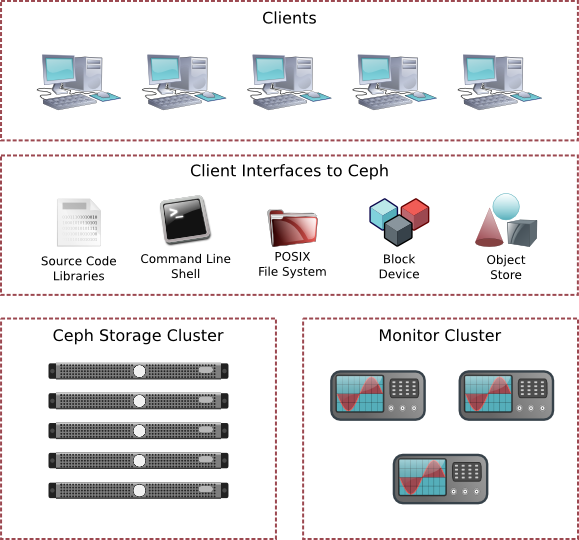

.. _architecture:

==============
 Architecture
==============

:term:`Ceph` uniquely delivers **object, block, and file storage** in one
unified system. Ceph is highly reliable, easy to manage, and free. Ceph
delivers extraordinary scalability–thousands of clients accessing petabytes to
exabytes of data. A :term:`Ceph Node` leverages commodity hardware and
intelligent daemons, and a :term:`Ceph Storage Cluster` accommodates large
numbers of nodes, which communicate with each other to replicate and
redistribute data dynamically.

.. toctree::
   :maxdepth: 2

   The Ceph Storage Cluster <storage-cluster>
   Scalability and High Availability <scalability-high-availability>
   Dynamic Cluster Management <dynamic-cluster-management>
   Erasure Coding <erasure-coding>
   Cache Tiering <cache-tiering>
   Extending Ceph <extending-ceph>
   Ceph Protocol <ceph-protocol>
   Ceph Clients <ceph-clients>
