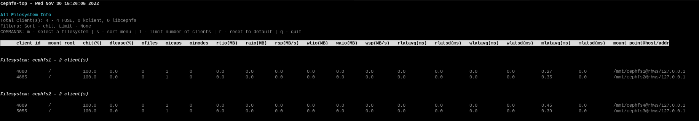

.. _cephfs-top:

==================
CephFS Top Utility
==================

CephFS provides `top(1)` like utility to display various Ceph Filesystem metrics
in realtime. `cephfs-top` is a curses based python script which makes use of `stats`
plugin in Ceph Manager to fetch (and display) metrics.

Manager Plugin
==============

Ceph Filesystem clients periodically forward various metrics to Ceph Metadata Servers (MDS)
which in turn get forwarded to Ceph Manager by MDS rank zero. Each active MDS forward its
respective set of metrics to MDS rank zero. Metrics are aggregated and forwarded to Ceph
Manager.

Metrics are divided into two categories - global and per-mds. Global metrics represent
set of metrics for the filesystem as a whole (e.g., client read latency) whereas per-mds
metrics are for a particular MDS rank (e.g., number of subtrees handled by an MDS).

.. note:: Currently, only global metrics are tracked.

`stats` plugin is disabled by default and should be enabled via::

  $ ceph mgr module enable stats

Once enabled, Ceph Filesystem metrics can be fetched via::

  $ ceph fs perf stats

The output format is JSON and contains fields as follows:

- `version`: Version of stats output
- `global_counters`: List of global performance metrics
- `counters`: List of per-mds performance metrics
- `client_metadata`: Ceph Filesystem client metadata
- `global_metrics`: Global performance counters
- `metrics`: Per-MDS performance counters (currently, empty) and delayed ranks

.. note:: `delayed_ranks` is the set of active MDS ranks that are reporting stale metrics.
          This can happen in cases such as (temporary) network issue between MDS rank zero
          and other active MDSs.

Metrics can be fetched for a partcilar client and/or for a set of active MDSs. To fetch metrics
for a particular client (e.g., for client-id: 1234)::

  $ ceph fs perf stats --client_id=1234

To fetch metrics only for a subset of active MDSs (e.g., MDS rank 1 and 2)::

  $ ceph fs perf stats --mds_rank=1,2

`cephfs-top`
============

`cephfs-top` utility relies on `stats` plugin to fetch performance metrics and display in
`top(1)` like format. `cephfs-top` is available as part of `cephfs-top` package.

By default, `cephfs-top` uses `client.fstop` user to connect to a Ceph cluster::

  $ ceph auth get-or-create client.fstop mon 'allow r' mds 'allow r' osd 'allow r' mgr 'allow r'
  $ cephfs-top

Description of Fields
---------------------

1. chit     : Cap hit
             Percentage of file capability hits over total number of caps

2. dlease   : Dentry lease
             Percentage of dentry leases handed out over the total dentry lease requests

3. ofiles   : Opened files
             Number of opened files

4. oicaps   : Pinned caps
             Number of pinned caps

5. oinodes  : Opened inodes
             Number of opened inodes

6. rtio     : Total size of read IOs
             Number of bytes read in input/output operations generated by all process

7. wtio     : Total size of write IOs
             Number of bytes written in input/output operations generated by all processes

8. raio     : Average size of read IOs
             Mean of number of bytes read in input/output operations generated by all 
             process over total IO done

9. waio     : Average size of write IOs
             Mean of number of bytes written in input/output operations generated by all 
             process over total IO done

10. rsp     : Read speed
             Speed of read IOs with respect to the duration since the last refresh of clients

11. wsp     : Write speed 
             Speed of write IOs with respect to the duration since the last refresh of clients

12. rlatavg : Average read latency
             Mean value of the read latencies

13. rlatsd  : Standard deviation (variance) for read latency
             Dispersion of the metric for the read latency relative to its mean

14. wlatavg : Average write latency
             Mean value of the write latencies

15. wlatsd  : Standard deviation (variance) for write latency
             Dispersion of the metric for the write latency relative to its mean

16. mlatavg : Average metadata latency
             Mean value of the metadata latencies

17. mlatsd  : Standard deviation (variance) for metadata latency
             Dispersion of the metric for the metadata latency relative to its mean

Command-Line Options
--------------------

To use a non-default user (other than `client.fstop`) use::

  $ cephfs-top --id <name>

By default, `cephfs-top` connects to cluster name `ceph`. To use a non-default cluster name::

  $ cephfs-top --cluster <cluster>

`cephfs-top` refreshes stats every second by default. To choose a different refresh interval use::

  $ cephfs-top -d <seconds>

Refresh interval should be a positive integer.

To dump the metrics to stdout without creating a curses display use::

  $ cephfs-top --dump

To dump the metrics of the given filesystem to stdout without creating a curses display use::

  $ cephfs-top --dumpfs <fs_name>

Interactive Commands
--------------------

1. m : Filesystem selection
      Displays a menu of filesystems for selection.

2. s : Sort field selection
      Designates the sort field.  'cap_hit' is the default.

3. l : Client limit
      Sets the limit on the number of clients to be displayed.

4. r : Reset
      Resets the sort field and limit value to the default.

5. q : Quit
      Exit the utility if you are at the home screen (all filesystem info),
      otherwise escape back to the home screen.

The metrics display can be scrolled using the Arrow Keys, PgUp/PgDn, Home/End and mouse.

Sample screenshot running `cephfs-top` with 2 filesystems:

.. note:: Minimum compatible python version for cephfs-top is 3.6.0. cephfs-top is supported on distros RHEL 8, Ubuntu 18.04, CentOS 8 and above.
