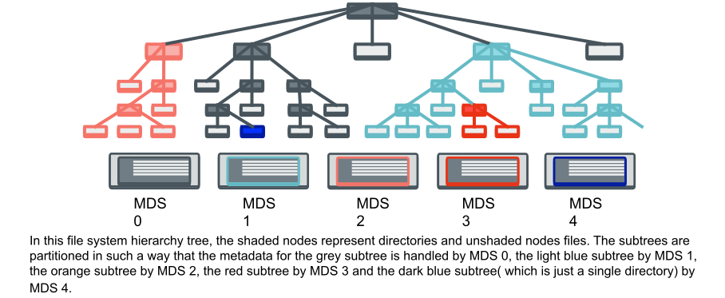

==================================
CephFS Dynamic Metadata Management
==================================
Metadata operations usually take up more than 50 percent of all
file system operations. Also the metadata scales in a more complex
fashion when compared to scaling storage (which in turn scales I/O
throughput linearly). This is due to the hierarchical and
interdependent nature of the file system metadata. So in CephFS,
the metadata workload is decoupled from data workload so as to
avoid placing unnecessary strain on the RADOS cluster. The metadata
is hence handled by a cluster of Metadata Servers (MDSs). 
CephFS distributes metadata across MDSs via `Dynamic Subtree Partitioning <https://ceph.com/wp-content/uploads/2016/08/weil-mds-sc04.pdf>`__.

Dynamic Subtree Partitioning
----------------------------
In traditional subtree partitioning, subtrees of the file system
hierarchy are assigned to individual MDSs. This metadata distribution
strategy provides good hierarchical locality, linear growth of
cache and horizontal scaling across MDSs and a fairly good distribution
of metadata across MDSs.

The problem with traditional subtree partitioning is that the workload
growth by depth (across a single MDS) leads to a hotspot of activity.
This results in lack of vertical scaling and wastage of non-busy resources/MDSs. 

This led to the adoption of a more dynamic way of handling
metadata: Dynamic Subtree Partitioning, where load intensive portions
of the directory hierarchy from busy MDSs are migrated to non busy MDSs. 

This strategy ensures that activity hotspots are relieved as they
appear and so leads to vertical scaling of the metadata workload in
addition to horizontal scaling. 
