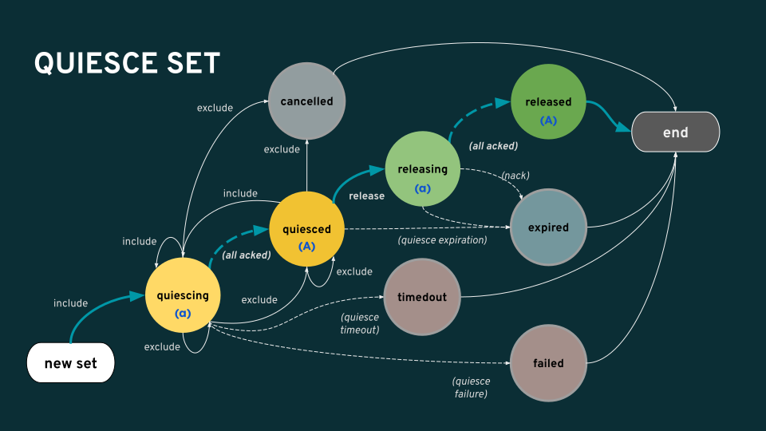

.. _fs-volumes-and-subvolumes:

FS volumes and subvolumes
=========================

The volumes module of the :term:`Ceph Manager` daemon (ceph-mgr) provides a
single source of truth for CephFS exports. The OpenStack shared file system
service (manila_) and the Ceph Container Storage Interface (CSI_) storage
administrators use the common CLI provided by the ceph-mgr ``volumes`` module
to manage CephFS exports.

The ceph-mgr ``volumes`` module implements the following file system export
abstractions:

* FS volumes, an abstraction for CephFS file systems

* FS subvolumes, an abstraction for independent CephFS directory trees

* FS subvolume groups, an abstraction for a directory level higher than FS
  subvolumes. Used to effect policies (e.g., :doc:`/cephfs/file-layouts`)
  across a set of subvolumes

Some possible use-cases for the export abstractions:

* FS subvolumes used as Manila shares or CSI volumes

* FS subvolume groups used as Manila share groups

Requirements
------------

* Nautilus (14.2.x) or later Ceph release

* Cephx client user (see :doc:`/rados/operations/user-management`) with
  at least the following capabilities::

    mon 'allow r'
    mgr 'allow rw'

FS Volumes
----------

Create a volume by running the following command:

.. prompt:: bash #

   ceph fs volume create <vol_name> [placement]

This creates a CephFS file system and its data and metadata pools. It can also
deploy MDS daemons for the filesystem using a ceph-mgr orchestrator module (for
example Rook). See :doc:`/mgr/orchestrator`.

``<vol_name>`` is the volume name (an arbitrary string). ``[placement]`` is an
optional string that specifies the :ref:`orchestrator-cli-placement-spec` for
the MDS. See also :ref:`orchestrator-cli-cephfs` for more examples on
placement.

.. note:: Specifying placement via a YAML file is not supported through the
          volume interface.

To remove a volume, run the following command:

.. prompt:: bash #

   ceph fs volume rm <vol_name> [--yes-i-really-mean-it]

This removes a file system and its data and metadata pools. It also tries to
remove MDS daemons using the enabled ceph-mgr orchestrator module.

.. note:: After volume deletion, it is recommended to restart `ceph-mgr`
   if a new file system is created on the same cluster and subvolume interface
   is being used. Please see https://tracker.ceph.com/issues/49605#note-5
   for more details.

List volumes by running the following command:

.. prompt:: bash #

   ceph fs volume ls

Rename a volume by running the following command:

.. prompt:: bash #

   ceph fs volume rename <vol_name> <new_vol_name> [--yes-i-really-mean-it]

Renaming a volume can be an expensive operation that requires the following:

- Renaming the orchestrator-managed MDS service to match the <new_vol_name>.
  This involves launching a MDS service with ``<new_vol_name>`` and bringing
  down the MDS service with ``<vol_name>``.
- Renaming the file system matching ``<vol_name>`` to ``<new_vol_name>``.
- Changing the application tags on the data and metadata pools of the file system
  to ``<new_vol_name>``.
- Renaming the metadata and data pools of the file system.

The CephX IDs that are authorized for ``<vol_name>`` must be reauthorized for
``<new_vol_name>``. Any ongoing operations of the clients using these IDs may
be disrupted. Ensure that mirroring is disabled on the volume.

To fetch the information of a CephFS volume, run the following command:

.. prompt:: bash #

   ceph fs volume info vol_name [--human_readable]

The ``--human_readable`` flag shows used and available pool capacities in KB/MB/GB.

The output format is JSON and contains fields as follows:

* ``pools``: Attributes of data and metadata pools
        * ``avail``: The amount of free space available in bytes
        * ``used``: The amount of storage consumed in bytes
        * ``name``: Name of the pool
* ``mon_addrs``: List of Ceph monitor addresses
* ``used_size``: Current used size of the CephFS volume in bytes
* ``pending_subvolume_deletions``: Number of subvolumes pending deletion

Sample output of the ``volume info`` command:

.. prompt:: bash #

   ceph fs volume info vol_name

::

    {
        "mon_addrs": [
            "192.168.1.7:40977"
        ],
        "pending_subvolume_deletions": 0,
        "pools": {
            "data": [
                {
                    "avail": 106288709632,
                    "name": "cephfs.vol_name.data",
                    "used": 4096
                }
            ],
            "metadata": [
                {
                    "avail": 106288709632,
                    "name": "cephfs.vol_name.meta",
                    "used": 155648
                }
            ]
        },
        "used_size": 0
    }

FS Subvolume groups
-------------------

Create a subvolume group by running the following command:

.. prompt:: bash #

   ceph fs subvolumegroup create <vol_name> <group_name> [--size <size_in_bytes>] [--pool_layout <data_pool_name>] [--uid <uid>] [--gid <gid>] [--mode <octal_mode>]

The command succeeds even if the subvolume group already exists.

When creating a subvolume group you can specify its data pool layout (see
:doc:`/cephfs/file-layouts`), uid, gid, file mode in octal numerals, and
size in bytes. The size of the subvolume group is specified by setting
a quota on it (see :doc:`/cephfs/quota`). By default, the subvolume group
is created with octal file mode ``755``, uid ``0``, gid ``0`` and the data pool
layout of its parent directory.

Remove a subvolume group by running a command of the following form:

.. prompt:: bash #

   ceph fs subvolumegroup rm <vol_name> <group_name> [--force]

The removal of a subvolume group fails if the subvolume group is not empty or
is non-existent. The ``--force`` flag allows the non-existent "subvolume group remove
command" to succeed.

Fetch the absolute path of a subvolume group by running a command of the following form:

.. prompt:: bash #

   ceph fs subvolumegroup getpath <vol_name> <group_name>

List subvolume groups by running a command of the following form:

.. prompt:: bash #

   ceph fs subvolumegroup ls <vol_name>

.. note:: Subvolume group snapshot feature is no longer supported in mainline CephFS (existing group
          snapshots can still be listed and deleted)

Fetch the metadata of a subvolume group by running a command of the following form:

.. prompt:: bash #

   ceph fs subvolumegroup info <vol_name> <group_name>

The output format is JSON and contains fields as follows:

* ``atime``: access time of the subvolume group path in the format "YYYY-MM-DD HH:MM:SS"
* ``mtime``: modification time of the subvolume group path in the format "YYYY-MM-DD HH:MM:SS"
* ``ctime``: change time of the subvolume group path in the format "YYYY-MM-DD HH:MM:SS"
* ``uid``: uid of the subvolume group path
* ``gid``: gid of the subvolume group path
* ``mode``: mode of the subvolume group path
* ``mon_addrs``: list of monitor addresses
* ``bytes_pcent``: quota used in percentage if quota is set, else displays "undefined"
* ``bytes_quota``: quota size in bytes if quota is set, else displays "infinite"
* ``bytes_used``: current used size of the subvolume group in bytes
* ``created_at``: creation time of the subvolume group in the format "YYYY-MM-DD HH:MM:SS"
* ``data_pool``: data pool to which the subvolume group belongs

Check the presence of any subvolume group by running a command of the following form:

.. prompt:: bash #

   ceph fs subvolumegroup exist <vol_name>

The ``exist`` command outputs:

* "subvolumegroup exists": if any subvolumegroup is present
* "no subvolumegroup exists": if no subvolumegroup is present

.. note:: This command checks for the presence of custom groups and not
   presence of the default one. To validate the emptiness of the volume, a
   subvolumegroup existence check alone is not sufficient. Subvolume existence
   also needs to be checked as there might be subvolumes in the default group.

Resize a subvolume group by running a command of the following form:

.. prompt:: bash #

   ceph fs subvolumegroup resize <vol_name> <group_name> <new_size> [--no_shrink]

The command resizes the subvolume group quota, using the size specified by
``new_size``.  The ``--no_shrink`` flag prevents the subvolume group from
shrinking below the current used size.

The subvolume group may be resized to an infinite size by passing ``inf`` or
``infinite`` as the ``new_size``.

Remove a snapshot of a subvolume group by running a command of the following form:

.. prompt:: bash #

   ceph fs subvolumegroup snapshot rm <vol_name> <group_name> <snap_name> [--force]

Supplying the ``--force`` flag allows the command to succeed when it would otherwise
fail due to the nonexistence of the snapshot.

List snapshots of a subvolume group by running a command of the following form:

.. prompt:: bash #

   ceph fs subvolumegroup snapshot ls <vol_name> <group_name>

FS Subvolumes
-------------

Create a subvolume using:

.. prompt:: bash #

   ceph fs subvolume create <vol_name> <subvol_name> [--size <size_in_bytes>] [--group_name <subvol_group_name>] [--pool_layout <data_pool_name>] [--uid <uid>] [--gid <gid>] [--mode <octal_mode>] [--namespace-isolated]

The command succeeds even if the subvolume already exists.

When creating a subvolume you can specify its subvolume group, data pool layout,
uid, gid, file mode in octal numerals, and size in bytes. The size of the subvolume is
specified by setting a quota on it (see :doc:`/cephfs/quota`). The subvolume can be
created in a separate RADOS namespace by specifying --namespace-isolated option. By
default a subvolume is created within the default subvolume group, and with an octal file
mode '755', uid of its subvolume group, gid of its subvolume group, data pool layout of
its parent directory and no size limit.

Remove a subvolume using:

.. prompt:: bash #

   ceph fs subvolume rm <vol_name> <subvol_name> [--group_name <subvol_group_name>] [--force] [--retain-snapshots]

The command removes the subvolume and its contents. It does this in two steps.
First, it moves the subvolume to a trash folder, and then asynchronously purges
its contents.

The removal of a subvolume fails if it has snapshots, or is non-existent.
'--force' flag allows the non-existent subvolume remove command to succeed.

A subvolume can be removed retaining existing snapshots of the subvolume using the
'--retain-snapshots' option. If snapshots are retained, the subvolume is considered
empty for all operations not involving the retained snapshots.

.. note:: Snapshot retained subvolumes can be recreated using 'ceph fs subvolume create'

.. note:: Retained snapshots can be used as a clone source to recreate the subvolume, or clone to a newer subvolume.

Resize a subvolume using:

.. prompt:: bash #

   ceph fs subvolume resize <vol_name> <subvol_name> <new_size> [--group_name <subvol_group_name>] [--no_shrink]

The command resizes the subvolume quota using the size specified by ``new_size``.
The ``--no_shrink`` flag prevents the subvolume from shrinking below the current  used size of the subvolume.

The subvolume can be resized to an unlimited (but sparse) logical size by passing ``inf`` or ``infinite`` as `` new_size``.

Authorize cephx auth IDs, the read/read-write access to fs subvolumes:

.. prompt:: bash #

   ceph fs subvolume authorize <vol_name> <sub_name> <auth_id> [--group_name=<group_name>] [--access_level=<access_level>]

The ``access_level`` takes ``r`` or ``rw`` as value.

Deauthorize cephx auth IDs, the read/read-write access to fs subvolumes:

.. prompt:: bash #

   ceph fs subvolume deauthorize <vol_name> <sub_name> <auth_id> [--group_name=<group_name>]

List cephx auth IDs authorized to access fs subvolume:

.. prompt:: bash #

   ceph fs subvolume authorized_list <vol_name> <sub_name> [--group_name=<group_name>]

Evict fs clients based on auth ID and subvolume mounted:

.. prompt:: bash #

   ceph fs subvolume evict <vol_name> <sub_name> <auth_id> [--group_name=<group_name>]

Fetch the absolute path of a subvolume using:

.. prompt:: bash #

   ceph fs subvolume getpath <vol_name> <subvol_name> [--group_name <subvol_group_name>]

Fetch the information of a subvolume using:

.. prompt:: bash #

   ceph fs subvolume info <vol_name> <subvol_name> [--group_name <subvol_group_name>]

The output format is JSON and contains fields as follows.

* ``atime``: access time of the subvolume path in the format "YYYY-MM-DD HH:MM:SS"
* ``mtime``: modification time of the subvolume path in the format "YYYY-MM-DD HH:MM:SS"
* ``ctime``: change time of the subvolume path in the format "YYYY-MM-DD HH:MM:SS"
* ``uid``: uid of the subvolume path
* ``gid``: gid of the subvolume path
* ``mode``: mode of the subvolume path
* ``mon_addrs``: list of monitor addresses
* ``bytes_pcent``: quota used in percentage if quota is set, else displays ``undefined``
* ``bytes_quota``: quota size in bytes if quota is set, else displays ``infinite``
* ``bytes_used``: current used size of the subvolume in bytes
* ``created_at``: creation time of the subvolume in the format "YYYY-MM-DD HH:MM:SS"
* ``data_pool``: data pool to which the subvolume belongs
* ``path``: absolute path of a subvolume
* ``type``: subvolume type indicating whether it's clone or subvolume
* ``pool_namespace``: RADOS namespace of the subvolume
* ``features``: features supported by the subvolume
* ``state``: current state of the subvolume

If a subvolume has been removed retaining its snapshots, the output contains only fields as follows.

* ``type``: subvolume type indicating whether it's clone or subvolume
* ``features``: features supported by the subvolume
* ``state``: current state of the subvolume

A subvolume's ``features`` are based on the internal version of the subvolume and are
a subset of the following:

* ``snapshot-clone``: supports cloning using a subvolumes snapshot as the source
* ``snapshot-autoprotect``: supports automatically protecting snapshots, that are active clone sources, from deletion
* ``snapshot-retention``: supports removing subvolume contents, retaining any existing snapshots

A subvolume's ``state`` is based on the current state of the subvolume and contains one of the following values.

* ``complete``: subvolume is ready for all operations
* ``snapshot-retained``: subvolume is removed but its snapshots are retained

List subvolumes using:

.. prompt:: bash #

   ceph fs subvolume ls <vol_name> [--group_name <subvol_group_name>]

.. note:: subvolumes that are removed but have snapshots retained, are also listed.

Check the presence of any subvolume using:

.. prompt:: bash #

   ceph fs subvolume exist <vol_name> [--group_name <subvol_group_name>]

These are the possible results of the ``exist`` command:

* ``subvolume exists``: if any subvolume of given group_name is present
* ``no subvolume exists``: if no subvolume of given group_name is present

Set custom metadata on the subvolume as a key-value pair using:

.. prompt:: bash #

   ceph fs subvolume metadata set <vol_name> <subvol_name> <key_name> <value> [--group_name <subvol_group_name>]

.. note:: If the key_name already exists then the old value will get replaced by the new value.

.. note:: key_name and value should be a string of ASCII characters (as specified in python's string.printable). key_name is case-insensitive and always stored in lower case.

.. note:: Custom metadata on a subvolume is not preserved when snapshotting the subvolume, and hence, is also not preserved when cloning the subvolume snapshot.

Get custom metadata set on the subvolume using the metadata key:

.. prompt:: bash #

   ceph fs subvolume metadata get <vol_name> <subvol_name> <key_name> [--group_name <subvol_group_name>]

List custom metadata (key-value pairs) set on the subvolume using:

.. prompt:: bash #

   ceph fs subvolume metadata ls <vol_name> <subvol_name> [--group_name <subvol_group_name>]

Remove custom metadata set on the subvolume using the metadata key:

.. prompt:: bash #

   ceph fs subvolume metadata rm <vol_name> <subvol_name> <key_name> [--group_name <subvol_group_name>] [--force]

Using the ``--force`` flag allows the command to succeed that would otherwise
fail if the metadata key did not exist.

Create a snapshot of a subvolume using:

.. prompt:: bash #

   ceph fs subvolume snapshot create <vol_name> <subvol_name> <snap_name> [--group_name <subvol_group_name>]

Remove a snapshot of a subvolume using:

.. prompt:: bash #

   ceph fs subvolume snapshot rm <vol_name> <subvol_name> <snap_name> [--group_name <subvol_group_name>] [--force]

Using the ``--force`` flag allows the command to succeed that would otherwise
fail if the snapshot did not exist.

.. note:: if the last snapshot within a snapshot retained subvolume is removed, the subvolume is also removed

List snapshots of a subvolume using:

.. prompt:: bash #

   ceph fs subvolume snapshot ls <vol_name> <subvol_name> [--group_name <subvol_group_name>]

Fetch the information of a snapshot using:

.. prompt:: bash #

   ceph fs subvolume snapshot info <vol_name> <subvol_name> <snap_name> [--group_name <subvol_group_name>]

The output format is JSON and contains fields as follows.

* ``created_at``: creation time of the snapshot in the format "YYYY-MM-DD HH:MM:SS:ffffff"
* ``data_pool``: data pool to which the snapshot belongs
* ``has_pending_clones``: ``yes`` if snapshot clone is in progress, otherwise ``no``
* ``pending_clones``: list of in-progress or pending clones and their target group if any exist, otherwise this field is not shown
* ``orphan_clones_count``: count of orphan clones if the snapshot has orphan clones, otherwise this field is not shown

Sample output when snapshot clones are in progress or pending:

.. prompt:: bash #

   ceph fs subvolume snapshot info cephfs subvol snap

::

    {
        "created_at": "2022-06-14 13:54:58.618769",
        "data_pool": "cephfs.cephfs.data",
        "has_pending_clones": "yes",
        "pending_clones": [
            {
                "name": "clone_1",
                "target_group": "target_subvol_group"
            },
            {
                "name": "clone_2"
            },
            {
                "name": "clone_3",
                "target_group": "target_subvol_group"
            }
        ]
    }

Sample output when no snapshot clone is in progress or pending:

.. prompt:: bash #

   ceph fs subvolume snapshot info cephfs subvol snap

::

    {
        "created_at": "2022-06-14 13:54:58.618769",
        "data_pool": "cephfs.cephfs.data",
        "has_pending_clones": "no"
    }

Set custom key-value metadata on the snapshot by running:

.. prompt:: bash #

   ceph fs subvolume snapshot metadata set <vol_name> <subvol_name> <snap_name> <key_name> <value> [--group_name <subvol_group_name>]

.. note:: If the key_name already exists then the old value will get replaced by the new value.

.. note:: The key_name and value should be a strings of ASCII characters (as specified in Python's ``string.printable``). The key_name is case-insensitive and always stored in lowercase.

.. note:: Custom metadata on a snapshot is not preserved when snapshotting the subvolume, and hence is also not preserved when cloning the subvolume snapshot.

Get custom metadata set on the snapshot using the metadata key:

.. prompt:: bash #

   ceph fs subvolume snapshot metadata get <vol_name> <subvol_name> <snap_name> <key_name> [--group_name <subvol_group_name>]

List custom metadata (key-value pairs) set on the snapshot using:

.. prompt:: bash #

   ceph fs subvolume snapshot metadata ls <vol_name> <subvol_name> <snap_name> [--group_name <subvol_group_name>]

Remove custom metadata set on the snapshot using the metadata key:

.. prompt:: bash #

   ceph fs subvolume snapshot metadata rm <vol_name> <subvol_name> <snap_name> <key_name> [--group_name <subvol_group_name>] [--force]

Using the ``--force`` flag allows the command to succeed that would otherwise
fail if the metadata key did not exist.

Cloning Snapshots
-----------------

Subvolumes can be created by cloning subvolume snapshots. Cloning is an asynchronous operation that copies
data from a snapshot to a subvolume. Due to this bulk copying, cloning is inefficient for very large
data sets.

.. note:: Removing a snapshot (source subvolume) would fail if there are pending or in progress clone operations.

Protecting snapshots prior to cloning was a prerequisite in the Nautilus release, and the commands to protect/unprotect
snapshots were introduced for this purpose. This prerequisite, and hence the commands to protect/unprotect, is being
deprecated and may be removed from a future release.

The commands being deprecated are:

.. prompt:: bash #

   ceph fs subvolume snapshot protect <vol_name> <subvol_name> <snap_name> [--group_name <subvol_group_name>]
   ceph fs subvolume snapshot unprotect <vol_name> <subvol_name> <snap_name> [--group_name <subvol_group_name>]

.. note:: Using the above commands will not result in an error, but they have no useful purpose.

.. note:: Use the ``subvolume info`` command to fetch subvolume metadata regarding supported ``features`` to help decide if protect/unprotect of snapshots is required, based on the availability of the ``snapshot-autoprotect`` feature.

To initiate a clone operation use:

.. prompt:: bash #

   ceph fs subvolume snapshot clone <vol_name> <subvol_name> <snap_name> <target_subvol_name>

.. note:: ``subvolume snapshot clone`` command depends upon the above mentioned config option ``snapshot_clone_no_wait``

If a snapshot (source subvolume) is a part of non-default group, the group name needs to be specified:

.. prompt:: bash #

   ceph fs subvolume snapshot clone <vol_name> <subvol_name> <snap_name> <target_subvol_name> --group_name <subvol_group_name>

Cloned subvolumes can be a part of a different group than the source snapshot (by default, cloned subvolumes are created in default group). To clone to a particular group use:

.. prompt:: bash #

   ceph fs subvolume snapshot clone <vol_name> <subvol_name> <snap_name> <target_subvol_name> --target_group_name <subvol_group_name>

Similar to specifying a pool layout when creating a subvolume, pool layout can be specified when creating a cloned subvolume. To create a cloned subvolume with a specific pool layout use:

.. prompt:: bash #

   ceph fs subvolume snapshot clone <vol_name> <subvol_name> <snap_name> <target_subvol_name> --pool_layout <pool_layout>

To check the status of a clone operation use:

.. prompt:: bash #

   ceph fs clone status <vol_name> <clone_name> [--group_name <group_name>]

A clone can be in one of the following states:

#. ``pending``     : Clone operation has not started
#. ``in-progress`` : Clone operation is in progress
#. ``complete``    : Clone operation has successfully finished
#. ``failed``      : Clone operation has failed
#. ``canceled``    : Clone operation is cancelled by user

The reason for a clone failure is shown as below:

#. ``errno``     : error number
#. ``error_msg`` : failure error string

Here is an example of an ``in-progress`` clone:

.. prompt:: bash #

   ceph fs subvolume snapshot clone cephfs subvol1 snap1 clone1
   ceph fs clone status cephfs clone1

::

    {
        "status": {
            "state": "in-progress",
            "source": {
                "volume": "cephfs",
                "subvolume": "subvol1",
                "snapshot": "snap1"
            }
        }
    }

.. note:: The ``failure`` section will be shown only if the clone's state is ``failed`` or ``cancelled``

Here is an example of a ``failed`` clone:

.. prompt:: bash #

   ceph fs subvolume snapshot clone cephfs subvol1 snap1 clone1
   ceph fs clone status cephfs clone1

::

    {
        "status": {
            "state": "failed",
            "source": {
                "volume": "cephfs",
                "subvolume": "subvol1",
                "snapshot": "snap1"
                "size": "104857600"
            },
            "failure": {
                "errno": "122",
                "errstr": "Disk quota exceeded"
            }
        }
    }

(NOTE: since ``subvol1`` is in the default group, the ``source`` object's  ``clone status`` does not include the group name)

.. note:: Cloned subvolumes are accessible only after the clone operation has successfully completed.

After a successful clone operation, ``clone status`` will look like the below:

.. prompt:: bash #

   ceph fs clone status cephfs clone1

::

    {
        "status": {
            "state": "complete"
        }
    }

If a clone operation is unsuccessful, the ``state`` value will be  ``failed``.

To retry a failed clone operation, the incomplete clone must be deleted and the clone operation must be issued again.
To delete a partial clone use:

.. prompt:: bash #

   ceph fs subvolume rm <vol_name> <clone_name> [--group_name <group_name>] --force

.. note:: Cloning synchronizes only directories, regular files and symbolic links. Inode timestamps (access and
          modification times) are synchronized up to seconds granularity.

An ``in-progress`` or a ``pending`` clone operation may be canceled. To cancel a clone operation use the ``clone cancel`` command:

.. prompt:: bash #

   ceph fs clone cancel <vol_name> <clone_name> [--group_name <group_name>]

On successful cancellation, the cloned subvolume is moved to the ``canceled`` state:

.. prompt:: bash #

   ceph fs subvolume snapshot clone cephfs subvol1 snap1 clone1
   ceph fs clone cancel cephfs clone1
   ceph fs clone status cephfs clone1

::

    {
        "status": {
            "state": "canceled",
            "source": {
                "volume": "cephfs",
                "subvolume": "subvol1",
                "snapshot": "snap1"
            }
        }
    }

.. note:: The canceled cloned may be deleted by supplying the ``--force`` option to the `fs subvolume rm` command.

Configurables
~~~~~~~~~~~~~

Configure the maximum number of concurrent clone operations. The default is 4:

.. prompt:: bash #

   ceph config set mgr mgr/volumes/max_concurrent_clones <value>

Configure the snapshot_clone_no_wait option :

.. prompt:: bash #

   ``snapshot_clone_no_wait`` config option is used to reject the clone creation request when the cloner threads 
   ( which can be configured using above option i.e. ``max_concurrent_clones``) are not available.
   It is enabled by default i.e. the value set is True, whereas it can be configured by using below command.

   ceph config set mgr mgr/volumes/snapshot_clone_no_wait <bool>

   The current value of ``snapshot_clone_no_wait`` can be fetched by using below command.

   ceph config get mgr mgr/volumes/snapshot_clone_no_wait

.. _subvol-pinning:

Pinning Subvolumes and Subvolume Groups
---------------------------------------

Subvolumes and subvolume groups may be automatically pinned to ranks according
to policies. This can distribute load across MDS ranks in predictable and
stable ways.  Review :ref:`cephfs-pinning` and :ref:`cephfs-ephemeral-pinning`
for details on how pinning works.

Pinning is configured by:

.. prompt:: bash #

   ceph fs subvolumegroup pin <vol_name> <group_name> <pin_type> <pin_setting>

or for subvolumes:

.. prompt:: bash #

   ceph fs subvolume pin <vol_name> <group_name> <pin_type> <pin_setting>

Typically you will want to set subvolume group pins. The ``pin_type`` may be
one of ``export``, ``distributed``, or ``random``. The ``pin_setting``
corresponds to the extended attributed "value" as in the pinning documentation
referenced above.

So, for example, setting a distributed pinning strategy on a subvolume group:

.. prompt:: bash #

   ceph fs subvolumegroup pin cephfilesystem-a csi distributed 1

Will enable distributed subtree partitioning policy for the "csi" subvolume
group.  This will cause every subvolume within the group to be automatically
pinned to one of the available ranks on the file system.

Subvolume quiesce
-----------------

It may be needed to pause IO to a set of subvolumes of a given volume (file system).
A good example of such case is a consistent snapshot spanning multiple subvolumes.
Such a task arises often in an environment such as k8s, where a single deployed application
can work with many mounted subvolumes across several hosts. When a snapshot of such a system is needed,
the application may not find the result consistent unless the snapshots were taken
under an active write pause.

The volumes plugin provides a tool to initiate and await such a pause across a set of subvolumes:

.. prompt:: bash $ auto

  $ ceph fs quiesce --set-id myset1 <vol_name> <[group_name/]sub_name...> --await
  # perform actions while the IO pause is active, like taking snapshots
  $ ceph fs quiesce --set-id myset1 --release --await
  # if successful, all members of the set were confirmed as still in pause and released from such

The ``quiesce`` functionality is itself based on top of a lower level QuiesceDb service maintained by the MDS
daemons. Volumes plugin merely maps the subvolume names to their corresponding paths on the given file system
and then issues the appropriate quiesce command to the MDS. You can learn more about the feature in the developer guides.

Operations
~~~~~~~~~~

The IO pause (referred to as `quiesce`) is requested for a group of one or more subvolumes (i.e. paths in a filesystem).
The group is referred to as "quiesce set", and every quiesce set must have a unique string id to interact with.
A quiesce set can be manipulated in the following ways:

* **include** one or more subvolumes - quiesce set members
* **exclude** one or more members
* **cancel** the set, asynchronously aborting the pause on all its current members
* **release** the set, requesting the end of the pause from all members and expecting an ack from all clients
* **query** the current state of a set by id or all active sets or all known sets
* **cancel all** active sets in case an immediate resume of IO is required.

The operations listed above are non-blocking: they perform the intended modification if it's applicable
and get back with an up to date version of the target set, whether the operation was successful or not. 
The set may change states as a result of the modification, and the version that's returned in the response 
is guaranteed to be in a state consistent with this and potentialy other successful operations from 
the same control loop batch.

Some set states are `awaitable`. We will discuss those below, but for now it's important to mention that
any of the commands above can be amended with an **await** modifier, which will cause them to block
on the set after applying their intended modification, as long as the resulting set state is `awaitable`.
Such a command will block until the set reaches the awaited state, gets modified by another command,
or transitions into another state. The reason for the unblock will be clear by the result code, while
the contents of the response will always be the most recent set state.

`Awaitable` states on the diagram are marked with ``(a)`` or ``(A)``. Blocking versions of the operations
will pend while the set is in an ``(a)`` state and will complete with success if it reaches an ``(A)`` state.
If the set is already at an ``(A)`` state, the operation completes immediately with a success. 

Most of the operations require a set-id. The exceptions are:

* creation of a new set without specifying a set id,
* query of active or all known sets, and
* the cancel all

Creating a new set is achieved by including member(s) via the `include` or `reset` commands.
It's possible to specify a set id, and if it's a new id then the set will be created
with the specified member(s) in the `QUIESCING` state. When no set id is specified while including
or resetting members, then a new set with a unique set id is created. The set id will be known
to the caller by inspecting the output

.. prompt:: bash $ auto

  $ ceph fs quiesce a sub1 --set-id=unique-id
  {
      "epoch": 3,
      "db_version": 1,
      "sets": {
          "unique-id": {
              "db_version": 1,
              "age_ref": 0.0,
              "state": {
                  "name": "TIMEDOUT",
                  "age": 0.0
              },
              "timeout": 0.0,
              "expiration": 0.0,
              "members": {
                  "file:/volumes/_nogroup/sub1/b1fcce76-3418-42dd-aa76-f9076d047dd3": {
                      "excluded": false,
                      "state": {
                          "name": "QUIESCING",
                          "age": 0.0
                      }
                  }
              }
          }
      }
  }

The output contains the set we just created successfully, however it's already `TIMEDOUT`. 
This is expected, since we have not specified the timeout for this quiesce,
and we can see in the output that it was initialized to 0 by default, along with the expiration.

Timeouts
~~~~~~~~

The two timeout parameters, `timeout` and `expiration`, are the main guards against 
accidentally causing a DOS condition for our application. Any command to an active set
may carry the ``--timeout`` or ``--expiration`` arguments to update these values for the set.
If present, the values will be applied before the action this command requests.

.. prompt:: bash $ auto

  $ ceph fs quiesce a --set-id=unique-id --timeout=10 > /dev/null
  Error EPERM:  

It's too late for our ``unique-id`` set, as it's in a terminal state. No changes are allowed
to sets that are in their terminal states, i.e. inactive. Let's create a new set

.. prompt:: bash $ auto

  $ ceph fs quiesce a sub1 --timeout 60
  {
      "epoch": 3,
      "db_version": 2,
      "sets": {
          "8988b419": {
              "db_version": 2,
              "age_ref": 0.0,
              "state": {
                  "name": "QUIESCING",
                  "age": 0.0
              },
              "timeout": 60.0,
              "expiration": 0.0,
              "members": {
                  "file:/volumes/_nogroup/sub1/b1fcce76-3418-42dd-aa76-f9076d047dd3": {
                      "excluded": false,
                      "state": {
                          "name": "QUIESCING",
                          "age": 0.0
                      }
                  }
              }
          }
      }
  }

This time, we haven't specified a set id, so the system created a new one. We see its id
in the output, it's ``8988b419``. The command was a success and we see that 
this time the set is `QUIESCING`. At this point, we can add more members to the set

.. prompt:: bash $ auto

  $ ceph fs quiesce a --set-id 8988b419 --include sub2 sub3
  {
      "epoch": 3,
      "db_version": 3,
      "sets": {
          "8988b419": {
              "db_version": 3,
              "age_ref": 0.0,
              "state": {
                  "name": "QUIESCING",
                  "age": 30.7
              },
              "timeout": 60.0,
              "expiration": 0.0,
              "members": {
                  "file:/volumes/_nogroup/sub1/b1fcce76-3418-42dd-aa76-f9076d047dd3": {
                      "excluded": false,
                      "state": {
                          "name": "QUIESCING",
                          "age": 30.7
                      }
                  },
                  "file:/volumes/_nogroup/sub2/bc8f770e-7a43-48f3-aa26-d6d76ef98d3e": {
                      "excluded": false,
                      "state": {
                          "name": "QUIESCING",
                          "age": 0.0
                      }
                  },
                  "file:/volumes/_nogroup/sub3/24c4b57b-e249-4b89-b4fa-7a810edcd35b": {
                      "excluded": false,
                      "state": {
                          "name": "QUIESCING",
                          "age": 0.0
                      }
                  }
              }
          }
      }
  }

The ``--include`` bit is optional, as if no operation is given while members are provided, 
then "include" is assumed.

As we have seen, the timeout argument specifies how much time we are ready to give the system
to reach the `QUIESCED` state on the set. However, since new members can be added to an
active set at any time, it wouldn't be fair to measure the timeout from the set creation time.
Hence, the timeout is tracked per member: every member has `timeout` seconds to quiesce,
and if any one takes longer than that, the whole set is marked as `TIMEDOUT` and the pause is released.

Once the set is in the `QUIESCED` state, it will begin its expiration timer. This timer is tracked
per set as a whole, not per members. Once the `expiration` seconds elapse, the set will transition
into an `EXPIRED` state, unless it was actively released or canceled by a dedicated operation.

It's possible to add new members to a `QUIESCED` set. In this case, it will transition back to `QUIESCING`,
and the new member(s) will have their own timeout to quiesce. If they succeed, then the set will
again be `QUIESCED` and the expiration timer will restart. 

.. warning:: 
  * The `expiration timer` doesn't apply when a set is `QUIESCING`; it is reset to the
    value of the `expiration` property when the **set** becomes `QUIESCED`
  * The `timeout` doesn't apply to **members** that are `QUIESCED`

Awaiting
~~~~~~~~

Note that the commands above are all non-blocking. If we want to wait for the quiesce set
to reach the `QUIESCED` state, we should await it at some point. ``--await`` can be given
along with other arguments to let the system know our intention.

Technically, there are two types of await: `quiesce await` and `release await`. The former
is the default, and the latter can only be achieved with ``--release`` present in the argument list.
To avoid confision, it is not permitted to issue a `quiesce await` when the set is already `RELEASING`
or `RELEASED`. Trying to ``--release`` a set that is not `QUIESCED` is an ``EPERM`` error as well, regardless
of whether await is requested alongside. However, it's not an error to `release await` 
an already released set, or to `quiesce await` a `QUIESCED` one.

When awaiting, one may also specify a maximum duration that they would like this await request to block for,
not affecting the two intrinsic timeouts discussed above. If the target awaited state isn't reached
within the specified duration, then ``EINPROGRESS`` is returned. For that, one should use the argument
``--await-for=<seconds>``. One could think of ``--await`` as equivalent to ``--await-for=Infinity``.
While it doesn't make sense to specify both arguments, it is not considered an error. If
both ``--await`` and ``--await-for`` are present, then the former is ignored, and the time limit
from ``--await-for`` is honored.

.. prompt:: bash $ auto

  $ time ceph fs quiesce a sub1 --timeout=10 --await-for=2
  {
      "epoch": 6,
      "db_version": 3,
      "sets": {
          "c3c1d8de": {
              "db_version": 3,
              "age_ref": 0.0,
              "state": {
                  "name": "QUIESCING",
                  "age": 2.0
              },
              "timeout": 10.0,
              "expiration": 0.0,
              "members": {
                  "file:/volumes/_nogroup/sub1/b1fcce76-3418-42dd-aa76-f9076d047dd3": {
                      "excluded": false,
                      "state": {
                          "name": "QUIESCING",
                          "age": 2.0
                      }
                  }
              }
          }
      }
  }
  Error EINPROGRESS: 
  ceph fs quiesce a sub1 --timeout=10 --await-for=2  0.41s user 0.04s system 17% cpu 2.563 total

(there is a ~0.5 sec overhead that the ceph client adds, at least in a local debug setup)

Quiesce-Await and Expiration
~~~~~~~~~~~~~~~~~~~~~~~~~~~~

Quiesce await has a side effect: it resets the internal expiration timer. This allows for a watchdog
approach to a long running multistep process under the IO pause by repeatedly ``--await``\ ing an already
`QUIESCED` set. Consider the following example script:

.. prompt:: bash $ auto

  $ set -e   # (1)
  $ ceph fs quiesce a sub1 sub2 sub3 --timeout=30 --expiration=10 --set-id="snapshots" --await # (2)
  $ ceph fs subvolume snapshot create a sub1 snap1-sub1  # (3)
  $ ceph fs quiesce a --set-id="snapshots" --await  # (4)
  $ ceph fs subvolume snapshot create a sub2 snap1-sub2  # (3)
  $ ceph fs quiesce a --set-id="snapshots" --await  # (4)
  $ ceph fs subvolume snapshot create a sub3 snap1-sub3  # (3)
  $ ceph fs quiesce a --set-id="snapshots" --release --await  # (5)

.. warning:: This example uses arbitrary timeouts to convey the concept. In real life, the values must be carefully
  chosen in accordance with the actual system requirements and specifications.

The goal of the script is to take consistent snapshots of 3 subvolumes. 
We begin by setting the bash ``-e`` option `(1)` to exit this script if any or the following commands 
returns with a non-zero status.

We go on requesting an IO pause for the three subvolumes `(2)`. We set our timeouts allowing 
the system to spend up to 30 seconds reaching the quiesced state across all members
and stay quiesced for up to 10 seconds before the quiesce expires and the IO
is resumed. We also specify ``--await`` to only proceed once the quiesce is reached.

We then proceed with a set of command pairs that take the next snapshot and call ``--await`` on our set
to extend the expiration timeout for 10 more seconds `(3,4)`. This approach gives us up to 10 seconds
for every snapshot, but also allows taking as many snapshots as we need without losing the IO pause,
and with it - consistency. If we wanted, we could update the `expiration` every time we called for await.

If any of the snapshots gets stuck and takes longer than 10 seconds to complete, then the next call
to ``--await`` will return an error since the set will be `EXPIRED` which is not an awaitable state.
This limits the impact on the applications in the bad case scenarios.

We could have set the `expiration` timeout to 30 at the beginning `(2)`, but that would mean that
a single stuck snapshot would keep the applications pending for all this time.

If Version
~~~~~~~~~~

Sometimes, it's not enough to just observe the successful quiesce or release. The reason could be
a concurrent change of the set by another client. Consider this example:

.. prompt:: bash $ auto

  $ ceph fs quiesce a sub1 sub2 sub3 --timeout=30 --expiration=60 --set-id="snapshots" --await  # (1)
  $ ceph fs subvolume snapshot create a sub1 snap1-sub1  # (2)
  $ ceph fs subvolume snapshot create a sub2 snap1-sub2  # (3)
  $ ceph fs subvolume snapshot create a sub3 snap1-sub3  # (4)
  $ ceph fs quiesce a --set-id="snapshots" --release --await  # (5)

The sequence looks good, and the release `(5)` completes successfully. However, it could be that
before snap for sub3 `(4)` is taken, another session excludes sub3 from the set, resuming its IOs

.. prompt:: bash $ auto

  $ ceph fs quiesce a --set-id="snapshots" --exclude sub3

Since removing a member from a set doesn't affect its `QUIESCED` state, the release command `(5)`
has no reason to fail. It will ack the two unexcluded members sub1 and sub2 and report success.

In order to address this or similar problems, the quiesce command supports an optimistic concurrency
mode. To activate it, one needs to pass an ``--if-version=<db_version>`` that will be compared
to the set's db version and the operation will only proceed if the values match. Otherwise, the command
will not be executed and the return status will be ``ESTALE``.

It's easy to know which version to expect of a set, since every command that modifies a set will return
this set on the stdout, regarldess of the exit status. In the examples above one can notice that every
set carries a ``"db_version"`` property which is the last db version where this set got modified.

In the example at the beginning of this subsection, the initial quiesce command `(1)` would have returned
the newly created set with id ``"snapshots"`` and some version, let's say ``13``. Since we don't expect any other
changes to the set while we are making snapshots with the commands `(2,3,4)`, the release command `(5)`
could have looked like

.. prompt:: bash $ auto

  $ ceph fs quiesce a --set-id="snapshots" --release --await --if-version=13 # (5)

This way, the result of the release command would have been ``ESTALE`` instead of 0, and we would
know that something wasn't right with the quiesce set and our snapshots might not be consistent.

.. tip:: When ``--if-version`` and the command returns ``ESTALE``, the requested action is **not** executed.
  It means that the script may want to execute some unconditional command on the set to adjust its state
  according to the requirements

There is another use of the ``--if-version`` argument which could come handy for automation software.
As we have discussed earlier, it is possible to create a new quiesce set with a given set id. Drivers like
the CSI for k8s could use their internal request id to eliminate the need to keep an additional mapping
to the quiesce set id. However, to guarantee uniqueness, the driver may want to verify that the set is
indeed new. For that, ``if-version=0`` may be used, and it will only create the new set if no other
set with this id was present in the database

.. prompt:: bash $ auto

  $ ceph fs quiesce a sub1 sub2 sub3 --set-id="external-id" --if-version=0

.. _manila: https://github.com/openstack/manila
.. _CSI: https://github.com/ceph/ceph-csi
