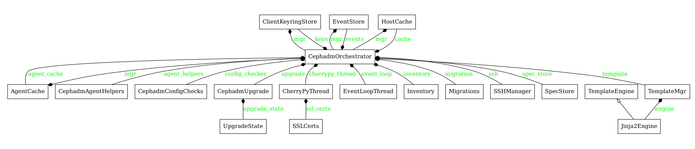
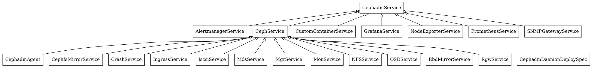

=======================
Cephadm Developer Guide
=======================

Design and Architecture
=======================

Cephadm is composed mainly of two different components:
* Cephadm binary
* Cephadm Mgr module

The ``cephadm`` binary is a simple Python binary file copied to the node managed
by the ``cephadm``. It contains all the logic necessary to perform the different
operations needed by the ``cephadm`` to manage the node such as:

* Cluster initial bootstrap
* Daemons life cycle management [create|start|stop|restart|remove]
* Check host requirements
* Repository management

During the initial cluster bootstrp the ``cephadm`` binary creates a minimal cluster
deploying a ceph ``mon`` and a ceph ``mgr``. By default a monitoring stack is deployed
as well.

The ``cephadm``  mgr module is Python component that runs as part of the Ceph mgr
and ensures the cluster status matches the specified by the user. The cephadm mgr module
inherits from the orchestrator and implements its interface. It's functionality is divided
into different modules, following are the most important ones:

* **serve.py** : this is the main cephadm class. It runs the main loop which performs the following actions:
  * schedule/launch daemons
  * check daemons status
  * apply services specs
  * conciliate cluster status
  * launch/resume cluster upgrade

* **module.py** : this module contains the cephadm mgr module implementation. It's where all the ``ceph orch`` commands are implemented.

* **inventory.py** : this module contains the inventory of cephadm. This is where all the
cluster related information is stored and cephadm sources of truth. *HostCache* is the class
where most of the persistent data related to services and daemons is stored. It must be kept
in sync with standby manager instance so whenever a failover occurs cephadm mgr module
can continue operating with up-to-date cluster information. See Host Cache section for more
information about this class.

* **upgrade.py**: this module contains all the logic needed to upgrade a ceph cluster safely.

* **migrations.py**: this module contains all the data migration which are needed during cluster upgrades. In general these are some adjustments needed when upgrading the cluster to a new software version.

* **agent.py**: this module contains the agent logic which runs as part of the cephadm mgr module.
Please do not confuse with the cephadm agent binary which runs on the nodes and collects data from
them.

* **scheudle.py**: this module contains the logic behind scheduling daemons on cluster nodes. This
includes rules used by cephadm to place daemons on the different hosts taking into account the available
nodes and the current cluster configuration.

* **services**: this package contains different modules for all the ceph supported services such as:

   * ingress
   * iscsi
   * nfs
   * ods

Following is a class diagram of the cephadm mgr module:

   Services vs. Daemons
=======================

.. ditaa::

            +---------------+ +---------------+ +---------------+ +---------------+ 
            |      OSDs     | |    Monitors   | |    Managers   | |      MDS      |
            +---------------+ +---------------+ +---------------+ +---------------+ 

Host Cache
=======================

HostCache stores different things:

1. ``daemons``: Deployed daemons O(daemons)

They're part of the configuration nowadays and need to be
persistent. The name "daemon cache" is unfortunately a bit misleading.
Like for example we really need to know where daemons are deployed on
hosts that are offline.

2. ``devices``: ceph-volume inventory cache O(hosts)

As soon as this is populated, it becomes more or less read-only.

3. ``networks``: network interfaces for each host. O(hosts)

This is needed in order to deploy MONs. As this is mostly read-only.

4. ``last_client_files`` O(hosts)

Stores the last digest and owner/mode for files we've pushed to /etc/ceph
(ceph.conf or client keyrings).

5. ``scheduled_daemon_actions``: O(daemons)

Used to run daemon actions after deploying a daemon. We need to
store it persistently, in order to stay consistent across
MGR failovers.

Host cache stores all the configuration needed by the ``cephadm`` to manage
the Ceph cluster. This information is kept in sync with the standby Mgr module
this way when a fail-over occurs the standby can take over and continue operating
using up-to-date cluster information. All objects stored in the host cache must
be serializable. Serialization is based on ``json``, thus all the classes must
implement ``from_json`` and ``to_json`` methods.

Scheduler
=======================

Migrations
=======================

SSH library
=======================

Agent
=======================

Upgrade
=======================

``cephadm`` can safely upgrade from one release to the next one. Downgrades are note
supported at this moment. All the upgrade logic is located in ``src/cephadm/upgrade``.
Following is a high level flow diagram of the upgrade process:

.. ditaa::

      +---------------+
      |               |
      |  Upgrade mgr  |
      |               |
      +---------------+
             |
             v
      +---------------+
      |               |
      |  Upgrade mon  |
      |               |
      +---------------+
             |
             v
      +---------------+
      |               |
      |  Upgrade GW   |
      |               |
      +---------------+
             |
             v
      +----------------------+
      |                      |
      |  Upgrade Monitoring  |
      |                      |
      +----------------------+
