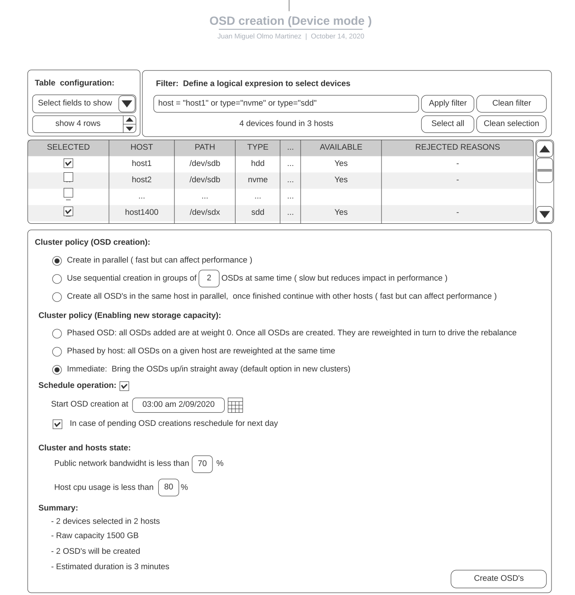
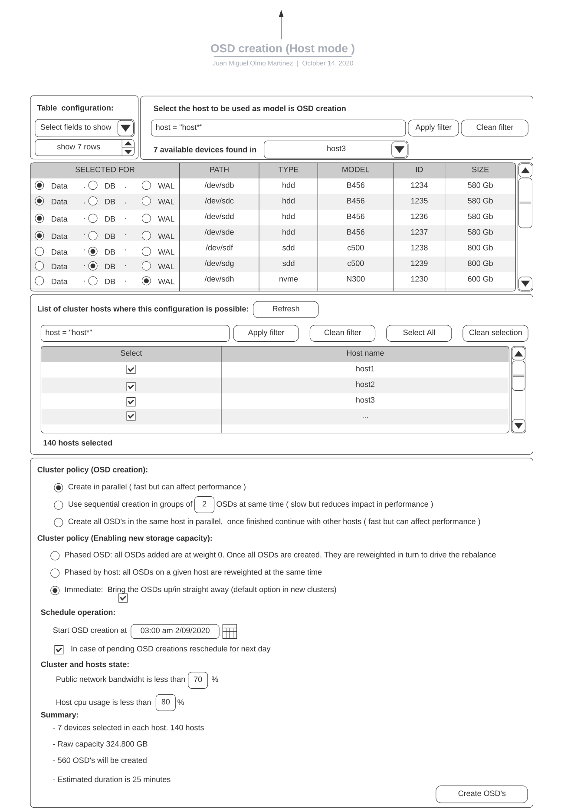

==============================================
Storage Devices and OSDs Management Workflows
==============================================
The cluster storage devices are the physical storage devices installed in each of the cluster’s hosts. We need to execute different operations over them and also to retrieve information about physical features and working behavior.
The basic use cases we have in this area are:

- `1. Retrieve device information. Inventory`_
- `2. Add OSDs`_
- `3. Remove OSDs`_
- `4. Replace OSDs`_

1. Retrieve device information. Inventory
=========================================
We must be able to review what is the current state and condition of the cluster storage devices. We need the identification and features detail (including ident/fault led on/off capable) and if the device is used or not as an OSD/DB/WAL device.

The information required for each device will be at least:
::

    Hostname   Path      Type  Serial    Size   Health  Ident  Fault  Available

.. Note: A more optional extended view with other information fields could be also useful.

In order to know what is the current condition of the device, we need to know what is the amount of storage used, the percentage of free space, the average number of IOPS and the fault led state.
This information should be provided probably by the Ceph orchestrator which is the component where we have access to this kind of information.

Another important question around retrieving device information is “efficiency”. The information about devices can be critical in components like the Orchestrator or the Dashboard, because this information usually is used to take decisions.
When we talk about efficiency we need to be sure that all the points are covered:

#. Get the complete information for each device in the most fast way.
#. All the information about all the devices in one host is accessible always immediately.
#. The information is constantly updated in each host. A device failure or the addition of a new device must be detected in the smallest possible timeframe
#. Scalability. To work with thousands of devices in hundreds of hosts shouldn't be a problem.

A. Current workflow:
--------------------
**CLI**:
    Operations:

.. prompt:: bash #

  ceph orch device ls
  ceph orch device ls json ( to get all the fields for each device )

    Problems in current implementation:
        * Does not scale.

**GUI**:
    Operations:
        * cluster.Inventory section:
            The cluster.Inventory section presents a basic list of the devices in the cluster. It is a fixed list with only a few fields. Only the “ident light on” operation is possible although we do not know if it is possible or not until the operation is launched.

    Problems in current implementation:
        * Does not scale (depends of the orchestrator)
        * Rigid user experience

B. Proposed workflow:
---------------------

**CLI**:
The current API is good enough, we only need to be sure that we have:

    - all the attribute/health/operative state fields from each device
    - fast response
    - scalable

**GUI**:
The inventory should be able to be customized in order to show the desired fields of information for each device. Being customizable also the position of each field(column) and the sort order.

The inventory should be filtered using any of the fields present in the list of devices.

A customized inventory list together with the filter and sort order should be able to be stored for easy utilization. In this way we can provide a set of interesting predefined inventory lists. For example:

    - Devices available
    - Devices more used (more average iops) (should be an alert/trigger)
    - Devices biggers than n Gb

The inventory should also provide a way to do directly operations over physical devices:

    * Identify:  Start/stop to blink the identification light
    * Create OSD: Create an OSD using this disk device if it is available.
    * Remove OSD: Delete the OSD using this disk device.

2. Add OSDs
===========

A. Current workflow
--------------------

**CLI**:
We can specify specific devices or use a “drive group” specification to create OSD’s in different hosts. By default, the definition of the OSDs to create is “declarative“ unless you use the unmanaged parameter.

.. prompt:: bash #

  ceph orch daemon add osd <host>:device1,device2 [--unmanaged=true]  (manual approach)
  ceph orch apply osd -i <json_file/yaml_file> [--dry-run] [--unmanaged=true]*  (Service Spec based approach)

**GUI**:
Implemented in the dashboard section “cluster.OSDs”.
There is a button to create the OSDs, that presents a page dialog box to select the physical devices that are going to be part of the OSDs as main, WAL or Db devices.
It Is very difficult to make a selection ( or to understand how to make the selection). This is even worse if your cluster has the same kind of devices, resulting in the weird thing that is not possible to create an OSD using only one storage device (because you cannot select it)
The problem here is the UI has been designed to work with “drive groups” and not to work for the user. The “drive group” is an abstract concept that must be used only in the background. Users must not be aware of this concept.

B. Proposed workflow
--------------------

**CLI and GUI**

The utilization of “declarative” drive groups makes it very difficult to understand how to configure OSD’s and the implications. Also make difficult the implementation because the multiple possibilities and the big amount of different conditions that we can find in a production system makes very complex the right evaluation and use of a declarative description of the storage devices used.
This results in unexpected situations. For example:
* A disk cleaned can be reused automatically and without any warning for creating a new OSD.
* New installed disks are used automatically for OSDs (without any warning)
* Errors trying to recreate OSD’s in disk removed from the system.

So there is an important thing to consider in order to simplify everything for the user and for the implementation:
**Avoid the “declarative” use of the drive groups**

**GUI**:

The user should be able to define the set of physical disk devices that are going to be used to support OSD’s.
This means to make simple things like create one OSD in a certain device, and also to define in an easy way how to create multiple OSD’s across multiple devices in different hosts.

We should take into account different premises:

We use only bluestore OSD’s, this means that in order to create an OSD we can decide between different strategies: consume only a single device for the OSD, use an additional device for the WAL, and/or use another different device for the DB.
To split the different bluestore OSD data components between different devices only makes sense if the WAL/DB devices are faster than the main storage device.
And the split of devices are always inside the same host, although the configuration will be applicable to other hosts with the same storage devices schema.

A massive creation of OSDs in a production system can result in real disaster because rebalancing can affect negatively to the normal system performance.
The same massive OSD creation in a cluster that is being installed for the first time probably is the desired behaviour.
So we should provide a mechanism to allow the user to select in which way the OSDs are going to be created. It seems that we have two possibilities:
* Fast creation - fast but harmful for performance -
Create the OSDs directly
* Conservative creation - Slow but respectful with performance -
Create all the OSDs with 0 weight. Once all OSd’ are installed, start to assign the right weight to each OSD one by one.

With all these premises into account it is proposed the following interface with two different modes:

**Device mode**:

An inventory list with all the available devices and filter/listing capability is presented to the user, the user can “play” with this list obtaining a set of preferred cluster physical storage devices.

The user can select from the “preferred devices list” ,one, several or all the devices. These selected devices will be the ones used to create OSD’s (1 per physical device.).

OSD ids coming from previously deleted OSDs can be available. The user should indicate if these ids must be used or not in the new OSDs.

The user interface proposed could be like:

**Host mode**:

Is basically an OSD configuration using the storage devices in a host. This configuration will be used as a base pattern to apply the same schema in other hosts.

The user must select a base host.
Once the host is selected, we should provide three lists (or ways to select) of available devices in the host:
* “slow devices” with the “hdd” devices
* “fast devices (WAL)” with the “sdd/nvme” devices that can be used for Bluestore WAL data
* “fast devices(DB)” with the “sdd/nvme” devices that can be used for Bluestore DB data

The user, using filters over the list of “slow devices” should select one,several,or all the devices in the list for OSD creation.
If the user wants to split Bluestore data components in several devices, the same operation will be needed to be performed in the other two “fast devices” lists.

OSD ids coming from previously deleted OSDs can be available. The user should indicate if these ids must be used or not in the new OSDs

Once the devices are selected we can provide a “preview “ of the OSD’s that are going to be created. (the fast devices potentially will store the WAL/DB for several OSDs).

.. Example: The user selects 8 slow storage devices for OSD, and 2 nvme for WAL and 1 sdd for DB. In each nvme device we will have the WAL for 4 OSD’s and in the sdd device we will have the DB for 8 OSD’s.

OSD creation should have the inventory, and analyse to determine whether the OSD creation can be hybrid, dedicated - present those as options to the user (they never see a device group!) - then they click create.

When the user is happy with the OSD configuration in the host, we should provide a way to present a list of hosts where it is possible to apply the same OSD configuration. The user will select from this list the hosts where he wants to create the OSD’s.

A preview/summary of the creation of OSD’s in all the hosts must be provided, and if the user wants this configuration, then it will be applied, resulting in a bulk OSD creation in multiple hosts.

Information about the progress of OSD creation in all the hosts should be provided.

Key points to consider:
-----------------------

**1. Context is everything**:
The current OSD creation flow doesn’t provide any indications of available devices or hosts. This leaves the user clicking on the add button and seeing nothing, if there are no devices available - at which point the user assumes there are no available devices. Both host-mode and device-mode UI flows illustrate a couple of usability features that should be implemented as a bare minimum.

    a. If there are no devices available, the add button should be disabled

    b. The UI for OSD creation should include a summary of discovered hosts with disks and the total number of available disks that could be used for OSD creation. This should also show total raw. E.g. 5 hosts, 50 HDDs (80TB), 10 NVME (5TB)

        - The discovered configuration could also
            - Use the hosts rack ID annotations to look at the capacity from a fault domain perspective to ensure it’s balanced - and warn if not.
            - Confirm whether the host configurations are identical (homogeneous). Heterogeneous configurations could therefore be accompanied by a INFO/WARN message in the UI to highlight the potential balance issues of heterogeneous clusters.

    c. Once the deployment decision is made, display a summary of the selection, that the user CONFIRMs
        * Total devices by type that would be used
        * Total number of OSDs that would be created
        * Overall raw capacity of the creation request, together with the potential raw cluster capacity once the OSD addition is complete
        * Use a rule-of-thumb to determine approximate deployment time - set an expectation.

**2. Enabling new capacity**:
Policy option for how new disks are added to the cluster (this is present in both host-mode and device-mode designs)
- Phased by OSD: All OSDs added are at weight 0. The orchestrator then reweights each OSD in turn to drive the rebalance
- Phased by host: all OSDs on a given host are reweighted at the same time
- Immediate: don’t use reweight. Bring the OSDs up/in straight away (on an empty cluster, this should be the default)

**3. UI redesign**:
Discover the devices, suggest a layout based on these devices combined with best practice, inform if there are is not enough flash for the number of HDDs, inform if there are no free devices, and also provide the advanced use case which is what we see today (which echoes the drive group approach)

**4. Imperative not Declarative**:
The use of declarative “drive groups” is a problem in several aspects:

For the final user:

The “admin persona” who is going to install a cluster by first time knows what is the current hardware composition and will create the OSD’s possibly using all the storage devices in the hosts of the cluster planified to harbor OSDs.

But we are not telling the “admin persona” that this initial decision will be inmutable in the future and applied automatically without any warning.

This will result in several undesired situations:

    1. Storage devices with OSD’s cannot be used  for other purposes. Because they are reinstalled as OSD’s as soon as they are cleaned. Seems difficult to explain that if you do not want that, you need to add the device to a black list,  or create the OSD using the “unmanaged” parameter. (not provided in the UI)
    Another horrible situation can be: you buy a new device for one of your hosts in order to store the minecraft server. You have bad luck and this device is more or less the same as the ones you used for OSD’s … then you won’t install your minecraft server because the device is automatically used for OSDs.
    Another stressful situation… your lab team installed 10 new disks in your cluster, and they decided to do that just where you have more traffic in the cluster network. Rebalance of data will cause a funny situation for the “admin persona”.
    This is a good example about  how we can make the users life more difficult managing OSDs

    2. Probably after a couple of years the requirements will grow. New different storage devices will be added. And the “admin persona” will need to specify that these devices will harbor OSDs. Then we have to store the initial “drive group” used to create the initial OSDs, and also the new “drive group” definition for the new devices. So now we have more than one “drive group”, so this implies two possibilities, add a “drive groups” management tool, or merge “the two definitions" in only one!

    In any case this is a good example about how we can make the users and developers life more difficult.

All these things can be avoided using imperative drive groups, we are going to provide the same functionality but without all the undesired collateral effects.
From the development point of view , this will also simplify things, so it seems a very good idea to move from “declarative” drive groups to “imperative” drive groups.

.. Note: The current dashboard implementation of the functionality to create OSDs is trying to deal with “drive groups” , This is the reason that it will be so uncomfortable for the final user. The “drive group”concept should be completely hidden to the dashboard user.

3. Remove OSDs
==============

A. Current workflow
--------------------

**CLI**:
    * We can launch the command to delete a OSD (one by one)

.. prompt:: bash #

  ceph orch osd rm <svc_id(s)> [--replace] [--force]

    * We can verify what is the status of the delete operation

.. prompt:: bash #

  ceph orch osd rm status

    * Finally we can “clean” completely the device used in the OSD

.. prompt:: bash #

  ceph orch device zap my_hostname /dev/sdx

**GUI**:

In the cluster OSD section we have a button to execute different primitive operations over the OSD’s selected. One of these primitives is delete.

When the “delete” primitive is selected and the action button is pressed, a dialog box to confirm the operation and a check box to ask about preserving the “osd id” is shown. After accepting nothing seems to happen….

No way to know what is the progress of the delete operation.

We tend to show all the primitives for osd management in the UI - question is, does that make the environment more complex? Should the UI focus on the key workflows of osd management to cover 90% of the work quickly and easily, and leave the 10% to the CLI?

B. Proposed workflow
---------------------

**CLI**:

    - Need a way to know in advance how much time is going to be needed to delete an OSD (if we rebalance data)
    - The current set of command can satisfy main requirements

**GUI**:

The user should select the OSD (or set of OSDs) to remove from a list with filtering capabilities.

The OSD removal should provide an option to preserve the OSD id for use when creating new OSD’s. An assessment about the time that is going to take the operation is another important  element to decide how to do the operation and when is the best moment.

When the user decides to execute the removal operation, the system should follow a safe procedure, with a certain degree of intelligence.

Depending of the OSD state (in(out, up/down) and the situation ( we are in a low/high cpu/network utilization time interval), probably we will need to do different things.

* Direct removal of the OSD:

we are going to execute the OSD deletion operations without any wait.

* Safe OSD Removal:

We want to remove the OSD in the most safe way. This means wait until we know that the OSD is not storing information. The user must receive a notification when it will be safe to remove the OSD

* Scheduled OSD removal:

We want to execute the removal in the future. Besides that,  it is probable that we only will want to execute the removal if the system utilization is below certain limit

4. Replace OSDs
===============

A. Current workflow
--------------------

Is the same workflow used for removing OSDs, but we just need to use the "replace" parameter in order to preserve the OSD id for future use when we are deleting.
In the GUI the replace parameter appears as a checkbox.

B. Proposed workflow
---------------------

Follow the directives we have in the proposed workflow for OSD removal
