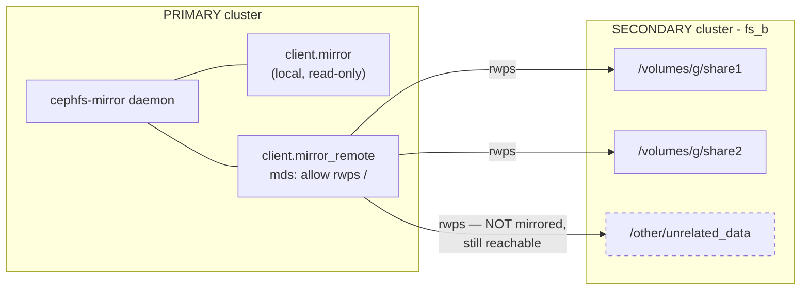
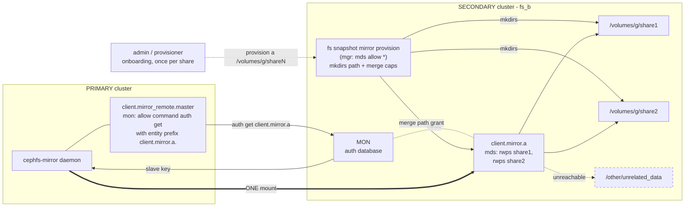
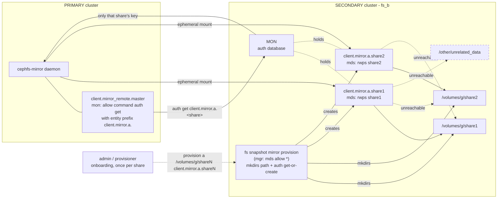
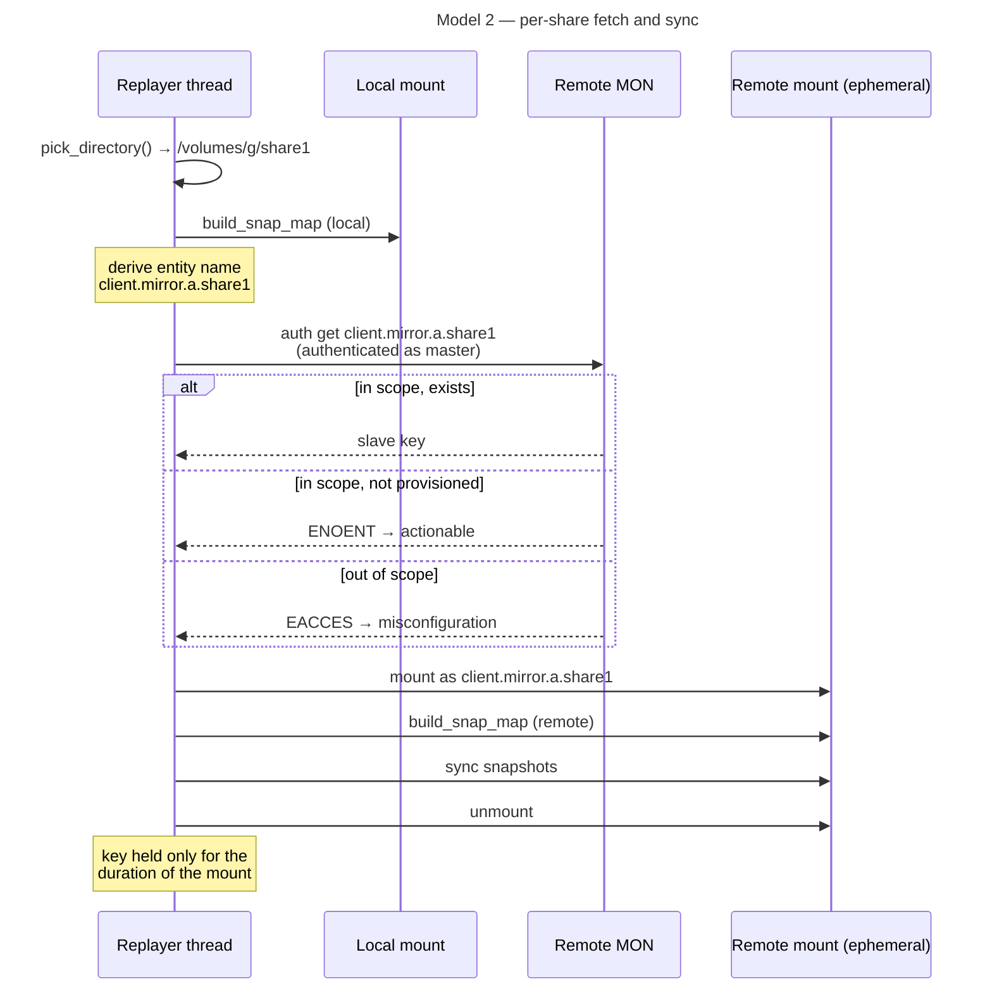
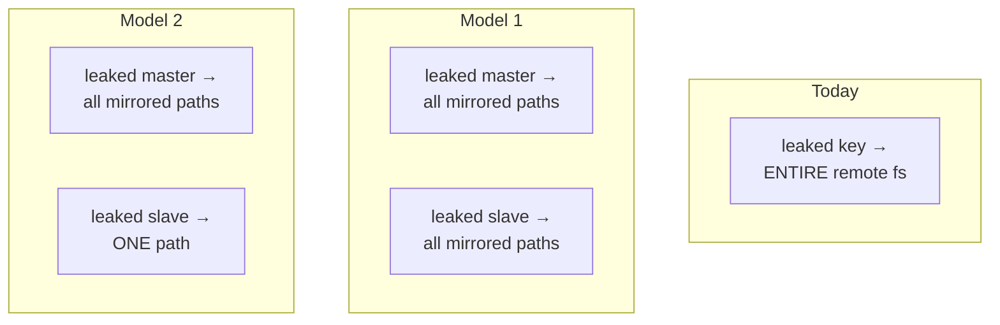

# Per-subvol/dir auth isolation

Tracker #75014

---

## 0. Today: one credential (say `client.mirror_remote`), `rwps` on `/`

One key and its reach exceeds what is being mirrored: a leaked key touches the entire remote filesystem.

---

## 1. Model 1: single slave, all mirrored paths

One entity, one (persistent?) mount. Cap string is rewritten on every dir add/remove
so this model serializes every add/remove through one record which inherently involves read-modify-write contention per PAXOS transaction. This also needs a `deauthorize` counterpart. A leaked slave reaches every mirrored path.

---

## 2. Model 2: per-share slaves, ephemeral mounts

One entity per share. A leaked slave reaches exactly one path. Mounts are created and torn down per sync, bounded by `cephfs_mirror_max_concurrent_directory_syncs`.

---

## 3. Model 2: sync sequence

---

## 4. Blast radius, side by side

Two total-loss secrets in model 1; one in model 2. That difference is the argument for model 2 suitable for multi-tenancy where a mirroring-provisioner mirrors subvolumes belonging to mutually distrusting consumers.

---

## IMP Questions

- ~~Tackle `ceph_mkdirs()`~~ **RESOLVED.** New remote-side interface::

      # on the HOST, to learn the mirror target
      ceph fs subvolume getpath a subvol1 --group_name grp
        -> /volumes/grp/subvol1/<uuid>

      # on the REMOTE, once per share at onboarding
      ceph fs snapshot mirror provision a /volumes/grp/subvol1 client.mirror.a.subvol1

Note the two commands take **different levels**. Provisioning targets the subvolume *base* path (derivable from group+subvol, no uuid), and grants `rwps` on it. The daemon then creates `<uuid>/` *inside* that granted scope since `handle_client_mkdir` checks the parent with `MAY_WRITE`, so a cap on `X` permits creating children of `X`, just not `X` itself. Provisioning supplies exactly that one directory.

No credential risk: this runs on the remote as an ordinary mgr command, and the mgr already holds `mds 'allow *'`. No new privileged key is created, and the primary never gains provisioning power.

- Who creates slave keys? The remote-side `provision` command above, invoked by an admin or the provisioner's orchestration.
    - This routes through a mgr module, so the invoking identity can create and read slave keys. Worth stating plainly: CephX is symmetric, so the mon holds every entity's secret and any sufficiently privileged identity can already read any key and this is true cluster-wide and predates this feature. The threat model here is therefore credential leakage, not privileged insiders: per-share scoping bounds what a leaked key reaches. Defending against a privileged insider would require asymmetric identity, which CephX does not provide. Having orchestration (cephadm/Rook) administer these keys removes humans from the handling path, which narrows the leakage surface further within the same model.

- One more important thing to note is given how we would create the slave keys, we might restrict the MDS auth caps using the `path` attribute but the OSD caps would be on the data pool meaning these users can technically still access the data.

- Open sub-question: pre-provision (master holds only `auth get`) vs mint-on-demand (master holds `auth get-or-create`, needs an anchored regex on `caps_mds` or it can mint itself a root-scoped slave).

---

## Notes

- Personal inclination towards model-2 since it assures finer granularity at path-level meaning this is the floor and any layer of abstraction say subvolumegroup level isolation is just another indirection.
- Measure MDS churn with inflated `cephfs_mirror_max_concurrent_directory_syncs` and `cephfs_mirror_directory_scan_interval` due to bloated client mounts.
- A single slave key or `N` slave keys mean the same churn to the mon db store. It might sound counterintuitive but N entires is simpler since it's more of an append-only where there are no contentions.
- To avoid redundant libcephfs calls, the `build_snap_map()` should persist the snap map in cache.
- **cephfs-mirror replicates no xattrs at all.** The only xattr traffic in `PeerReplayer.cc` is its own bookkeeping (`ceph.mirror.dirty_snap_id`) i.e. one `ceph_fsetxattr` and two `ceph_getxattr`. There is no `listxattr`. Data, mode, ownership and timestamps cross but nothing else does. So none of these reach the replica:

      ceph.dir.subvolume                the subvolume mark
      ceph.quota.max_bytes              quota
      ceph.dir.layout.pool              data pool
      ceph.dir.layout.pool_namespace    namespace isolation
      earmark / normalization / casesensitive / enctag

- Consequences worth separating:
  1. This is a **pre-existing gap in mirroring generally**, not something per-share auth introduces. Mirror any directory with a quota today and the replica has none.

  2. For subvolumes specifically, V2 takes snapshots under the `<subvolume-name>` directory rather than `<uuid>`, so `.meta` and `<uuid>/` both sit inside the mirrored tree so `.meta` replicates for free as ordinary file content but its contents then *claim* a quota and pool that were never applied, because those live in xattrs.

  3. Therefore "make the remote a first-class subvolume" depends on xattr replication landing first.
