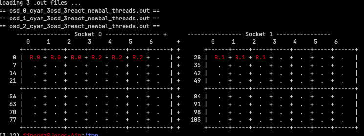
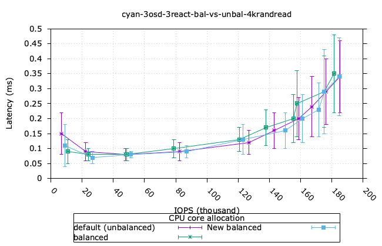
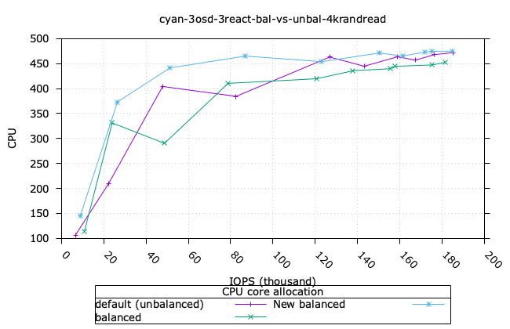
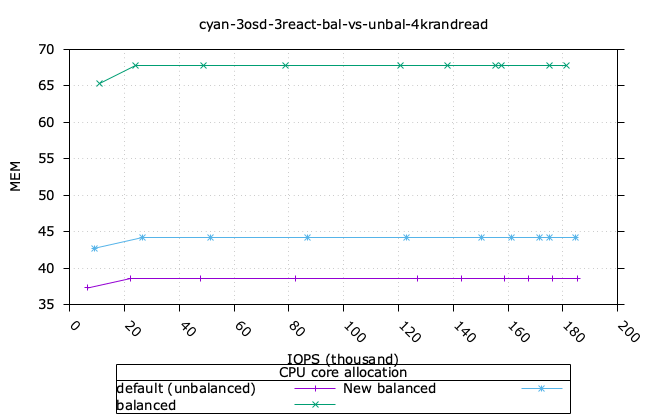

# Balance CPU Crimson.

----------

We introduced the following utilities to help analysing the Performance impact of two strategies for
allocation of CPU cores to Seastar reactor threads. This is limited to a single host deployment at the moment.

- OSD-based: this consists on allocating CPU cores from the same NUMA socket to the same OSD.
  for simplicity, if the OSD id is even, all its reactor threads are allocated to NUMA socket 0, and 
  consequently if the OSD is is odd, all its reactor threads are allocated to NUMA socket 1.

- NUMA socket based: this consists of allocating evenly CPU cores from each NUMA socket to the reactors, so 
  all the OSD end up with reactor on both NUMA sockets.

A new option `--crimson-balance-cpu <osd|socket>` has been implemented in `vstart.sh` to support these strategies.

Worth pointing out, there are *three* CPU allocation strategies:

- when the new flag is not specified (default), Seastar reactors to use CPUs in ascending contiguous order (unbalanced across sockets),
- osd: distribute across sockets uniformly, don't split within an OSD,
- socket: distribute across sockets uniformly, split within an OSD.

The utilities introduced are:

- `balance-cpu.py`: a stand-alone script to produce the list of CPU core ids to use by `vstart.sh` when allocating
  Seastar reactor threads. It uses as input the .json produced by `lscpu.py`.
- `lscpu.py`: a Python module to parse the .json file created by `lscpu --json`. This produces a Python dictionary
  with the NUMA details, that is, number of sockets, range of CPU core ids (physical and HT-siblings).
- `tasksetcpu.py`: a stand-alone script to produce a grid showing the current CPU allocation, useful to quickly
  visualise the allocation strategy.

## Usage:

The following is a typical example of creating a cluster with three OSDs and three reactors per OSD, and
the desired CPU allocation policy:

```
# MDS=0 MON=1 OSD=3 MGR=1 /ceph/src/vstart.sh --new -x --localhost --without-dashboard --cyanstore --redirect-output --crimson --crimson-smp 3 --no-restart --crimson-balance-cpu osd
```

The following is the corresponding CPU distribution:



The following snippet shows the typical usage of the `balance-cpu.py` script:

```
lscpu --json > /tmp/numa_nodes.json
python3 ${CEPH_DIR}/../src/tools/contrib/balance-cpu.py -o $CEPH_NUM_OSD -r $crimson_smp \
  -b $balance_strategy -u /tmp/numa_nodes.json > /tmp/numa_args.out
```
* the accepted balance strategies are "osd" or "socket".
* the file produced `/tmp/numa_args.out` contains the list of CPU ids that `vstart.sh` consumes to issue the corresponding ceph configuration commands.

The grid can be printed as follows:

```
  [ ! -f "${NUMA_NODES_OUT}" ] && lscpu --json > ${NUMA_NODES_OUT}
  python3 /ceph/src/tools/contrib/tasksetcpu.py -c $TEST_NAME -u ${NUMA_NODES_OUT} -d ${RUN_DIR}
```

## Performance

The following charts show the comparison of IOPs for the three CPU allocation policies: default
(contiguous allocation, no balance), OSD-based, NUMA socket-based. It is interesting to note that
there does not seem to be any significant throughput degradation, for this small configuration 
(3 OSD, 3 reactors). However, the OSD-based allocation requires higher memory utilisation than the other 
two configurations, which is an interesting finding and requires further investigation.







