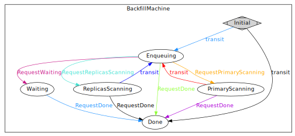

===============
BackfillMachine
===============

In Crimson, backfill is implemented with `Boost State Chart <https://www.boost.org/doc/libs/1_86_0/libs/statechart/doc/>`_.

.. //TODO: Once the implementation is settled:
..         * Explain exceptional states once we finish working on this code
..         * Explain example happy path flow (code walkthorugh?)
..         * https://tracker.ceph.com/issues/68728

A sample of the recent state model:

.. note:: ``Cancelled`` and ``Crushed`` states are not included in the
          following graph in order to make it easier to follow:

          * **Any** state is able to transit into ``Crushed``.

          * **Any** state (except from ``Initial`` and ``Waiting``) can transit into ``Cancelled``

In similarly to :doc:`/dev/peering` a copy of the latest BackfillMachine
state model can be genereated using the `gen_state_diagram.py <https://github.com/ceph/ceph/blob/master/doc/scripts/gen_state_diagram.py>`_
