.. _seastore:

==========
 SeaStore
==========

Goals and Basics
================

* Target NVMe devices primarily, with interest in HDDs as well.
* make use of SPDK for user-space driven IO
* Use Seastar futures programming model to facilitate
  run-to-completion and a sharded memory/processing model
* Allow zero (or minimal) data copying on read and write paths when
  combined with a Seastar-based messenger using DPDK

Data layout basics
------------------

One or more cores/shards will be reading and writing to the device at
once.  Each shard will have its own independent data it is operating
on and stream to its own open segments.  Devices that support streams
can be hinted accordingly so that data from different shards is not
mixed on the underlying media.

Architecture
============

.. .. Mermaid source of seastore_arch.svg
.. flowchart TB
  %% Level 1
  SeaStore[SeaStore]
  %% Level 2
  subgraph Logical
    direction LR
    OnodeManager[OnodeManager]
    OmapManager[OmapManager]
    ObjectDataHandler[ObjectDataHandler]
    Ellipsis[...]
  end
  %% Level 3
  TransactionManager[TransactionManager]
  %% Level 4
  subgraph Physical
    direction LR
    Journal[Journal]
    LBAManager[LBAManager]
    ExtentPlacementManager[ExtentPlacementManager]
  end
  %% Level 5
  subgraph EPM
    direction LR
    Cache[Cache]
    AsyncCleaner[AsyncCleaner]
    Devices[Devices]
  end
  %% Order
  SeaStore --> OmapManager
  OmapManager --> TransactionManager
  TransactionManager --> LBAManager
  ExtentPlacementManager --> AsyncCleaner
  ExtentPlacementManager --> Cache
  ExtentPlacementManager --> Devices
  ExtentPlacementManager --> EPM
  %% Hide Lines
  linkStyle 0 stroke:transparent
  linkStyle 1 stroke:transparent
  linkStyle 2 stroke:transparent
  linkStyle 3 stroke:transparent
  linkStyle 4 stroke:transparent
  linkStyle 5 stroke:transparent

Design
======

Each reactor manages its own root.  Prior to reusing a segment, we rewrite any live
blocks to an open segment.

Because we are only writing sequentially to open segments, we must
“clean” one byte of an existing segment for every byte written at
steady state.  Generally, we’ll need to reserve some portion of the
usable capacity in order to ensure that write amplification remains
acceptably low (20% for 2x? -- TODO: find prior work). We support both
background garbage collection, which allows us to exploit periods of
lower I/O demand, and inline relocation of blocks from existing
segments as part of ongoing client I/O.

.. _metadata-structures:

Metadata Structures
-------------------

.. Mermaid source of seastore.svg
.. flowchart TD
  %% Root
  Root((Root))
  %% Physical
  subgraph Physical["Physically Addressed"]
    LBABtree["LBA Btree"]
    BackrefTree["Backref Tree"]
  end
  %% Logical
  subgraph Logical["Logically Addressed"]
    OnodeTree["Onode Tree"]
    OnodeN["Onode"]
    %% Per-Onode structures
    Omap1["OMAP
    B-tree Root
    (LBA)"]
    Omap2["XATTR
    B-tree Root
    (LBA)"]
    Extents["Data Extents
    (LBA Range)"]
    %% Mapping and containment
    OnodeTree -- "map: ghobject_t → Onode" --> OnodeN
    OnodeN --> Omap1
    OnodeN --> Omap2
    OnodeN --> Extents
  end
  %% Top-level links
  Root --> OnodeTree
  Root --> LBABtree
  Root --> BackrefTree
  %% Styling
  classDef logical fill:#e0f7fa,stroke:#333,stroke-width:1px;
  classDef physical fill:#f1f8e9,stroke:#333,stroke-width:1px;
  class OnodeTree,OnodeN,Omap1,Omap2,Extents logical;
  class LBABtree,BackrefTree physical;

**Extents**:

  An extent is an allocation unit on disk. All extents are either **physically addressed** (``paddr_t``)
  (direct physical location on disk) or **logically addressed** (``laddr_t``).
  Logically addressed extents are referred to by logical rather than physical addresses, allowing them to
  be relocated freely without affecting the data structures they belong to.
  The vast majority of extents fall into this category.

  There are multiple types of extents, such as ``ROOT``, ``OMAP_LEAF``, and ``OBJECT_DATA_BLOCK``
  (see ``extent_types_t`` for the full list).
  Each extent type can interpret **journal deltas** differently, see :ref:`journal` for details.

  *Interface:* ``ObjectDataHandler``

**Onode Tree**:
  Maps ``ghobject_t`` to ``Onode``. The Onode layout (``onode_layout_t``) will consist the
  Omap Btrees and the ``extent_types_t::OBJECT_DATA_BLOCK`` extents.

  *Interface:* ``FLTreeOnodeManager``

**Omap Btree**:
  Stores ``omap_type_t`` entries for each object.

  *Interface:* ``BtreeOMapManager``

  The same ``BtreeOMapManager`` interface is used for handling multiple omap types:

  ``omap_type_t::OMAP``, ``omap_type_t::XATTRS``, and ``omap_type_t::LOG``.

  Each type is stored in its own tree, but the interface remains consistent to avoid reimplementation for each type.

**LBA Btree**:
  Mappings of a logically addressed extents to either a physical address or
  another (indirect) logical address.

  *Mapping:* ``laddr_t`` --> ``pladdr_t``

  *Extents:* ``LADDR_INTERNAL`` and ``LADDR_LEAF``

  *Interface:* ``LBAManager``

.. note::
  ``pladdr_t`` represents either ``paddr_t`` (direct mapping) or ``laddr_t`` (indirect mapping).
  See :ref:`lbamanager`.

**Backref Tree**:
  Maps physically addressed extents to logical addresses.

  *Mapping:* ``paddr_t`` --> ``laddr_t``

  *Extents:* ``BACKREF_INTERNAL`` and ``BACKREF_LEAF``

  *Interface:* ``BackrefManager``

.. note::
   The Backref Tree is used only for **garbage collection** on **Segmented Seastore device types**
   (See SegmmentCleaner).

.. _device-types:

Device Types
------------

Configured via the ``seastore_main_device_type`` option, the device types are
separated into **Segmented** and **RBM** backend types as follows:

- **backend_type_t::SEGMENTED**:

  **Segmented Backend Motivation:**:

  All flash devices are internally structured in terms of erasure blocks that
  can be written efficiently but must be erased in their entirety. The
  NVMe device generally has limited knowledge about what data in a
  segment is still "live" (hasn't been logically discarded). This limited
  knowledge reduces garbage-collection efficiency when data with mixed lifetimes
  shares the same segments. We can design an on-device layout that is friendly to GC at lower layers and
  drive garbage collection at higher layers.

  The basic idea is that all data will be stream out sequentially to
  large segments on the device.  In the SSD hardware, segments are
  likely to be on the order of hundreds of MB to tens of GB.

  SeaStore's logical segments would ideally be perfectly aligned with
  the hardware segments.  In practice, it may be challenging to
  determine geometry and to sufficiently hint to the device that LBAs
  being written should be aligned to the underlying hardware.
  In the worst case, we can structure our logical segments to span multiple physical segments sizes,
  to avoid the metadata cost of representing each erasure block independently.

  When we reach some utilization threshold, we mix cleaning work in with
  the ongoing write workload in order to evacuate live data from
  previously written segments.  Once they are completely free we can
  discard the entire segment so that it can be erased and reclaimed by
  the device.

  The key is to mix a small bit of cleaning work with every write
  transaction to avoid spikes and variance in write latency.

  **Segment Layout:**:

  The backing storage is abstracted into a set of segments.

  The types of segements are:

  * ``segment_type_t::JOURNAL`` - See Journal Types in :ref:`journal`
  * ``segment_type_t::OOL`` - Data segments
  * ``segment_type_t::NULL_SEG`` - Initial segment state

  Each segment can be in one of Three states:

  * ``segment_state_t::EMPTY``
  * ``segment_state_t::OPEN``
  * ``segment_state_t::CLOSED``.

  Each segment is prefixed with ``segment_header_t`` in the first block and suffixed with a ``segment_tail_t``.

  Note that segments will generally be large (something like >=256MB),
  so there will not typically be very many of them.

  Each shard will keep open N segments for writes

  - HDD: N is probably 1 on one shard
  - NVME/SSD: N is probably 2/shard, one for "journal" and one for
    finished data records as their lifetimes are different.

  I think the exact number to keep open and how to partition writes
  among them will be a tuning question -- GC/layout should be flexible.
  Where practical, the goal is to partition blocks by expected
  lifetime so that a segment either has long lived or short lived
  blocks.

  Segment: [ ``segment_header_t`` | ``record_t`` | ``record_t`` | ``record_t`` ... ]

  Used for:

  * ``device_type_t::SSD`` (default)
  * ``device_type_t::HDD``
  * ``device_type_t::ZBD``

  Preferred for sequential writes. Can't overwrite written extents (similar to ZNS).

  *Interface:* ``SegmentManager``

- **backend_type_t::RANDOM_BLOCK**:

  Used for:

  * ``device_type_t::RANDOM_BLOCK_SSD``

  Preferred for fast NVMe devices where overwrites are efficient enough
  that log structured updates aren't worth the overhead.

  *Interface:* ``RBMDevice``

.. _journal:

Journal
-------

*Interface:* ``Journal``

See ``src/crimson/os/seastore/journal.h``

Responsible for atomically writing (``Journal::submit_record``) and replaying
(``Journal::reply``) journal records. A journal record ``record_t`` is a struct containing deltas and extents.

**Journal Records**:

The byte contents of segments are a sequence of ``record_t`` records.
A group of records is prefixed by a ``record_group_header_t`` header which includes the number of records,
length of the data and checksum. A record group is a set of records that are written to disk in a single write operation.

See ``RecordSubmitter::flush_current_batch()``.

* ``record_type_t::OOL``:

  Data records. These records are not padded and do not contain **any** metadata (See ``encode_records``).

* ``record_type_t::JOURNAL``:

  Used in the Journal segment only.
  Each record is then prefixed by ``record_header_t`` which contain the number of deltas and extents sequence in this record.

  Each delta (``delta_info_t``) describes a logical mutation for some block.
  Each included block is an aligned extent addressable by ``<segment_id_t, segment_off_t>``.
  A transaction can be implemented by constructing a record combining deltas and updated blocks and writing
  it to an open segment.

Record: [ ``record_header_t`` | ``record_type_t::delta`` | ``record_type_t::delta``... | ``record_type_t::extents`` | ``record_type_t::extents`` ... ]

See ``src/crimson/os/seastore/seastore_types.h`` for most SeaStore structures.

**Journal Trimming**:

The journal trimming interface is ``JournalTrimmer`` and is implemented in ``JournalTrimmerImpl``.
Periodically, we trim the journal (else, we’d have to replay
journal deltas from the beginning of time). Journal entries can be trimmed once the
extents they reference have been rewritten elsewhere (See: ``JournalTrimmerImpl::trim_dirty()``).

**Journal Deltas**:

Deltas are logical mutations to existing extents.
Note, deltas are not always byte range modifications.  Consider a btree
node structured with keys to the left and values to the right (common
trick for improving point query/key scan performance).  Inserting a
key/value into that node at the min would involve moving a bunch of
bytes, which would be expensive (or verbose) to express purely as a
sequence of byte operations.  As such, each delta indicates the type
as well as the location of the corresponding extent.  Each block
type can therefore implement ``CachedExtent::apply_delta`` as appropriate.
For example, ``OMapInnerNode::apply_delta`` or ``ObjectDataBlock::apply_delta``.

A transaction is represented by an atomically written record.
Transaction deltas are always written to the journal.  If the transaction is associated
with blocks written to other segments, final record with the deltas
should be written only once the other blocks are persisted.  Crash
recovery is done by finding the segment containing the beginning of
the current journal, loading the root node, replaying the deltas, and
loading blocks into the cache as needed.

**Journal Types**:

According to the :ref:`device-types`, the journal has two implementations:

* **SegmentedJournal**: Used for Segmented devices.

  * One open segment is designated as the journal (``segment_type_t::JOURNAL``).
  * The size of the journal segment is equal to ``seastore_segment_size``.
  *  A record can contain:

    * Blocks written as part of the transaction (inline)
    * Journal deltas

  * Small or short-lived extents (e.g., leaf nodes) can be written inline to the journal segment.
    This is possible when the delta fits in the journal record and when the extent is expected
    to be updated again soon. Longer-lived or large extents are written to out-of-line segments
    (``segment_type_t::OOL``). Writing out-of-line extents avoids unnecessary
    data movement during segment cleaning.
  * ``record_type_t::OOL`` will never contain metadata. See ``record_size_t::get_raw_mdlength()`` for example.

* **CircularBoundedJournal**: Used for RBM devices.

  * Journal is fixed size (configured via ``seastore_cbjournal_size``)
  * A record will contain **only** Journal deltas as all extents are written out-of-line, outside the journal.
  * Trimming the journal does not require moving data since no data is written inline.

Block Cache
-----------

Every block is in one of the following states:

- ``extent_state_t::INITIAL_WRITE_PENDING``:

  In ``Transaction::write_set`` and ``fresh_block_list``; has ``prior_instance`` under rewrite.

- ``extent_state_t::MUTATION_PENDING``:

  In ``Transaction::write_set`` and ``mutated_block_list``; has ``prior_instance``.

- ``extent_state_t::CLEAN``:

  In ``Cache::extent_index`` and in ``Transaction::read_set`` during write.
  Contents match disk; ``version == 0``.

- ``extent_state_t::DIRTY``:

  Must be fully present in the cache. Contents do not match disk; ``version > 0``.
  The current version of the record requires overlaying deltas from the journal.

- ``extent_state_t::EXIST_CLEAN``:

  Similar to ``CLEAN``, but its metadata has not yet been persisted to disk.
  Present in ``Transaction::write_set`` and ``existing_block_list``.
  After the transaction commits, the state becomes ``CLEAN`` and the extent is added to the Cache.
  Modifying such extents will transition the state to ``EXIST_MUTATION_PENDING``.

- ``extent_state_t::EXIST_MUTATION_PENDING``:

  Similar to ``MUTATION_PENDING``, but ``prior_instance`` is empty.
  Present in ``Transaction::write_set``, ``existing_block_list``, and ``mutated_block_list``.
  After the transaction commits, the state becomes ``DIRTY`` and the extent is added to the Cache.

- ``extent_state_t::INVALID``:

  No ``ExtentIndex`` set.

SeaStore uses caching not only for performance but also for **correctness** purposes.

The cache can represent the *projected* outcome of to-be-committed transactions.
This projected state can be used during reads (``TransactionManager::read_pin``) to verify checksums.
It ensures that persisted extent checksum matches the projected transaction outcome when handling
a fully loaded extent during reads. For testing purposes, we can also force a full re-load on reads
(see ``Cache::check_full_extent_integrity``).

Caching also keeps ``extent_state_t::DIRTY`` extents, those whose contents differ
from what is persisted, **pinned in memory**. Pinning is managed through the
``ExtentPinboard`` interface, which supports two caching algorithms: **LRU** and
**2Q** (configured via ``seastore_cachepin_type``).

The caching layer additionally detects **transaction conflicts** that require
retries (see ``Cache::mark_transaction_conflicted``). However, this mechanism is
planned to be removed due to high retry rate write workloads.

**Interface:** ``Cache``

See: ``src/crimson/os/seastore/cache.h``

See src/os/crimson/seastore/cached_extent.h.
See src/os/crimson/seastore/cache.h.

GC
---

Prior to reusing a segment, we must relocate all live blocks.  Because
we only write sequentially to empty segments, for every byte we write
to currently open segments, we need to clean a byte of an existing
closed segment.  As a design choice, we’d like to avoid background
work as it complicates estimating operation cost and has a tendency to
create non-deterministic latency spikes.  Thus, under normal operation
each seastore reactor will be inserting enough work to clean a segment
at the same rate as incoming operations.

In order to make this cheap for sparse segments, we need a way to
positively identify dead blocks.  Thus, for every block written, an
entry will be added to the lba tree with a pointer to the previous lba
in the segment.  Any transaction that moves a block or modifies the
reference set of an existing one will include deltas/blocks required
to update the lba tree to update or remove the previous block
allocation.  The gc state thus simply needs to maintain an iterator
(of a sort) into the lba tree segment linked list for segment
currently being cleaned and a pointer to the next record to be
examined -- records not present in the allocation tree may still
contain roots (like allocation tree blocks) and so the record metadata
must be checked for a flag indicating root blocks.

For each transaction, we evaluate a heuristic function of the
currently available space and currently live space in order to
determine whether we need to do cleaning work (could be simply a range
of live/used space ratios).

Logical Layout
==============

The above block and delta semantics are used to build the root level trees
described here :ref:`metadata-structures`.

Each of the above structures is comprised of blocks with mutations
encoded in deltas.  Each node of the above trees maps onto an extent.
Each extent is either physically addressed (root blocks and the
lba_tree nodes) or is logically-addressed (everything else).
Physically addressed extents are located by a ``paddr_t: <segment_id_t,
segment_off_t>`` tuple and are marked as physically addressed in the
record. logically-addressed are addressed by ``laddr_t`` and require a lookup in
the lba_tree to address.

Because the cache/transaction machinery lives below the level of the
lba tree, we can represent atomic mutations of the lba tree and other
structures by simply including both in a transaction.

.. _lbamanager:

LBAManager/BtreeLBAManager
--------------------------

Implementations of the LBAManager interface are responsible for managing
the logical to physical mapping.

See: crimson/os/seastore/lba_manager.h

The BtreeLBAManager implements this interface directly on top of
Journal and SegmentManager using a wandering btree approach.

Because SegmentManager does not let us predict the location of a
committed record (a property of both SMR and Zone devices), references
to blocks created within the same transaction will necessarily be
*relative* addresses.  The BtreeLBAManager maintains an invariant by
which the in-memory copy of any block will contain only absolute
addresses when !is_pending() -- on_commit and complete_load fill in
absolute addresses based on the actual block addr and on_delta_write
does so based on the just committed record.  When is_pending(), if
is_initial_pending references in memory are block_relative (because
they will be written to the original block location) and
record_relative otherwise (value will be written to delta).

To support cloning, there are two kinds of LBA Mappings:

* Direct LBA Mapping: the ``pladdr_t`` in the value of is the ``paddr_t`` of the corresponding extent.

* Indirect LBA Mapping: the ``pladdr_t`` in the value is an ``laddr_t`` pointing
  to the direct LBA mapping that's pointing to the actual paddr of the extent being searched.

.. _transactionmanager:

TransactionManager
------------------

The TransactionManager is responsible for presenting a unified
interface on top of the Journal, SegmentManager, Cache, and
LBAManager.  Users can allocate and mutate extents based on logical
addresses with segment cleaning handled in the background.

See ``crimson/os/seastore/transaction_manager.h``

.. _extentplacementmanager:

ExtentPlacementManager
----------------------

Manages extents across backing devices, allowing SeaStore to work with multiple,
potentially heterogeneous devices of potentially different performance classes.

See: ``crimson/os/seastore/extent_placement_manager.h``

ExtentPlacementManager is responsible for:

**Placing extents**:
  The extent is placed on a segment based on several factors, such as:

  * ``data_category_t``: either ``data_category_t::DATA`` or ``data_category_t::METADATA``.

  * `placement_hint_t`: whether a mutation or retirement is expected, the options are
    ``placement_hint_t::HOT`` and ``placement_hint_t::COLD``. ``placement_hint_t::REWRITE``
    is used after ExtentPlacementManager (EPM) decisions for internal rewrites.

**Background processes**:
  See ``ExtentPlacementManager::BackgroundProcess::do_background_cycle()``.

  *Interface:* ``AsyncCleaner`` which holds the ``background_callback``.

  There are two implementations of the ``AsyncCleaner`` interface.
  According to the :ref:`device-types`, these are **RBMCleaner** and **SegmentCleaner**.

  * **SegmentCleaner**: For Segmented devices, performs garbage collection on the segemets
    on that device (See `SegmentCleaner::clean_space()`). Logical extents are remapped within the :ref:`lbamanager`
    and physical extents are updated accordingly. The SegmmentCleaner is also responisble for throttling GC work
    in order to avoid abrupt pauses and maintain smooth IO latenices.

**Tiering**:

  .. note::
    Tiering is supported only for Segmented devices, using a dedicated cold
    ``SegmentCleaner``. All RBM extents belong to the **same** static generation
    (``rewrite_gen_t::OOL``) and are never adjusted.

  When multiple devices are present, the EPM considers how long ago an extent was
  written. Extents that are rarely written or read may be demoted to a cold tier.
  This logic is implemented by ``rewrite_gen_t`` which is designed to group the similar
  aged extents in the same segment (See ``adjust_generation``).

  The number of tiers is set based on the configured ``seastore_hot_tier_generations`` and ``seastore_cold_tier_generations``.
  Each genreation maps its own segment and has its own dedicated ``ExtentOolWriter`` writer (See ``generation_to_writer``).

Next Steps
==========

Cache
-----

- Support for rewriting dirty blocks

  - Need to add support to CachedExtent for finding/updating
    dependent blocks
  - Need to add support for adding dirty block writout to
    try_construct_record

LBAManager
----------

- Add segment -> laddr for use in GC
- Support for locating remaining used blocks in segments

GC
---

- Support in BtreeLBAManager for tracking used blocks in segments
- Heuristic for identifying segments to clean

Other
------

- Add support for periodically generating a journal checkpoint.

ObjectStore considerations
==========================

Splits, merges, and sharding
----------------------------

One of the current ObjectStore requirements is to be able to split a
collection (PG) in O(1) time.  Starting in mimic, we also need to be
able to merge two collections into one (i.e., exactly the reverse of a
split).

However, the PGs that we split into would hash to different shards of
the OSD in the current sharding scheme.  One can imagine replacing
that sharding scheme with a temporary mapping directing the smaller
child PG to the right shard since we generally then migrate that PG to
another OSD anyway, but this wouldn't help us in the merge case where
the constituent pieces may start out on different shards and
ultimately need to be handled in the same collection (and be operated
on via single transactions).

This suggests that we likely need a way for data written via one shard
to "switch ownership" and later be read and managed by a different
shard.

