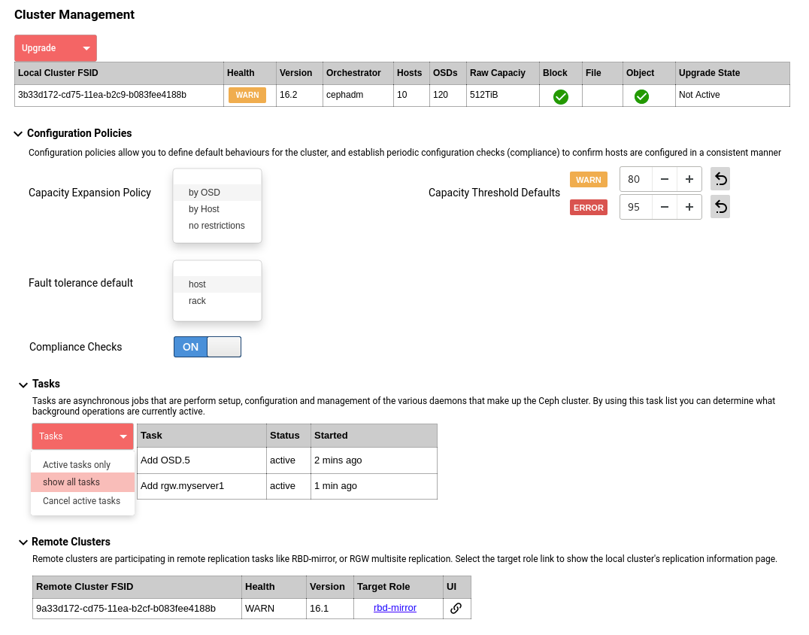

==================
Cluster Management
==================

.. note:: this document is intended to promote discussion in the community to help refine ideas
   for cluster management. The ideas presented do not indicate intent for the next Ceph release, 
   but serve to highlight a potential longer term strategy for managing cluster lifecycle operations.

In previous Ceph releases, cluster lifecycle management was the responsibility of an external systems
management toolchain like Ansible or DeepSea. However, with the development of the cephadm orchestrator,
these cluster lifecycle operations now become possible from within the cluster.

Cluster Overview
==================
Managing a cluster is not just about the pools, and disk images that are defined for applications to
use. One of the challenges of managing any platform, especially ones based on a distributed architecture,
is to maintain consistency. A common approach to deliver consistency is the introduction of policy based
management. 

By implementing a level of policy driven management, we can

* better implement defaults at the cluster level
* define checks for detecting and alerting potential configuration drift (compliance)
* better define defaults that can be applied to 3rd party systems (e.g. prometheus alerting)

The mockup below attempts to convey the key areas for Ceph Cluster Management.

The interface is split into a discrete areas;

The local cluster table is always visible and provides an overview of the state of the cluster. This table
also provides an action button to perform tasks against the cluster as a whole.

The remaining sections would be provided as collapsable components.

**Configuration Policies**

Policies are settings that determine default operational settings for pools, alerts and replication rules.

**Tasks**

The background tasks that the orchestrator component manages will be visible here.

**Remote Clusters**

Ceph clusters can be connected for remote replication of block, file or object workloads. This section provides
a quick appreciation for the inter-cluster relationships that this cluster has.

Configuration Policies
======================

Capacity Expansion Policy
_________________________
Data redistribution is a benefit of Ceph's architecture, but rebalancing data across new OSDs
will consume resources. This activity has the potential to impact client performance, so this
setting establishes the expansion rule for the orchestrator to use when phasing new OSDs into
the cluster.

Capacity Threshold Defaults
___________________________
By default capacity thresholds are determined by OSD nearfull and full settings. This policy
enables the admin to set warning/error warning thresholds that can be implemented by pool using
Prometheus. This establishes a common default alerting policy.

Fault Tolerance Default
_______________________
If the hosts are configured with rack information, it is possbile to place the hosts in
a specific crush bucket that represents the rack. This allows replication rules to adopt a 
data protection policy based on either a rack fault domain or a host fault domain.

The default determined here would be used by the UI to determine the default replication
rule, presented to the user when creating a pool.

Compliance Checks
_________________
A stable cluster configuration is a key part in ensuring cluster stability. However, over time
server configurations may drift, potentially introducing instability. By enabling compliance
checks, the orchestrator will examine and compare host facts to identify inconsistencies as
soon as possible, to reduce operational risk.

Some of the checks that host facts can support (today) are listed below;

* OS version consistency
* Support consistently configured 
* Security policy (SELINUX, AppArmor enabled)
* enabled services are running
* daemons are not in a disabled or dead state (when the host is in an ONLINE state)
* cluster network and public network using consistent

  * network connection speeds
  * interface MTU size
  * dedicated/shared interfaces

More checks could be enabled by enhancing cephadm's gather-facts function.
https://tracker.ceph.com/issues/47711

Tasks
=====
This section provides insight into the background tasks that have been, or are currently
running in the cluster. In addition to viewing state, the interface also exposes the 
orchestrators cancel feature to abort all active orchestrator tasks.

Remote Clusters
===============
When remote replication options like rbd-mirror are configured the cluster management
component shows an overview of this replication relationship. This helps establish a 
more complete picture of the cluster, highlighting external dependencies that may
otherwise not be considered.

Each replication relationship entry offers a link to it's corresponding configuration
and also, where applicable provides a URL to the connected clusters UI.

