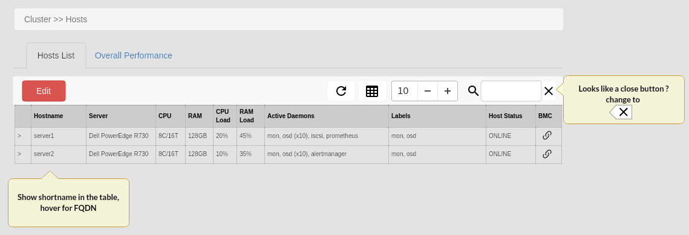
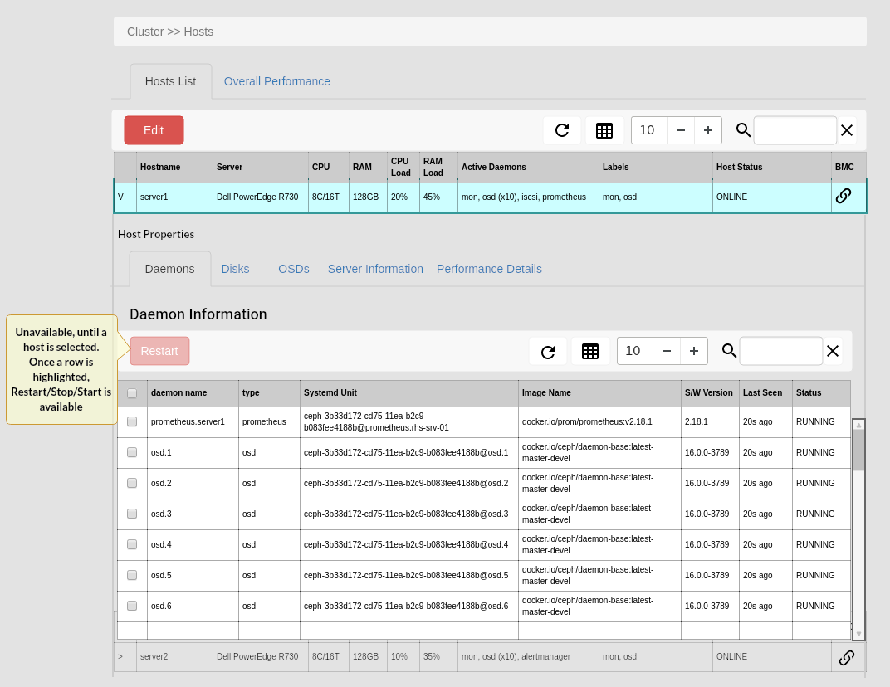
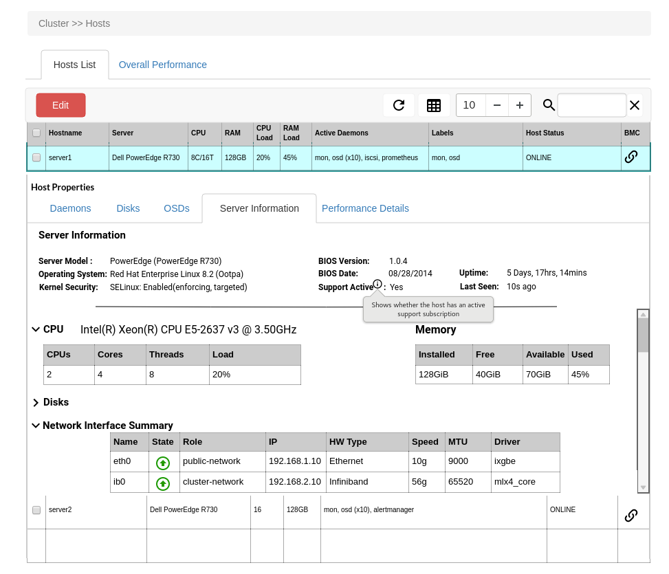
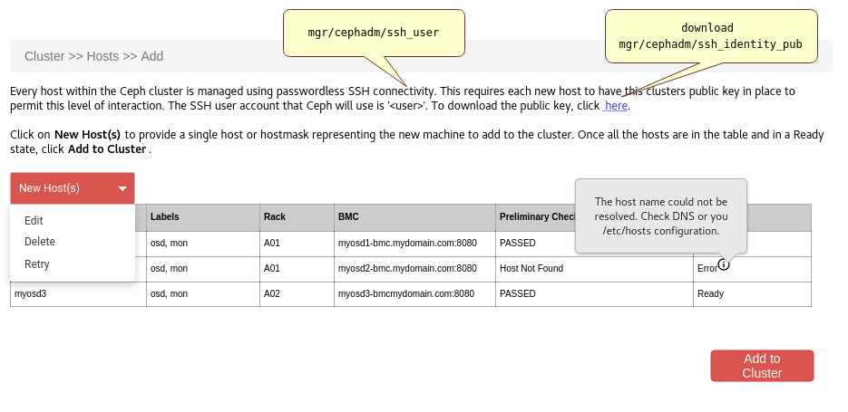
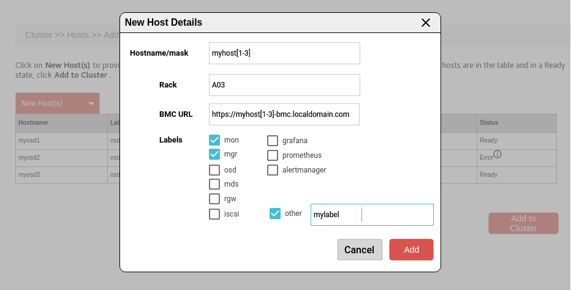

===============
Host Management
===============

.. note:: This document is intended to promote discussion relating to the types of host management features
   that the Ceph UI should provide. A number of the mockup also show a refresh icon, which may become redundant
   during Pacific development as data gathering becomes more optimised.

The hosts that a Ceph cluster consumes are essential components of the cluster, and should be manageable
in the same ways as the ceph daemons that they hold. However, not all aspects of managing a host should
fall to the Ceph UI due to complexity and ownership. This means that there is a line that needs to be
defined where management of the host and ceph intersect.

The following sections describe the management tasks and lifecycle processes that should be provided
by the Ceph UI.

Host Information
================
It is a fundamental requirement to be able to understand the types of hosts that Ceph is reliant upon.
Having host related information easily accessible, reduces the reliance the Ceph Administrator has on
other 3rd party tools and frameworks - ultimately providing a more end-to-end experience.

This image shows the highlevel overview of the hosts, providing a quick understanding of the server 
type, the daemons associated with it and the overall status of the host. The other inclusion is the
use of a link to the BMC - this allows the Admin to quickly and easily jump from the Ceph UI to BMC
boards like iDRAC or iLO. For example if a disk shows as failed, the alert can link to the hosts page
where the host status would be ONLINE, FAULT - with the Admin able to quick click a link to open the
server's BMC interface to progress the fault.

The action button is extended to cover the following host tasks

* Edit *(change labels, BMC information)*
* Enter Maintenance *(host must be online)*
* Exit Maintenance *(host must be in maintenance mode)*
* Reboot *(host must be in maintenance mode)*
* Export *(export the server information as a CSV to support local configuration management processes)*
* Drain 
* Remove *(available for hosts in drained state)*

When a server is selected, the host properties component is shown. This is made up of a tabbed
interface; daemons, disks, osds, server information and performance details. The default tab
selected is daemons, since this is the most common interaction point with a host.

The intent is that the admin is able to manage the cluster daemons directly from the UI, so the default
display should focus on imformation that is relevant to the current orchestrator. For example, the default
table columns for a cluster managed by cephadm would centre around systemd related metadata, whereas with 
the rook orchestrator the columns would describe the attributes pertinent to the kubernetes platform. The
intent her is sensible defaults - all the columns will be available, so the user could change their view
as they can today with the table layout 'button'.

Daemon Management
=================
When a daemon is selected the action button would provide the following

* stop *(daemon must be running)*
* start *(daemon must be stopped)*
* restart *(daemon must be running)*
* view logs *(only available to daemons in a running state)*

The **view logs** option may use cephadm's **logs** command to gather the daemons logs, allowing them to be
viewed, and potentially downloaded to the Admins machine in support of problem determination workflows and
support escalations.

Server Information
==================
The Pacific release provides more server metadata. A Server Information tab has been added that shows
metadata about the host's configuration. 

This data is gathered by cephadm's gather-facts command and includes *load* metrics for CPU and RAM, to
allow the UI to provide a quick appreciation for load without relying on Prometheus.

Adding a Host
=============
The process of adding a host to the cluster has changed to support a 'bulk' add option which utilises host
mask syntax, and also includes preliminary checks performed in the UI to filter out common misconfiguration
issues.
The mockup below shows the result of trying to add 3 hosts to the cluster, and illustrates;

* preliminary check results
* the ability to edit host entries before attempting to add to the cluster
* a holistic view of the hosts prior to adding to the cluster, allowing the admin to visually inspect
  the desired hosts before selecting "Add to Cluster"

In the event of a preliminary check failing for a host, the status column will indicate the error. A more 
detailed error message would be shown via a tooltip, when the user hovers over the 'info' icon.

Add Host Modal
______________
When the admin selects New Host(s), the New Host modal is displayed

| **Hostname/mask**
| The hostname mask would support numeric ranges, to provide a simple method of adding hosts in bulk. 
| **Rack**
| Freeform text that can be used to implement a host to rack association in crush
| **BMC URL**
| URL string for the BMC http/https address (must be prefixed by http or https)
| **Labels**
| A predefined set of labels is provided that align to common ceph roles, with the custom labels also
  supported via the Other textbox. This field would support a comma separated list of labels.

Preliminary (aka "pre-flight") checks
_____________________________________
In order to avoid cluster expansion issues, the pre-flight process performs the following checks;

* hostname is resolvable
* SSH is contactable
* if BMC is provided, ensure it is resolvable

Performing Host Maintenance
===========================
Hosts must undergo regular maintenance, whether that maintenance is for a software upgrade or hardware
component replacement or expansion. The UI should therefore ensure that it is a simple process to
initiate maintenance against a host, and also protect against erroneous maintenance requests that could
undermine data availability within the Ceph Cluster.

Since removing a host can impact performance and capacity, the duration of maintenance should be defined
along with the maintenance request. A default maintenance window of 4hrs would be provided by the UI, but
a host in maintenance beyond the predefined limit would generate a healthcheck alert to prompt the Admin,
to investigate the outage to manage the risk to service.

Before passing the maintenance request to the orchestrator, there are a number of checks than can be done
to catch common issues;

Deny Outcomes
_____________

* If the hosts in the cluster have Rack identifiers, and there is another host in maintenance, deny the
  request if the other host is in a different rack.
* PG backfill/recovery is active
* cluster is in an error state

Warning Outcomes
________________
If the maintenance request is OK to proceed but would have an impact, a modal should be shown to explain the
potential impact of the action, requesting the Admin to confirm the maintenance action.

* request is against a host that provides prometheus, and there is only a single prometheus instance

  * **IMPACT** : Alerting based on metrics will be unavailable, all embedded grafana charts will cease to function
* request is against a host that provides grafana, and there is only a single grafana instance
  
  * **IMPACT** : All embedded charts will be unavailable in the UI. Alerting will continue to be available.
* request would result in only a single backup daemon of the same type active in the cluster

  * **IMPACT**: A service or data availability event could occur if a subsequent failure occurs within the cluster
    during the maintenance window.

Draining a Host
===============
Removing a host from the cluster, starts with the drain process. This probably the most complex host action, since
the drain process will revolve around an "impact" plan. Draining a host is a two-step process

#. Admin requests a host to be drained
#. UI submits a drain request to the orchestrator in 'dry-run' mode

   #. The orchestrator provides an action plan to describe the drain operation
   #. Admin confirms the plan, to initiate the drain process

