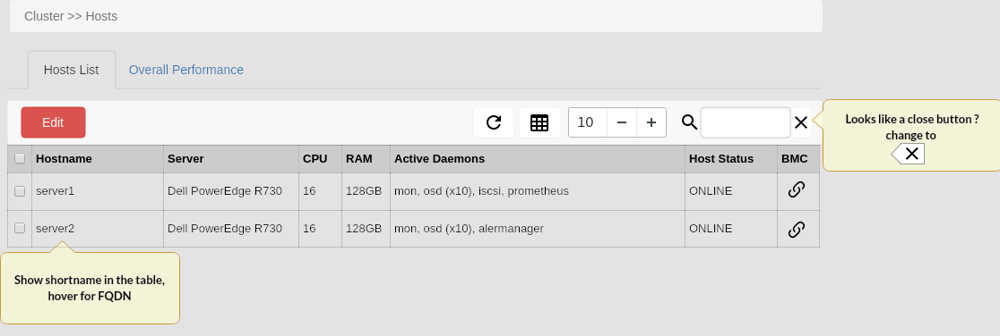
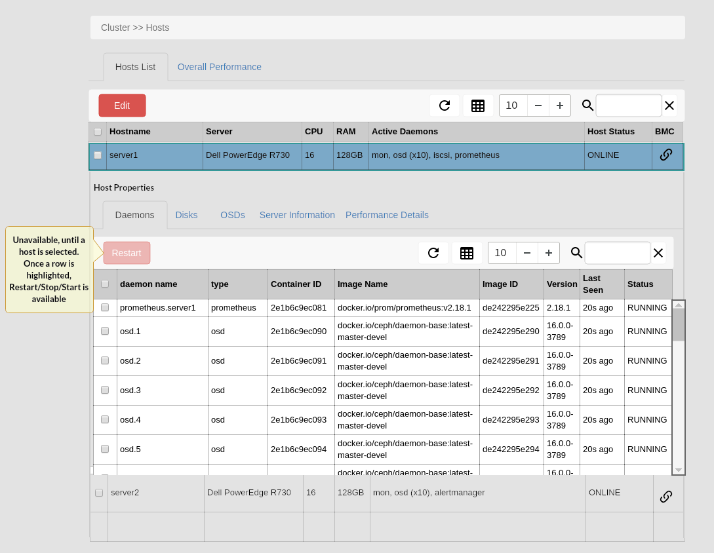
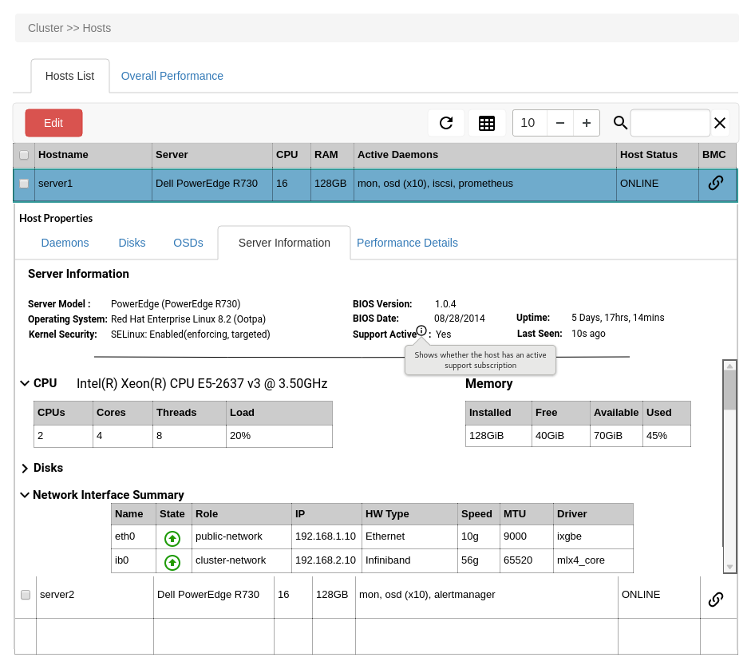

Host Management
===============

.. note:: This document is intended to promote discussion relating to the types of host management features that the Ceph UI should provide.

The hosts that a Ceph cluster consumes are essential components of the cluster, and should be manageable in the same ways as the ceph daemons that they hold.
However, not all aspects of managing a host should fall to the Ceph UI due to complexity and ownership. This means that there is a line that needs to be
defined where management of the host and ceph intersect.

Host Processes
##############

The following sections describe the management tasks and lifecycle processes that should be provided by the Ceph UI.

Host Information
----------------
It is a fundamental requirement to be able to understand the types of hosts that Ceph is reliant upon. Having host related 
information easily accessible, reduces the reliance the Ceph Administrator has on other 3rd party tools and frameworks -
ultimately providing a more end-to-end experience.

This image shows the highlevel overview of the hosts, providing a quick understanding of the server 
type, the daemons associated with it and the overall status of the host. The other inclusion is the use of a link
to the BMC - this allows the Admin to quickly and easily jump from the Ceph UI to BMC boards like iDRAC or iLO. For example
if a disk shows as failed, the alert can link to the hosts page where the host status would be ONLINE, FAULT - with the Admin
able to quick click a link to open the physical BMC interface to progress the fault.

The action button is extended to cover the following host tasks

* Edit
* Enter Maintenance
* Exit Maintenance
* Reboot
* Drain
* Remove

When a server is selected, the host properties component is shown. This is made up of a tabbed interface; daemons, disks, osds,
server information and performance details. The default tab selected is daemons, since this is the most common interaction point
with a host.

As you can see the intent is that the admin is able to manage the cluster daemons directly from the UI.

In addition to management, new capabilities available in Pacific provide more server metadata. A Server Information tab has been added that shows
metadata about the host's configuration. 

Adding a Host
-------------
On the face of it, adding a host to the cluster could be a simple step - but, there are a number of elements to the host addition process that
could help daemon placement, crush and hardware support.

<MOCKUP - Host add - labels, BMC, rack location>

Removing a Host
---------------
Removing a host from the cluster is probably the most complex host action, since the removal process will revolve around an "impact" plan. Removing a host starts
with removing the daemons and each daemon type will require different handling.

<MOCKUP - Host remove - impact statement>

Performing Host Maintenance
---------------------------
Hosts must undergo regular maintenance, whether that maintenance is for a software upgrade or hardware component replacement or expansion. The UI should
therefore ensure that it is a simple process to initiate maintenance against a host, and also protect against erroneous maintenance requests that could
undermine data availability within the Ceph Cluster.

<MOCKUP - Host actions - enter maintenance/exit maintenance>

Daemon Management
-----------------
All daemons running within the cluster are managed through systemd, and just like any other system there is a requirement to be able to manage these
daemons from time to time.

<MOCKUP - daemon interaction - stop/restart/start/fetch logs>

