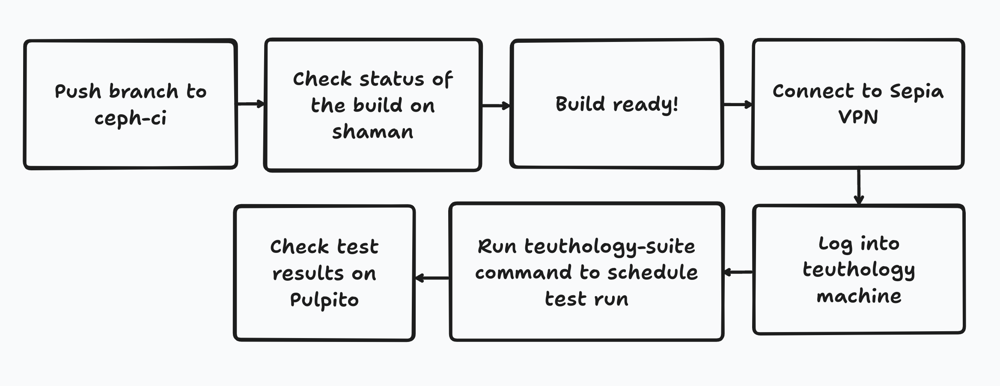

.. _tests-integration-testing-teuthology-workflow:

Integration Tests using Teuthology Workflow
===========================================

Infrastructure
--------------

Components
**********

1. `ceph-ci`_: Clone of the main Ceph repository, used for triggering Jenkins 
   Ceph builds for development.

2. `Ceph Jenkins`_: Responsible for triggering builds, uploading packages 
   to Chacra, and pushing updates about the build to Shaman.

3. `Shaman`_: UI Interface used to check build status. In its backend, 
   it is a REST API to query and store build information.

4. `Chacra`_: Service where packages are uploaded. The binaries uploaded 
   here can be downloaded and used by anyone.

5. `Teuthology CLI`_: Developers can use various Teuthology commands to schedule 
   and manage test runs.

6. Teuthology: This component is responsible for pushing test jobs to 
   the Beanstalk queue and Paddles. It also picks jobs from 
   the queue and runs tests.

7. Beanstalk queue: A priority queue containing all the queued jobs. 
   Developers typically do not need to interact with it.

8. Paddles: A backend service that stores all test run information. 
   Developers typically do not need to interact with it.

9. `Pulpito`_: A UI interface (for information stored in Paddles) that allows 
   developers to see detailed information about their scheduled tests, 
   including status and results.

10. Testnodes: A cluster of various machines that are used for running tests.
    Developers usually schedule tests to run on `smithi`_ machines, which are
    dedicated test nodes for Teuthology integration testing.

Each Teuthology test *run* contains multiple test *jobs*. Each job runs in an 
environment isolated from other jobs, on a different collection of test nodes.

Workflow Overview
*****************

To test a change in Ceph, start by pushing a branch with your changes to the
`ceph-ci`_ repository. This will automatically trigger the Jenkins process 
to build Ceph binaries - the status of the build can be observed on `Shaman`_. 
These built packages will be uploaded on `Chacra`_. 

To schedule a Teuthology integration test against this new build, you will 
need access to the Sepia lab. Once you have access, log into the Teuthology 
machine and complete the one-time initial Teuthology setup required to run 
Teuthology commands. After the setup, use the ``teuthology-suite`` command to schedule 
a Teuthology run. In this command, use the ``-c <ceph-ci branch name>`` option to 
specify your build. The results of your test can be observed on `Pulpito`_. 
Log into a `developer playground machine`_ to review the Teuthology run's archive logs. 

The rest of the document will explain these steps in detail: 

1. Getting binaries - Build Ceph.
2. Scheduling Test Run:

   a. About Test Suites.
   b. Triggering Teuthology Tests.
   c. Testing QA changes (without re-building binaries).
   d. Filtering Tests.

3. Viewing Test Results:

   a. Pulpito Dashboard.
   b. Teuthology Archives (Reviewing Logs).

4. Killing tests.
5. Re-running tests.

Getting binaries - Build Ceph
-----------------------------

Ceph binaries must be built for your branch before you can use teuthology to run integration tests on them. Follow these steps to build the Ceph binaries:

#. Push the branch to the `ceph-ci`_ repository. This triggers the process of
   building the binaries on the Jenkins CI.

#. To ensure that the build process has been initiated, confirm that the branch
   name has appeared in the list of "Latest Builds Available" at `Shaman`_.
   Soon after you start the build process, the testing infrastructure adds
   other, similarly-named builds to the list of "Latest Builds Available".
   The names of these new builds will contain the names of various Linux
   distributions of Linux and will be used to test your build against those
   Linux distributions. 

#. Wait for the packages to be built and uploaded to `Chacra`_, and wait for
   the repositories offering the packages to be created. The entries for the
   branch names in the list of "Latest Builds Available" on `Shaman`_ will turn
   green to indicate that the packages have been uploaded to `Chacra`_ and to
   indicate that their repositories have been created.  Wait until each entry
   is coloured green. This usually takes between two and three hours depending
   on the availability of the machines.
   
   The Chacra URL for a particular build can be queried from `the Chacra site`_.

.. note:: The branch to be pushed on ceph-ci can be any branch. The branch does
   not have to be a PR branch.

.. note:: If you intend to push master or any other standard branch, check
   `Shaman`_ beforehand since it might already have completed builds for it.

.. _the Chacra site: https://shaman.ceph.com/api/search/?status=ready&project=ceph

Pushing to the ceph-ci repository
*********************************

Follow these steps to push to the ceph-ci repository. After pushing, a new build will 
automatically be scheduled. 

1. Add the ceph-ci repository as a remote to your local clone of the Ceph repository:

   .. prompt:: bash $

       git remote add ceph-ci git@github.com:ceph/ceph-ci.git  

       $ git remote -v  
       origin   git@github.com:ceph/ceph.git (fetch)  
       origin   git@github.com:ceph/ceph.git (push)  
       ceph-ci  git@github.com:ceph/ceph-ci.git (fetch)  
       ceph-ci  git@github.com:ceph/ceph-ci.git (push)  

2. Push your branch upstream by running a command of the following form:

   .. prompt:: bash $

       $ git push ceph-ci wip-yourname-feature-x 

Naming the ceph-ci branch
*************************
Prepend your branch with your name before you push it to ceph-ci. For example,
a branch named ``feature-x`` should be named ``wip-$yourname-feature-x``, where
``$yourname`` is replaced with your name. Identifying your branch with your
name makes your branch easily findable on Shaman and Pulpito.

If you are using one of the stable branches (`quincy`, `pacific`, etc.), include
the name of that stable branch in your ceph-ci branch name.
For example, the ``feature-x`` PR branch should be named 
``wip-feature-x-nautilus``. *This is not just a convention. This ensures that your branch is built in the correct environment.*

Delete the branch from ceph-ci when you no longer need it. If you are
logged in to GitHub, all your branches on ceph-ci can be found here:
https://github.com/ceph/ceph-ci/branches.

.. note:: You can choose to only trigger a CentOS 9.Stream build (excluding other 
   distro like ubuntu) by adding "centos9-only" at the end of the ceph-ci branch name. 
   For example, ``wip-$yourname-feature-centos9-only``. This helps to get quicker builds 
   and save resources when you don't require binaries for other distros. 

Scheduling Test Run
-------------------

About Test Suites 
*****************

Integration tests are organized into “suites”, which are defined in ``qa/suites``
sub-directory of the Ceph repository. These test suites can be run with the teuthology-suite 
command. 

See `Suites Inventory`_ for a list of available suites of integration tests.

More details understanding of how these test suites are defined can be found on `Integration Test Introduction Page`_.

Triggering Teuthology Tests
***************************

After you have built Ceph binaries for your branch, you can run tests using
teuthology. This procedure explains how to run tests using teuthology.

#. Log in to the teuthology machine:

   .. prompt:: bash $

       ssh <username>@teuthology.front.sepia.ceph.com

   This requires Sepia lab access. To request access to the Sepia lab, see:
   https://ceph.github.io/sepia/adding_users/.

#. For initial setup, follow `teuthology installation guide`_ to setup teuthology for 
   your user on teuthology machine. This will enable you to run teuthology commands. 

#. Run the ``teuthology-suite`` command:

   .. prompt:: bash $

        teuthology-suite -v \
        -m smithi \
        -c wip-devname-feature-x \
        -s fs \
        -p 110 \
        --filter "cephfs-shell" \
        -e foo@gmail.com

   The options in the above command are defined here: 

      =============  =========================================================
         Option        Meaning
      =============  =========================================================
        -v            verbose
        -m            machine name
        -c            the name of the branch that was pushed on ceph-ci
        -s            test-suite name
        -p            the higher the number, the lower the priority of 
                      the job
        --filter      filter tests in a given suite. The argument
                      passed to this filter specifies which test you 
                      want to run
        -e <email>    When tests finish or time out, send an email to the
                      specified address. Can also be specified in 
                      ~/.teuthology.yaml as 'results_email'
      =============  =========================================================

   .. note:: The priority number present in the command above is a placeholder. 
      Do not use it in your own tests. See `Testing Priority`_ for information 
      about recommended values.

   .. note:: Do not issue a command without a priority number. The default 
      value is 1000, a value so large that your job is unlikely ever to run.

   Run ``teuthology-suite --help`` to read descriptions of these and other 
   available options.

#. Wait for the tests to run. ``teuthology-suite`` prints a link to
   `Pulpito`_ where the test results can be viewed.

The ``--dry-run`` option allows you to demo-run ``teuthology-suite`` command without 
actually scheduling teuthology tests. This is helpful to check how many jobs and which jobs
a command will schedule. 

Other frequently used/useful options are ``-d`` (or ``--distro``),
``--distro-version``, ``--filter-out``, ``--timeout``, ``flavor``, ``--rerun``,
``--limit`` (for limiting number of jobs) , ``-N`` (for how many times the job will
run), and ``--subset`` (used to reduce the number of tests that are triggered). Run
``teuthology-suite --help`` to read descriptions of these and other options.

.. _teuthology_testing_qa_changes:

Testing QA changes (without re-building binaries)
*************************************************

If you are making changes only in the ``qa/`` directory, you do not have to
rebuild the binaries before you re-run tests. If you make changes only in
``qa/``, you can use the binaries built for the ceph-ci branch to re-run tests.
You just have to make sure to tell the ``teuthology-suite`` command to use a
separate branch for running the tests.

If you made changes only in ``qa/``
(https://github.com/ceph/ceph/tree/master/qa), you do not need to rebuild the
binaries. You can use existing binaries that are built periodically for master and other stable branches and run your test changes against them.
Your branch with the qa changes can be tested by passing two extra arguments to the ``teuthology-suite`` command: (1) ``--suite-repo``, specifying your ceph repo, and (2) ``--suite-branch``, specifying your branch name. 

For example, if you want to make changes in ``qa/`` after testing ``branch-x``
(for which the ceph-ci branch is ``wip-username-branch-x``), run the following
command

.. prompt:: bash $

   teuthology-suite -v \
    -m smithi \
    -c wip-username-branch-x \
    -s fs \
    -p 50 \
    --filter cephfs-shell

Then make modifications locally, update the PR branch, and trigger tests from
your PR branch as follows:

.. prompt:: bash $

   teuthology-suite -v \
    -m smithi \
    -c wip-username-branch-x \
    -s fs -p 50 \
    --filter cephfs-shell \
    --suite-repo https://github.com/$username/ceph \
    --suite-branch branch-x

You can verify that the tests were run using this branch by looking at the
values for the keys ``suite_branch``, ``suite_repo`` and ``suite_sha1`` in the
job config printed at the beginning of the teuthology job.

.. note:: If you are making changes that are not in the ``qa/`` directory, 
          you must follow the standard process of triggering builds, waiting 
          for the builds to finish, then triggering tests and waiting for 
          the test results. 

Filtering Tests
***************

Test suites includes combinations of many yaml files which can results in massive 
amount of jobs being scheduled for a suite. So filters can help to reduce the amount
of jobs or schedule particular jobs within a suite.
 
Keywords for filtering tests can be found in
``qa/suites/<suite-name>/<subsuite-name>/tasks`` in Ceph repository and can be used as arguments
for ``--filter``. Each YAML file in that directory can trigger tests; using the
name of the file without its filename extension as an argument to the
``--filter`` triggers those tests. 

For example, in the command above in the :ref:`Testing QA Changes
<teuthology_testing_qa_changes>` section, ``cephfs-shell`` is specified. 
This works because there is a file named ``cephfs-shell.yaml`` in
``qa/suites/fs/basic_functional/tasks/``.

If the filename doesn't suggest what kind of tests it triggers, search the
contents of the file for the ``modules`` attribute. For ``cephfs-shell.yaml``
the ``modules`` attribute is ``tasks.cephfs.test_cephfs_shell``. This means
that it triggers all tests in ``qa/tasks/cephfs/test_cephfs_shell.py``.

Read more about how to `Filter Tests by their Description`_.

Viewing Test Results
---------------------

Pulpito Dashboard
*****************

After the teuthology job is scheduled, the status and results of the test run 
can be checked at https://pulpito.ceph.com/.

Teuthology Archives
*******************

After the tests have finished running, the log for the job can be obtained by
clicking on the job ID at the Pulpito run page associated with your tests. It's
more convenient to download the log and then view it rather than viewing it in
an internet browser since these logs can easily be up to 1 GB in size.
It is also possible to ssh into a `developer playground machine`_ and access the following path::

    /teuthology/<run-name>/<job-id>/teuthology.log

For example: for the above test ID, the path is::

   /teuthology/teuthology-2019-12-10_05:00:03-smoke-master-testing-basic-smithi/4588482/teuthology.log

This method can be used to view the log more quickly than would be possible through a browser.

To view ceph logs (cephadm, ceph monitors, ceph-mgr, etc) or system logs,
remove ``teuthology.log`` from the job's teuthology log url on browser and then navigate 
to ``remote/<machine>/log/``. System logs can be found at ``remote/<machine>/syslog/``.
Similarly, these logs can be found on developer playground machines at 
``/teuthology/<test-id>/<job-id>/remote/<machine>/``. 

Some other files that are included for debugging purposes:

* ``unit_test_summary.yaml``: Provides a summary of all unit test failures.
  Generated (optionally) when the ``unit_test_scan`` configuration option is
  used in the job's YAML file.

* ``valgrind.yaml``: Summarizes any Valgrind errors that may occur.

.. note:: To access archives more conveniently, ``/a/`` has been symbolically
   linked to ``/teuthology/``. For instance, to access the previous
   example, we can use something like::

   /a/teuthology-2019-12-10_05:00:03-smoke-master-testing-basic-smithi/4588482/teuthology.log

Killing Tests
-------------
``teuthology-kill`` can be used to kill jobs that have been running
unexpectedly for several hours, or when developers want to terminate tests
before they complete.

Here is the command that terminates jobs:

.. prompt:: bash $

   teuthology-kill -p  -r teuthology-2019-12-10_05:00:03-smoke-master-testing-basic-smithi -m smithi -o scheduled_teuthology@teuthology 

The argument passed to ``-r`` is run name. It can be found
easily in the link to the Pulpito page for the tests you triggered. For
example, for the above test ID, the link is - http://pulpito.front.sepia.ceph.com/teuthology-2019-12-10_05:00:03-smoke-master-testing-basic-smithi/

Re-running Tests
----------------

The ``teuthology-suite`` command has a ``-r`` (or ``--rerun``) option, which
allows you to re-run tests. This is handy when your tests have failed or end
up dead. The ``--rerun`` option takes the name of a teuthology run as an
argument. Option ``-R`` (or ``--rerun-statuses``) can be passed along with
``-r`` to choose which kind of tests should be picked from the run. For
example, you can re-run only those tests from previous run which had ended up
as dead. Following is a practical example:

.. prompt:: bash $ 

   teuthology-suite -v \
    -m smithi \
    -c wip-rishabh-fs-test_cephfs_shell-fix \
    -p 50 \
    --r teuthology-2019-12-10_05:00:03-smoke-master-testing-basic-smithi \
    -R fail,dead,queued \
    -e $CEPH_QA_MAIL

Following's the definition of new options introduced in this section:

      =======================  ===============================================
         Option                     Meaning
      =======================  ===============================================
        -r, --rerun             Attempt to reschedule a run, selecting only
                                those jobs whose status are mentioned by
                                --rerun-status.
        -R, --rerun-statuses    A comma-separated list of statuses to be used
                                with --rerun. Supported statuses: 'dead',
                                'fail', 'pass', 'queued', 'running' and
                                'waiting'. Default value: 'fail,dead'
      =======================  ===============================================

.. _ceph-ci: https://github.com/ceph/ceph-ci
.. _Ceph Jenkins: https://jenkins.ceph.com/
.. _Teuthology CLI: https://docs.ceph.com/projects/teuthology/en/latest/commands/list.html
.. _Chacra: https://github.com/ceph/chacra/blob/master/README.rst
.. _Pulpito: http://pulpito.front.sepia.ceph.com/
.. _Running Your First Test: ../../running-tests-locally/#running-your-first-test
.. _Shaman: https://shaman.ceph.com/builds/ceph/
.. _Suites Inventory: ../tests-integration-testing-teuthology-intro/#suites-inventory
.. _Testing Priority: ../tests-integration-testing-teuthology-intro/#testing-priority
.. _Triggering Tests: ../tests-integration-testing-teuthology-workflow/#triggering-tests
.. _Integration Test Introduction Page: ../tests-integration-testing-teuthology-intro/#how-integration-tests-are-defined
.. _tests-sentry-developers-guide: ../tests-sentry-developers-guide/
.. _smithi: https://wiki.sepia.ceph.com/doku.php?id=hardware:smithi
.. _teuthology installation guide: https://docs.ceph.com/projects/teuthology/en/latest/INSTALL.html#installation-and-setup
.. _Filter Tests by their Description: ../tests-integration-testing-teuthology-intro/#filtering-tests-by-their-description
.. _developer playground machine: https://wiki.sepia.ceph.com/doku.php?id=devplayground
