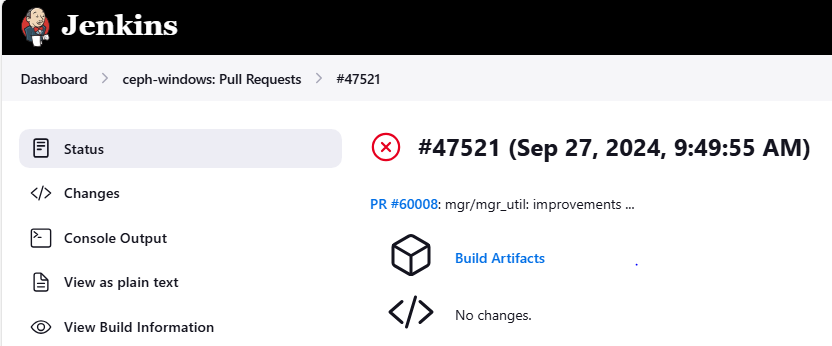
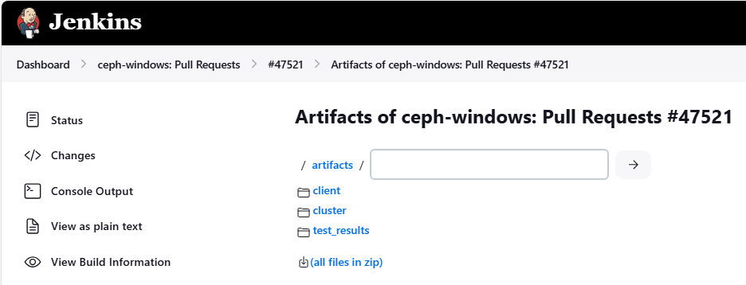
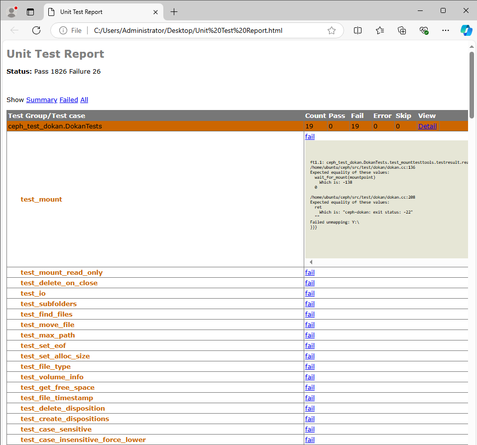

.. _dev-testing-windows:

=================
Testing - Windows
=================

Since Pacific, the Ceph client tools and libraries can be natively used on
Windows. This allows Windows nodes to consume Ceph without additional layers
such as iSCSI gateways or SMB shares.

A significant amount of unit tests and integration tests were ported in order
to ensure that these components continue to function properly on Windows.

Windows CI Job
==============

The `Windows CI job`_ performs the following steps for each GitHub pull request:

* spin up a Linux VM in which to build the server-side (Linux) Ceph binaries
  and cross-compile the Windows (client) binaries.
* recreate the Linux VM and start a Ceph vstart cluster
* boot a Windows VM and run the Ceph tests there

`A small PowerShell framework`_ parallelizes the tests, aggregates the results
and isolates or skips certain tests that are known to be flaky.

The console output can contain compilation errors as well as the name of the
tests that failed. To get the console output of the failing tests as well as
Ceph and operating system logs, please check the build artifacts from the
Jenkins "Status" page.

The Windows CI artifacts can be downloaded as a zip archive or viewed inside
the browser. Click the "artifacts" button to see the contents of the artifacts
folder.

Artifact contents:

* ``client/`` - Ceph client-side logs (Windows)
    * ``eventlog/`` - Windows system logs
    * ``logs/`` - Ceph logs
    * ``-windows.conf`` - Ceph configuration file
* ``cluster/`` - Ceph server-side logs (Linux)
    * ``ceph_logs/``
    * ``journal``
* ``test_results/``
    * ``out/`` - raw and xml test output grouped by the test executable
    * ``test_results.html`` - aggregated test report (html)
    * ``test_results.txt`` - aggregated test report (plaintext)

We're using the `subunit`_ format and associated tools to aggregate the test
results, which is especially handy when running a large amount of tests in
parallel.

The aggregated test report provides a great overview of the failing tests.
Go to the end of the file to see the actual errors::

    {0} unittest_mempool.mempool.bufferlist_reassign [0.000000s] ... ok
    {0} unittest_mempool.mempool.bufferlist_c_str [0.006000s] ... ok
    {0} unittest_mempool.mempool.btree_map_test [0.000000s] ... ok
    {0} ceph_test_dokan.DokanTests.test_mount [9.203000s] ... FAILED

    Captured details:
    ~~~~~~~~~~~~~~~~~
        b'/home/ubuntu/ceph/src/test/dokan/dokan.cc:136'
        b'Expected equality of these values:'
        b'  wait_for_mount(mountpoint)'
        b'    Which is: -138'
        b'  0'
        b''
        b'/home/ubuntu/ceph/src/test/dokan/dokan.cc:208'
        b'Expected equality of these values:'
        b'  ret'
        b'    Which is: "ceph-dokan: exit status: -22"'
        b'  ""'
        b'Failed unmapping: Y:\\'
    {0} ceph_test_dokan.DokanTests.test_mount_read_only [9.140000s] ... FAILED

The html report conveniently groups the test results by test suite (test binary).
For security reasons it isn't rendered by default but it can be downloaded and
viewed locally:

Timeouts and missing test results are often an indication that a process crashed.
Note that the ceph status is printed out on the console before and after
performing the tests, which can help identify crashed services.

You may also want to check the service logs (both client and server side). Also,
be aware that the Windows "application" event log will contain entries in case
of crashed Windows processes.

Frequently asked questions
==========================

1. Why is the Windows CI job the only one that fails on my PR?

Ceph integration tests are normally performed through Teuthology on the Ceph
Lab infrastructure. These tests are triggered on-demand by the Ceph QA
team and do not run automatically for every submitted pull request.

Since the Windows CI job focuses only on the client-side Ceph components,
it can run various integration tests in a timely manner for every pull request
on GitHub. **In other words, it runs various librados, librbd and libcephfs
tests that other checks such as "make check" do not.**

For this reason, the Windows CI often catches regressions that are missed by the
other checks and would otherwise only come up through Teuthology. More often
than not, these regressions are not platform-specific and affect Linux as well.

In case of Windows CI failures, we strongly suggest checking the test results
as described above.

Be aware that the `Windows build script`_ may use different compilation flags
and ``-D`` options passed to CMake. For example, it defaults to ``Release`` mode
instead of ``Debug`` mode. At the same time, it uses a different toolchain
(``mingw-llvm``) and a separate set of `dependencies`_, make sure to bump the
versions if needed.

2. Why is the Windows CI job mandatory?

The test job was initially optional, as a result regressions were introduced
very often.

After a time, Windows support became mature enough to make this CI job mandatory.
This significantly reduces the amount of work required to address regressions
and assures Ceph users of continued Windows support.

As said before, another great advantage is that it runs integration tests that
quickly catch regressions which often affect Linux builds as well. This spares
developers from having to wait for the full Teuthology results.

.. _Windows CI job: https://github.com/ceph/ceph-build/blob/main/ceph-windows-pull-requests/config/definitions/ceph-windows-pull-requests.yml
.. _A small PowerShell framework: https://github.com/ceph/ceph-win32-tests/
.. _Windows build script: https://github.com/ceph/ceph/blob/main/win32_build.sh
.. _dependencies: https://github.com/ceph/ceph/blob/main/win32_deps_build.sh
.. _subunit: https://github.com/testing-cabal/subunit