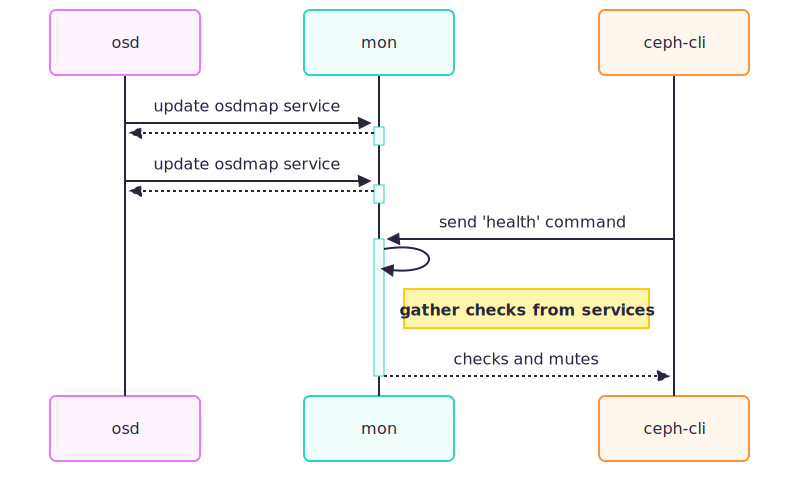
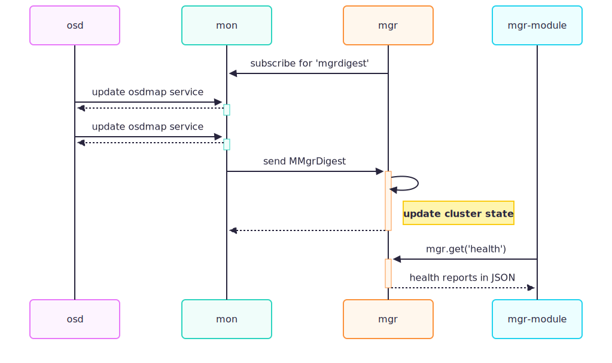
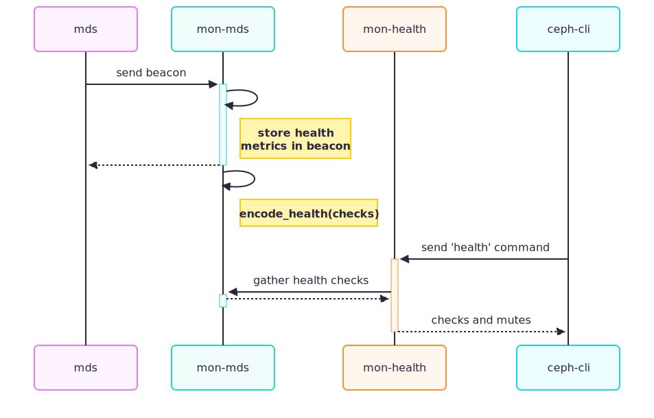
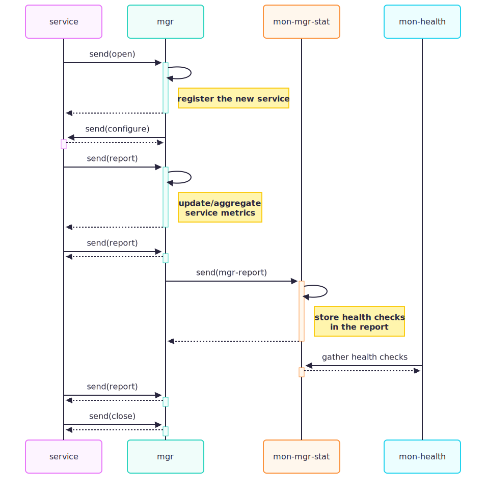

==============
Health Reports
==============

How to Get Reports
==================

In general, there are two channels to retrieve the health reports:

ceph (CLI)
   The ``ceph`` CLI command sends the ``health`` Monitor command for retrieving
   the health status of the cluster.
Manager module
   A Manager module calls the ``mgr.get('health')`` method for the same report
   in the form of a JSON encoded string.

The following diagrams outline the involved parties and how they interact when
the clients query for the reports:

.. Mermaid source of health_reports_sequence1.svg
   sequenceDiagram
       participant osd
       participant mon
       participant ceph-cli
       osd->>+mon: update osdmap service
       mon-->>-osd:
       osd->>+mon: update osdmap service
       mon-->>-osd:
       ceph-cli->>+mon: send 'health' command
       mon->>mon:
       Note right of mon: gather checks from services
       mon-->>-ceph-cli: checks and mutes

.. Mermaid source of health_reports_sequence2.svg
   sequenceDiagram
       participant osd
       participant mon
       participant mgr
       participant mgr-module
       mgr->>mon: subscribe for 'mgrdigest'
       osd->>+mon: update osdmap service
       mon-->>-osd:
       osd->>+mon: update osdmap service
       mon-->>-osd:
       mon->>+mgr: send MMgrDigest
       mgr->>mgr:
       Note right of mgr: update cluster state
       mgr-->>-mon:
       mgr-module->>+mgr: mgr.get('health')
       mgr-->>-mgr-module: health reports in JSON

Where are the Reports Generated
===============================

Monitor: Aggregator of Aggregators
----------------------------------

Monitor aggregates health reports from multiple Paxos services:

- ``AuthMonitor``
- ``HealthMonitor``
- ``MDSMonitor``
- ``MgrMonitor``
- ``MgrStatMonitor``
- ``MonmapMonitor``
- ``OSDMonitor``

When each of the Paxos services persist the pending changes in their own domain,
health-related issues are identified and stored into monstore with the prefix ``health``
using the same transaction. For instance:

- ``OSDMonitor`` checks a pending osdmap for possible issues such as
  ``down`` OSDs and a missing scrub flag in a pool and then stores
  the encoded form of the health reports along with the new osdmap. These reports are
  later loaded and decoded, so they can be collected on demand.
- ``MDSMonitor`` persists the health metrics contained in the beacon sent by the MDS daemons
  and prepares health reports when storing the pending changes.

.. Mermaid source of health_reports_sequence3.svg
   sequenceDiagram
       participant mds
       participant mon-mds
       participant mon-health
       participant ceph-cli
       mds->>+mon-mds: send beacon
       mon-mds->>mon-mds:
       Note right of mon-mds: store health metrics in beacon
       mon-mds-->>-mds:
       mon-mds->>mon-mds:
       Note right of mon-mds: encode_health(checks)
       ceph-cli->>+mon-health: send 'health' command
       mon-health->>+mon-mds: gather health checks
       mon-mds-->>-mon-health:
       mon-health-->>-ceph-cli: checks and mutes

To add a new warning related to CephFS, for example, a good place to
start is ``MDSMonitor::encode_pending()``, where health reports are collected from
the latest ``FSMap`` and the health metrics reported by MDS daemons.

It is noteworthy that ``MgrStatMonitor`` does not prepare health reports. It
receives aggregated reports from the Manager and then persists them to monstore.

Manager: a Delegate Aggregator
------------------------------

Monitor establishes consensus information including osdmap, mdsmap and monmap
which is critical for cluster functioning. Aggregated statistics of the cluster
are crucial for the administrator to understand the status of the cluster but
they are not critical for cluster functioning. For scalability reasons they are
offloaded to Manager which collects and aggregates the metrics.

Manager receives and processes ``MPGStats`` messages from OSDs. Daemons also
report metrics and status periodically to Manager using ``MMgrReport``. An
aggregated report is then sent periodically to the Monitor ``MgrStatMonitor``
service which persists the data to monstore.

.. Mermaid source of health_reports_sequence4.svg
   sequenceDiagram
       participant service
       participant mgr
       participant mon-mgr-stat
       participant mon-health
       service->>+mgr: send(open)
       mgr->>mgr:
       Note right of mgr: register the new service
       mgr-->>-service:
       mgr->>+service: send(configure)
       service-->>-mgr:
       service->>+mgr: send(report)
       mgr->>mgr:
       Note right of mgr: update/aggregate service metrics
       mgr-->>-service:
       service->>+mgr: send(report)
       mgr-->>-service:
       mgr->>+mon-mgr-stat: send(mgr-report)
       mon-mgr-stat->>mon-mgr-stat:
       Note right of mon-mgr-stat: store health checks in the report
       mon-mgr-stat-->>-mgr:
       mon-health->>+mon-mgr-stat: gather health checks
       mon-mgr-stat-->>-mon-health:
       service->>+mgr: send(report)
       mgr-->>-service:
       service->>+mgr: send(close)
       mgr-->>-service:

