=========================================
 QoS Study with mClock and WPQ Schedulers
=========================================

Introduction
============

The mClock scheduler provides three controls for each service using it. In Ceph,
the services using mClock are for example client I/O, background recovery,
scrub, snap trim and PG deletes. The three controls such as *weight*,
*reservation* and *limit* are used for predictable allocation of resources to
each service in proportion to its weight subject to the constraint that the
service receives at least its reservation and no more than its limit. In Ceph,
these controls are used to allocate IOPS for each service type provided the IOPS
capacity of each OSD is known. The mClock scheduler is based on
`the dmClock algorithm`_. See :ref:`dmclock-qos` section for more details.

Ceph's use of mClock was primarily experimental and approached with an
exploratory mindset. This is still true with other organizations and individuals
who continue to either use the codebase or modify it according to their needs.

DmClock exists in its own repository_. Before the Ceph *Pacific* release,
mClock could be enabled by setting the :confval:`osd_op_queue` Ceph option to
"mclock_scheduler". Additional mClock parameters like *reservation*, *weight*
and *limit* for each service type could be set using Ceph options.
For example, ``osd_mclock_scheduler_client_[res,wgt,lim]`` is one such option.
See :ref:`dmclock-qos` section for more details. Even with all the mClock
options set, the full capability of mClock could not be realized due to:

- Unknown OSD capacity in terms of throughput (IOPS).
- No limit enforcement. In other words, services using mClock were allowed to
  exceed their limits resulting in the desired QoS goals not being met.
- Share of each service type not distributed across the number of operational
  shards.

To resolve the above, refinements were made to the mClock scheduler in the Ceph
code base. See :doc:`/rados/configuration/mclock-config-ref`. With the
refinements, the usage of mClock is a bit more user-friendly and intuitive. This
is one step of many to refine and optimize the way mClock is used in Ceph.

Overview
========

A comparison study was performed as part of efforts to refine the mClock
scheduler. The study involved running tests with client ops and background
recovery operations in parallel with the two schedulers. The results were
collated and then compared. The following statistics were compared between the
schedulers from the test results for each service type:

- External client

  - Average throughput(IOPS),
  - Average and percentile(95th, 99th, 99.5th) latency,

- Background recovery

  - Average recovery throughput,
  - Number of misplaced objects recovered per second

Test Environment
================

1. **Software Configuration**: CentOS 8.1.1911 Linux Kernel 4.18.0-193.6.3.el8_2.x86_64
2. **CPU**: 2 x Intel® Xeon® CPU E5-2650 v3 @ 2.30GHz
3. **nproc**: 40
4. **System Memory**: 64 GiB
5. **Tuned-adm Profile**: network-latency
6. **CephVer**: 17.0.0-2125-g94f550a87f (94f550a87fcbda799afe9f85e40386e6d90b232e) quincy (dev)
7. **Storage**:

  - Intel® NVMe SSD DC P3700 Series (SSDPE2MD800G4) [4 x 800GB]
  - Seagate Constellation 7200 RPM 64MB Cache SATA 6.0Gb/s HDD (ST91000640NS) [4 x 1TB]

Test Methodology
================

Ceph cbt_ was used to test the recovery scenarios. A new recovery test to
generate background recoveries with client I/Os in parallel was created.
See the next section for the detailed test steps. The test was executed 3 times
with the default *Weighted Priority Queue (WPQ)* scheduler for comparison
purposes. This was done to establish a credible mean value to compare
the mClock scheduler results at a later point.

After this, the same test was executed with mClock scheduler and with different
mClock profiles i.e., *high_client_ops*, *balanced* and *high_recovery_ops* and
the results collated for comparison. With each profile, the test was
executed 3 times, and the average of those runs are reported in this study.

.. note:: Tests with HDDs were performed with and without the bluestore WAL and
          dB configured. The charts discussed further below help bring out the
          comparison across the schedulers and their configurations.

Establish Baseline Client Throughput (IOPS)
===========================================

Before the actual recovery tests, the baseline throughput was established for
both the SSDs and the HDDs on the test machine by following the steps mentioned
in the :doc:`/rados/configuration/mclock-config-ref` document under
the "Benchmarking Test Steps Using CBT" section. For this study, the following
baseline throughput for each device type was determined:

+--------------------------------------+-------------------------------------------+
|  Device Type                         | Baseline Throughput(@4KiB Random Writes)  |
+======================================+===========================================+
| **NVMe SSD**                         | 21500 IOPS (84 MiB/s)                     |
+--------------------------------------+-------------------------------------------+
| **HDD (with bluestore WAL & dB)**    | 340 IOPS (1.33 MiB/s)                     |
+--------------------------------------+-------------------------------------------+
| **HDD (without bluestore WAL & dB)** | 315 IOPS (1.23 MiB/s)                     |
+--------------------------------------+-------------------------------------------+

.. note:: The :confval:`bluestore_throttle_bytes` and
          :confval:`bluestore_throttle_deferred_bytes` for SSDs were determined to be
          256 KiB. For HDDs, it was 40MiB. The above throughput was obtained
          by running 4 KiB random writes at a queue depth of 64 for 300 secs.

MClock Profile Allocations
==========================

The low-level mClock shares per profile are shown in the tables below. For
parameters like *reservation* and *limit*, the shares are represented as a
percentage of the total OSD capacity. For the *high_client_ops* profile, the
*reservation* parameter is set to 50% of the total OSD capacity. Therefore, for
the NVMe(baseline 21500 IOPS) device, a minimum of 10750 IOPS is reserved for
client operations. These allocations are made under the hood once
a profile is enabled.

The *weight* parameter is unitless. See :ref:`dmclock-qos`.

high_client_ops(default)
````````````````````````

This profile allocates more reservation and limit to external clients ops
when compared to background recoveries and other internal clients within
Ceph. This profile is enabled by default.

+------------------------+-------------+--------+-------+
|  Service Type          | Reservation | Weight | Limit |
+========================+=============+========+=======+
| client                 | 50%         | 2      | MAX   |
+------------------------+-------------+--------+-------+
| background recovery    | 25%         | 1      | 100%  |
+------------------------+-------------+--------+-------+
| background best effort | 25%         | 2      | MAX   |
+------------------------+-------------+--------+-------+

balanced
`````````

This profile allocates equal reservations to client ops and background
recovery ops. The internal best effort client get a lower reservation
but a very high limit so that they can complete quickly if there are
no competing services.

+------------------------+-------------+--------+-------+
|  Service Type          | Reservation | Weight | Limit |
+========================+=============+========+=======+
| client                 | 40%         | 1      | 100%  |
+------------------------+-------------+--------+-------+
| background recovery    | 40%         | 1      | 150%  |
+------------------------+-------------+--------+-------+
| background best effort | 20%         | 2      | MAX   |
+------------------------+-------------+--------+-------+

high_recovery_ops
`````````````````

This profile allocates more reservation to background recoveries when
compared to external clients and other internal clients within Ceph. For
example, an admin may enable this profile temporarily to speed-up background
recoveries during non-peak hours.

+------------------------+-------------+--------+-------+
|  Service Type          | Reservation | Weight | Limit |
+========================+=============+========+=======+
| client                 | 30%         | 1      | 80%   |
+------------------------+-------------+--------+-------+
| background recovery    | 60%         | 2      | 200%  |
+------------------------+-------------+--------+-------+
| background best effort | 1 (MIN)     | 2      | MAX   |
+------------------------+-------------+--------+-------+

custom
```````

The custom profile allows the user to have complete control of the mClock
and Ceph config parameters. To use this profile, the user must have a deep
understanding of the workings of Ceph and the mClock scheduler. All the
*reservation*, *weight* and *limit* parameters of the different service types
must be set manually along with any Ceph option(s). This profile may be used
for experimental and exploratory purposes or if the built-in profiles do not
meet the requirements. In such cases, adequate testing must be performed prior
to enabling this profile.


Recovery Test Steps
===================

Before bringing up the Ceph cluster, the following mClock configuration
parameters were set appropriately based on the obtained baseline throughput
from the previous section:

- :confval:`osd_mclock_max_capacity_iops_hdd`
- :confval:`osd_mclock_max_capacity_iops_ssd`
- :confval:`osd_mclock_profile`

See :doc:`/rados/configuration/mclock-config-ref` for more details.

Test Steps(Using cbt)
`````````````````````

1. Bring up the Ceph cluster with 4 osds.
2. Configure the OSDs with replication factor 3.
3. Create a recovery pool to populate recovery data.
4. Create a client pool and prefill some objects in it.
5. Create the recovery thread and mark an OSD down and out.
6. After the cluster handles the OSD down event, recovery data is
   prefilled into the recovery pool. For the tests involving SSDs, prefill 100K
   4MiB objects into the recovery pool. For the tests involving HDDs, prefill
   5K 4MiB objects into the recovery pool.
7. After the prefill stage is completed, the downed OSD is brought up and in.
   The backfill phase starts at this point.
8. As soon as the backfill/recovery starts, the test proceeds to initiate client
   I/O on the client pool on another thread using a single client.
9. During step 8 above, statistics related to the client latency and
   bandwidth are captured by cbt. The test also captures the total number of
   misplaced objects and the number of misplaced objects recovered per second.

To summarize, the steps above creates 2 pools during the test. Recovery is
triggered on one pool and client I/O is triggered on the other simultaneously.
Statistics captured during the tests are discussed below.


Non-Default Ceph Recovery Options
`````````````````````````````````

Apart from the non-default bluestore throttle already mentioned above, the
following set of Ceph recovery related options were modified for tests with both
the WPQ and mClock schedulers.

- :confval:`osd_max_backfills` = 1000
- :confval:`osd_recovery_max_active` = 1000
- :confval:`osd_async_recovery_min_cost` = 1

The above options set a high limit on the number of concurrent local and
remote backfill operations per OSD. Under these conditions the capability of the
mClock scheduler was tested and the results are discussed below.

Test Results
============

Test Results With NVMe SSDs
```````````````````````````

Client Throughput Comparison
----------------------------

The chart below shows the average client throughput comparison across the
schedulers and their respective configurations.

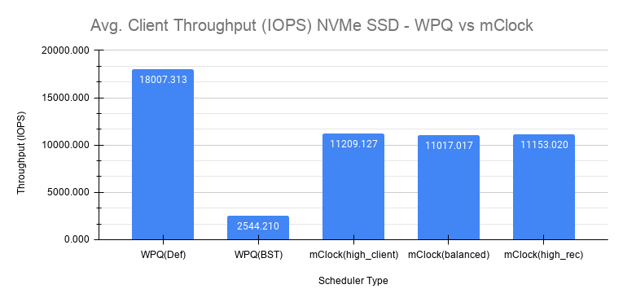


WPQ(def) in the chart shows the average client throughput obtained
using the WPQ scheduler with all other Ceph configuration settings set to
default values. The default setting for :confval:`osd_max_backfills` limits the number
of concurrent local and remote backfills or recoveries per OSD to 1. As a
result, the average client throughput obtained is impressive at just over 18000
IOPS when compared to the baseline value which is 21500 IOPS.

However, with WPQ scheduler along with non-default options mentioned in section
`Non-Default Ceph Recovery Options`_, things are quite different as shown in the
chart for WPQ(BST). In this case, the average client throughput obtained drops
dramatically to only 2544 IOPS. The non-default recovery options clearly had a
significant impact on the client throughput. In other words, recovery operations
overwhelm the client operations. Sections further below discuss the recovery
rates under these conditions.

With the non-default options, the same test was executed with mClock and with
the default profile (*high_client_ops*) enabled. As per the profile allocation,
the reservation goal of 50% (10750 IOPS) is being met with an average throughput
of 11209 IOPS during the course of recovery operations. This is more than 4x
times the throughput obtained with WPQ(BST).

Similar throughput with the *balanced* (11017 IOPS) and *high_recovery_ops*
(11153 IOPS) profile was obtained as seen in the chart above. This clearly
demonstrates that mClock is able to provide the desired QoS for the client
with multiple concurrent backfill/recovery operations in progress.

Client Latency Comparison
-------------------------

The chart below shows the average completion latency (*clat*) along with the
average 95th, 99th and 99.5th percentiles across the schedulers and their
respective configurations.

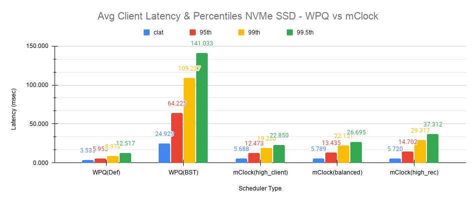

The average *clat* latency obtained with WPQ(Def) was 3.535 msec. But in this
case the number of concurrent recoveries was very much limited at an average of
around 97 objects/sec or ~388 MiB/s and a major contributing factor to the low
latency seen by the client.

With WPQ(BST) and with the non-default recovery options, things are very
different with the average *clat* latency shooting up to an average of almost
25 msec which is 7x times worse! This is due to the high number of concurrent
recoveries which was measured to be ~350 objects/sec or ~1.4 GiB/s which is
close to the maximum OSD bandwidth.

With mClock enabled and with the default *high_client_ops* profile, the average
*clat* latency was 5.688 msec which is impressive considering the high number
of concurrent active background backfill/recoveries. The recovery rate was
throttled down by mClock to an average of 80 objects/sec or ~320 MiB/s according
to the minimum profile allocation of 25% of the maximum OSD bandwidth thus
allowing the client operations to meet the QoS goal.

With the other profiles like *balanced* and *high_recovery_ops*, the average
client *clat* latency didn't change much and stayed between 5.7 - 5.8 msec with
variations in the average percentile latency as observed from the chart above.

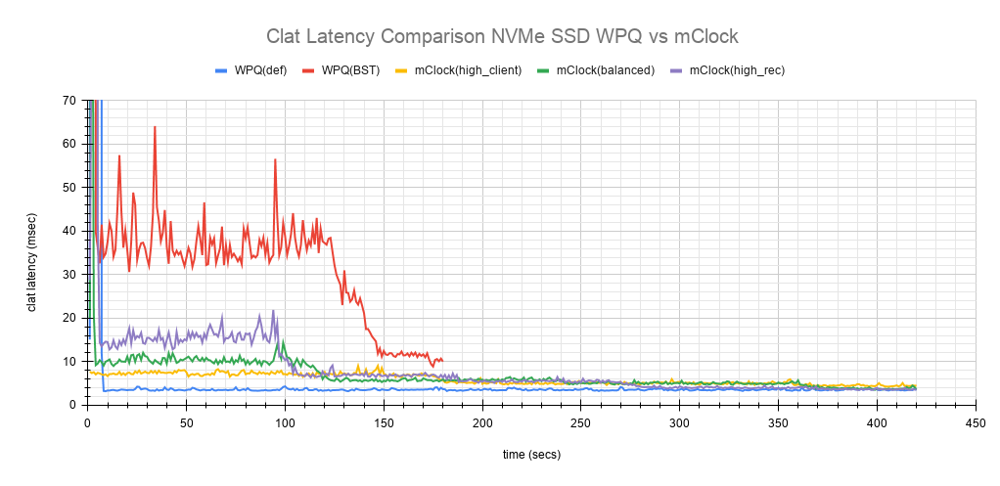

Perhaps a more interesting chart is the comparison chart shown above that
tracks the average *clat* latency variations through the duration of the test.
The chart shows the differences in the average latency between the
WPQ and mClock profiles). During the initial phase of the test, for about 150
secs, the differences in the average latency between the WPQ scheduler and
across the profiles of mClock scheduler are quite evident and self explanatory.
The *high_client_ops* profile shows the lowest latency followed by *balanced*
and *high_recovery_ops* profiles. The WPQ(BST) had the highest average latency
through the course of the test.

Recovery Statistics Comparison
------------------------------

Another important aspect to consider is how the recovery bandwidth and recovery
time are affected by mClock profile settings. The chart below outlines the
recovery rates and times for each mClock profile and how they differ with the
WPQ scheduler. The total number of objects to be recovered in all the cases was
around 75000 objects as observed in the chart below.

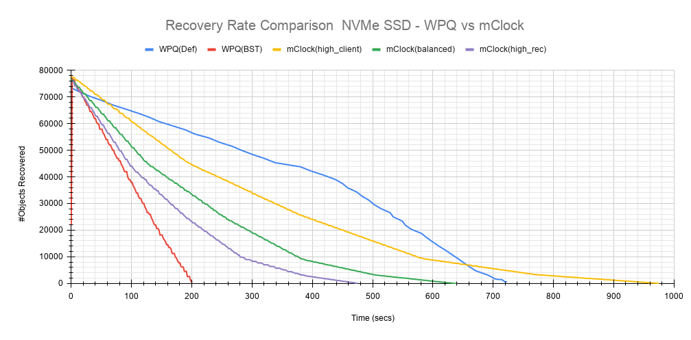

Intuitively, the *high_client_ops* should impact recovery operations the most
and this is indeed the case as it took an average of 966 secs for the
recovery to complete at 80 Objects/sec. The recovery bandwidth as expected was
the lowest at an average of ~320 MiB/s.

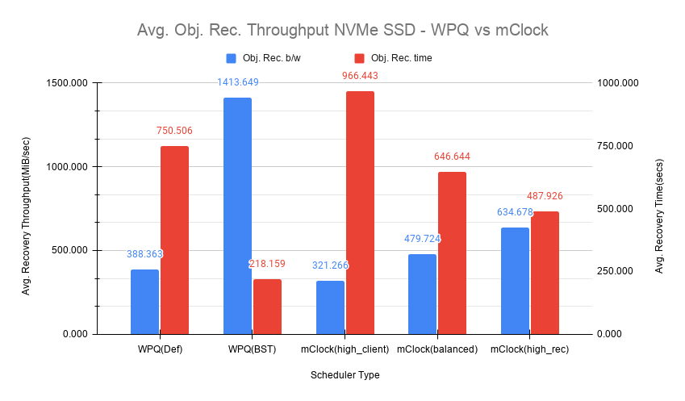

The *balanced* profile provides a good middle ground by allocating the same
reservation and weight to client and recovery operations. The recovery rate
curve falls between the *high_recovery_ops* and *high_client_ops* curves with
an average bandwidth of ~480 MiB/s and taking an average of ~647 secs at ~120
Objects/sec to complete the recovery.

The *high_recovery_ops* profile provides the fastest way to complete recovery
operations at the expense of other operations. The recovery bandwidth was
nearly 2x the bandwidth at ~635 MiB/s when compared to the bandwidth observed
using the *high_client_ops* profile. The average object recovery rate was ~159
objects/sec and completed the fastest in approximately 488 secs.

Test Results With HDDs (WAL and dB configured)
``````````````````````````````````````````````

The recovery tests were performed on HDDs with bluestore WAL and dB configured
on faster NVMe SSDs. The baseline throughput measured was 340 IOPS.

Client Throughput & latency Comparison
--------------------------------------

The average client throughput comparison for WPQ and mClock and its profiles
are shown in the chart below.

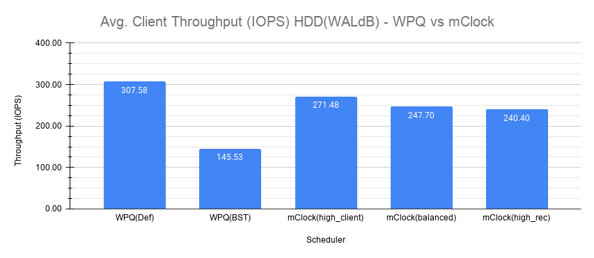

With WPQ(Def), the average client throughput obtained was ~308 IOPS since the
the number of concurrent recoveries was very much limited. The average *clat*
latency was ~208 msec.

However for WPQ(BST), due to concurrent recoveries client throughput is affected
significantly with 146 IOPS and an average *clat* latency of 433 msec.

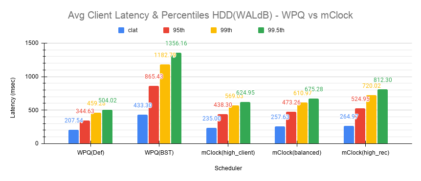

With the *high_client_ops* profile, mClock was able to meet the QoS requirement
for client operations with an average throughput of 271 IOPS which is nearly
80% of the baseline throughput at an average *clat* latency of 235 msecs.

For *balanced* and *high_recovery_ops* profiles, the average client throughput
came down marginally to ~248 IOPS and ~240 IOPS respectively. The average *clat*
latency as expected increased to ~258 msec and ~265 msec respectively.

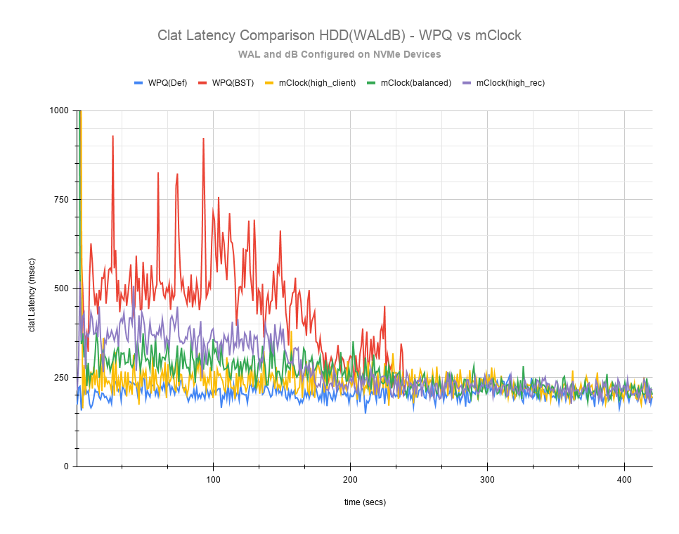

The *clat* latency comparison chart above provides a more comprehensive insight
into the differences in latency through the course of the test. As observed
with the NVMe SSD case, *high_client_ops* profile shows the lowest latency in
the HDD case as well followed by the *balanced* and *high_recovery_ops* profile.
It's fairly easy to discern this between the profiles during the first 200 secs
of the test.

Recovery Statistics Comparison
------------------------------

The charts below compares the recovery rates and times. The total number of
objects to be recovered in all the cases using HDDs with WAL and dB was around
4000 objects as observed in the chart below.

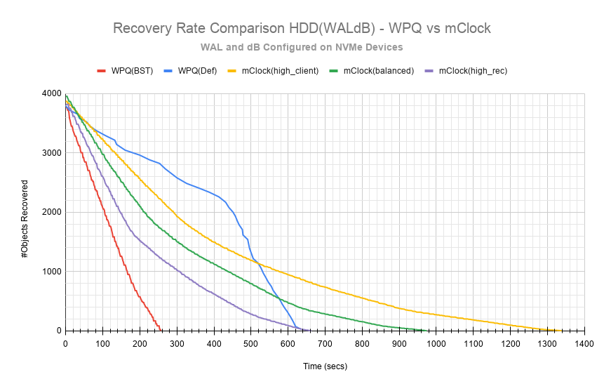

As expected, the *high_client_ops* impacts recovery operations the most as it
took an average of  ~1409 secs for the recovery to complete at ~3 Objects/sec.
The recovery bandwidth as expected was the lowest at ~11 MiB/s.

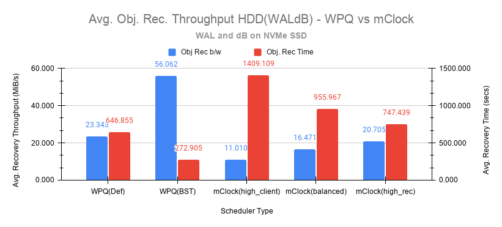

The *balanced* profile as expected provides a decent compromise with an an
average bandwidth of ~16.5 MiB/s and taking an average of ~966 secs at ~4
Objects/sec to complete the recovery.

The *high_recovery_ops* profile is the fastest with nearly 2x the bandwidth at
~21 MiB/s when compared to the *high_client_ops* profile. The average object
recovery rate was ~5 objects/sec and completed in approximately 747 secs. This
is somewhat similar to the recovery time observed with WPQ(Def) at 647 secs with
a bandwidth of 23 MiB/s and at a rate of 5.8 objects/sec.

Test Results With HDDs (No WAL and dB configured)
`````````````````````````````````````````````````

The recovery tests were also performed on HDDs without bluestore WAL and dB
configured. The baseline throughput measured was 315 IOPS.

This type of configuration without WAL and dB configured is probably rare
but testing was nevertheless performed to get a sense of how mClock performs
under a very restrictive environment where the OSD capacity is at the lower end.
The sections and charts below are very similar to the ones presented above and
are provided here for reference.

Client Throughput & latency Comparison
--------------------------------------

The average client throughput, latency and percentiles are compared as before
in the set of charts shown below.

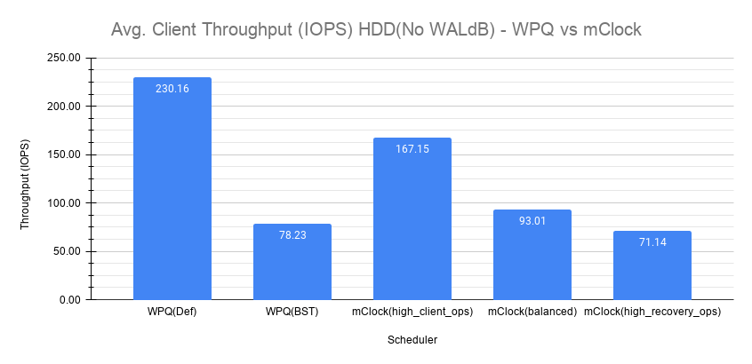

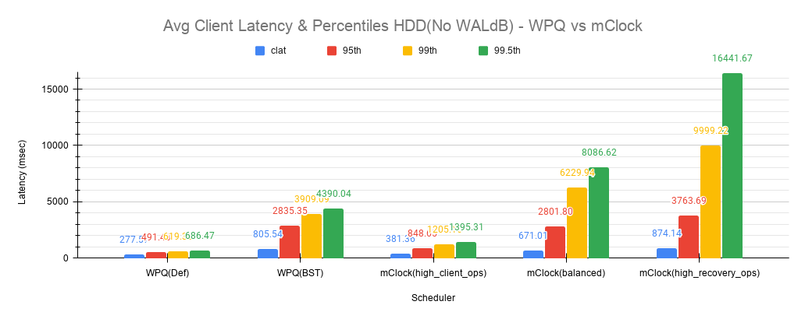

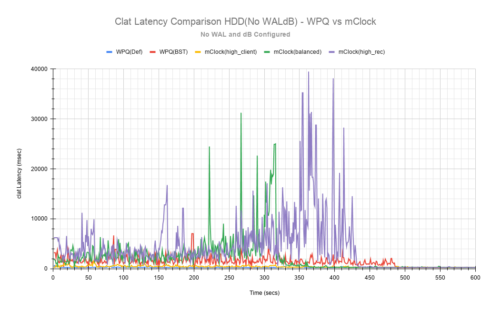

Recovery Statistics Comparison
------------------------------

The recovery rates and times are shown in the charts below.

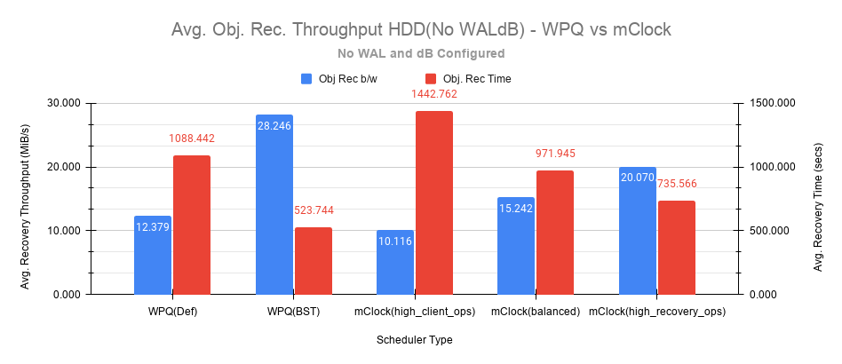

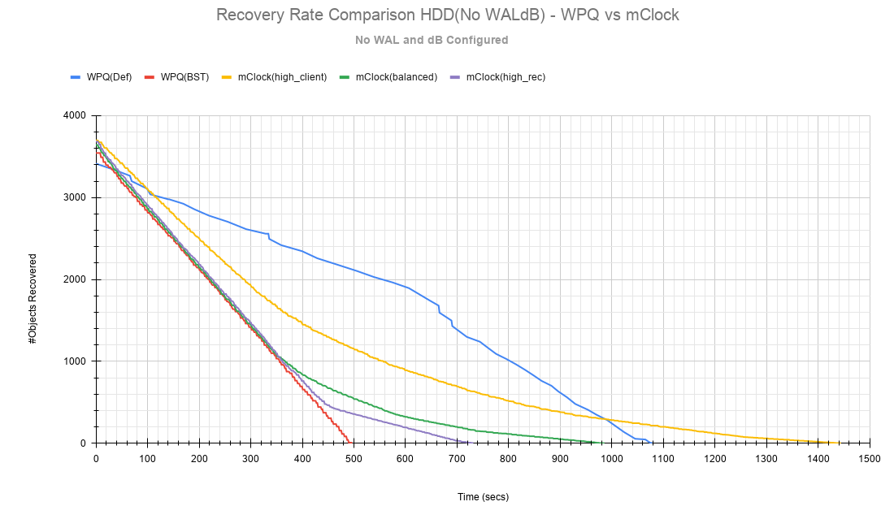

Key Takeaways and Conclusion
============================

- mClock is able to provide the desired QoS using profiles to allocate proper
  *reservation*, *weight* and *limit* to the service types.
- By using the cost per I/O and the cost per byte parameters, mClock can
  schedule operations appropriately for the different device types(SSD/HDD).

The study so far shows promising results with the refinements made to the mClock
scheduler. Further refinements to mClock and profile tuning are planned. Further
improvements will also be based on feedback from broader testing on larger
clusters and with different workloads.

.. _the dmClock algorithm: https://www.usenix.org/legacy/event/osdi10/tech/full_papers/Gulati.pdf
.. _repository: https://github.com/ceph/dmclock
.. _cbt: https://github.com/ceph/cbt
