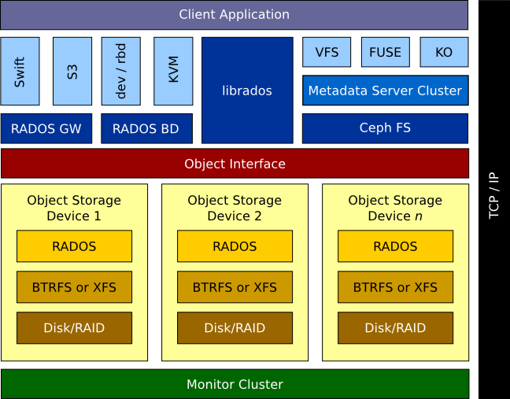

===============
Welcome to Ceph
===============
Ceph is an open source storage system that delivers extraordinary scalability--thousands of clients
accessing petabytes to exabytes of data--with high performance and solid reliability. 

Ceph leverages commodity hardware to accommodate large numbers of Object Storage Devices (OSDs)
operating in clusters over a TCP/IP network. Ceph's Reliable Autonomic Distributed Object Store (RADOS) 
utilizes the CPU, memory and network interface of the OSDs to communicate with each other, 
replicate data, and redistribute data dynamically. Ceph's monitors maintain a master copy of the 
OSD cluster map. Monitors also use the Paxos algorithm to to resolve disparities among different versions 
of the OSD cluster map as maintained by a plurality of monitors.

Client applications access RADOS OSD clusters in several ways. A C/C++ binding (``librados``) provides an
application with direct access to RADOS OSDs. Applications can access RADOS as a block device (``rbd``) using a 
device driver (dev/rdb) or the Qemu Kernel-based Virtual Machine (KVM). The RADOS RESTful gateway (``radosgw``)
supports popular protocols like Amazon S3 and Swift so that applications that support those
data storage interfaces can utilize RADOS OSDs. Finally, client applications can access RADOS OSDs
using the Ceph file system. 

The Ceph File System (Ceph FS) is a virtual file system (VFS) with POSIX semantics that provides
client applications with a unified interface to petabytes or even exabytes of data. Ceph metadata servers 
provide the Ceph FS file system mapping. Client applications access Ceph FS via a Filesystem in User Space (FUSE), 
a Kernel Object (KO), or the Ceph VFS.

Ceph Development Status
=======================
The Ceph project is currently focused on stability. The Ceph file system is functionally complete, 
but has not been tested well enough at scale and under load to recommend it for a production environment yet.
We recommend deploying Ceph for testing and evaluation. We do not recommend deploying Ceph into a
production environment or storing valuable data until stress testing is complete.
Ceph is developed on Linux. You may attempt to deploy Ceph on other platforms, but Linux is the 
target platform for the Ceph project. You can access the Ceph file system from other operating systems 
using NFS or Samba re-exports.

.. toctree::
   :maxdepth: 1
   :hidden:

   start/index
   install/index
   configure/index
   architecture
   ops/index
   rec/index
   config
   control
   api/index
   Internals <dev/index>
   man/index
   papers
   appendix/index
