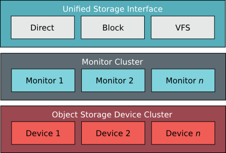

===============
Welcome to Ceph
===============
Ceph uniquely delivers *object, block, and file storage in one unified system*. Ceph is highly reliable, easy to manage, and free. The power of Ceph can transform your company’s IT infrastructure and your ability to manage vast amounts of data. Ceph delivers extraordinary scalability--thousands of clients accessing petabytes to exabytes of data. Ceph leverages commodity hardware and intelligent daemons to accommodate large numbers of storage hosts, which communicate with each other to replicate data, and redistribute data dynamically. Ceph monitors the storage hosts to ensure they are operating effectively.

Ceph Development Status
=======================
Ceph has been under development as an open source project for since 2004, and its current focus
is on stability. The Ceph file system is functionally complete, but has not been tested well enough at scale 
and under load to recommend it for a production environment yet. We recommend deploying Ceph for testing 
and evaluation. We do not recommend deploying Ceph into a production environment or storing valuable data 
until stress testing is complete. Ceph is developed on Linux. You may attempt to deploy Ceph on other platforms, 
but Linux is the target platform for the Ceph project. You can access the Ceph file system from other operating systems 
using NFS or Samba re-exports.

.. toctree::
   :maxdepth: 1
   :hidden:

   start/index
   install/index
   create_cluster/index
   configure/index
   ops/index
   rec/index
   config
   control
   api/index
   Internals <dev/index>
   man/index
   architecture
   papers
   appendix/index