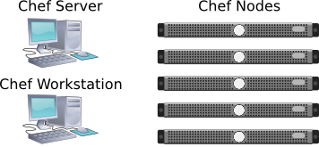

=================
 Installing Chef
=================
Chef defines three types of entities:
 
#. **Chef Server:** Manages Chef 'nodes."
#. **Chef Nodes:** Managed by the Chef Server. 
#. **Chef Workstation:** Manages Chef.

See `Chef Architecture Introduction`_ for details.

Identify a host(s) for your Chef server and Chef workstation. You may 
install them on the same host. To configure Chef, do the following on 
the host designated to operate as the Chef server:

#. Install Ruby
#. Install Chef
#. Install the Chef Server
#. Install Knife
#. Install the Chef Client

Once you have completed the foregoing steps, you may bootstrap the
Chef nodes with ``knife.``

Installing Ruby
---------------
Chef requires you to install Ruby. Use the version applicable to your current 
Linux distribution. ::

	sudo apt-get update
	sudo apt-get install ruby

Installing Chef and the Chef Server
-----------------------------------
.. important:: Before you install Chef, identify the host for your Chef
               server, and its fully qualified URI.

First, add Opscode packages to your APT configuration.
For example:: 

	sudo tee /etc/apt/sources.list.d/chef.list << EOF
	deb http://apt.opscode.com/ $(lsb_release -cs)-0.10 main  
	deb-src http://apt.opscode.com/ $(lsb_release -cs)-0.10 main
	EOF

Next, you must request keys so that APT can verify the packages. :: 

	sudo apt-key adv --keyserver keys.gnupg.net --recv-keys 83EF826A

To install Chef, execute ``update`` and ``install``. For example::

	sudo apt-get upgrade
	sudo apt-get update
	sudo apt-get install chef chef-server

Enter the fully qualified URI for your Chef server. For example::

	http://your-chef-server.com:4000

The Chef server installer will prompt you to enter a temporary password. Enter
a temporary password (e.g., ``foo``) and proceed with the installation. 

.. tip:: As of this writing, we found a bug in the Chef installer.
   When you press **Enter** to get to the password entry field, nothing happens. 
   We were able to get to the password entry field by pressing **ESC**.

Once the installer finishes and activates the Chef server, you may enter the fully 
qualified URI in a browser to launch the Chef web UI. For example:: 

	http://your-chef-server.com:4000

The Chef web UI will prompt you to enter the username and password.

- **login:** ``admin``
- **password:** ``foo``

Once you have entered the temporary password, the Chef web UI will prompt you
to enter a new password.

Configuring Knife
-----------------
Once you complete the Chef server installation, install ``knife`` on the the
Chef server. If the Chef server is a remote host, use ``ssh`` to connect. :: 

	ssh username@your-chef-server.com

In the ``/home/username`` directory, create a hidden Chef directory. :: 

	mkdir -p ~/.chef

The server generates validation and web UI certificates with read/write 
permissions for the user that installed the Chef server. Copy them from the
``/etc/chef`` directory to the ``~/.chef`` directory. Then, change their 
ownership to the current user. ::

	sudo cp /etc/chef/validation.pem /etc/chef/webui.pem ~/.chef

From the current user's home directory, configure ``knife`` with an initial 
API client. :: 

	knife configure -i

The configuration will prompt you for inputs. Answer accordingly: 

*Where should I put the config file? [~/.chef/knife.rb]* Press **Enter** 
to accept the default value.

*Please enter the chef server URL:* If you are installing the 
client on the same host as the server, enter ``http://localhost:4000``. 
Otherwise, enter an appropriate URL for the server.

*Please enter a clientname for the new client:* Press **Enter** 
to accept the default value.

*Please enter the existing admin clientname:* Press **Enter** 
to accept the default value.

*Please enter the location of the existing admin client's private key:* 
Override the default value so that it points to the ``.chef`` directory. 
(*e.g.,* ``.chef/webui.pem``)

*Please enter the validation clientname:* Press **Enter** to accept 
the default value.

*Please enter the location of the validation key:* Override the 
default value so that it points to the ``.chef`` directory. 
(*e.g.,* ``.chef/validation.pem``)

*Please enter the path to a chef repository (or leave blank):*
Leave the entry field blank and press **Enter**.

Installing Chef Client
----------------------
Install the Chef client on the Chef Workstation and nodes.
See `Installing Chef Client on Ubuntu or Debian`_

Create a directory for the GPG key. ::

	sudo mkdir -p /etc/apt/trusted.gpg.d

Add the GPG keys and update the index. :: 

	gpg --keyserver keys.gnupg.net --recv-keys 83EF826A
	gpg --export packages@opscode.com | sudo tee /etc/apt/trusted.gpg.d/opscode-keyring.gpg > /dev/null

Update APT. :: 

	sudo apt-get update

Install the Opscode keyring to ensure the keyring stays up to date. :: 

	sudo apt-get install opscode-keyring

The ``chef-client`` requires a ``client.rb`` and a copy of the 
``validation.pem`` file. Create a directory for them. ::

	sudo mkdir -p /etc/chef

Create the ``client.rb`` and ``validation.pem`` for ``chef-client``. :: 

	sudo knife configure client /etc/chef

Copy ``validation.pem`` to Nodes
--------------------------------
You will need to copy the ``validation.pem`` file in each node with 
the one installed on your Chef server. For each node, replace 
``{nodename}`` in the following line with the node's host name. ::

	sudo cat /etc/chef/validation.pem | ssh -t -v {nodename} "exec sudo tee /etc/chef/validation.pem >/dev/null"

Verify Nodes
------------
Verify that you have setup all the hosts you want to use as 
Chef nodes. :: 

	knife node list

A list of the nodes you've configured should appear.

See the `Deploy With Chef <../../config-cluster/chef>`_ section for information
on using Chef to deploy your Ceph cluster.

.. _Chef Architecture Introduction: http://wiki.opscode.com/display/chef/Architecture+Introduction
.. _Installing Chef Client on Ubuntu or Debian: http://wiki.opscode.com/display/chef/Installing+Chef+Client+on+Ubuntu+or+Debian
.. _Installing Chef Server on Debian or Ubuntu using Packages: http://wiki.opscode.com/display/chef/Installing+Chef+Server+on+Debian+or+Ubuntu+using+Packages
.. _Knife Bootstrap: http://wiki.opscode.com/display/chef/Knife+Bootstrap
