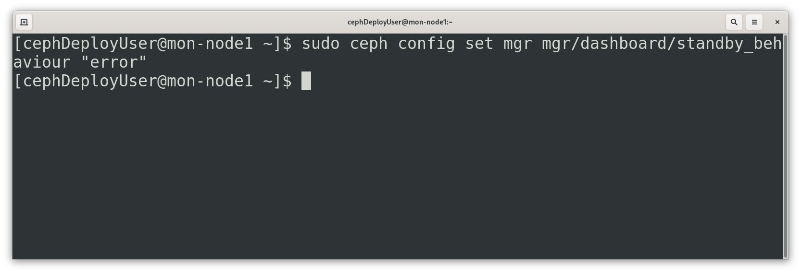
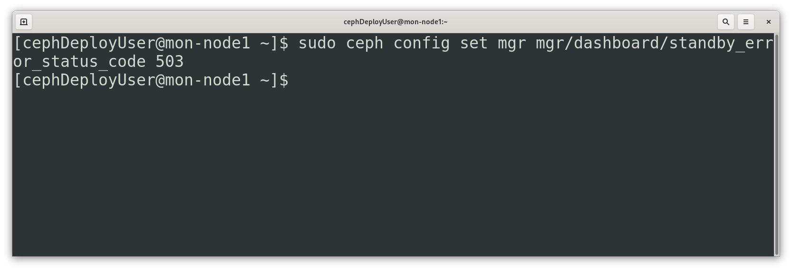
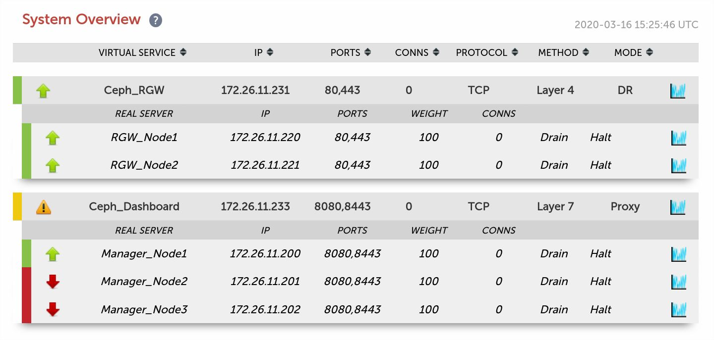
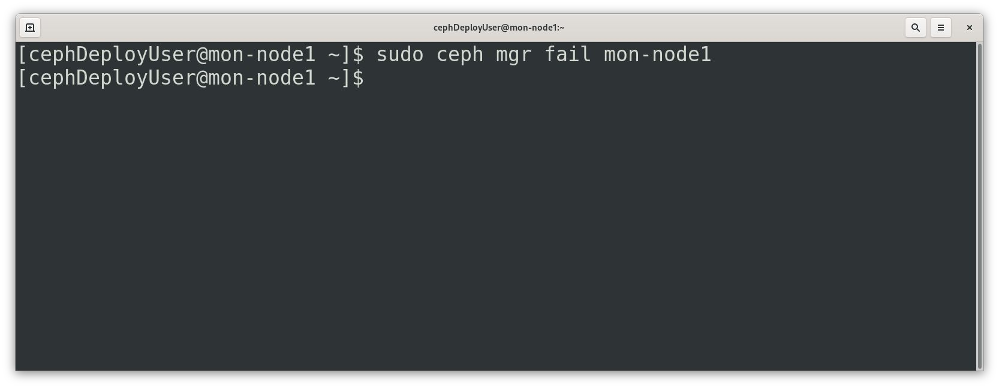
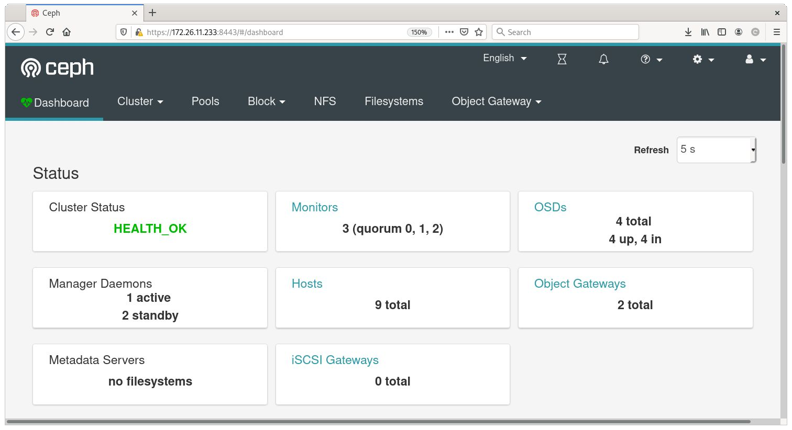
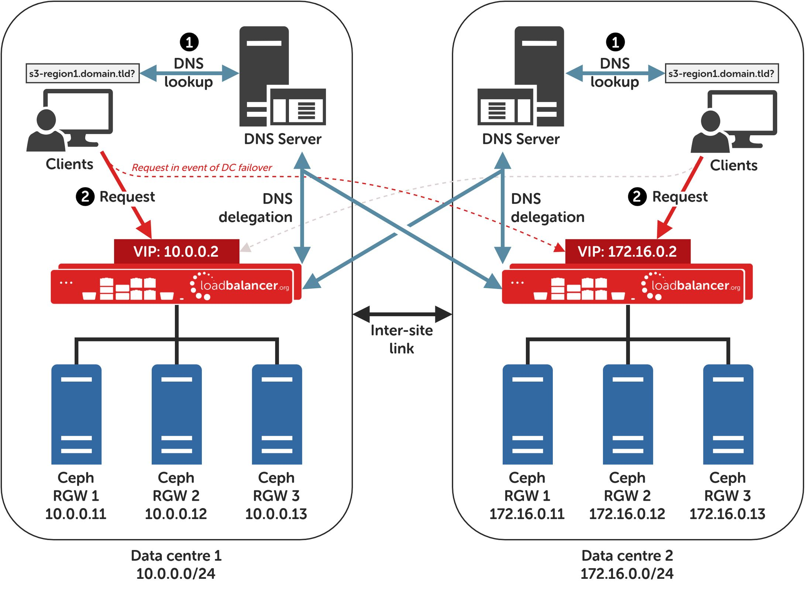

Load Balancing Ceph Object Gateways
===================================

.. _lb_ceph_obj_gate:

About this Guide
----------------
This guide details the steps required to configure a load balanced Ceph Object Gateway environment utilizing Loadbalancer.org appliances. It covers the configuration of the load balancers and also any Ceph configuration changes that are required to enable load balancing.

For more information about initial appliance deployment, network configuration and using the Web User Interface (WebUI), please also refer to the relevant Administration Manual:

`v7 Administration Manual <http://pdfs.loadbalancer.org/loadbalanceradministrationv7.pdfv7>`_

`v8 Administration Manual <http://pdfs.loadbalancer.org/loadbalanceradministrationv8.pdf>`_

Loadbalancer.org Appliances Supported
-------------------------------------
All our products can be used for load balancing Ceph Object Gateway. The complete list of models is shown below:

+---------------------+-----------------------+
| Discontinued Models |  Current Models  1    |
+---------------------+-----------------------+
| Enterprise R16      |  Enterprise R20       |
+---------------------+-----------------------+
| Enterprise VA       |  R16 Enterprise MAX   |
+---------------------+-----------------------+
| Enterprise VA       |  Enterprise 10G       |
+---------------------+-----------------------+
| Enterprise R320     |  Enterprise 40G       |
+---------------------+-----------------------+
|                     |  Enterprise VA R20    |
+---------------------+-----------------------+
|                     |  Enterprise VA MAX    |
+---------------------+-----------------------+
|                     |  Enterprise AWS    2  |
+---------------------+-----------------------+
|                     |  Enterprise AZURE  2  |
+---------------------+-----------------------+
|                     |  Enterprise GCP    2  |
+---------------------+-----------------------+

   1. For full specifications of these models please refer to: `this page <http://www.loadbalancer.org/products/hardware>`_
   2. Some features may not be supported, please check with Loadbalancer.org support

Loadbalancer.org Software Versions Supported
--------------------------------------------

V7.6.4 and later

Ceph Software Versions Supported
--------------------------------

Ceph – all versions

Ceph
----

Ceph is a free and open-source object storage solution. It provides for the building of massively scalable and decentralised storage clusters, up to petabytes or exabytes of data, using standard commodity hardware.

At the heart of Ceph is its Reliable Autonomic Distributed Object Store (RADOS) which provides the underlying storage functionality. Ceph provides three interfaces for accessing its RADOS storage cluster: the Ceph File System (CephFS), which presents storage as a traditional POSIX-compatible file system; the Ceph Block Device (RBD), which allows storage to be mounted as a block device; and the Ceph Object Gateway (RGW), which provides S3 and Swift-compatible API access and is the subject of this document.

The Ceph project is backed by a variety of organisations, with contributions and broader community involvement notably from Canonical, CERN, Fujitsu, Intel, Red Hat, SanDisk, and SUSE. Commercial support and professional services for Ceph are available from Red Hat, as *Red Hat Ceph Storage*, SUSE, as *SUSE Enterprise Storage*, and Canonical, as “Ceph storage on Ubuntu”.

Load Balancing Ceph
-------------------

.. note::
     It's highly recommended that you have a working Ceph environment with working Ceph Object Gateways first before implementing the load balancer.

Load Balancing & HA Requirements
^^^^^^^^^^^^^^^^^^^^^^^^^^^^^^^^
For high availability and scalability, multiple Ceph Object Gateways must be deployed as part of a Ceph deployment. Additional gateways can be deployed over time to increase capacity to meet demand as needed.

Persistence (aka Server Affinity)
^^^^^^^^^^^^^^^^^^^^^^^^^^^^^^^^^
Ceph Object Gateways do not require session affinity at the load balancing layer.

Virtual Service (VIP) Requirements
^^^^^^^^^^^^^^^^^^^^^^^^^^^^^^^^^^
To provide load balancing and HA for Ceph Object Gateways, one VIP is required:

   * Ceph RGW

Optionally, an additional VIP can be used to make the Ceph Dashboard highly available from a single IP address, if the optional dashboard module is in use:

   * Ceph Dashboard

Port Requirements
^^^^^^^^^^^^^^^^^
Ceph is extremely flexible and its user facing services can be configured to use HTTP and/or HTTPS over whichever ports are desired.

The following table is illustrative only: it shows a range of services using a mixture of default ports and likely real-world port values. A specific deployment may well use different ports. The services that are likely to be load balanced are:

+------+--------------------+-----------------------------+
| Port | Protocols          |     Use                     |
+------+--------------------+-----------------------------+
|  80  |  TCP/HTTP          | Ceph Object Gateway Access  |
+------+--------------------+-----------------------------+
| 443  |  TCP/HTTPS         | Secure Ceph Object Gateway  |
|      |                    | Access (HTTPS)              |
+------+--------------------+-----------------------------+
| 8080 | TCP/HTTP           | Ceph Dashboard Access       |
+------+--------------------+-----------------------------+
| 8443 | TCP/HTTPS          | Secure Ceph Dashboard       | 
|      |                    | Access (HTTPS)              |
+------+--------------------+-----------------------------+

TLS/SSL Termination
^^^^^^^^^^^^^^^^^^^

Default/Recommended Option: No TLS/SSL Termination (TLS/SSL Pass-through)
"""""""""""""""""""""""""""""""""""""""""""""""""""""""""""""""""""""""""
If secure HTTPS services are in use, it is highly recommended to **leave all TLS/SSL termination being performed on the Ceph Object Gateways**. The gateway servers are best positioned to perform this function and, crucially, it’s easy to provision additional gateway servers as needed to handle a growing computational load from increased HTTPS use.

Legacy Support Option: Performing TLS/SSL Termination On The Load Balancer
""""""""""""""""""""""""""""""""""""""""""""""""""""""""""""""""""""""""""
One exception to the above recommendation is when load balancing older Ceph deployments. Ceph version 11.0.1, Kraken, introduced support for TLS/SSL using the CivetWeb HTTP frontend on Ceph Object Gateways. Versions prior to that supported HTTP, plain text access to Ceph Object Gateways only.

To use HTTPS on an older deployment that doesn’t have native HTTPS support, a TLS/SSL termination can be configured on the load balancer. This allows clients to connect to the load balancer using HTTPS and the load balancer can then send plain text HTTP to the Ceph Object Gateways, as normal.

To configure the load balancer in this way, first run through the instructions in section :ref:`Appliance Configuration for Ceph Object Gateways – Using Layer 7 SNAT Mode (HAProxy) <app_config_ceph_obj_gateway_layer_7_snat_mode>`. Once complete, then proceed to run through the instructions in section 1 of the appendix, :ref:`Legacy Support Option: Performing TLS/SSL Termination on the Load Balancer <leg_support_opt_tslssl_term_on_lb>`.

.. note::
        Layer 4 DR Mode is not compatible with the “legacy support”, TLS/SSL termination option.

GSLB / Location Affinity
^^^^^^^^^^^^^^^^^^^^^^^^

For multi-site Ceph deployments, it is possible to use the load balancer’s GSLB functionality to provide high availability and location affinity across multiple sites. Using this optional, DNS based feature, in the event that a site’s Ceph Object Gateway service and/or load balancers are offline then local clients are automatically directed to a functioning Ceph Object Gateway service at another site.
A full explanation and instructions on setting up this optional feature can be found in section 2 of the appendix, :ref:`Configuring GSLB / Location Affinity <config_gslb_loc_affinity>`.

Deployment Concept
------------------

        .. image:: lb_deploy_img/07_01.png

VIPs = **V**irtual **IP** Addresses

.. note::
     The load balancer can be deployed as a single unit, although Loadbalancer.org recommends a clustered pair for resilience & high availability. Please refer to :ref:`section 3 in the appendix <clust_pair_config_add_slave_unit>` for more details on configuring a clustered pair.

Load Balancer Deployment Methods
--------------------------------
The load balancer can be deployed in 4 fundamental ways: 

   1. Layer 4 DR mode 
   2. Layer 4 NAT mode
   3. Layer 4 SNAT mode
   4. Layer 7 SNAT mode.

When load balancing Ceph Object Gateways, using layer 4 DR mode or layer 7 SNAT mode is recommended. It is also possible to use layer 4 TUN mode or layer 4 NAT mode in specific circumstances, however these load balancing methods come with many caveats and should only be considered if both layer 4 DR mode and layer 7 SNAT mode have been discounted.

Layer 4 DR mode and layer 7 SNAT mode are both described below and are used for the configurations presented in this guide. For configuring using DR mode please refer to :ref:`Appliance Configuration for Ceph Object Gateways <app_config_ceph_obj_gate>`, and for configuring using layer 7 SNAT mode refer to :ref:`Appliance Configuration for Ceph Object Gateways -- Using Layer 7 SNAT Mode (HAProxy)<app_config_ceph_obj_gateway_layer_7_snat_mode>`. 

Layer 4 DR Mode
^^^^^^^^^^^^^^^
One-arm direct routing (DR) mode is a very high performance solution that requires little change to your existing infrastructure.

.. note:: 
     Kemp, Brocade, Barracuda & A10 Networks call this "Direct Server Return" and F5 call it "N-Path".

        .. image:: lb_deploy_img/08_01.png

   * DR mode works by changing the destination MAC address of the incoming packet to match the selected Real Server on the fly which is very fast
   * When the packet reaches the Real Server it expects the Real Server to own the Virtual Services IP address (VIP). This means that you need to ensure that the Real Server (and the load balanced application) respond to both the Real Servers own IP address and the VIP
   * The Real Server should not respond to ARP requests for the VIP.  Only the load balancer should do this. Configuring the Real Servers in this way is referred to as **Solving the ARP Problem**. Please refer to :ref:`Configuring Ceph Object Gateways for Layer 4 DR Mode (LVS/DR)<layer_4_dr_mode>` for more information.
   * On average, DR mode is 8 times quicker than NAT for HTTP, 50 times quicker for Terminal Services and much, much faster for streaming media or FTP.
   * The load balancer must have an Interface in the same subnet as the Real Servers to ensure layer 2 connectivity required for DR mode to work.
   * The VIP can be brought up on the same subnet as the Real Servers, or on a different subnet provided that the load balancer has an interface in that subnet.
   * Port translation is not possible in DR mode i.e. having a different RIP port than the VIP port.
   * DR mode is transparent, i.e. the Real Server will see the source IP address of the client.

Layer 7 SNAT Mode
^^^^^^^^^^^^^^^^^
Layer 7 SNAT mode uses a proxy (HAProxy) at the application layer. Inbound requests are terminated on the load balancer, and HAProxy generates a new request to the chosen Real Server. As a result, Layer 7 is a slower technique than DR or NAT mode at Layer 4. Layer 7 is typically chosen when either enhanced options such as SSL termination, cookie based persistence, URL rewriting, header insertion/deletion etc. are required, or when the network topology prohibits the use of the layer 4 methods.

        .. image:: lb_deploy_img/08_02.png

This mode can be deployed in a one-arm or two-arm configuration and does not require any changes to the Real Servers. However, since the load balancer is acting as a full proxy it doesn't have the same raw throughput as the layer 4 methods.

The load balancer proxies the application traffic to the servers so that the source of all traffic becomes the load balancer.

   * SNAT mode is a full proxy and therefore load balanced Real Servers do not need to be changed in any way.
   * Because SNAT mode is a full proxy any server in the cluster can be on any accessible subnet including across the Internet or WAN.
   * SNAT mode is not transparent by default, i.e. the Real Servers will not see the source IP address of the client, they will see the load balancers own IP address by default, or any other local appliance IP address if preferred (e.g. the VIP address), this can be configured per layer 7 VIP. If required, the clients IP address can be passed through either by enabling TProxy on the load balancer, or for HTTP, using X-forwarded-For headers. Refer to `chapter 6 in the Loadbalancer administration manual <http://pdfs.loadbalancer.org/loadbalanceradministrationv8.pdf>`__ for more details.
   * SNAT mode can be deployed using either a 1-arm or 2-arm configuration.

Our Recommendation
^^^^^^^^^^^^^^^^^^
The load balancing method to use depends on a number of factors. To help choose, presented below is a brief summary of each method.

Layer 4 DR Mode (LVS/DR)
""""""""""""""""""""""""
This mode delivers the **best raw performance and throughput**. It requires making a few simple changes on the Ceph Object Gateways see :ref:`Configuring Ceph Object Gateways for Layer 4 DR Mode (LVS/DR) <layer_4_dr_mode>` for details).

This is **particularly well suited to read-intensive storage scenarios** because the bandwidth of the return traffic is maximised by completely bypassing the load balancer. This is also known as ‘direct server return’.

This mode has the caveat that the load balancer *must* reside on the same network segment as the Ceph Object Gateways. If that condition cannot be met then layer 7 SNAT mode should be used.

Layer 7 SNAT Mode (HAProxy)
"""""""""""""""""""""""""""
This is the **simplest and most flexible** mode to configure as no changes are required on the Ceph Object Gateways. The servers can be located anywhere in relation to the load balancer, provided that traffic can be routed between the load balancer and the servers.
In this mode, the load balancer uses HAProxy and acts as a full reverse proxy between the users and the Ceph Object Gateways.

Configuring Ceph for Load Balancing
===================================

 .. _layer_4_dr_mode: 

Configuring Ceph Object Gateways for Layer 4 DR Mode (LVS/DR)
-------------------------------------------------------------
If Layer 4 DR mode is used then the ‘ARP problem’ must be solved. This involves configuring each Real Server (each Ceph Object Gateway in this context) to be able to receive traffic destined for the VIP address, and ensuring that each Real Server does not respond to ARP requests for the VIP address – only the load balancer should do this.

The steps below are for Linux servers. For instructions for FreeBSD servers, please refer to chapter 6 in our `admin manual <http://pdfs.loadbalancer.org/loadbalanceradministrationv8.pdf>`__.

   1. **Step 1: Re-configure ARP On The Real Servers**
         
        To do this, add the following lines to /etc/sysctl.conf::

                net.ipv4.conf.all.arp_ignore=1
                net.ipv4.conf.ens192.arp_ignore=1
                net.ipv4.conf.all.arp_announce=2
                net.ipv4.conf.ens192.arp_announce=2

        For example:

      .. image:: lb_deploy_img/09_01.png

      .. note::
        Adjust the commands shown above to suit the network configuration of your server, i.e. change ens192 to match the name of your server’s network interface.

   2. **Step 2: Re-configure DAD On The Real Servers (this Step Is Only Necessary If Using IPv6 Addresses)**

        Add the following lines to /etc/sysctl.conf::

                net.ipv6.conf.lo.dad_transmits=0
                net.ipv6.conf.lo.accept_dad=0

   3. **Step 3: Apply These Settings**

        Either reboot the Real Server or run the following command to apply these settings::

                /sbin/sysctl -p

   4. **Step 4: Add The Virtual Service’s IP Address To The Loopback Adapter**

        To temporarily add the VIP address, e.g. for an initial test, run the following command for the VIP address::

                ip addr add dev lo <IPv4-VIP>/32

        For IPv6 addresses use::

                ip addr add dev lo <IPv6-VIP>/128

        .. image:: lb_deploy_img/09_03.png

      To make this new address permanent and persist across server reboots, add the command to an appropriate startup script, such as /etc/rc.local. For example, on CentOS 7 / RHEL 7:

        .. image:: lb_deploy_img/09_04.png

       As described in the help text, on CentOS 7 / RHEL 7 it is necessary to also execute::

        chmod +x /etc/rc.d/rc.local

      to make the rc.local script executable during boot, otherwise the VIP address will not be added at boot.

      .. note::
        Note: As an alternative to using a startup script such as rc.local (which, on some Linux distributions, may be considered a legacy option or is offered “for compatibility purposes” only), the VIP address can be added to the loopback adaptor by modifying the OS appropriate NIC configuration file.

      As an example, on CentOS 7 / RHEL 7 the loopback adaptor configuration file at /etc/sysconfig/network-scripts/ifcfg-lo can be appended to in order to add the additional IP address, e.g. by appending::

              IPADDR1=172.26.11.231
              NETMASK1=255.255.255.255

      .. image:: lb_deploy_img/09_05.png

      The network service would then need to be restarted to put the new configuration and IP address into use, e.g. by executing:: 
        
           systemctl restart network

        

.. _config_dash_mod_for_load_bal:

Configuring the Dashboard Module for Load Balancing
---------------------------------------------------

The Ceph Dashboard module is an optional component of Ceph. If desired, an additional virtual service can be used to make the Ceph Dashboard highly available from a single IP address.
Two changes should be made to the dashboard module before attempting to load balance the service.

Disable The Redirection
^^^^^^^^^^^^^^^^^^^^^^^
The default behaviour of passive manager nodes is to send an HTTP 303 response status code when a client attempts to access the dashboard from them. When the dashboard service is being load balanced, there is a possibility that a connecting client could be sent an unresolvable URL redirect in the event that a fail over from one manager to another is in progress. As such, the default redirection behaviour should be disabled when the dashboard service is being load balanced.
From any Ceph node in the cluster, execute the following command (sudo privileges may be required)::

        ceph config set mgr mgr/dashboard/standby_behaviour "error"

Configure The Error Status Code
^^^^^^^^^^^^^^^^^^^^^^^^^^^^^^^
Once redirection has been disabled, passive manager nodes will send an HTTP 500 ‘internal server error’ status code if a client attempts to access the dashboard from them. It is recommended by the Ceph project, and is good practice, to use the more descriptive HTTP 503 ‘service unavailable’ status code.
From any Ceph node in the cluster, execute the following command (sudo privileges may be required)::

        ceph config set mgr mgr/dashboard/standby_error_status_code 503

Loadbalancer.org Appliance – the Basics
=======================================

Virtual Appliance Download & Deployment
---------------------------------------
A fully featured, fully supported 30 day trial is available if you are conducting a PoC (Proof of Concept) deployment. The VA is currently available for VMware, Virtual Box, Hyper-V, KVM and XEN and has been optimized for each Hypervisor. By default, the VA is allocated 1 CPU, 2GB of RAM and has an 8GB virtual disk. The Virtual Appliance can be downloaded  `here <http://www.loadbalancer.org/resources/free-trial>`_.

.. note::

     The same download is used for the licensed product, the only difference is that a license key file (supplied by our sales team when the product is purchased) must be applied using the appliance's WebUI.

.. note::

     Please refer to the `Administration Manual <http://pdfs.loadbalancer.org/v8/loadbalanceradministrationv8.3.pdf>`_ and the ReadMe.txt text file included in the VA download for more detailed information on deploying the VA using various Hypervisors.

Initial Network Configuration
^^^^^^^^^^^^^^^^^^^^^^^^^^^^^
The IP address, subnet mask, default gateway and DNS settings can be configured in several ways as detailed below:

Method 1 - Using the Network Setup Wizard at the console
""""""""""""""""""""""""""""""""""""""""""""""""""""""""
After boot up, follow the instructions on the console to configure the IP address, subnet mask, default gateway and DNS settings.

Method 2 - Using the WebUI
""""""""""""""""""""""""""
   1. Using a browser, connect to the WebUI on the default IP address/port: https://192.168.2.21:9443
   2. To set the IP address & subnet mask, use: Local Configuration > Network Interface Configuration
   3. To set the default gateway, use: Local Configuration > Routing
   4. To configure DNS settings, use: Local Configuration > Hostname & DNS

Accessing the Web User Interface (WebUI)
^^^^^^^^^^^^^^^^^^^^^^^^^^^^^^^^^^^^^^^^
The WebUI can be accessed via HTTPS at the following URL: https://192.168.2.21:9443/lbadmin

* Note the port number → 9443

(replace 192.168.2.21 with the IP address of your load balancer if it's been changed from the default)

Login using the following credentials:

    Username: loadbalancer
    Password: loadbalancer

Note: To change the password , use the WebUI menu option: Maintenance > Passwords.

Once logged in, the WebUI will be displayed as shown on the following page:

 .. image:: lb_deploy_img/10_01.png

(shows v8.2.x)

HA Clustered Pair Configuration
-------------------------------
Loadbalancer.org recommend that load balancer appliances are deployed in pairs for high availability. In this guide a single unit is deployed first, adding a secondary slave unit is covered in section 3 of the appendix.

.. _app_config_ceph_obj_gate:

Appliance Configuration for Ceph Object Gateways – Using Layer 4 DR Mode (LVS/DR)
=================================================================================

The following instructions assume that the steps from :ref:`Configuring Ceph Object Gateways for Layer 4 DR Mode (LVS/DR)<layer_4_dr_mode>` have already been followed.

Configuring VIP 1 – Ceph Object Gateways
----------------------------------------

Configuring The Virtual Service (VIP)
^^^^^^^^^^^^^^^^^^^^^^^^^^^^^^^^^^^^^

1. Using the web user interface, navigate to Cluster Configuration > Layer 4 – Virtual Services and click on Add a new Virtual Service
2. Define the Label for the virtual service as required, e.g. Ceph_RGW
3. Set the Virtual Service IP Address field to the required IP address, e.g. 172.26.11.231
4. Set the Ports field to the ports that are in use by the Ceph Object Gateways, e.g. 80,443
5. Leave the Protocol set to TCP
6. Leave the Forwarding Method set to Direct Routing
7. Click Update to create the virtual service
   
   .. image:: lb_deploy_img/11_01.png

8. Click Modfiy next to the newly created VIP
9. Set the Balance Mode to Weighted Round Robin
10. Ensure that the Persistence Enable checkbox is not checked
11. Click Update

Defining The Real Servers (RIPs)
^^^^^^^^^^^^^^^^^^^^^^^^^^^^^^^^
1. Using the web user interface, navigate to *Cluster Configuration > Layer 4 – Real Servers* and click on **Add a new Real Server** next to the newly created VIP.
2. Define the *Label* for the real server as required, e.g. **RGW_Node1**.
3. Set the *Real Server IP Address* field to the required IP address, e.g. **172.26.11.220**.
4. Click **Update**.
5. Repeat these steps to add the remaining Ceph Object Gateways

   .. image:: lb_deploy_img/11_02.png

Configuring VIP 2 – Ceph Dashboard
----------------------------------
A layer 7 solution (which uses HAProxy) should be used for this optional virtual service. To configure it, follow the instructions in section :ref:`Configuring VIP 2 – Ceph Dashboard <config_vip2_ceph_dash>`:  followed by the instructions that immediately follow it, :ref:`Finalizing the Layer 7 Configuration <final_layer_7_config>`.

.. _app_config_ceph_obj_gateway_layer_7_snat_mode:

Appliance Configuration for Ceph Object Gateways – Using Layer 7 SNAT Mode (HAProxy)
====================================================================================

Enabling Multithreaded Load Balancing
-------------------------------------
For the full layer 7 load balancing scenario (not necessary if using a layer 7 virtual service for the dashboard element *only*), the Loadbalancer.org appliance should be configured to actively use multiple CPU cores for the load balancing process. This is required to achieve the high level of performance and throughput required when load balancing a deployment of Ceph Object Gateways at layer 7.

.. note:: 
        A virtual host should be allocated a minimum of 4 vCPUs.

To enable multithreaded mode from the WebUI:

   1. Navigate to *Cluster Configuration > Layer 7 - Advanced Configuration*
   2. Check the **Enable Multithreading** checkbox
   3. Set Number of Threads as appropriate, e.g. **3**

      .. note:: 
         We recommend using a number of threads equal to ‘the number of CPU cores - 1’.
         For example: on a 4 core CPU system, 3 threads are recommended; on an 8 core CPU system, 
         7 threads are recommended.
    
   4. Click **Update** to apply the changes

Configuring VIP 1 – Ceph Object Gateways
----------------------------------------

Configuring The Virtual Service (VIP)
^^^^^^^^^^^^^^^^^^^^^^^^^^^^^^^^^^^^^

   1. Using the web user interface, navigate to *Cluster Configuration > Layer 7 – Virtual Services* and click on **Add a new Virtual Service**
   2. Define the Label for the virtual service as required, e.g. **Ceph_RGW**
   3. Set the *Virtual Service IP Address* field to the required IP address, e.g. **172.26.11.232**
   4. Set the Ports field to the ports that are in use by the Ceph Object Gateways, e.g. **80,443i**
   5. Set the *Layer 7 Protocol* to **TCP Mode**
   6. Click **Update** to create the virtual service

   .. image:: lb_deploy_img/11_01.png

   7. Click **Modfiy** next to the newly created VIP
   8. Set the *Balance Mode* to **Weighted Round Robin**
   9. Set *Persistence Mode* to **None**
   10. Click **Update**

Defining The Real Servers (RIPs)
^^^^^^^^^^^^^^^^^^^^^^^^^^^^^^^^

   1. Using the web user interface, navigate to *Cluster Configuration > Layer 7 – Real Servers* and click on **Add a new Real Server** next to the newly created VIP
   2. Define the Label for the real server as required, e.g. **RGW_Node1**
   3. Set the *Real Server IP Address* field to the required IP address, e.g. **172.26.11.220**
   4. Click **Update**
   5. Repeat these steps to add the remaining Ceph Object Gateways.

   .. image:: lb_deploy_img/11_02.png

.. _config_vip2_ceph_dash:

Configuring VIP 2 – Ceph Dashboard
----------------------------------
The Ceph Dashboard module is an optional component of Ceph. In a deployment with multiple manager nodes, only one manager node is active at a given time. Only the active manager node hosts the web-based dashboard service.

If desired, an additional virtual service can be used on the load balancer to ensure that the Ceph Dashboard is highly available and always accessible from the same IP address.

The dashboard should have been configured for load balancing before following the instructions presented below (see section :ref:`Configuring the Dashboard Module for Load Balancing <config_dash_mod_for_load_bal>`).

  .. image:: lb_deploy_img/12_04.png

Configuring The Virtual Service (VIP)
^^^^^^^^^^^^^^^^^^^^^^^^^^^^^^^^^^^^^

   1. Using the web user interface, navigate to *Cluster Configuration > Layer 7 – Virtual Services* and click on **Add a new Virtual Service**
   2. Define the *Label* for the virtual service as required, e.g. **Ceph_Dashboard**
   3. Set the *Virtual Service IP Address* field to the required IP address, e.g. **172.26.11.233**
   4. Set the *Ports* field to the ports that are in use by the Ceph Dashboard, e.g. **8080,8443**
   5. Set the *Layer 7 Protocol* to **TCP Mode**
   6. Click **Update** to create the virtual service.

      .. image:: lb_deploy_img/12_05.png 
      
   7. Click **Modfiy** next to the newly created VIP.
   8. In the *Health Checks* section click **Advanced** to expand the menu.
   9. Set *Health Checks* as appropriate for the dashboard configuration. For example:
      * If the dashboard service is configured to use HTTP then a valid option is to select **Negotiate HTTP (GET)** and set the *Check Port* as required, e.g. **8080**
      * If the dashboard service is configured to use HTTPS then a valid option is to select **Negotiate HTTPS (GET)** and set the *Check Port* as required, e.g. **8443**

   10. In the *Other* section click **Advanced** to expand the menu.
   11. Check the **Timeout** checkbox.
   12. Set *Client Timeout* to **50s** (for 50 seconds).
   13. Set *Real Server Timeout* to **450s**.
   14. Click **Update**.

Defining The Real Servers (RIPs)
^^^^^^^^^^^^^^^^^^^^^^^^^^^^^^^^

   1. Using the web user interface, navigate to *Cluster Configuration > Layer 7 – Real Servers* and click on **Add a new Real Server** next to the newly created VIP.
   2. Define the *Label* for the real server as required, e.g. **Manager_Node1**.
   3. Set the *Real Server IP Address* field to the required IP address, e.g. **172.26.11.200**
   4. Click **Update**.
   5. Repeat these steps to add the remaining manager nodes.

   .. image:: lb_deploy_img/12_06.png

   .. note::
      Unlike with most load balancing deployments, it is required to add all manager nodes to the dashboard virtual service. This is because any manager node could be the single active node at a given time. For example, if a manager node becomes the active node but is not defined under the dashboard virtual service then the virtual service will fail.

.. _final_layer_7_config:

Finalizing the Layer 7 Configuration
------------------------------------
To apply the new settings, HAProxy must be reloaded as follows:

   1. Using the WebUI, navigate to: *Maintenance > Restart Services* and click **Reload HAProxy**.

Testing & Verification
======================

Using System Overview
---------------------
The System Overview can be viewed in the WebUI. It shows a graphical view of all VIPs & RIPs (i.e. the Ceph nodes) and shows the state/health of each server as well as the state of the cluster as a whole.

The example below shows a **layer 4 DR mode** configuration load balancing a pair of Ceph Object Gateways, where both nodes are healthy and available to accept connections, and a layer 7 virtual service for the Ceph Dashboard, with the active manager node showing as available to accept connections:

The example below shows a **layer 7 SNAT mode** configuration load balancing a pair of Ceph Object Gateways, where both nodes are healthy and available to accept connections, and a layer 7 virtual service for the Ceph Dashboard, with the active manager node showing as available to accept connections:

Testing Dashboard Fail Over
---------------------------
It is possible to issue a command to intentionally cause the active manager node to fail. This will cause one of the other manager nodes to become active and start serving the Ceph Dashboard service. From the load balancer’s System Overview page, the active manager node should then turn ’red’/offline and another manager node should become ’green’/healthy.

From any Ceph node in the cluster, execute the following command to trigger a manager node failure (sudo privileges may be required)::

     ceph mgr fail <hostnameOfActiveManager>

In the following example, the manager daemons all reside on monitor nodes. A failure is triggered on the active manager daemon, which resides on monitor node 1:

It is then observed that another manager node has become active:

.. image:: lb_deploy_img/13_04.png

As a final test, the dashboard is successfully logged into using the VIP address, which is 172.26.11.233 in this example:

Technical Support
=================
For more details about configuring the appliance and assistance with designing your deployment please don't hesitate to contact the support team using the following email address: support@loadbalancer.org.

Further Documentation
The Administration Manual contains much more information about configuring and deploying the appliance. It's available here: http://pdfs.loadbalancer.org/loadbalanceradministrationv8.pdf

Conclusion
==========
Loadbalancer.org appliances provide a very cost effective solution for highly available load balanced Ceph environments with Ceph Object Gateways.

Appendix
========

.. _leg_support_opt_tslssl_term_on_lb:

Legacy Support Option: Performing TLS/SSL Termination on the Load Balancer
--------------------------------------------------------------------------
Ceph versions prior to 11.0.1, Kraken, supported HTTP access to Ceph Object Gateways only. To use HTTPS on an older deployment which doesn’t have native HTTPS support, a TLS/SSL termination can be configured on the load balancer. This allows clients to connect to the load balancer using HTTPS, and the load balancer can then send plain text HTTP to the Ceph Object Gateways.

The following instructions assume that the steps from section `Appliance Configuration for Ceph Object Gateways – Using Layer 7 SNAT Mode (HAProxy) <app_config_ceph_obj_gate>` have already been followed.

Uploading The Certificate
^^^^^^^^^^^^^^^^^^^^^^^^^
A self signed public certificate is included on the load balancer. This can be used for handling TLS/SSL connections, however, connecting clients will need to manually intervene to accept the self signed certificate when connecting to the load balanced HTTPS service. This is often acceptable for internal deployments. For public facing deployments, it is strongly advised to obtain a public certificate signed by a well known and trusted certificate authority.

Once obtained, the appropriate public certificate, including **both** the private key and public certificate parts, must be uploaded to the load balancer for TLS/SSL termination to work.

Detailed information on creating PEM certificate files and converting between certificate formats is presented in our Administration Manual: http://pdfs.loadbalancer.org/loadbalanceradministrationv8.pdf

The process for uploading a certificate is as follows:
   1. Using the web user interface, navigate to *Cluster Configuration > SSL Certificate* and click on **Add a new SSL Certificate**
   2. Press the *Upload prepared PEM/PFX file* radio button
   3. Define the Label for the certificate as required. It may make sense to use the domain that the certificate is associated to, e.g. **ceph.mysite.org**.
   4. Click on **Browse** and select the appropriate PEM or PFX style certificate.
   5. If uploading a PFX certificate, enter the certificate’s password in the **PFX File Password** field.
   6. Click **Upload** certificate.

Modifying The Existing Ceph Object Gateways Virtual Service
^^^^^^^^^^^^^^^^^^^^^^^^^^^^^^^^^^^^^^^^^^^^^^^^^^^^^^^^^^^
   1. Using the web user interface, navigate to *Cluster Configuration > Layer 7 – Virtual Services* and click **Modify** next to the Ceph Object Gateways virtual service (*Ceph_RGW* in the example presented in this document).
   2. Set the Ports field to the port that is in use by the Ceph Object Gateways for the HTTP service, e.g. **80**.
   3. Click **Update**.

Creating The TLS/SSL Termination
^^^^^^^^^^^^^^^^^^^^^^^^^^^^^^^^
   1. Using the web user interface, navigate to *Cluster Configuration > SSL Termination* and click on **Add a new Virtual Service**.
   2. From the *Associated Virtual Service* drop-down list, select the Ceph Object Gateways service that was created previously, e.g. **Ceph_RGW**.
   3. Set the *Virtual Service Port* field to the port that will be used for the HTTPS service, e.g. **443**.
   4. If using an uploaded public certificate, i.e. not the default self signed certificate, from the *SSL Certificate* drop-down list, select the certificate for the service in question, which in this example is **ceph.mysite.org**.
   5. Click **Update** to create the TLS/SSL termination service.

   .. image:: lb_deploy_img/17_01.png

Finalizing The Configuration
^^^^^^^^^^^^^^^^^^^^^^^^^^^^
To apply the new settings, HAProxy and stunnel must both be reloaded as follows:

   1. Using the WebUI, navigate to: *Maintenance > Restart Services* and click **Reload STunnel**.
   2. Using the WebUI, navigate to: *Maintenance > Restart Services* and click **Reload HAProxy**.

.. _config_gslb_loc_affinity:

Configuring GSLB / Location Affinity
------------------------------------

Conceptual Overview
^^^^^^^^^^^^^^^^^^^
For **multi-site Ceph deployments**, it is possible to use the load balancer’s GSLB functionality to provide high availability and location affinity across multiple sites.
   * Clients across multiple sites can use the same fully qualified domain name to access the Ceph Object Gateway service.
   * Under normal operation, clients are directed to their site’s local cluster of Ceph Object Gateways.
   * In the event that a site’s Ceph Object Gateway service and/or load balancers are offline then local clients are automatically directed to a functioning cluster of Ceph Object Gateways at another site.

   For the sake of simplicity, the diagram presented below shows a two site setup. The principle can be extended to  encompass as many sites as desired.

Explanation:
   * **Start:** A client tries to access the Ceph Object Gateway service using the S3 protocol. To do this, the client uses the service’s fully qualified domain name, in this example *s3-region1.domain.tld*.
   * The client sends a DNS query for *s3-region1.domain.tld* to its local DNS server.
   * The local site’s DNS server has the domain *s3-region1.domain.tld* delegated to the load balancers.
   * The DNS server sends a delegated DNS query for *s3-region1.domain.tld* to one of the load balancers.
   * The load balancer that received the delegated DNS query replies to the DNS server by serving up the appropriate, **local** VIP address. For example, if the query originated from the 10.0.0.0/24 subnet then the VIP in that subnet is served up. Likewise, if the query originated from the 172.16.0.0/24 subnet then the VIP in that subnet is served up. As such, clients are always directed to their local, on-site Ceph Object Gateway cluster, provided that the on-site instances are online and available
   * The DNS server sends the delegated DNS answer to the client.
   * **Finish:** The client connects to the S3 service at *s3-region1.domain.tld* by using the local VIP address

   .. note::
      **In the event that the cluster of Ceph Object Gateways and/or load balancers at one site should completely fail** then local clients will be directed to the cluster of Ceph Object Gateways at the other site and the service will continue to be available.
      This style of multi-site failover is possible because the load balancers’ GSLB functionality continuously health checks the service at each site. When the service at a site is observed to be unavailable then that site’s IP address is no longer served when responding to DNS queries.
      
Handling Multiple Subdomains

.. _clust_pair_config_add_slave_unit:

Clustered Pair Configuration – Adding a Slave Unit
--------------------------------------------------
If you initially configured just the master unit and now need to add a slave - our recommended procedure, please refer to the relevant section below for more details:

   .. note::
        A number of settings are not replicated as part of the master/slave pairing process and therefore must be manually configured on the slave appliance. These are listed below:
        * Hostname & DNS settings
        * Network settings including IP addresses, bonding configuration and VLANs
        * Routing configuration including default gateways and static routes
        * Date & time settings
        * Physical – Advanced Configuration settings including Internet Proxy IP address & port, Firewall table size, SMTP relay and Syslog server
        * SNMP settings
        * Graphing settings
        * Firewall Script  & Firewall Lockdown Script settings
        * Software updates

Version 7:
----------
Please refer to Chapter 8 – Appliance Clustering for HA in the `v7 Administration Manual <http://www.loadbalancer.org/pdf/loadbalanceradministrationv7.pdf>`.

Version 8:
----------
To add a slave node – i.e. create a highly available clustered pair:
   * Deploy a second appliance that will be the slave and configure initial network settings
   * Using the WebUI, navigate to: *Cluster Configuration > High-Availability Configuration*

   .. image:: lb_deploy_img/17_03.png

   * Specify the IP address and the loadbalancer users password (the default is 'loadbalancer')  for the slave (peer) appliance as shown above
   * Click **Add new node**.
   * The pairing process now commences as shown below:

   .. image:: lb_deploy_img/17_04.png

   * Once complete, the following will be displayed:

   .. image:: lb_deploy_img/17_05.png

   * To finalize the configuration, restart heartbeat and any other services as prompted in the blue message box at the top of the screen.

   .. note::
            Clicking the Restart Heartbeat button on the master appliance will also automatically restart heartbeat on the slave appliance.

   .. note::
            Please refer to chapter 9 – Appliance Clustering for HA in the Administration Manual for more detailed information on configuring HA with 2 appliances.

Document Revision History
+-----------+------------------+--------------------+---------------------+---------------+
|  Version  |  Date            |     Change         |  Reason for Change  |  Changed By   |
+-----------+------------------+--------------------+---------------------+---------------+
|  1.0.0    |  23 March 2020   |  Iniitial version  |                     |      AH       |
+-----------------------------------------------------------------------------------------+

About Loadbalancer.org
----------------------
Loadbalancer.org’s mission is to ensure that its clients’ businesses are never interrupted. The load balancer experts ask the right questions to get to the heart of what matters, bringing a depth of understanding to each deployment. Experience enables Loadbalancer.org engineers to design less complex, unbreakable solutions - and to provide exceptional personalized support.

United Kingdom

Loadbalancer.org Ltd.
Compass House, North Harbour
Business Park, Portsmouth, PO6 4PS
UK:+44 (0) 330 380 1064
sales@loadbalancer.org
support@loadbalancer.org

Canada

Loadbalancer.org Appliances Ltd.
300-422 Richards Street, Vancouver,
BCV6B 2Z4, Canada
TEL:+1 302.213.0122
sales@loadbalancer.org
support@loadbalancer.org

United States

Loadbalancer.org, Inc.
4550 Linden Hill Road, Suite 201
Wilmington, DE 19808, USA
TEL: +1 833.274.2566
sales@loadbalancer.org
support@loadbalancer.org
Germany

Loadbalancer.org GmbH
Tengstraße 2780798,
München, Germany
TEL: +49 (0)89 2000 2179
sales@loadbalancer.org
support@loadbalancer.org

