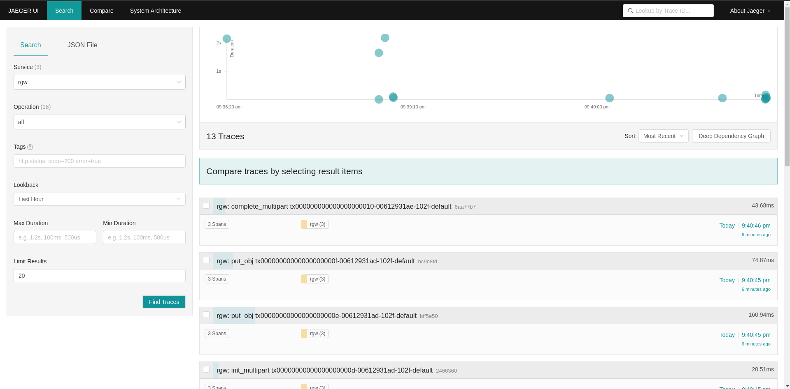

JAEGER- DISTRIBUTED TRACING
===========================

Jaeger provides ready-to-use tracing services for distributed systems. 

BASIC ARCHITECTURE AND TERMINOLOGY
----------------------------------

* TRACE: A trace shows the data/execution path through a system.
* SPAN: A single unit of a trace. A data structure that stores information such
  as the operation name, timestamps, and the ordering within a trace.
* JAEGER CLIENT: Language-specific implementations of the OpenTracing API.
* JAEGER AGENT: A daemon that listens for spans sent over User Datagram
  Protocol. The agent is meant to be placed on the same host as the
  instrumented application. (The Jaeger agent acts like a sidecar listener.)
* JAEGER COLLECTOR: A daemon that receives spans sent by the Jaeger agent. The
  Jaeger collector then stitches the spans together to form a trace. (A databse
  can be enabled to persist a database for these traces).
* JAEGER QUERY AND CONSOLE FRONTEND: The UI-based frontend that presents
  reports of the jaeger traces. Accessible at  http://<jaeger frontend host>:16686.

Read more about jaeger tracing:.

  https://www.jaegertracing.io/docs/

JAEGER DEPLOYMENT
-----------------

Jaeger can be deployed using cephadm, or manually.

CEPHADM BASED DEPLOYMENT AS A SERVICE
-------------------------------------

`Cephadm Jaeger Services Deployment <../cephadm/services/tracing/>`_

MANUAL TEST DEPLOYMENT FOR JAEGER OPENTELEMETRY ALL IN ONE CONTAINER
--------------------------------------------------------------------

For single node testing Jaeger opentelemetry can be deployed using:

.. prompt:: bash $

   docker run -d --name jaeger \
  -e COLLECTOR_ZIPKIN_HOST_PORT=:9411 \
  -e COLLECTOR_OTLP_ENABLED=true \
  -p 6799:6799/udp \
  -p 6832:6832/udp \
  -p 5778:5778 \
  -p 16686:16686 \
  -p 4317:4317 \
  -p 4318:4318 \
  -p 14250:14250 \
  -p 14268:14268 \
  -p 14269:14269 \
  -p 9411:9411 \
  jaegertracing/all-in-one:latest --processor.jaeger-compact.server-host-port=6799

`Jaeger Deployment <https://www.jaegertracing.io/docs/1.25/deployment/>`_

`Jaeger Performance Tuning <https://www.jaegertracing.io/docs/1.25/performance-tuning/>`_

.. note::

  The Jaeger agent must be running on each host (and not running in all-in-one
  mode). This is because spans are sent to the local Jaeger agent. Spans of
  hosts that do not have active Jaeger agents will be lost.

  The default configured port for Jaeger agent differs from the official default
  6831, since Ceph tracers are configured to send tracers to agents that listen
  to port the configured 6799. Use the option "--processor.jaeger-compact.server-host-port=6799" for manual Jaeger
  deployments.

HOW TO ENABLE TRACING IN CEPH
-----------------------------

Tracing in Ceph is disabled by default.

Tracing can be enabled globally, and tracing can also be enabled separately for
each entity (for example, for rgw).

Enable tracing globally:

.. prompt:: bash $

   ceph config set global jaeger_tracing_enable true

Enable tracing for each entity:

.. prompt:: bash $

   ceph config set <entity> jaeger_tracing_enable true

TRACES IN RGW
-------------

Traces run on RGW can be found under the Service `rgw` in the Jaeger Frontend.

REQUESTS
^^^^^^^^
Every user request is traced. Each trace contains tags for `Operation name`,
`User id`, `Object name` and `Bucket name`.

There is also an `Upload id` tag for Multipart upload operations.

The names of request traces have the following format: `<command> <transaction
id>`.

MULTIPART UPLOAD
^^^^^^^^^^^^^^^^
There is a kind of trace that consists of a span for each request made by a
multipart upload, and it includes all `Put Object` requests.

The names of multipart traces have the following format: `multipart_upload
<upload id>`.

rgw service in Jaeger Frontend:

osd service in Jaeger Frontend:

.. image:: ./osd_jaeger.png
  :width: 400
