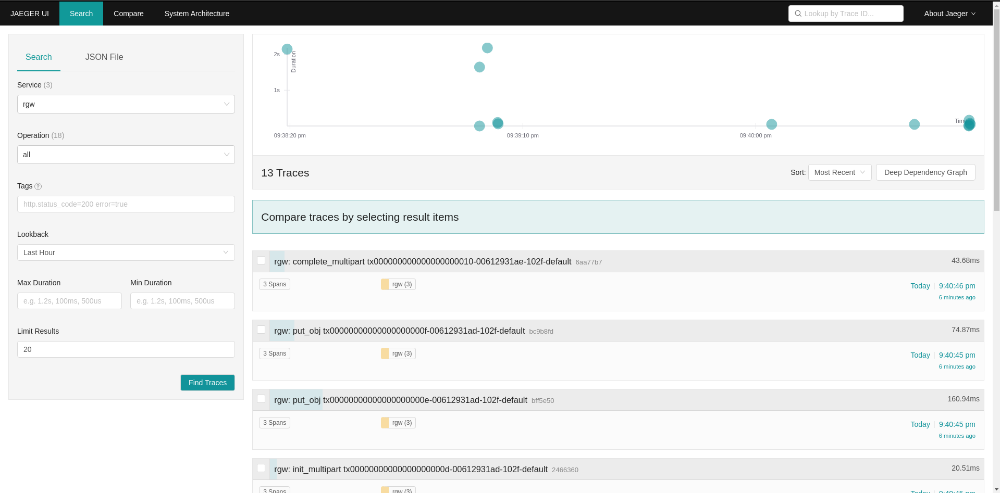
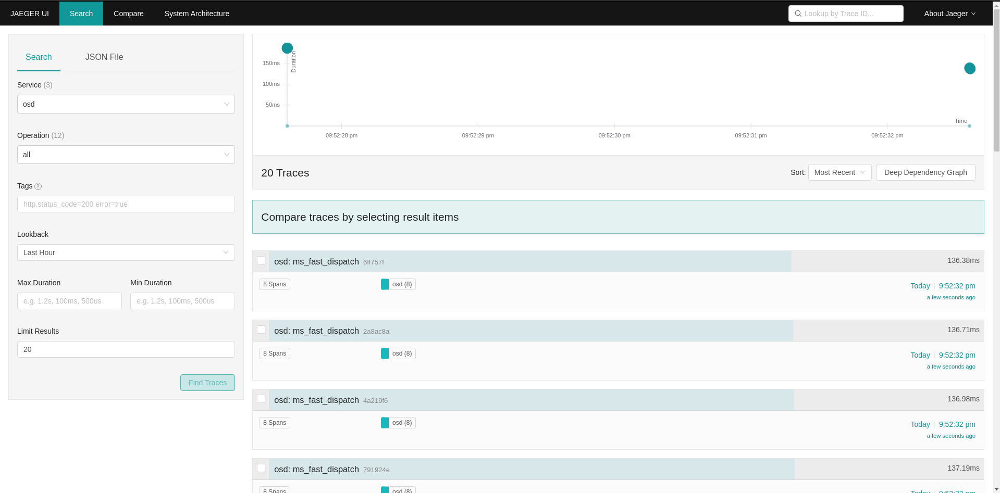

.. _jaegertracing:

OPENTELEMETRY DISTRIBUTED TRACING
==================================

Ceph uses the OpenTelemetry C++ SDK to provide distributed tracing capabilities.
OpenTelemetry is an open-source observability framework that provides APIs, libraries,
and instrumentation for collecting traces, metrics, and logs. Traces can be exported
to various backends including Jaeger for visualization and analysis.

BASIC ARCHITECTURE AND TERMINOLOGY
----------------------------------

* TRACE: A trace shows the data/execution path through a system.
* SPAN: A single unit of a trace. A data structure that stores information such
  as the operation name, timestamps, attributes, and the ordering within a trace.
* OPENTELEMETRY SDK: The OpenTelemetry C++ SDK provides the core tracing functionality,
  including span creation, context propagation, and trace export.
* OTLP EXPORTER: The OpenTelemetry Protocol (OTLP) exporter sends trace data using
  gRPC to an OpenTelemetry collector or compatible backend.
* OPENTELEMETRY COLLECTOR: A vendor-agnostic service that receives, processes, and
  exports telemetry data. The collector can forward traces to various backends including
  Jaeger, Zipkin, or other observability platforms.
* JAEGER BACKEND: Jaeger can be used as a trace storage and visualization backend.
  The Jaeger UI provides reports and visualization of traces at http://<jaeger frontend host>:16686.

Read more about OpenTelemetry:

  https://opentelemetry.io/docs/

JAEGER DEPLOYMENT
-----------------

Jaeger can be deployed using cephadm, or manually.

CEPHADM BASED DEPLOYMENT AS A SERVICE
-------------------------------------

`Cephadm Jaeger Services Deployment <../cephadm/services/tracing/>`_

MANUAL TEST DEPLOYMENT FOR JAEGER WITH OPENTELEMETRY COLLECTOR
--------------------------------------------------------------

For single node testing, Jaeger with OpenTelemetry Protocol (OTLP) support can be deployed using:

.. prompt:: bash $

   docker run -d --name jaeger \
  -p 16686:16686 \
  -p 4317:4317 \
  -p 4318:4318 \
  -v ./jaeger-config.yaml:/etc/jaeger/jaeger-config.yaml:Z \
  cr.jaegertracing.io/jaegertracing/jaeger:2.17.0 \
  --config /etc/jaeger/jaeger-config.yaml

This deployment exposes:

* Port 16686: Jaeger UI
* Port 4317: OTLP gRPC endpoint (used by Ceph)
* Port 4318: OTLP HTTP endpoint

JAEGER V2 CONFIGURATION FILE
----------------------------

An example ``jaeger-config.yaml`` configuration file as referenced in the docker command above follows:

.. code-block:: yaml

   # Jaeger v2 Binary Configuration

   # Service configuration
   service:
     # Pipelines define how data flows through the system
     pipelines:
       traces:
         receivers:
           - otlp
         processors:
           - batch
         exporters:
           - debug
           - jaeger_storage_exporter

     # Extensions provide essential Jaeger capabilities
     extensions:
       - jaeger_query
       - jaeger_storage

   # Receivers: How Jaeger receives trace data
   receivers:
     # OpenTelemetry Protocol receiver (standard for OTLP)
     otlp:
       protocols:
         grpc:
           endpoint: 0.0.0.0:4317
         http:
           endpoint: 0.0.0.0:4318
           cors:
             allowed_origins:
               - "*"

   # Processors: Transform trace data (e.g., buffering)
   processors:
     batch:
       timeout: 1s
       send_batch_size: 1024

   # Exporters: Where to send trace data
   exporters:
     jaeger_storage_exporter:
       trace_storage: memory
     debug:
       verbosity: normal

   # Extensions: Essential UI and Storage backend logic
   extensions:
     # Jaeger Query service (The Web UI)
     jaeger_query:
       storage:
         traces: memory
       ui:
         config_file: ""
       grpc:
         endpoint: 0.0.0.0:16685
       http:
         endpoint: 0.0.0.0:16686

     # Jaeger Storage backend configuration
     jaeger_storage:
       backends:
         memory:
           memory:
             max_traces: 100000

`Jaeger Deployment <https://www.jaegertracing.io/docs/latest/deployment/>`_

`Jaeger Performance Tuning <https://www.jaegertracing.io/docs/latest/performance-tuning/>`_

.. note::

  Ceph uses the OpenTelemetry Protocol (OTLP) with gRPC to send traces directly
  to the collector endpoint. The default port is 4317, which is the standard
  OTLP gRPC port. Each Ceph daemon that has tracing enabled will connect to the
  configured collector endpoint to export spans.

  Unlike the legacy Jaeger agent deployment, there is no need for a local agent
  on each host. Ceph daemons connect directly to the OTLP collector endpoint,
  which can be a centralized service or a local collector instance.

.. _jaegertracing-enable:

HOW TO ENABLE TRACING IN CEPH
-----------------------------

Tracing in Ceph is disabled by default.

Tracing can be enabled globally, and tracing can also be enabled separately for
each entity (for example, for rgw or osd).

Enable tracing globally:

.. prompt:: bash $

   ceph config set global jaeger_tracing_enable true

Enable tracing for a specific entity:

.. prompt:: bash $

   ceph config set <entity> jaeger_tracing_enable true

CONFIGURATION PARAMETERS
------------------------

The following configuration parameters control OpenTelemetry tracing behavior:

* **jaeger_tracing_enable** (bool, default: false): Enable or disable tracing for the daemon.
* **jaeger_agent_host** (string, default: "localhost"): Hostname or IP address of the
  OpenTelemetry collector OTLP gRPC endpoint.
* **jaeger_agent_port** (int, default: 4317): TCP port number of the OpenTelemetry
  collector OTLP gRPC endpoint.

.. note::

  Despite the "jaeger" prefix in the configuration parameter names, these settings
  now configure the OpenTelemetry OTLP exporter. The parameter names have been
  retained for backward compatibility.

Configure the collector endpoint:

.. prompt:: bash $

   ceph config set global jaeger_agent_host collector.example.com
   ceph config set global jaeger_agent_port 4317

OPENTELEMETRY IMPLEMENTATION DETAILS
------------------------------------

Ceph's tracing implementation uses the following OpenTelemetry components:

* **OpenTelemetry C++ SDK**: Provides the core tracing API and functionality
* **OTLP gRPC Exporter**: Exports spans using the OpenTelemetry Protocol over gRPC
* **Batch Span Processor**: Batches spans before export to improve performance
* **Trace Context Propagation**: Span context is propagated across service boundaries
  using encoding/decoding of span context in internal messages

The tracer is initialized with a service name (e.g., "rgw", "osd") and creates
spans using the OpenTelemetry API. Spans are automatically batched and exported
to the configured OTLP endpoint.

TRACES IN RGW
-------------

Traces from RGW can be found under the service name `rgw` in the Jaeger UI.

REQUESTS
--------

Every user request is traced. Each trace contains attributes (formerly called tags) for:

* Operation name
* User ID
* Object name
* Bucket name
* Upload ID (for multipart upload operations)

The names of request traces have the following format: `<command> <transaction id>`.

MULTIPART UPLOAD
----------------
Multipart upload operations create a trace that consists of a span for each request,
including all `Put Object` requests.

The names of multipart traces have the following format: `multipart_upload <upload id>`.

VIEWING TRACES
--------------

rgw service in Jaeger UI:

osd service in Jaeger UI:

BACKWARD COMPATIBILITY
----------------------

The migration from legacy Jaeger client to OpenTelemetry maintains backward
compatibility in the following ways:

* Configuration parameter names retain the "jaeger" prefix (e.g., `jaeger_tracing_enable`,
  `jaeger_agent_host`, `jaeger_agent_port`)
* The same Jaeger UI can be used for visualization
* Existing traces and monitoring workflows continue to work

However, the underlying implementation has changed:

* **Old**: Used Jaeger C++ client with UDP transport to local Jaeger agent
* **New**: Uses OpenTelemetry C++ SDK with OTLP gRPC exporter to collector endpoint

The new implementation provides:

* Better performance through batch span processing
* More flexible deployment options (no local agent required)
* Compatibility with the broader OpenTelemetry ecosystem
* Support for multiple backend options beyond Jaeger
