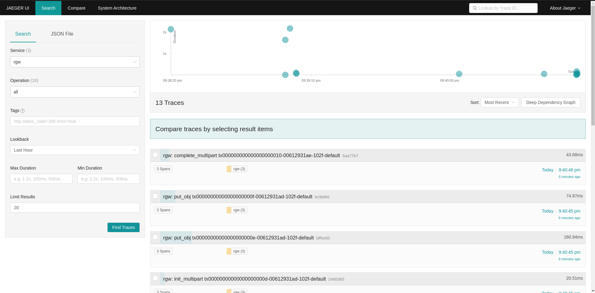
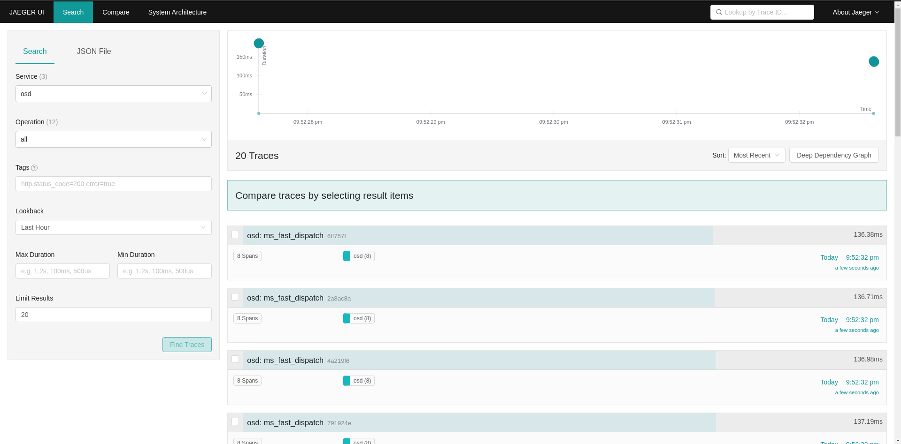

.. _jaegertracing:

===================
Distributed tracing
===================

Ceph daemons can export traces in the OpenTelemetry format to a Jaeger
backend, where each trace shows what one request did and where its time
went. Ceph offers two kinds of traces:

* **Slow-op traces** (OSD): only operations slower than a threshold are
  traced. The trace is built after the operation completes, from the event
  timeline that the op tracker records for every operation anyway, so
  operations faster than the threshold cost nothing extra. This is the kind to
  leave on in production.
* **Tracing of every request** (OSD and RGW): every request is traced as it
  runs. This shows the complete request flow between RGW and the OSDs, but it
  adds measurable CPU and latency to every operation, so enable it only while
  investigating.

Terminology
===========

* **Trace**: the path of one request through the system.
* **Span**: one timed unit of work in a trace, with a name, a start and end
  time, attributes, and timestamped events. Spans nest: a slow-op trace has
  one span for the operation and one child span for each phase of it.
* **Jaeger**: the tracing backend that receives, stores and displays traces.
  Its web UI listens on port 16686.

Quick start
===========

A single Jaeger v2 container is enough: every Ceph daemon can send spans to
it directly, and it needs no agents on other hosts and no separate database.

#. Start Jaeger on a host that the OSDs can reach:

   .. prompt:: bash $

      podman run -d --name jaeger --network host jaegertracing/jaeger:latest

   Jaeger v2 accepts spans over OTLP/HTTP on port 4318 and serves its UI on
   port 16686. By default it keeps traces in memory, so they are lost when
   the container restarts.

#. Point the OSDs at it. This takes effect without restarting the OSDs:

   .. prompt:: bash $

      ceph config set osd trace_exporter otlp
      ceph config set osd trace_otlp_endpoint http://<jaeger host>:4318/v1/traces

#. Trace operations slower than half a second:

   .. prompt:: bash $

      ceph config set osd osd_op_trace_slow_threshold 0.5

#. Open ``http://<jaeger host>:16686`` and select the ``osd`` service.

.. _slow-op-traces:

Slow-op traces
==============

Every operation that takes at least ``osd_op_trace_slow_threshold`` seconds
is exported as a trace when it completes. The default of ``0`` disables slow-op
traces. They are independent of ``jaeger_tracing_enable``, which may stay
``false``.

.. confval:: osd_op_trace_slow_threshold
.. confval:: osd_op_trace_max_per_sec

What a slow-op trace contains
-----------------------------

* **One span for the operation**, named after its message type (for example
  ``osd_op`` for a client request, ``osd_repop`` for a replicated write on a
  replica). It starts when the operation arrived and ends when it completed.
* **Every op tracker event** as a span event, with its original timestamp.
  These are the same events that ``ceph tell osd.N dump_historic_ops`` shows,
  such as ``queued_for_pg``, ``reached_pg``, ``waiting for rw locks``,
  ``started`` and ``commit_sent``.
* **A child span for each phase** that took at least 1% of the operation. A
  phase is the time between two consecutive events and is named after both,
  so the long child spans show directly what the operation waited for.
  For example, in a replicated write where one replica was slow::

    osd_op                                                          0.296 s
      sub_op_commit_rec from osd.2 -> sub_op_commit_rec from osd.1  0.290 s

  The primary had the acknowledgement of ``osd.2`` and then waited 0.29 s for
  ``osd.1``.
* **Attributes** that Jaeger can search on, for example ``pool_name=rbd``
  or ``role=replica``:

  - ``description``: the operation, as in the op tracker
  - ``osd``, ``source`` (the sender), ``reqid`` and ``duration_s``
  - ``role``: ``primary`` or ``replica``, the part this OSD played in the
    request. A reply from a replica is handled by the primary.
  - ``pool``, ``pool_name``, ``pg`` and ``osdmap_epoch`` (the epoch the
    sender used)
  - ``object``, and ``namespace`` if it is not the default one
  - for client requests: ``op_type`` (``read``, ``write`` or
    ``read-write``), ``ops`` (for example ``writefull,setxattr``) and
    ``bytes`` (written, or requested for reads)
  - ``msg_bytes``: the size of the message as received

One trace per request
---------------------

A replicated write shows up as an ``osd_op`` on the primary, an
``osd_repop`` on each replica and an ``osd_repop_reply`` on the primary for
each acknowledgement. Every OSD derives the trace ID from the request ID
(``reqid``) and the cluster fsid, so all of these that were slow land in the
same trace, with no extra data sent between OSDs. That puts the primary's
wait for ``osd.1`` next to what ``osd.1`` was doing with the sub-op at the
time. The operations hang off a shared root span that no OSD exports, so
Jaeger may warn about a missing parent span; that is expected.

Only slow operations are traced, and each OSD applies its own rate limit, so
a trace holds the operations that crossed ``osd_op_trace_slow_threshold`` on
their own OSD, not necessarily all of them.

If a client sent its own trace context with the request, as RGW does when
tracing every request, the primary's operation becomes part of the client's
trace instead, with a link to the request's trace. Replicas do not receive
the client's context, so their operations stay in the request's trace.

Finding the trace of a slow operation
-------------------------------------

A traced operation shows its ``trace_id`` in the op history. The slowest
recent operations are listed first by:

.. prompt:: bash $

   ceph tell osd.0 dump_historic_ops_by_duration

Search for that ID in the Jaeger UI to open the trace. The history keeps
``osd_op_history_size`` operations from the last ``osd_op_history_duration``
seconds; ``dump_historic_slow_ops`` keeps only operations slower than
``osd_op_history_slow_op_threshold`` (10 seconds by default).

Rate limit
----------

When a cluster has trouble, many operations become slow at once. Each OSD
exports at most ``osd_op_trace_max_per_sec`` slow-op traces per second
(default 10) and skips the rest. The ``trackedop`` perf counters count both:

.. prompt:: bash $

   ceph tell osd.0 perf dump trackedop

* ``slow_op_traces``: operations exported as traces
* ``slow_op_traces_dropped``: slow operations skipped because of the rate limit

Cost
----

The decision to trace, and the building of the trace, happen after the
operation completed, on the op tracker's history thread rather than in the
I/O path. An operation faster than the threshold costs nothing beyond what the
op tracker already does. Slow-op traces therefore need the op tracker
(``osd_enable_op_tracker``, enabled by default).

If no traces appear
-------------------

#. Check that ``osd_op_trace_slow_threshold`` is set and that some operations
   are slower than it: ``ceph tell osd.N dump_historic_ops_by_duration``.
#. Check the counters above. If ``slow_op_traces`` rises, the OSD exports
   traces; if ``slow_op_traces_dropped`` rises, raise
   ``osd_op_trace_max_per_sec``.
#. Check where the OSD sends them. The OSD log records every change of
   destination at debug level 1 of the ``trace`` subsystem, for example
   ``otel_tracing: exporting spans over OTLP/HTTP to
   http://10.0.0.5:4318/v1/traces``.
#. Check that the OSD hosts can reach that address: TCP port 4318 for OTLP.
   With the ``jaeger`` exporter, spans travel over UDP, so a firewall drops
   them without any error; allow UDP port 6831 (or 6799 for a cephadm agent).

Where spans are sent
====================

.. confval:: trace_exporter
.. confval:: trace_otlp_endpoint
.. confval:: jaeger_agent_host
.. confval:: jaeger_agent_port

Ceph can export spans with either of two protocols:

* ``otlp`` posts them over HTTP to ``trace_otlp_endpoint``. OTLP is the
  OpenTelemetry protocol, so the same setting works with Jaeger v2, Grafana
  Tempo, the OpenTelemetry Collector and most commercial tracing services.
  Delivery is acknowledged, so spans are not silently lost on the network.
  This is the recommended exporter.
* ``jaeger`` (the default, for compatibility) sends them over UDP to
  ``jaeger_agent_host`` and ``jaeger_agent_port``. The defaults, ``localhost``
  and port 6799, match a Jaeger agent on every host as deployed by cephadm
  (see below). Jaeger v2 still accepts this protocol on UDP port 6831, but it
  is Jaeger-specific and deprecated by OpenTelemetry.

OSDs apply a change to any of these options without restarting; RGW reads them
when it starts. Export happens on a background thread, never in the I/O path.

.. _jaegertracing-enable:

Tracing every request
=====================

Tracing of every request is disabled by default. It can be enabled for all
daemons or for one daemon type at a time:

.. prompt:: bash $

   ceph config set global jaeger_tracing_enable true
   ceph config set <entity> jaeger_tracing_enable true

.. warning::

   Every request then creates spans in the I/O path. On an OSD, expect a
   noticeable rise in CPU per operation and in latency. For operations that
   matter most, prefer :ref:`slow-op traces <slow-op-traces>`.

Traces in RGW
-------------

Traces from RGW are listed under the ``rgw`` service in the Jaeger UI.

Every user request is traced. Each trace carries the ``Operation name``,
``User id``, ``Object name`` and ``Bucket name`` tags, and multipart uploads
also carry ``Upload id``. Request traces are named ``<command> <transaction
id>``.

A multipart upload also gets a trace of its own, with a span for each request
that belongs to the upload, including every ``Put Object`` request. These
traces are named ``multipart_upload <upload id>``.

rgw service in the Jaeger UI:

osd service in the Jaeger UI:

Deploying Jaeger with cephadm
=============================

cephadm can deploy Jaeger as a set of services, with a Jaeger agent on every
host. See :ref:`Cephadm Jaeger services deployment <cephadm-tracing>`.

Further reading: `Jaeger documentation <https://www.jaegertracing.io/docs/>`_.
