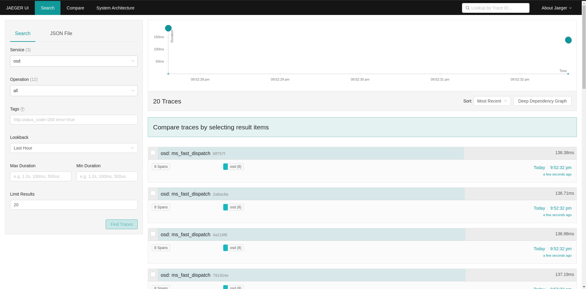

JAEGER- DISTRIBUTED TRACING
===========================

Jaeger  provides ready to use tracing services for distributed
systems and is becoming the widely used standard because of their simplicity and
standardization.

BASIC ARCHITECTURE AND TERMINOLOGY
----------------------------------

* TRACE: A trace shows the data/execution path through a system.
* SPAN: A single unit of a trace, it is a data structure that stores
  information like operation name, timestamps, ordering in a trace.
* JAEGER CLIENT: language-specific implementations of the OpenTracing API.
* JAEGER AGENT: a daemon that listens for spans sent over User Datagram Protocol.
  The agent is meant to be placed on the same host as the instrumented
  application. (acts like a sidecar listener)
* JAEGER COLLECTOR: Jaeger agent sends the spans to this daemon which then
  stitches the spans together to form a trace(if enabled, also persists a database
  for these traces)
* JAEGER QUERY AND CONSOLE FRONTEND: UI based frontend to checkout the jaeger
  traces, navigate to http://<jaeger frontend host>:16686 

read more about jaeger tracing:.

  https://www.jaegertracing.io/docs/

JAEGER DEPLOYMENT
-----------------

there are couple of ways to deploy jaeger.
it can be done using cephadm, or manually.

please refer to:

`Cephadm Jaeger services deployment <../cephadm/services/tracing/>`_

`jaeger deployment <https://www.jaegertracing.io/docs/1.25/deployment/>`_

`jaeger performance tuning <https://www.jaegertracing.io/docs/1.25/performance-tuning/>`_

Important Notes:
^^^^^^^^^^^^^^^^

- Spans are being sent to local jaeger agent, so the jaeger agent must be running on each host (not in all-in-one mode). otherwise, spans of hosts without active jaeger agent will be lost.

- Ceph tracers are configured to sent tracers to agents that are listening to port 6799, so on manual jaeger deployment, option "--processor.jaeger-compact.server-host-port=6799" should be used.

HOW TO ENABLE TRACING IN CEPH
-----------------------------

tracing in Ceph is disabled by default.
it could be enabled globally, or for each entity separately (e.g. rgw).

  Enable tracing globally::

      $ ceph config set global jaeger_tracing_enable true

  Enable tracing for each entity::

      $ ceph config set <entity> jaeger_tracing_enable true

TRACES IN RGW
-------------

traces of RGW can be found under Service `rgw` in Jaeger Frontend.

REQUESTS
^^^^^^^^
every user request is being traced. each trace contains tags for
`Operation name`, `User id`, `Object name` and `Bucket name`.

there is also `Upload id` tag for Multipart upload operations.

request trace is named `<command> <transaction id>`.

MULTIPART UPLOAD
^^^^^^^^^^^^^^^^
there is a trace, that consists a span for each request that made by that multipart upload, including all `Put Object` requests.

multipart trace is named `multipart_upload <upload id>`.

rgw service in Jaeger Frontend:

.. image:: ./rgw_jaeger.png
  :width: 400

osd service in Jaeger Frontend:

