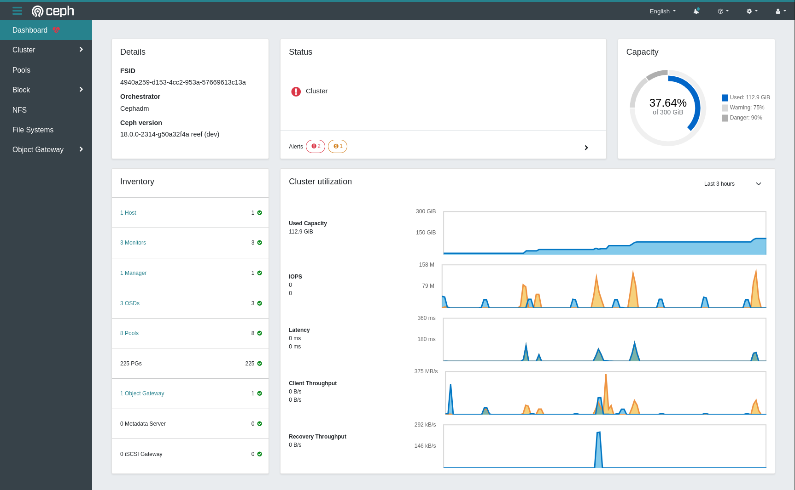
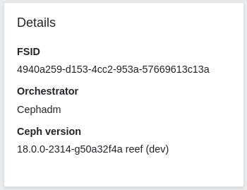
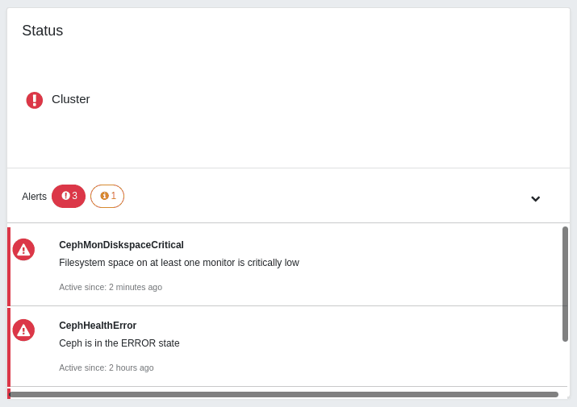
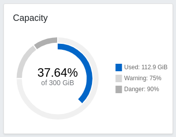
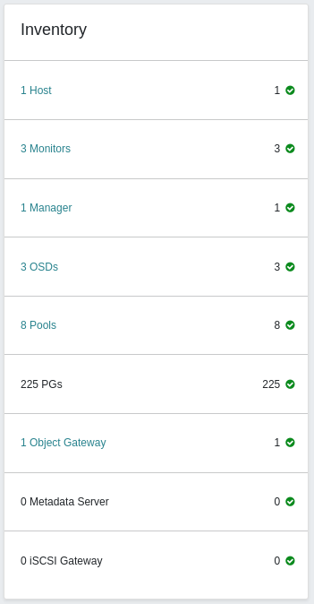
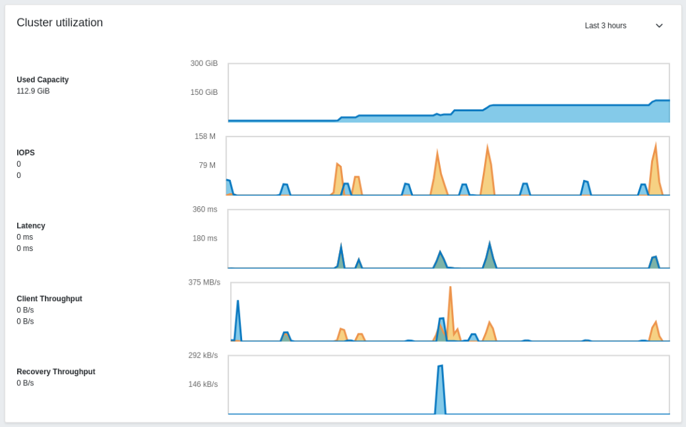

.. _mgr-dashboard:

Ceph Dashboard
==============

Overview
--------

The Ceph Dashboard is a built-in web-based Ceph management and monitoring
application through which you can inspect and administer various aspects
and resources within the cluster. It is implemented as a :ref:`ceph-manager-daemon` module.

The original Ceph Dashboard that was shipped with Ceph Luminous started
out as a simple read-only view into run-time information and performance
data of Ceph clusters. It used a very simple architecture to achieve the
original goal. However, there was growing demand for richer web-based
management capabilities, to make it easier to administer Ceph for users that
prefer a WebUI over the CLI.

The new :term:`Ceph Dashboard` module adds web-based monitoring and
administration to the Ceph Manager. The architecture and functionality of this new
module are derived from
and inspired by the `openATTIC Ceph management and monitoring tool
<https://openattic.org/>`_. Development is actively driven by the
openATTIC team at `SUSE <https://www.suse.com/>`_, with support from
companies including `Red Hat <https://redhat.com/>`_ and members of the Ceph
community.

The dashboard module's backend code uses the CherryPy framework and implements
a custom REST API. The WebUI implementation is based on
Angular/TypeScript and includes both functionality from the original dashboard
and new features originally developed for the standalone version
of openATTIC. The Ceph Dashboard module is implemented as an
application that provides a graphical representation of information and statistics
through a web server hosted by ``ceph-mgr``.

Feature Overview
^^^^^^^^^^^^^^^^

The dashboard provides the following features:

* **Multi-User and Role Management**: The dashboard supports multiple user
  accounts with different permissions (roles). User accounts and roles
  can be managed via both the command line and the WebUI. The dashboard
  supports various methods to enhance password security. Password
  complexity rules may be configured, requiring users to change their password
  after the first login or after a configurable time period. See
  :ref:`dashboard-user-role-management` for details.
* **Single Sign-On (SSO)**: The dashboard supports authentication
  via an external identity provider using the SAML 2.0 protocol. See
  :ref:`dashboard-sso-support` for details.
* **SSL/TLS support**: All HTTP communication between the web browser and the
  dashboard is secured via SSL. A self-signed certificate can be created with
  a built-in command, but it's also possible to import custom certificates
  signed and issued by a CA. See :ref:`dashboard-ssl-tls-support` for details.
* **Auditing**: The dashboard backend can be configured to log all ``PUT``, ``POST``
  and ``DELETE`` API requests in the Ceph audit log. See :ref:`dashboard-auditing`
  for instructions on how to enable this feature.
* **Internationalization (I18N)**: The language used for dashboard text can be
  selected at run-time.

The Ceph Dashboard offers the following monitoring and management capabilities:

* **Overall cluster health**: Display performance and capacity metrics as well
  as cluster status.
* **Embedded Grafana Dashboards**: Ceph Dashboard
  `Grafana`_ dashboards may be embedded in external applications and web pages
  to surface information and performance metrics gathered by
  the :ref:`mgr-prometheus` module. See
  :ref:`dashboard-grafana` for details on how to configure this functionality.
* **Cluster logs**: Display the latest updates to the cluster's event and
  audit log files. Log entries can be filtered by priority, date or keyword.
* **Hosts**: Display a list of all cluster hosts along with their
  storage drives, which services are running, and which version of Ceph is
  installed.
* **Performance counters**: Display detailed service-specific statistics for
  each running service.
* **Monitors**: List all Mons, their quorum status, and open sessions.
* **Monitoring**: Enable creation, re-creation, editing, and expiration of
  Prometheus' silences, list the alerting configuration and all
  configured and firing alerts. Show notifications for firing alerts.
* **Configuration Editor**: Display all available configuration options,
  their descriptions, types, default and currently set values.  These may be edited as well.
* **Pools**: List Ceph pools and their details (e.g. applications,
  pg-autoscaling, placement groups, replication size, EC profile, CRUSH
  rules, quotas etc.)
* **OSDs**: List OSDs, their status and usage statistics as well as
  detailed information like attributes (OSD map), metadata, performance
  counters and usage histograms for read/write operations. Mark OSDs
  up/down/out, purge and reweight OSDs, perform scrub operations, modify
  various scrub-related configuration options, select profiles to
  adjust the level of backfilling activity. List all drives associated with an
  OSD. Set and change the device class of an OSD, display and sort OSDs by
  device class. Deploy OSDs on new drives and hosts.
* **Device management**: List all hosts known by the orchestrator. List all
  drives attached to a host and their properties. Display drive
  health predictions and SMART data. Blink enclosure LEDs.
* **iSCSI**: List all hosts that run the TCMU runner service, display all
  images and their performance characteristics (read/write ops, traffic).
  Create, modify, and delete iSCSI targets (via ``ceph-iscsi``). Display the
  iSCSI gateway status and info about active initiators.
  See :ref:`dashboard-iscsi-management` for instructions on how to configure
  this feature.
* **RBD**: List all RBD images and their properties (size, objects, features).
  Create, copy, modify and delete RBD images (incl. snapshots) and manage RBD
  namespaces. Define various I/O or bandwidth limitation settings on a global,
  per-pool or per-image level. Create, delete and rollback snapshots of selected
  images, protect/unprotect these snapshots against modification. Copy or clone
  snapshots, flatten cloned images.
* **RBD mirroring**: Enable and configure RBD mirroring to a remote Ceph server.
  List active daemons and their status, pools and RBD images including
  sync progress.
* **CephFS**: List active file system clients and associated pools,
  including usage statistics. Evict active CephFS clients. Manage CephFS
  quotas and snapshots. Browse a CephFS directory structure.
* **Object Gateway**: List all active object gateways and their performance
  counters. Display and manage (add/edit/delete) object gateway users and their
  details (e.g. quotas) as well as the users' buckets and their details (e.g.
  placement targets, owner, quotas, versioning, multi-factor authentication).
  See :ref:`dashboard-enabling-object-gateway` for configuration instructions.
* **NFS**: Manage NFS exports of CephFS file systems and RGW S3 buckets via NFS
  Ganesha. See :ref:`dashboard-nfs-ganesha-management` for details on how to
  enable this functionality.
* **Ceph Manager Modules**: Enable and disable Ceph Manager modules, manage
  module-specific configuration settings.

Overview of the Dashboard Landing Page
^^^^^^^^^^^^^^^^^^^^^^^^^^^^^^^^^^^^^^

The landing page of Ceph Dashboard serves as the home page and features metrics
such as the overall cluster status, performance, and capacity. It provides real-time
updates on any changes in the cluster and allows quick access to other sections of the dashboard.

.. note::
  You can change the landing page to the previous version from:
  ``Cluster >> Manager Modules >> Dashboard >> Edit``.
  Editing the ``FEATURE_TOGGLE_DASHBOARD`` option will change the landing page, from one view to another.

  Note that the previous version of the landing page will be disabled in future releases.

.. _dashboard-landing-page-details:

Details
"""""""
Provides an overview of the cluster configuration, displaying various critical aspects of the cluster.

.. _dashboard-landing-page-status:

Status
""""""
Provides a visual indication of cluster health, and displays cluster alerts grouped by severity.

.. _dashboard-landing-page-capacity:

Capacity
""""""""
* **Used**: Displays the used capacity out of the total physical capacity provided by storage nodes (OSDs)
* **Warning**: Displays the `nearfull` threshold of the OSDs
* **Danger**: Displays the `full` threshold of the OSDs

.. _dashboard-landing-page-inventory:

Inventory
"""""""""
An inventory for all assets within the cluster.
Provides direct access to subpages of the dashboard from each item of this card.

.. _dashboard-landing-page-performance:

Cluster Utilization
"""""""""""""""""""
* **Used Capacity**: Total capacity used of the cluster. The maximum value of the chart is the maximum capacity of the cluster.
* **IOPS (Input/Output Operations Per Second)**: Number of read and write operations.
* **Latency**: Amount of time that it takes to process a read or a write request.
* **Client Throughput**: Amount of data that clients read or write to the cluster.
* **Recovery Throughput**: Amount of recovery data that clients read or write to the cluster.

Supported Browsers
^^^^^^^^^^^^^^^^^^

Ceph Dashboard is primarily tested and developed using the following web
browsers:

+---------------------------------------------------------------+---------------------------------------+
|                            Browser                            |               Versions                |
+===============================================================+=======================================+
| `Chrome <https://www.google.com/chrome/>`_ and                | latest 2 major versions               |
| `Chromium <https://www.chromium.org/>`_ based browsers        |                                       |
+---------------------------------------------------------------+---------------------------------------+
| `Firefox <https://www.mozilla.org/firefox/>`_                 | latest 2 major versions               |
+---------------------------------------------------------------+---------------------------------------+
| `Firefox ESR <https://www.mozilla.org/firefox/enterprise/>`_  | latest major version                  |
+---------------------------------------------------------------+---------------------------------------+

While Ceph Dashboard might work in older browsers, we cannot guarantee compatibility and
recommend keeping your browser up to date.

Enabling
--------

If you have installed ``ceph-mgr-dashboard`` from distribution packages, the
package management system should take care of installing all required
dependencies.

If you're building Ceph from source and want to start the dashboard from your
development environment, please see the files ``README.rst`` and ``HACKING.rst``
in the source directory ``src/pybind/mgr/dashboard``.

Within a running Ceph cluster, the Ceph Dashboard is enabled with:

.. prompt:: bash $

   ceph mgr module enable dashboard

Configuration
-------------

.. _dashboard-ssl-tls-support:

SSL/TLS Support
^^^^^^^^^^^^^^^

All HTTP connections to the dashboard are secured with SSL/TLS by default.

To get the dashboard up and running quickly, you can generate and install a
self-signed certificate:

.. prompt:: bash $

   ceph dashboard create-self-signed-cert

Note that most web browsers will complain about self-signed certificates
and require explicit confirmation before establishing a secure connection to the
dashboard.

To properly secure a deployment and to remove the warning, a
certificate that is issued by a certificate authority (CA) should be used.

For example, a key pair can be generated with a command similar to:

.. prompt:: bash $

   openssl req -new -nodes -x509 \
   -subj "/O=IT/CN=ceph-mgr-dashboard" -days 3650 \
   -keyout dashboard.key -out dashboard.crt -extensions v3_ca

The ``dashboard.crt`` file should then be signed by a CA. Once that is done, you
can enable it for Ceph manager instances by running the following commands:

.. prompt:: bash $

   ceph dashboard set-ssl-certificate -i dashboard.crt
   ceph dashboard set-ssl-certificate-key -i dashboard.key

If unique certificates are desired for each manager instance,
the name of the instance can be included as follows (where ``$name`` is the name
of the ``ceph-mgr`` instance, usually the hostname):

.. prompt:: bash $

   ceph dashboard set-ssl-certificate $name -i dashboard.crt
   ceph dashboard set-ssl-certificate-key $name -i dashboard.key

SSL can also be disabled by setting this configuration value:

.. prompt:: bash $

   ceph config set mgr mgr/dashboard/ssl false

This might be useful if the dashboard will be running behind a proxy which does
not support SSL for its upstream servers or other situations where SSL is not
wanted or required. See :ref:`dashboard-proxy-configuration` for more details.

.. warning::

  Use caution when disabling SSL as usernames and passwords will be sent to the
  dashboard unencrypted.

.. note::

  You must restart Ceph manager processes after changing the SSL
  certificate and key. This can be accomplished by either running ``ceph mgr
  fail mgr`` or by disabling and re-enabling the dashboard module (which also
  triggers the manager to respawn itself):
  
  .. prompt:: bash $

     ceph mgr module disable dashboard
     ceph mgr module enable dashboard

.. _dashboard-host-name-and-port:

Host Name and Port
^^^^^^^^^^^^^^^^^^

Like most web applications, the dashboard binds to a TCP/IP address and TCP port.

By default, the ``ceph-mgr`` daemon hosting the dashboard (i.e., the currently
active manager) will bind to TCP port 8443 or 8080 when SSL is disabled.

If no specific address has been configured, the web app will bind to ``::``,
which corresponds to all available IPv4 and IPv6 addresses.

These defaults can be changed via the configuration key facility on a
cluster-wide level (so they apply to all manager instances) as follows:

.. prompt:: bash $

   ceph config set mgr mgr/dashboard/server_addr $IP
   ceph config set mgr mgr/dashboard/server_port $PORT
   ceph config set mgr mgr/dashboard/ssl_server_port $PORT

Since each ``ceph-mgr`` hosts its own instance of the dashboard, it may be
necessary to configure them separately. The IP address and port for a specific
manager instance can be changed with the following commands:

.. prompt:: bash $

   ceph config set mgr mgr/dashboard/$name/server_addr $IP
   ceph config set mgr mgr/dashboard/$name/server_port $PORT
   ceph config set mgr mgr/dashboard/$name/ssl_server_port $PORT

Replace ``$name`` with the ID of the ceph-mgr instance hosting the dashboard.

.. note::

  The command ``ceph mgr services`` will show you all endpoints that are
  currently configured. Look for the ``dashboard`` key to obtain the URL for
  accessing the dashboard.

Username and Password
^^^^^^^^^^^^^^^^^^^^^

In order to be able to log in, you need to create a user account and associate
it with at least one role. We provide a set of predefined *system roles* that
you can use. For more details please refer to the `User and Role Management`_
section.

To create a user with the administrator role you can use the following
commands:

.. prompt:: bash $

   ceph dashboard ac-user-create <username> -i <file-containing-password> administrator

Account Lock-out
^^^^^^^^^^^^^^^^

It disables a user account if a user repeatedly enters the wrong credentials
for multiple times. It is enabled by default to prevent brute-force or dictionary
attacks. The user can get or set the default number of lock-out attempts using
these commands respectively:

.. prompt:: bash $

   ceph dashboard get-account-lockout-attempts
   ceph dashboard set-account-lockout-attempts <value:int>

.. warning::

  This feature can be disabled by setting the default number of lock-out attempts to 0.
  However, by disabling this feature, the account is more vulnerable to brute-force or
  dictionary based attacks. This can be disabled by:

  .. prompt:: bash $

     ceph dashboard set-account-lockout-attempts 0

Enable a Locked User
^^^^^^^^^^^^^^^^^^^^

If a user account is disabled as a result of multiple invalid login attempts, then
it needs to be manually enabled by the administrator. This can be done by the following
command:

.. prompt:: bash $

   ceph dashboard ac-user-enable <username>

Accessing the Dashboard
^^^^^^^^^^^^^^^^^^^^^^^

You can now access the dashboard using your (JavaScript-enabled) web browser, by
pointing it to any of the host names or IP addresses and the selected TCP port
where a manager instance is running: e.g., ``http(s)://<$IP>:<$PORT>/``.

The dashboard page displays and requests a previously defined username and
password.

.. _dashboard-enabling-object-gateway:

Enabling the Object Gateway Management Frontend
^^^^^^^^^^^^^^^^^^^^^^^^^^^^^^^^^^^^^^^^^^^^^^^

When RGW is deployed with cephadm, the RGW credentials used by the
dashboard will be automatically configured. You can also manually force the
credentials to be set up with:

.. prompt:: bash $

   ceph dashboard set-rgw-credentials

This will create an RGW user with uid ``dashboard`` for each realm in
the system.

If you've configured a custom 'admin' resource in your RGW admin API, you should set it here also:

.. prompt:: bash $

   ceph dashboard set-rgw-api-admin-resource <admin_resource>

If you are using a self-signed certificate in your Object Gateway setup,
you should disable certificate verification in the dashboard to avoid refused
connections, e.g. caused by certificates signed by unknown CA or not matching
the host name:

.. prompt:: bash $

   ceph dashboard set-rgw-api-ssl-verify False

If the Object Gateway takes too long to process requests and the dashboard runs
into timeouts, you can set the timeout value to your needs:

.. prompt:: bash $

   ceph dashboard set-rest-requests-timeout <seconds>

The default value is 45 seconds.

.. _dashboard-iscsi-management:

Enabling iSCSI Management
^^^^^^^^^^^^^^^^^^^^^^^^^

The Ceph Dashboard can manage iSCSI targets using the REST API provided by the
``rbd-target-api`` service of the :ref:`ceph-iscsi`. Please make sure that it is
installed and enabled on the iSCSI gateways.

.. note::

  The iSCSI management functionality of Ceph Dashboard depends on the latest
  version 3 of the `ceph-iscsi <https://github.com/ceph/ceph-iscsi>`_ project.
  Make sure that your operating system provides the correct version, otherwise
  the dashboard will not enable the management features.

If the ``ceph-iscsi`` REST API is configured in HTTPS mode and its using a self-signed
certificate, you need to configure the dashboard to avoid SSL certificate
verification when accessing ceph-iscsi API.

To disable API SSL verification run the following command:

.. prompt:: bash $

   ceph dashboard set-iscsi-api-ssl-verification false

The available iSCSI gateways must be defined using the following commands:

.. prompt:: bash $

   ceph dashboard iscsi-gateway-list
   # Gateway URL format for a new gateway: <scheme>://<username>:<password>@<host>[:port]
   ceph dashboard iscsi-gateway-add -i <file-containing-gateway-url> [<gateway_name>]
   ceph dashboard iscsi-gateway-rm <gateway_name>

.. _dashboard-grafana:

Enabling the Embedding of Grafana Dashboards
^^^^^^^^^^^^^^^^^^^^^^^^^^^^^^^^^^^^^^^^^^^^

`Grafana`_ pulls data from `Prometheus <https://prometheus.io/>`_. Although
Grafana can use other data sources, the Grafana dashboards we provide contain
queries that are specific to Prometheus. Our Grafana dashboards therefore
require Prometheus as the data source. The Ceph :ref:`mgr-prometheus`
module exports its data in the Prometheus exposition format. These Grafana
dashboards rely on metric names from the Prometheus module and `Node exporter
<https://prometheus.io/docs/guides/node-exporter/>`_. The Node exporter is a
separate application that provides machine metrics.

.. note::

  Prometheus' security model presumes that untrusted users have access to the
  Prometheus HTTP endpoint and logs. Untrusted users have access to all the
  (meta)data Prometheus collects that is contained in the database, plus a
  variety of operational and debugging information.

  However, Prometheus' HTTP API is limited to read-only operations.
  Configurations can *not* be changed using the API and secrets are not
  exposed. Moreover, Prometheus has some built-in measures to mitigate the
  impact of denial of service attacks.

  Please see `Prometheus' Security model
  <https://prometheus.io/docs/operating/security/>` for more detailed
  information.

Installation and Configuration using cephadm
""""""""""""""""""""""""""""""""""""""""""""

Grafana and Prometheus can be installed using :ref:`cephadm`. They will
automatically be configured by ``cephadm``. Please see
:ref:`mgr-cephadm-monitoring` documentation for more details on how to use
``cephadm`` for installing and configuring Prometheus and Grafana.

Manual Installation and Configuration
"""""""""""""""""""""""""""""""""""""

The following process describes how to configure Grafana and Prometheus
manually. After you have installed Prometheus, Grafana, and the Node exporter
on appropriate hosts, proceed with the following steps.

#.  Enable the Ceph Exporter which comes as Ceph Manager module by running:

    .. prompt:: bash $

       ceph mgr module enable prometheus

    More details can be found in the documentation of the :ref:`mgr-prometheus`.

#.  Add the corresponding scrape configuration to Prometheus. This may look
    like::

      global:
        scrape_interval: 5s

      scrape_configs:
        - job_name: 'prometheus'
          static_configs:
            - targets: ['localhost:9090']
        - job_name: 'ceph'
          static_configs:
            - targets: ['localhost:9283']
        - job_name: 'node-exporter'
          static_configs:
            - targets: ['localhost:9100']

    .. note::

      Please note that in the above example, Prometheus is configured
      to scrape data from itself (port 9090), the Ceph manager module
      `prometheus` (port 9283), which exports Ceph internal data, and the Node
      Exporter (port 9100), which provides OS and hardware metrics for each host.

      Depending on your configuration, you may need to change the hostname in
      or add additional configuration entries for the Node
      Exporter. It is unlikely that you will need to change the default TCP ports.

      Moreover, you don't *need* to have more than one target for Ceph specific
      data, provided by the `prometheus` mgr module. But it is recommended to
      configure Prometheus to scrape Ceph specific data from all existing Ceph
      managers. This enables a built-in high availability mechanism, so that
      services run on a manager host will be restarted automatically on a different
      manager host if one Ceph Manager goes down.

#. Add Prometheus as data source to Grafana `using the Grafana Web UI <https://grafana.com/docs/grafana/latest/features/datasources/add-a-data-source/>`_.

   .. IMPORTANT:: 
      The data source must be named "Dashboard1".

#.  Install the `vonage-status-panel and grafana-piechart-panel` plugins using:

    .. prompt:: bash $

      grafana-cli plugins install vonage-status-panel
      grafana-cli plugins install grafana-piechart-panel

#.  Add Dashboards to Grafana:

    Dashboards can be added to Grafana by importing dashboard JSON files.
    Use the following command to download the JSON files:

    .. prompt:: bash $

       wget https://raw.githubusercontent.com/ceph/ceph/main/monitoring/ceph-mixin/dashboards_out/<Dashboard-name>.json

    You can find various dashboard JSON files `here <https://github.com/ceph/ceph/tree/
    main/monitoring/ceph-mixin/dashboards_out>`_.

    For Example, for ceph-cluster overview you can use:

    .. prompt:: bash $

       wget https://raw.githubusercontent.com/ceph/ceph/main/monitoring/ceph-mixin/dashboards_out/ceph-cluster.json

    You may also author your own dashboards.

#.  Configure anonymous mode in ``/etc/grafana/grafana.ini``::

      [auth.anonymous]
      enabled = true
      org_name = Main Org.
      org_role = Viewer

    In newer versions of Grafana (starting with 6.2.0-beta1) a new setting named
    ``allow_embedding`` has been introduced. This setting must be explicitly
    set to ``true`` for the Grafana integration in Ceph Dashboard to work, as the
    default is ``false``.

    ::

      [security]
      allow_embedding = true

Enabling RBD-Image monitoring
"""""""""""""""""""""""""""""

Monitoring of RBD images is disabled by default, as it can significantly impact
performance. For more information please see :ref:`prometheus-rbd-io-statistics`.
When disabled, the overview and details dashboards will be empty in Grafana and
metrics will not be visible in Prometheus.

Configuring Dashboard
"""""""""""""""""""""

After you have set up Grafana and Prometheus, you will need to configure the
connection information that the Ceph Dashboard will use to access Grafana.

You need to tell the dashboard on which URL the Grafana instance is
running/deployed:

.. prompt:: bash $

   ceph dashboard set-grafana-api-url <grafana-server-url>  # default: ''

The format of url is : `<protocol>:<IP-address>:<port>`

.. note::

  The Ceph Dashboard embeds Grafana dashboards via ``iframe`` HTML elements.
  If Grafana is configured without SSL/TLS support, most browsers will block the
  embedding of insecure content if SSL support is
  enabled for the dashboard (which is the default). If you
  can't see the embedded Grafana dashboards after enabling them as outlined
  above, check your browser's documentation on how to unblock mixed content.
  Alternatively, consider enabling SSL/TLS support in Grafana.

If you are using a self-signed certificate for Grafana,
disable certificate verification in the dashboard to avoid refused connections,
which can be a result of certificates signed by an unknown CA or that do not
match the host name:

.. prompt:: bash $

   ceph dashboard set-grafana-api-ssl-verify False

You can also access Grafana directly to monitor your cluster.

.. note::

  Ceph Dashboard configuration information can also be unset. For example, to
  clear the Grafana API URL we configured above:

  .. prompt:: bash $

     ceph dashboard reset-grafana-api-url

Alternative URL for Browsers
""""""""""""""""""""""""""""

The Ceph Dashboard backend requires the Grafana URL to be able to verify the
existence of Grafana Dashboards before the frontend even loads them. Due to the
nature of how Grafana is implemented in Ceph Dashboard, this means that two
working connections are required in order to be able to see Grafana graphs in
Ceph Dashboard:

- The backend (Ceph Mgr module) needs to verify the existence of the requested
  graph. If this request succeeds, it lets the frontend know that it can safely
  access Grafana.
- The frontend then requests the Grafana graphs directly from the user's
  browser using an iframe. The Grafana instance is accessed directly without any
  detour through Ceph Dashboard.

Now, it might be the case that your environment makes it difficult for the
user's browser to directly access the URL configured in Ceph Dashboard. To solve
this issue, a separate URL can be configured which will solely be used to tell
the frontend (the user's browser) which URL it should use to access Grafana.
This setting won't ever be changed automatically, unlike the GRAFANA_API_URL
which is set by :ref:`cephadm` (only if cephadm is used to deploy monitoring
services).

To change the URL that is returned to the frontend issue the following command:

.. prompt:: bash $

   ceph dashboard set-grafana-frontend-api-url <grafana-server-url>

If no value is set for that option, it will simply fall back to the value of the
GRAFANA_API_URL option. If set, it will instruct the browser to use this URL to
access Grafana.

.. _dashboard-sso-support:

Enabling Single Sign-On (SSO)
^^^^^^^^^^^^^^^^^^^^^^^^^^^^^

The Ceph Dashboard supports external authentication of users via the
`SAML 2.0 <https://en.wikipedia.org/wiki/SAML_2.0>`_ protocol. You need to
first create user accounts and associate them with desired roles, as
authorization is performed by the Dashboard. However, the authentication
process can be performed by an existing Identity Provider (IdP).

.. note::

  Ceph Dashboard SSO support relies on onelogin's
  `python-saml <https://pypi.org/project/python-saml/>`_ library.
  Please ensure that this library is installed on your system, either by using
  your distribution's package management or via Python's `pip` installer.

To configure SSO on Ceph Dashboard, you should use the following command:

.. prompt:: bash $

   ceph dashboard sso setup saml2 <ceph_dashboard_base_url> <idp_metadata> {<idp_username_attribute>} {<idp_entity_id>} {<sp_x_509_cert>} {<sp_private_key>}

Parameters:

* **<ceph_dashboard_base_url>**: Base URL where Ceph Dashboard is accessible (e.g., `https://cephdashboard.local`)
* **<idp_metadata>**: URL to remote (`http://`, `https://`) or local (`file://`) path or content of the IdP metadata XML (e.g., `https://myidp/metadata`, `file:///home/myuser/metadata.xml`).
* **<idp_username_attribute>** *(optional)*: Attribute that should be used to get the username from the authentication response. Defaults to `uid`.
* **<idp_entity_id>** *(optional)*: Use this when more than one entity id exists on the IdP metadata.
* **<sp_x_509_cert> / <sp_private_key>** *(optional)*: File path of the certificate that should be used by Ceph Dashboard (Service Provider) for signing and encryption (these file paths should be accessible from the active ceph-mgr instance).

.. note::

  The issuer value of SAML requests will follow this pattern:  **<ceph_dashboard_base_url>**/auth/saml2/metadata

To display the current SAML 2.0 configuration, use the following command:

.. prompt:: bash $

   ceph dashboard sso show saml2

.. note::

  For more information about `onelogin_settings`, please check the `onelogin documentation <https://github.com/onelogin/python-saml>`_.

To disable SSO:

.. prompt:: bash $

   ceph dashboard sso disable

To check if SSO is enabled:

.. prompt:: bash $

   ceph dashboard sso status

To enable SSO:

.. prompt:: bash $

   ceph dashboard sso enable saml2

.. _dashboard-alerting:

Enabling Prometheus Alerting
^^^^^^^^^^^^^^^^^^^^^^^^^^^^

To use Prometheus for alerting you must define `alerting rules
<https://prometheus.io/docs/prometheus/latest/configuration/alerting_rules>`_.
These are managed by the `Alertmanager
<https://prometheus.io/docs/alerting/alertmanager>`_.
If you are not yet using the Alertmanager, `install it
<https://github.com/prometheus/alertmanager#install>`_ as it receives
and manages alerts from Prometheus.

Alertmanager capabilities can be consumed by the dashboard in three different
ways:

#. Use the notification receiver of the dashboard.

#. Use the Prometheus Alertmanager API.

#. Use both sources simultaneously.

All three methods notify you about alerts. You won't be notified
twice if you use both sources, but you need to consume at least the Alertmanager API
in order to manage silences.

1. Use the notification receiver of the dashboard

  This allows you to get notifications as `configured
  <https://prometheus.io/docs/alerting/configuration/>`_ from the Alertmanager.
  You will get notified inside the dashboard once a notification is send out,
  but you are not able to manage alerts.

  Add the dashboard receiver and the new route to your Alertmanager
  configuration. This should look like::

    route:
      receiver: 'ceph-dashboard'
    ...
    receivers:
      - name: 'ceph-dashboard'
        webhook_configs:
        - url: '<url-to-dashboard>/api/prometheus_receiver'

  Ensure that the Alertmanager considers your SSL certificate in terms
  of the dashboard as valid. For more information about the correct
  configuration checkout the `<http_config> documentation
  <https://prometheus.io/docs/alerting/configuration/#%3Chttp_config%3E>`_.

2. Use the API of Prometheus and the Alertmanager

  This allows you to manage alerts and silences and will enable the "Active
  Alerts", "All Alerts" as well as the "Silences" tabs in the "Monitoring"
  section of the "Cluster" menu entry.

  Alerts can be sorted by name, job, severity, state and start time.
  Unfortunately it's not possible to know when an alert was sent out through a
  notification by the Alertmanager based on your configuration, that's why the
  dashboard will notify the user on any visible change to an alert and will
  notify the changed alert.

  Silences can be sorted by id, creator, status, start, updated and end time.
  Silences can be created in various ways, it's also possible to expire them.

  #. Create from scratch

  #. Based on a selected alert

  #. Recreate from expired silence

  #. Update a silence (which will recreate and expire it (default Alertmanager behaviour))

  To use it, specify the host and port of the Alertmanager server:
  
  .. prompt:: bash $

     ceph dashboard set-alertmanager-api-host <alertmanager-host:port>  # default: ''

  For example:
  
  .. prompt:: bash $

     ceph dashboard set-alertmanager-api-host 'http://localhost:9093'

  To be able to see all configured alerts, you will need to configure the URL to
  the Prometheus API. Using this API, the UI will also help you in verifying
  that a new silence will match a corresponding alert.

  
  .. prompt:: bash $

     ceph dashboard set-prometheus-api-host <prometheus-host:port>  # default: ''

  For example:

  .. prompt:: bash $

     ceph dashboard set-prometheus-api-host 'http://localhost:9090'

  After setting up the hosts, refresh your browser's dashboard window or tab.

3. Use both methods

  The behaviors of both methods are configured in a way that they
  should not disturb each other, through annoying duplicated notifications
  may pop up.

If you are using a self-signed certificate in your Prometheus or your
Alertmanager setup, you should disable certificate verification in the
dashboard to avoid refused connections caused by certificates signed by
an unknown CA or that do not match the host name.

- For Prometheus:

.. prompt:: bash $

   ceph dashboard set-prometheus-api-ssl-verify False

- For Alertmanager:

.. prompt:: bash $

   ceph dashboard set-alertmanager-api-ssl-verify False

.. _dashboard-user-role-management:

User and Role Management
------------------------

Password Policy
^^^^^^^^^^^^^^^

By default the password policy feature is enabled, which includes the
following checks:

- Is the password longer than N characters?
- Are the old and new password the same?

The password policy feature can be switched on or off completely:

.. prompt:: bash $

    ceph dashboard set-pwd-policy-enabled <true|false>

The following individual checks can also be switched on or off:

.. prompt:: bash $

  ceph dashboard set-pwd-policy-check-length-enabled <true|false>
  ceph dashboard set-pwd-policy-check-oldpwd-enabled <true|false>
  ceph dashboard set-pwd-policy-check-username-enabled <true|false>
  ceph dashboard set-pwd-policy-check-exclusion-list-enabled <true|false>
  ceph dashboard set-pwd-policy-check-complexity-enabled <true|false>
  ceph dashboard set-pwd-policy-check-sequential-chars-enabled <true|false>
  ceph dashboard set-pwd-policy-check-repetitive-chars-enabled <true|false>

Additionally the following options are available to configure password
policy.

- Minimum password length (defaults to 8):

.. prompt:: bash $

   ceph dashboard set-pwd-policy-min-length <N>

- Minimum password complexity (defaults to 10):

  .. prompt:: bash $

     ceph dashboard set-pwd-policy-min-complexity <N>

  Password complexity is calculated by classifying each character in
  the password. The complexity count starts by 0. A character is rated by
  the following rules in the given order.

  - Increase by 1 if the character is a digit.
  - Increase by 1 if the character is a lower case ASCII character.
  - Increase by 2 if the character is an upper case ASCII character.
  - Increase by 3 if the character is a special character like ``!"#$%&'()*+,-./:;<=>?@[\]^_`{|}~``.
  - Increase by 5 if the character has not been classified by one of the previous rules.

- A list of comma separated words that are not allowed to be used in a
  password:

  .. prompt:: bash $

     ceph dashboard set-pwd-policy-exclusion-list <word>[,...]

User Accounts
^^^^^^^^^^^^^

The Ceph Dashboard supports multiple user accounts. Each user account
consists of a username, a password (stored in encrypted form using ``bcrypt``),
an optional name, and an optional email address.

If a new user is created via the Web UI, it is possible to set an option that the
user must assign a new password when they log in for the first time.

User accounts are stored in the monitors' configuration database, and are
available to all ``ceph-mgr`` instances.

We provide a set of CLI commands to manage user accounts:

- *Show User(s)*:

  .. prompt:: bash $

     ceph dashboard ac-user-show [<username>]

- *Create User*:
  
  .. prompt:: bash $

     ceph dashboard ac-user-create [--enabled] [--force-password] [--pwd_update_required] <username> -i <file-containing-password> [<rolename>] [<name>] [<email>] [<pwd_expiration_date>]

  To bypass password policy checks use the `force-password` option.
  Add the option `pwd_update_required` so that a newly created user has
  to change their password after the first login.

- *Delete User*:

  .. prompt:: bash $

     ceph dashboard ac-user-delete <username>

- *Change Password*:

  .. prompt:: bash $

     ceph dashboard ac-user-set-password [--force-password] <username> -i <file-containing-password>

- *Change Password Hash*:

  .. prompt:: bash $

     ceph dashboard ac-user-set-password-hash <username> -i <file-containing-password-hash>

  The hash must be a bcrypt hash and salt, e.g. ``$2b$12$Pt3Vq/rDt2y9glTPSV.VFegiLkQeIpddtkhoFetNApYmIJOY8gau2``.
  This can be used to import users from an external database.

- *Modify User (name, and email)*:

  .. prompt:: bash $

     ceph dashboard ac-user-set-info <username> <name> <email>

- *Disable User*:

  .. prompt:: bash $

     ceph dashboard ac-user-disable <username>

- *Enable User*:

  .. prompt:: bash $

     ceph dashboard ac-user-enable <username>

User Roles and Permissions
^^^^^^^^^^^^^^^^^^^^^^^^^^

User accounts are associated with a set of roles that define which
dashboard functionality can be accessed.

The Dashboard functionality/modules are grouped within a *security scope*.
Security scopes are predefined and static. The current available security
scopes are:

- **hosts**: includes all features related to the ``Hosts`` menu
  entry.
- **config-opt**: includes all features related to management of Ceph
  configuration options.
- **pool**: includes all features related to pool management.
- **osd**: includes all features related to OSD management.
- **monitor**: includes all features related to monitor management.
- **rbd-image**: includes all features related to RBD image
  management.
- **rbd-mirroring**: includes all features related to RBD mirroring
  management.
- **iscsi**: includes all features related to iSCSI management.
- **rgw**: includes all features related to RADOS Gateway (RGW) management.
- **cephfs**: includes all features related to CephFS management.
- **nfs-ganesha**: includes all features related to NFS Ganesha management.
- **manager**: include all features related to Ceph Manager
  management.
- **log**: include all features related to Ceph logs management.
- **grafana**: include all features related to Grafana proxy.
- **prometheus**: include all features related to Prometheus alert management.
- **dashboard-settings**: allows to change dashboard settings.

A *role* specifies a set of mappings between a *security scope* and a set of
*permissions*. There are four types of permissions:

- **read**
- **create**
- **update**
- **delete**

See below for an example of a role specification, in the form of a Python dictionary::

  # example of a role
  {
    'role': 'my_new_role',
    'description': 'My new role',
    'scopes_permissions': {
      'pool': ['read', 'create'],
      'rbd-image': ['read', 'create', 'update', 'delete']
    }
  }

The above role dictates that a user has *read* and *create* permissions for
features related to pool management, and has full permissions for
features related to RBD image management.

The Dashboard provides a set of predefined roles that we call
*system roles*, which can be used right away by a fresh Ceph Dashboard
installation.

The list of system roles are:

- **administrator**: allows full permissions for all security scopes.
- **read-only**: allows *read* permission for all security scopes except
  dashboard settings.
- **block-manager**: allows full permissions for *rbd-image*,
  *rbd-mirroring*, and *iscsi* scopes.
- **rgw-manager**: allows full permissions for the *rgw* scope
- **cluster-manager**: allows full permissions for the *hosts*, *osd*,
  *monitor*, *manager*, and *config-opt* scopes.
- **pool-manager**: allows full permissions for the *pool* scope.
- **cephfs-manager**: allows full permissions for the *cephfs* scope.

The list of available roles can be retrieved with the following command:

.. prompt:: bash $

   ceph dashboard ac-role-show [<rolename>]

You can also use the CLI to create new roles. The available commands are the
following:

- *Create Role*:

  .. prompt:: bash $

     ceph dashboard ac-role-create <rolename> [<description>]

- *Delete Role*:

  .. prompt:: bash $

     ceph dashboard ac-role-delete <rolename>

- *Add Scope Permissions to Role*:

  .. prompt:: bash $

     ceph dashboard ac-role-add-scope-perms <rolename> <scopename> <permission> [<permission>...]

- *Delete Scope Permission from Role*:

  .. prompt:: bash $

     ceph dashboard ac-role-del-scope-perms <rolename> <scopename>

To assign roles to users, the following commands are available:

- *Set User Roles*:

  .. prompt:: bash $

     ceph dashboard ac-user-set-roles <username> <rolename> [<rolename>...]

- *Add Roles To User*:

  .. prompt:: bash $

     ceph dashboard ac-user-add-roles <username> <rolename> [<rolename>...]

- *Delete Roles from User*:

  .. prompt:: bash $

     ceph dashboard ac-user-del-roles <username> <rolename> [<rolename>...]

Example of User and Custom Role Creation
^^^^^^^^^^^^^^^^^^^^^^^^^^^^^^^^^^^^^^^^

In this section we show a complete example of the commands that
create a user account that can manage RBD images, view and create Ceph pools,
and has read-only access to other scopes.

1. *Create the user*:

   .. prompt:: bash $

      ceph dashboard ac-user-create bob -i <file-containing-password>

2. *Create role and specify scope permissions*:

   .. prompt:: bash $

      ceph dashboard ac-role-create rbd/pool-manager
      ceph dashboard ac-role-add-scope-perms rbd/pool-manager rbd-image read create update delete
      ceph dashboard ac-role-add-scope-perms rbd/pool-manager pool read create

3. *Associate roles to user*:

   .. prompt:: bash $

      ceph dashboard ac-user-set-roles bob rbd/pool-manager read-only

.. _dashboard-proxy-configuration:

Proxy Configuration
-------------------

In a Ceph cluster with multiple ``ceph-mgr`` instances, only the dashboard
running on the currently active ``ceph-mgr`` daemon will serve incoming requests.
Connections to the dashboard's TCP port on standby ``ceph-mgr`` instances
will receive an HTTP redirect (303) to the active manager's dashboard URL.
This enables you to point your browser to any ``ceph-mgr`` instance in
order to access the dashboard.

If you want to establish a fixed URL to reach the dashboard or if you don't want
to allow direct connections to the manager nodes, you could set up a proxy that
automatically forwards incoming requests to the active ``ceph-mgr``
instance.

Configuring a URL Prefix
^^^^^^^^^^^^^^^^^^^^^^^^

If you are accessing the dashboard via a reverse proxy,
you may wish to service it under a URL prefix. To get the dashboard
to use hyperlinks that include your prefix, you can set the
``url_prefix`` setting:

.. prompt:: bash $

   ceph config set mgr mgr/dashboard/url_prefix $PREFIX

so you can access the dashboard at ``http://$IP:$PORT/$PREFIX/``.

Disable the redirection
^^^^^^^^^^^^^^^^^^^^^^^

If the dashboard is behind a load-balancing proxy like `HAProxy <https://www.haproxy.org/>`_
you might want to disable redirection to prevent situations in which
internal (unresolvable) URLs are published to the frontend client. Use the
following command to get the dashboard to respond with an HTTP error (500 by default)
instead of redirecting to the active dashboard:

.. prompt:: bash $

   ceph config set mgr mgr/dashboard/standby_behaviour "error"

To reset the setting to default redirection, use the following command:

.. prompt:: bash $

   ceph config set mgr mgr/dashboard/standby_behaviour "redirect"

Configure the error status code
^^^^^^^^^^^^^^^^^^^^^^^^^^^^^^^

When redirection is disabled, you may want to customize the HTTP status
code of standby dashboards. To do so you need to run the command:

.. prompt:: bash $

   ceph config set mgr mgr/dashboard/standby_error_status_code 503

Resolve IP address to hostname before redirect
^^^^^^^^^^^^^^^^^^^^^^^^^^^^^^^^^^^^^^^^^^^^^^

The redirect from a standby to the active dashboard is done via the IP
address. This is done because resolving IP addresses to hostnames can be error
prone in containerized environments. It is also the reason why the option is
disabled by default.
However, in some situations it might be helpful to redirect via the hostname.
For example if the configured TLS certificate matches only the hostnames. To
activate the redirection via the hostname run the following command::

  $ ceph config set mgr mgr/dashboard/redirect_resolve_ip_addr True

You can disable it again by::

  $ ceph config set mgr mgr/dashboard/redirect_resolve_ip_addr False

HAProxy example configuration
^^^^^^^^^^^^^^^^^^^^^^^^^^^^^

Below you will find an example configuration for SSL/TLS passthrough using
`HAProxy <https://www.haproxy.org/>`_.

Please note that this configuration works under the following conditions.
If the dashboard fails over, the front-end client might receive a HTTP redirect
(303) response and will be redirected to an unresolvable host. This happens when
failover occurs between two HAProxy health checks. In this situation the
previously active dashboard node will now respond with a 303 which points to
the new active node. To prevent that situation you should consider disabling
redirection on standby nodes.

::

  defaults
    log global
    option log-health-checks
    timeout connect 5s
    timeout client 50s
    timeout server 450s

  frontend dashboard_front
    mode http
    bind *:80
    option httplog
    redirect scheme https code 301 if !{ ssl_fc }

  frontend dashboard_front_ssl
    mode tcp
    bind *:443
    option tcplog
    default_backend dashboard_back_ssl

  backend dashboard_back_ssl
    mode tcp
    option httpchk GET /
    http-check expect status 200
    server x <HOST>:<PORT> ssl check verify none
    server y <HOST>:<PORT> ssl check verify none
    server z <HOST>:<PORT> ssl check verify none

.. _dashboard-auditing:

Auditing API Requests
---------------------

The REST API can log PUT, POST and DELETE requests to the Ceph
audit log. This feature is disabled by default, but can be enabled with the
following command:

.. prompt:: bash $

   ceph dashboard set-audit-api-enabled <true|false>

If enabled, the following parameters are logged per each request:

* from - The origin of the request, e.g. https://[::1]:44410
* path - The REST API path, e.g. /api/auth
* method - e.g. PUT, POST or DELETE
* user - The name of the user, otherwise 'None'

The logging of the request payload (the arguments and their values) is enabled
by default. Execute the following command to disable this behaviour:

.. prompt:: bash $

   ceph dashboard set-audit-api-log-payload <true|false>

A log entry may look like this::

  2018-10-22 15:27:01.302514 mgr.x [INF] [DASHBOARD] from='https://[::ffff:127.0.0.1]:37022' path='/api/rgw/user/klaus' method='PUT' user='admin' params='{"max_buckets": "1000", "display_name": "Klaus Mustermann", "uid": "klaus", "suspended": "0", "email": "klaus.mustermann@ceph.com"}'

.. _dashboard-nfs-ganesha-management:

NFS-Ganesha Management
----------------------

The dashboard requires enabling the NFS module which will be used to manage
NFS clusters and NFS exports. For more information check :ref:`mgr-nfs`.

Plug-ins
--------

Plug-ins extend the functionality of the Ceph Dashboard in a modular
and loosely coupled fashion.

.. _Grafana: https://grafana.com/

.. include:: dashboard_plugins/feature_toggles.inc.rst
.. include:: dashboard_plugins/debug.inc.rst
.. include:: dashboard_plugins/motd.inc.rst

Troubleshooting the Dashboard
-----------------------------

Locating the Dashboard
^^^^^^^^^^^^^^^^^^^^^^

If you are unsure of the location of the Ceph Dashboard, run the following command:

.. prompt:: bash $

   ceph mgr services | jq .dashboard

::

    "https://host:port"

The command returns the URL where the Ceph Dashboard is located: ``https://<host>:<port>/``

.. note::

    Many Ceph tools return results in JSON format. We suggest that
    you install the `jq <https://stedolan.github.io/jq>`_ command-line
    utility to facilitate working with JSON data.

Accessing the Dashboard
^^^^^^^^^^^^^^^^^^^^^^^

If you are unable to access the Ceph Dashboard, run the following
commands:

#. Verify the Ceph Dashboard module is enabled:

   .. prompt:: bash $

      ceph mgr module ls | jq .enabled_modules

   Ensure the Ceph Dashboard module is listed in the return value of the
   command. Example snipped output from the command above::

    [
      "dashboard",
      "iostat",
      "restful"
    ]

#. If it is not listed, activate the module with the following command:

   .. prompt:: bash $

      ceph mgr module enable dashboard

#. Check the Ceph Dashboard and/or ``ceph-mgr`` log files for any errors.

   * Check if ``ceph-mgr`` log messages are written to a file by:
     
     .. prompt:: bash $

        ceph config get mgr log_to_file

     ::

        true

   * Get the location of the log file (it's ``/var/log/ceph/<cluster-name>-<daemon-name>.log``
     by default):

     .. prompt:: bash $

        ceph config get mgr log_file

     ::

        /var/log/ceph/$cluster-$name.log

#. Ensure the SSL/TSL support is configured properly:

   * Check if the SSL/TSL support is enabled:

     .. prompt:: bash $

        ceph config get mgr mgr/dashboard/ssl

   * If the command returns ``true``, verify a certificate exists by:

     .. prompt:: bash $

        ceph config-key get mgr/dashboard/crt

     and:

     .. prompt:: bash $

        ceph config-key get mgr/dashboard/key

   * If it doesn't return ``true``, run the following command to generate a self-signed
     certificate or follow the instructions outlined in
     :ref:`dashboard-ssl-tls-support`:

     .. prompt:: bash $

        ceph dashboard create-self-signed-cert

Trouble Logging into the Dashboard
^^^^^^^^^^^^^^^^^^^^^^^^^^^^^^^^^^

If you are unable to log into the Ceph Dashboard and you receive the following
error, run through the procedural checks below:

#. Check that your user credentials are correct. If you are seeing the
   notification message above when trying to log into the Ceph Dashboard, it
   is likely you are using the wrong credentials. Double check your username
   and password, and ensure that your keyboard's caps lock is not enabled by accident.

#. If your user credentials are correct, but you are experiencing the same
   error, check that the user account exists:

   .. prompt:: bash $

      ceph dashboard ac-user-show <username>

   This command returns your user data. If the user does not exist, it will
   print::

      Error ENOENT: User <username> does not exist

#. Check if the user is enabled:

   .. prompt:: bash $

      ceph dashboard ac-user-show <username> | jq .enabled

   ::

    true

   Check if ``enabled`` is set to ``true`` for your user. If not the user is
   not enabled, run:

   .. prompt:: bash $

      ceph dashboard ac-user-enable <username>

Please see :ref:`dashboard-user-role-management` for more information.

A Dashboard Feature is Not Working
^^^^^^^^^^^^^^^^^^^^^^^^^^^^^^^^^^

When an error occurs on the backend, you will usually receive an error
notification on the frontend. Run through the following scenarios to debug.

#. Check the Ceph Dashboard and ``ceph-mgr`` logfile(s) for any errors. These can
   found by searching for keywords, such as *500 Internal Server Error*,
   followed by ``traceback``. The end of a traceback contains more details about
   what exact error occurred.
#. Check your web browser's JavaScript Console for any errors.

Ceph Dashboard Logs
^^^^^^^^^^^^^^^^^^^

Dashboard Debug Flag
""""""""""""""""""""

With this flag enabled, error traceback is included in backend responses.

To enable this flag via the Ceph Dashboard, navigate from *Cluster* to *Manager
modules*. Select *Dashboard module* and click the edit button. Click the
*debug* checkbox and update.

To enable it via the CLI, run the following command:

.. prompt:: bash $

   ceph dashboard debug enable

Setting Logging Level of Dashboard Module
"""""""""""""""""""""""""""""""""""""""""

Setting the logging level to debug makes the log more verbose and helpful for
debugging.

#. Increase the logging level of manager daemons:

   .. prompt:: bash $

      ceph tell mgr config set debug_mgr 20

#. Adjust the logging level of the Ceph Dashboard module via the Dashboard or
   CLI:

   * Navigate from *Cluster* to *Manager modules*. Select *Dashboard module*
     and click the edit button. Modify the ``log_level`` configuration.
   * To adjust it via the CLI, run the following command:

     .. prompt:: bash $

        bin/ceph config set mgr mgr/dashboard/log_level debug

3. High log levels can result in considerable log volume, which can
easily fill up your filesystem. Set a calendar reminder for an hour, a day,
or a week in the future to revert this temporary logging increase.  This looks
something like this:

   .. prompt:: bash $

      ceph config log

   ::

      ...
      --- 11 --- 2020-11-07 11:11:11.960659 --- mgr.x/dashboard/log_level = debug ---
      ...
    
   .. prompt:: bash $

      ceph config reset 11

.. _centralized-logging:

Enable Centralized Logging in Dashboard
"""""""""""""""""""""""""""""""""""""""

To learn more about centralized logging, see :ref:`cephadm-monitoring-centralized-logs`

1. Create the Loki service on any particular host using "Create Services" option.

2. Similarly create the Promtail service which will be by default deployed 
   on all the running hosts.

3. To see debug-level messages as well as info-level events, run the following command via CLI:

   .. prompt:: bash $

      ceph config set mgr mgr/cephadm/log_to_cluster_level debug

4. To enable logging to files, run the following commands via CLI:

   .. prompt:: bash $

      ceph config set global log_to_file true
      ceph config set global mon_cluster_log_to_file true

5. Click on the Daemon Logs tab under Cluster -> Logs.

6. You can find some pre-defined labels there on clicking the Log browser button such as filename,
   job etc that can help you query the logs at one go.

7. You can query the logs with LogQL for advanced search and perform some
   calculations as well - https://grafana.com/docs/loki/latest/logql/.

Reporting issues from Dashboard
"""""""""""""""""""""""""""""""

Ceph-Dashboard provides two ways to create an issue in the Ceph Issue Tracker,
either using the Ceph command line interface or by using the Ceph Dashboard
user interface.

To create an issue in the Ceph Issue Tracker, a user needs to have an account
on the issue tracker. Under the ``my account`` tab in the Ceph Issue Tracker,
the user can see their API access key. This key is used for authentication
when creating a new issue. To store the Ceph API access key, in the CLI run:

.. prompt:: bash $

   ``ceph dashboard set-issue-tracker-api-key -i <file-containing-key>``

Then on successful update, you can create an issue using:

.. prompt:: bash $

   ``ceph dashboard create issue <project> <tracker_type> <subject> <description>``

The available projects to create an issue on are:
#. dashboard
#. block
#. object
#. file_system
#. ceph_manager
#. orchestrator
#. ceph_volume
#. core_ceph

The available tracker types are:
#. bug
#. feature

The subject and description are then set by the user.

The user can also create an issue using the Dashboard user interface. The settings
icon drop down menu on the top right of the navigation bar has the option to
``Raise an issue``. On clicking it, a modal dialog opens that has the option to
select the project and tracker from their respective drop down menus. The subject
and multiline description are added by the user. The user can then submit the issue.
