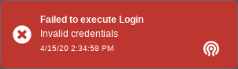

.. _mgr-dashboard:

Ceph Dashboard
==============

Overview
--------

The Ceph Dashboard is a built-in web-based Ceph management and monitoring
application to administer various aspects and objects of the cluster. It is
implemented as a :ref:`ceph-manager-daemon` module.

The original Ceph Dashboard that was shipped with Ceph Luminous started
out as a simple read-only view into various run-time information and performance
data of a Ceph cluster. It used a very simple architecture to achieve the
original goal. However, there was a growing demand for adding more web-based
management capabilities, to make it easier to administer Ceph for users that
prefer a WebUI over using the command line.

The new :term:`Ceph Dashboard` module is a replacement of the previous one and
adds a built-in web based monitoring and administration application to the Ceph
Manager. The architecture and functionality of this new module is derived from
and inspired by the `openATTIC Ceph management and monitoring tool
<https://openattic.org/>`_. The development is actively driven by the team
behind openATTIC at `SUSE <https://www.suse.com/>`_, with a lot of support from
companies like `Red Hat <https://redhat.com/>`_ and other members of the Ceph
community.

The dashboard module's backend code uses the CherryPy framework and a custom
REST API implementation. The WebUI implementation is based on
Angular/TypeScript, merging both functionality from the original dashboard as
well as adding new functionality originally developed for the standalone version
of openATTIC. The Ceph Dashboard module is implemented as a web
application that visualizes information and statistics about the Ceph cluster
using a web server hosted by ``ceph-mgr``.

Feature Overview
^^^^^^^^^^^^^^^^

The dashboard provides the following features:

* **Multi-User and Role Management**: The dashboard supports multiple user
  accounts with different permissions (roles). The user accounts and roles
  can be modified on both the command line and via the WebUI. The dashboard
  supports various methods to enhance password security, e.g. by enforcing
  configurable password complexity rules, forcing users to change their password
  after the first login or after a configurable time period. See
  :ref:`dashboard-user-role-management` for details.
* **Single Sign-On (SSO)**: the dashboard supports authentication
  via an external identity provider using the SAML 2.0 protocol. See
  :ref:`dashboard-sso-support` for details.
* **SSL/TLS support**: All HTTP communication between the web browser and the
  dashboard is secured via SSL. A self-signed certificate can be created with
  a built-in command, but it's also possible to import custom certificates
  signed and issued by a CA. See :ref:`dashboard-ssl-tls-support` for details.
* **Auditing**: the dashboard backend can be configured to log all PUT, POST
  and DELETE API requests in the Ceph audit log. See :ref:`dashboard-auditing`
  for instructions on how to enable this feature.
* **Internationalization (I18N)**: the dashboard can be used in different
  languages that can be selected at run-time.

Currently, Ceph Dashboard is capable of monitoring and managing the following
aspects of your Ceph cluster:

* **Overall cluster health**: Display overall cluster status, performance
  and capacity metrics.
* **Embedded Grafana Dashboards**: Ceph Dashboard is capable of embedding
  `Grafana`_ dashboards in many locations, to display additional information
  and performance metrics gathered by the :ref:`mgr-prometheus`. See
  :ref:`dashboard-grafana` for details on how to configure this functionality.
* **Cluster logs**: Display the latest updates to the cluster's event and
  audit log files. Log entries can be filtered by priority, date or keyword.
* **Hosts**: Display a list of all hosts associated to the cluster, which
  disks are attached, which services are running and which version of Ceph is
  installed.
* **Performance counters**: Display detailed service-specific statistics for
  each running service.
* **Monitors**: List all MONs, their quorum status, open sessions.
* **Monitoring**: Enable creation, re-creation, editing and expiration of
  Prometheus' silences, list the alerting configuration of Prometheus and all
  configured and firing alerts. Show notifications for firing alerts.
* **Configuration Editor**: Display all available configuration options,
  their description, type and default values and edit the current values.
* **Pools**: List all Ceph pools and their details (e.g. applications,
  pg-autoscaling, placement groups, replication size, EC profile, CRUSH
  rulesets, quotas etc.)
* **OSDs**: List all OSDs, their status and usage statistics as well as
  detailed information like attributes (OSD map), metadata, performance
  counters and usage histograms for read/write operations. Mark OSDs
  up/down/out, purge and reweight OSDs, perform scrub operations, modify
  various scrub-related configuration options, select different profiles to
  adjust the level of backfilling activity. List all disks associated with an
  OSD. Set and change the device class of an OSD, display and sort OSDs by
  device class. Deploy new OSDs on new disks/hosts.
* **Device management**: List all hosts known by the orchestrator. List all
  disks and their properties attached to a node. Display disk health information
  (health prediction and SMART data). Blink enclosure LEDs.
* **iSCSI**: List all hosts that run the TCMU runner service, display all
  images and their performance characteristics (read/write ops, traffic).
  Create, modify and delete iSCSI targets (via ``ceph-iscsi``). Display the
  iSCSI gateway status on the landing page and info about active initiators.
  See :ref:`dashboard-iscsi-management` for instructions on how to configure
  this feature.
* **RBD**: List all RBD images and their properties (size, objects, features).
  Create, copy, modify and delete RBD images (incl. snapshots) and manage RBD
  namespaces. Define various I/O or bandwidth limitation settings on a global,
  per-pool or per-image level. Create, delete and rollback snapshots of selected
  images, protect/unprotect these snapshots against modification. Copy or clone
  snapshots, flatten cloned images.
* **RBD mirroring**: Enable and configure RBD mirroring to a remote Ceph server.
  Lists all active sync daemons and their status, pools and RBD images including
  their synchronization state.
* **CephFS**: List all active file system clients and associated pools,
  including their usage statistics. Evict active CephFS clients. Manage CephFS
  quotas and snapshots. Browse a CephFS directory structure.
* **Object Gateway**: List all active object gateways and their performance
  counters. Display and manage (add/edit/delete) object gateway users and their
  details (e.g. quotas) as well as the users' buckets and their details (e.g.
  placement targets, owner, quotas, versioning, multi-factor authentication).
  See :ref:`dashboard-enabling-object-gateway` for configuration instructions.
* **NFS**: Manage NFS exports of CephFS file systems and RGW S3 buckets via NFS
  Ganesha. See :ref:`dashboard-nfs-ganesha-management` for details on how to
  enable this functionality.
* **Ceph Manager Modules**: Enable and disable all Ceph Manager modules, change
  the module-specific configuration settings.

Supported Browsers
^^^^^^^^^^^^^^^^^^

Ceph Dashboard is primarily tested and developed using the following web
browsers:

+-----------------------------------------------+----------+
|                    Browser                    | Versions |
+===============================================+==========+
| `Chrome <https://www.google.com/chrome/>`_    | 68+      |
+-----------------------------------------------+----------+
| `Firefox <https://www.mozilla.org/firefox/>`_ | 61+      |
+-----------------------------------------------+----------+

While Ceph Dashboard might work in older browsers, we cannot guarantee it and
recommend you to update your browser to the latest version.

Enabling
--------

If you have installed ``ceph-mgr-dashboard`` from distribution packages, the
package management system should have taken care of installing all the required
dependencies.

If you're installing Ceph from source and want to start the dashboard from your
development environment, please see the files ``README.rst`` and ``HACKING.rst``
in directory ``src/pybind/mgr/dashboard`` of the source code.

Within a running Ceph cluster, the Ceph Dashboard is enabled with::

  $ ceph mgr module enable dashboard

Configuration
-------------

.. _dashboard-ssl-tls-support:

SSL/TLS Support
^^^^^^^^^^^^^^^

All HTTP connections to the dashboard are secured with SSL/TLS by default.

To get the dashboard up and running quickly, you can generate and install a
self-signed certificate using the following built-in command::

  $ ceph dashboard create-self-signed-cert

Note that most web browsers will complain about such self-signed certificates
and require explicit confirmation before establishing a secure connection to the
dashboard.

To properly secure a deployment and to remove the certificate warning, a
certificate that is issued by a certificate authority (CA) should be used.

For example, a key pair can be generated with a command similar to::

  $ openssl req -new -nodes -x509 \
    -subj "/O=IT/CN=ceph-mgr-dashboard" -days 3650 \
    -keyout dashboard.key -out dashboard.crt -extensions v3_ca

The ``dashboard.crt`` file should then be signed by a CA. Once that is done, you
can enable it for all Ceph manager instances by running the following commands::

  $ ceph dashboard set-ssl-certificate -i dashboard.crt
  $ ceph dashboard set-ssl-certificate-key -i dashboard.key

If different certificates are desired for each manager instance for some reason,
the name of the instance can be included as follows (where ``$name`` is the name
of the ``ceph-mgr`` instance, usually the hostname)::

  $ ceph dashboard set-ssl-certificate $name -i dashboard.crt
  $ ceph dashboard set-ssl-certificate-key $name -i dashboard.key

SSL can also be disabled by setting this configuration value::

  $ ceph config set mgr mgr/dashboard/ssl false

This might be useful if the dashboard will be running behind a proxy which does
not support SSL for its upstream servers or other situations where SSL is not
wanted or required. See :ref:`dashboard-proxy-configuration` for more details.

.. warning::

  Use caution when disabling SSL as usernames and passwords will be sent to the
  dashboard unencrypted.

.. note::

  You need to restart the Ceph manager processes manually after changing the SSL
  certificate and key. This can be accomplished by either running ``ceph mgr
  fail mgr`` or by disabling and re-enabling the dashboard module (which also
  triggers the manager to respawn itself)::

    $ ceph mgr module disable dashboard
    $ ceph mgr module enable dashboard

Host Name and Port
^^^^^^^^^^^^^^^^^^

Like most web applications, dashboard binds to a TCP/IP address and TCP port.

By default, the ``ceph-mgr`` daemon hosting the dashboard (i.e., the currently
active manager) will bind to TCP port 8443 or 8080 when SSL is disabled.

If no specific address has been configured, the web app will bind to ``::``,
which corresponds to all available IPv4 and IPv6 addresses.

These defaults can be changed via the configuration key facility on a
cluster-wide level (so they apply to all manager instances) as follows::

  $ ceph config set mgr mgr/dashboard/server_addr $IP
  $ ceph config set mgr mgr/dashboard/server_port $PORT
  $ ceph config set mgr mgr/dashboard/ssl_server_port $PORT

Since each ``ceph-mgr`` hosts its own instance of dashboard, it may also be
necessary to configure them separately. The IP address and port for a specific
manager instance can be changed with the following commands::

  $ ceph config set mgr mgr/dashboard/$name/server_addr $IP
  $ ceph config set mgr mgr/dashboard/$name/server_port $PORT
  $ ceph config set mgr mgr/dashboard/$name/ssl_server_port $PORT

Replace ``$name`` with the ID of the ceph-mgr instance hosting the dashboard web
app.

.. note::

  The command ``ceph mgr services`` will show you all endpoints that are
  currently configured. Look for the ``dashboard`` key to obtain the URL for
  accessing the dashboard.

Username and Password
^^^^^^^^^^^^^^^^^^^^^

In order to be able to log in, you need to create a user account and associate
it with at least one role. We provide a set of predefined *system roles* that
you can use. For more details please refer to the `User and Role Management`_
section.

To create a user with the administrator role you can use the following
commands::

  $ ceph dashboard ac-user-create <username> <password> administrator

Accessing the Dashboard
^^^^^^^^^^^^^^^^^^^^^^^

You can now access the dashboard using your (JavaScript-enabled) web browser, by
pointing it to any of the host names or IP addresses and the selected TCP port
where a manager instance is running: e.g., ``http(s)://<$IP>:<$PORT>/``.

You should then be greeted by the dashboard login page, requesting your
previously defined username and password.

.. _dashboard-enabling-object-gateway:

Enabling the Object Gateway Management Frontend
^^^^^^^^^^^^^^^^^^^^^^^^^^^^^^^^^^^^^^^^^^^^^^^

To use the Object Gateway management functionality of the dashboard, you will
need to provide the login credentials of a user with the ``system`` flag
enabled.

If you do not have a user which shall be used for providing those credentials,
you will also need to create one::

  $ radosgw-admin user create --uid=<user_id> --display-name=<display_name> \
      --system

Take note of the keys ``access_key`` and ``secret_key`` in the output of this
command.

The credentials of an existing user can also be obtained by using
`radosgw-admin`::

  $ radosgw-admin user info --uid=<user_id>

Finally, provide the credentials to the dashboard::

  $ ceph dashboard set-rgw-api-access-key <access_key>
  $ ceph dashboard set-rgw-api-secret-key <secret_key>

In a typical default configuration with a single RGW endpoint, this is all you
have to do to get the Object Gateway management functionality working. The
dashboard will try to automatically determine the host and port of the Object
Gateway by obtaining this information from the Ceph Manager's service map.

If multiple zones are used, it will automatically determine the host within the
master zone group and master zone. This should be sufficient for most setups,
but in some circumstances you might want to set the host and port manually::

  $ ceph dashboard set-rgw-api-host <host>
  $ ceph dashboard set-rgw-api-port <port>

In addition to the settings mentioned so far, the following settings do also
exist and you may find yourself in the situation that you have to use them::

  $ ceph dashboard set-rgw-api-scheme <scheme>  # http or https
  $ ceph dashboard set-rgw-api-admin-resource <admin_resource>
  $ ceph dashboard set-rgw-api-user-id <user_id>

If you are using a self-signed certificate in your Object Gateway setup, then
you should disable certificate verification in the dashboard to avoid refused
connections, e.g. caused by certificates signed by unknown CA or not matching
the host name::

  $ ceph dashboard set-rgw-api-ssl-verify False

If the Object Gateway takes too long to process requests and the dashboard runs
into timeouts, then you can set the timeout value to your needs::

  $ ceph dashboard set-rest-requests-timeout <seconds>

The default value is 45 seconds.

.. _dashboard-iscsi-management:

Enabling iSCSI Management
^^^^^^^^^^^^^^^^^^^^^^^^^

The Ceph Dashboard can manage iSCSI targets using the REST API provided by the
`rbd-target-api` service of the :ref:`ceph-iscsi`. Please make sure that it's
installed and enabled on the iSCSI gateways.

.. note::

  The iSCSI management functionality of Ceph Dashboard depends on the latest
  version 3 of the `ceph-iscsi <https://github.com/ceph/ceph-iscsi>`_ project.
  Make sure that your operating system provides the correct version, otherwise
  the dashboard won't enable the management features.

If ceph-iscsi REST API is configured in HTTPS mode and its using a self-signed
certificate, then you need to configure the dashboard to avoid SSL certificate
verification when accessing ceph-iscsi API.

To disable API SSL verification run the following command::

  $ ceph dashboard set-iscsi-api-ssl-verification false

The available iSCSI gateways must be defined using the following commands::

  $ ceph dashboard iscsi-gateway-list
  $ ceph dashboard iscsi-gateway-add <scheme>://<username>:<password>@<host>[:port]
  $ ceph dashboard iscsi-gateway-rm <gateway_name>

.. _dashboard-grafana:

Enabling the Embedding of Grafana Dashboards
^^^^^^^^^^^^^^^^^^^^^^^^^^^^^^^^^^^^^^^^^^^^

`Grafana`_ requires data from `Prometheus <https://prometheus.io/>`_. Although
Grafana can use other data sources, the Grafana dashboards we provide contain
queries that are specific to Prometheus. Our Grafana dashboards therefore
require Prometheus as the data source. The Ceph :ref:`mgr-prometheus` also only
exports its data in the Prometheus' common format. The Grafana dashboards rely
on metric names from the Prometheus module and `Node exporter
<https://prometheus.io/docs/guides/node-exporter/>`_. The Node exporter is a
separate application that provides machine metrics.

.. note::

  Prometheus' security model presumes that untrusted users have access to the
  Prometheus HTTP endpoint and logs. Untrusted users have access to all the
  (meta)data Prometheus collects that is contained in the database, plus a
  variety of operational and debugging information.

  However, Prometheus' HTTP API is limited to read-only operations.
  Configurations can *not* be changed using the API and secrets are not
  exposed. Moreover, Prometheus has some built-in measures to mitigate the
  impact of denial of service attacks.

  Please see `Prometheus' Security model
  <https://prometheus.io/docs/operating/security/>` for more detailed
  information.

Installation and Configuration using cephadm
""""""""""""""""""""""""""""""""""""""""""""

Grafana and Prometheus can be installed using :ref:`cephadm`. They will
automatically be configured by `cephadm`. Please see
:ref:`mgr-cephadm-monitoring` documentation for more details on how to use
cephadm for installing and configuring Prometheus and Grafana.

Manual Installation and Configuration
"""""""""""""""""""""""""""""""""""""

The following process describes how to configure Grafana and Prometheus
manually. After you have installed Prometheus, Grafana and the Node exporter
on your preferred hosts, proceed with the following steps.

#.  Enable the Ceph Exporter which comes as Ceph Manager module by running::

      $ ceph mgr module enable prometheus

    More details can be found in the documentation of the :ref:`mgr-prometheus`.

#.  Add the corresponding scrape configuration to Prometheus. This may look
    like::

      global:
        scrape_interval: 5s

      scrape_configs:
        - job_name: 'prometheus'
          static_configs:
            - targets: ['localhost:9090']
        - job_name: 'ceph'
          static_configs:
            - targets: ['localhost:9283']
        - job_name: 'node-exporter'
          static_configs:
            - targets: ['localhost:9100']

    .. note::

      Please note that in the aforementioned example, Prometheus is configured
      to scrape data from itself (port 9090), the Ceph manager module
      `prometheus` (port 9283), which exports Ceph internal data and the Node
      exporter (port 9100), which provides metrics of a machine.

      Depending on your configuration, you may need to change the hostname in
      this configuration or add additional configuration entries for the Node
      exporter. It is unlikely that you will need to change the provided ports.

      Moreover, you don't *need* to have more than one target for Ceph specific
      data, provided by the `prometheus` mgr module. But it is recommended to
      configure Prometheus to scrape Ceph specific data from all existing Ceph
      managers. This enables a built-in high availability mechanism, where
      services run on a manager will be restarted automatically on a second
      manager instance if one Ceph Manager goes down.

#.  Add Prometheus as data source to Grafana `using the Grafana Web UI
    <https://grafana.com/docs/grafana/latest/features/datasources/add-a-data-source/>`_.

#.  Install the `vonage-status-panel and grafana-piechart-panel` plugins using::

      grafana-cli plugins install vonage-status-panel
      grafana-cli plugins install grafana-piechart-panel

#.  Add the Dashboards to Grafana:

    Dashboards can be added to Grafana by importing dashboard JSON files.
    Use the following command to download the JSON files::

      wget https://raw.githubusercontent.com/ceph/ceph/master/monitoring/grafana/dashboards/<Dashboard-name>.json

    You can find all the dashboard JSON files `here <https://github.com/ceph/ceph/tree/
    master/monitoring/grafana/dashboards>`_ .

    For Example, for ceph-cluster overview you can use::

      wget https://raw.githubusercontent.com/ceph/ceph/master/monitoring/grafana/dashboards/ceph-cluster.json

#.  Configure Grafana in ``/etc/grafana/grafana.ini`` to enable anonymous mode::

      [auth.anonymous]
      enabled = true
      org_name = Main Org.
      org_role = Viewer

    In newer versions of Grafana (starting with 6.2.0-beta1) a new setting named
    ``allow_embedding`` has been introduced. This setting needs to be explicitly
    set to ``true`` for the Grafana integration in Ceph Dashboard to work, as its
    default is ``false``.

    ::

      [security]
      allow_embedding = true

Configuring Dashboard
"""""""""""""""""""""

After you have set up Grafana and Prometheus, you will need to configure the
connection information that the Ceph Dashboard will use to access Grafana.

You need to tell the dashboard on which url Grafana instance is running/deployed::

  $ ceph dashboard set-grafana-api-url <grafana-server-url>  # default: ''

The format of url is : `<protocol>:<IP-address>:<port>`

.. note::

  Ceph Dashboard embeds the Grafana dashboards via ``iframe`` HTML elements.
  If Grafana is configured without SSL/TLS support, most browsers will block the
  embedding of insecure content into a secured web page, if the SSL support in
  the dashboard has been enabled (which is the default configuration). If you
  can't see the embedded Grafana dashboards after enabling them as outlined
  above, check your browser's documentation on how to unblock mixed content.
  Alternatively, consider enabling SSL/TLS support in Grafana.

If you are using a self-signed certificate in your Grafana setup, then you should
disable certificate verification in the dashboard to avoid refused connections,
e.g. caused by certificates signed by unknown CA or not matching the host name::

  $ ceph dashboard set-grafana-api-ssl-verify False

You can directly access Grafana Instance as well to monitor your cluster.

.. _dashboard-sso-support:

Enabling Single Sign-On (SSO)
^^^^^^^^^^^^^^^^^^^^^^^^^^^^^

The Ceph Dashboard supports external authentication of users via the
`SAML 2.0 <https://en.wikipedia.org/wiki/SAML_2.0>`_ protocol. You need to create
the user accounts and associate them with the desired roles first, as authorization
is still performed by the Dashboard. However, the authentication process can be
performed by an existing Identity Provider (IdP).

.. note::

  Ceph Dashboard SSO support relies on onelogin's
  `python-saml <https://pypi.org/project/python-saml/>`_ library.
  Please ensure that this library is installed on your system, either by using
  your distribution's package management or via Python's `pip` installer.

To configure SSO on Ceph Dashboard, you should use the following command::

  $ ceph dashboard sso setup saml2 <ceph_dashboard_base_url> <idp_metadata> {<idp_username_attribute>} {<idp_entity_id>} {<sp_x_509_cert>} {<sp_private_key>}

Parameters:

* **<ceph_dashboard_base_url>**: Base URL where Ceph Dashboard is accessible (e.g., `https://cephdashboard.local`)
* **<idp_metadata>**: URL to remote (`http://`, `https://`) or local (`file://`) path or content of the IdP metadata XML (e.g., `https://myidp/metadata`, `file:///home/myuser/metadata.xml`).
* **<idp_username_attribute>** *(optional)*: Attribute that should be used to get the username from the authentication response. Defaults to `uid`.
* **<idp_entity_id>** *(optional)*: Use this when more than one entity id exists on the IdP metadata.
* **<sp_x_509_cert> / <sp_private_key>** *(optional)*: File path of the certificate that should be used by Ceph Dashboard (Service Provider) for signing and encryption.

.. note::

  The issuer value of SAML requests will follow this pattern:  **<ceph_dashboard_base_url>**/auth/saml2/metadata

To display the current SAML 2.0 configuration, use the following command::

  $ ceph dashboard sso show saml2

.. note::

  For more information about `onelogin_settings`, please check the `onelogin documentation <https://github.com/onelogin/python-saml>`_.

To disable SSO::

  $ ceph dashboard sso disable

To check if SSO is enabled::

  $ ceph dashboard sso status

To enable SSO::

  $ ceph dashboard sso enable saml2

.. _dashboard-alerting:

Enabling Prometheus Alerting
^^^^^^^^^^^^^^^^^^^^^^^^^^^^

Using Prometheus for monitoring, you have to define `alerting rules
<https://prometheus.io/docs/prometheus/latest/configuration/alerting_rules>`_.
To manage them you need to use the `Alertmanager
<https://prometheus.io/docs/alerting/alertmanager>`_.
If you are not using the Alertmanager yet, please `install it
<https://github.com/prometheus/alertmanager#install>`_ as it's mandatory in
order to receive and manage alerts from Prometheus.

The Alertmanager capabilities can be consumed by the dashboard in three different
ways:

#. Use the notification receiver of the dashboard.

#. Use the Prometheus Alertmanager API.

#. Use both sources simultaneously.

All three methods are going to notify you about alerts. You won't be notified
twice if you use both sources, but you need to consume at least the Alertmanager API
in order to manage silences.

1. Use the notification receiver of the dashboard

  This allows you to get notifications as `configured
  <https://prometheus.io/docs/alerting/configuration/>`_ from the Alertmanager.
  You will get notified inside the dashboard once a notification is send out,
  but you are not able to manage alerts.

  Add the dashboard receiver and the new route to your Alertmanager
  configuration. This should look like::

    route:
      receiver: 'ceph-dashboard'
    ...
    receivers:
      - name: 'ceph-dashboard'
        webhook_configs:
        - url: '<url-to-dashboard>/api/prometheus_receiver'

  Please make sure that the Alertmanager considers your SSL certificate in terms
  of the dashboard as valid. For more information about the correct
  configuration checkout the `<http_config> documentation
  <https://prometheus.io/docs/alerting/configuration/#%3Chttp_config%3E>`_.

2. Use the API of Prometheus and the Alertmanager

  This allows you to manage alerts and silences. This will enable the "Active
  Alerts", "All Alerts" as well as the "Silences" tabs in the "Monitoring"
  section of the "Cluster" menu entry.

  Alerts can be sorted by name, job, severity, state and start time.
  Unfortunately it's not possible to know when an alert was sent out through a
  notification by the Alertmanager based on your configuration, that's why the
  dashboard will notify the user on any visible change to an alert and will
  notify the changed alert.

  Silences can be sorted by id, creator, status, start, updated and end time.
  Silences can be created in various ways, it's also possible to expire them.

  #. Create from scratch

  #. Based on a selected alert

  #. Recreate from expired silence

  #. Update a silence (which will recreate and expire it (default Alertmanager behaviour))

  To use it, specify the host and port of the Alertmanager server::

    $ ceph dashboard set-alertmanager-api-host <alertmanager-host:port>  # default: ''

  For example::

    $ ceph dashboard set-alertmanager-api-host 'http://localhost:9093'

  To be able to see all configured alerts, you will need to configure the URL to
  the Prometheus API. Using this API, the UI will also help you in verifying
  that a new silence will match a corresponding alert.

  ::

    $ ceph dashboard set-prometheus-api-host <prometheus-host:port>  # default: ''

  For example::

    $ ceph dashboard set-prometheus-api-host 'http://localhost:9090'

  After setting up the hosts, you have to refresh the dashboard in your browser window.

3. Use both methods

  The different behaviors of both methods are configured in a way that they
  should not disturb each other through annoying duplicated notifications
  popping up.

.. _dashboard-user-role-management:

User and Role Management
------------------------

Password Policy
^^^^^^^^^^^^^^^

By default the password policy feature is enabled including the following
checks:

- Is the password longer than N characters?
- Are the old and new password the same?

The password policy feature can be switched on or off completely::

    $ ceph dashboard set-pwd-policy-enabled <true|false>

The following individual checks can be switched on or off::

  $ ceph dashboard set-pwd-policy-check-length-enabled <true|false>
  $ ceph dashboard set-pwd-policy-check-oldpwd-enabled <true|false>
  $ ceph dashboard set-pwd-policy-check-username-enabled <true|false>
  $ ceph dashboard set-pwd-policy-check-exclusion-list-enabled <true|false>
  $ ceph dashboard set-pwd-policy-check-complexity-enabled <true|false>
  $ ceph dashboard set-pwd-policy-check-sequential-chars-enabled <true|false>
  $ ceph dashboard set-pwd-policy-check-repetitive-chars-enabled <true|false>

Additionally the following options are available to configure the password
policy behaviour.

- The minimum password length (defaults to 8)::

  $ ceph dashboard set-pwd-policy-min-length <N>

- The minimum password complexity (defaults to 10)::

  $ ceph dashboard set-pwd-policy-min-complexity <N>

  The password complexity is calculated by classifying each character in
  the password. The complexity count starts by 0. A character is rated by
  the following rules in the given order.

  - Increase by 1 if the character is a digit.
  - Increase by 1 if the character is a lower case ASCII character.
  - Increase by 2 if the character is an upper case ASCII character.
  - Increase by 3 if the character is a special character like ``!"#$%&'()*+,-./:;<=>?@[\]^_`{|}~``.
  - Increase by 5 if the character has not been classified by one of the previous rules.

- A list of comma separated words that are not allowed to be used in a
  password::

  $ ceph dashboard set-pwd-policy-exclusion-list <word>[,...]

User Accounts
^^^^^^^^^^^^^

Ceph Dashboard supports managing multiple user accounts. Each user account
consists of a username, a password (stored in encrypted form using ``bcrypt``),
an optional name, and an optional email address.

If a new user is created via Web UI, it is possible to set an option that this
user must assign a new password when they log in for the first time.

User accounts are stored in MON's configuration database, and are globally
shared across all ceph-mgr instances.

We provide a set of CLI commands to manage user accounts:

- *Show User(s)*::

  $ ceph dashboard ac-user-show [<username>]

- *Create User*::

  $ ceph dashboard ac-user-create [--enabled] [--force-password] [--pwd_update_required] <username> [<password>] [<rolename>] [<name>] [<email>] [<pwd_expiration_date>]

  To bypass the password policy checks use the `force-password` option.
  Use the option `pwd_update_required` so that a newly created user has
  to change their password after the first login.

- *Delete User*::

  $ ceph dashboard ac-user-delete <username>

- *Change Password*::

  $ ceph dashboard ac-user-set-password [--force-password] <username> <password>

- *Change Password Hash*::

  $ ceph dashboard ac-user-set-password-hash <username> <hash>

  The hash must be a bcrypt hash and salt, e.g. ``$2b$12$Pt3Vq/rDt2y9glTPSV.VFegiLkQeIpddtkhoFetNApYmIJOY8gau2``.
  This can be used to import users from an external database.

- *Modify User (name, and email)*::

  $ ceph dashboard ac-user-set-info <username> <name> <email>

- *Disable User*::

  $ ceph dashboard ac-user-disable <username>

- *Enable User*::

  $ ceph dashboard ac-user-enable <username>

User Roles and Permissions
^^^^^^^^^^^^^^^^^^^^^^^^^^

User accounts are also associated with a set of roles that define which
dashboard functionality can be accessed by the user.

The Dashboard functionality/modules are grouped within a *security scope*.
Security scopes are predefined and static. The current available security
scopes are:

- **hosts**: includes all features related to the ``Hosts`` menu
  entry.
- **config-opt**: includes all features related to management of Ceph
  configuration options.
- **pool**: includes all features related to pool management.
- **osd**: includes all features related to OSD management.
- **monitor**: includes all features related to Monitor management.
- **rbd-image**: includes all features related to RBD image
  management.
- **rbd-mirroring**: includes all features related to RBD-Mirroring
  management.
- **iscsi**: includes all features related to iSCSI management.
- **rgw**: includes all features related to Rados Gateway management.
- **cephfs**: includes all features related to CephFS management.
- **manager**: include all features related to Ceph Manager
  management.
- **log**: include all features related to Ceph logs management.
- **grafana**: include all features related to Grafana proxy.
- **prometheus**: include all features related to Prometheus alert management.
- **dashboard-settings**: allows to change dashboard settings.

A *role* specifies a set of mappings between a *security scope* and a set of
*permissions*. There are four types of permissions:

- **read**
- **create**
- **update**
- **delete**

See below for an example of a role specification based on a Python dictionary::

  # example of a role
  {
    'role': 'my_new_role',
    'description': 'My new role',
    'scopes_permissions': {
      'pool': ['read', 'create'],
      'rbd-image': ['read', 'create', 'update', 'delete']
    }
  }

The above role dictates that a user has *read* and *create* permissions for
features related to pool management, and has full permissions for
features related to RBD image management.

The Dashboard already provides a set of predefined roles that we call
*system roles*, and can be used right away in a fresh Ceph Dashboard
installation.

The list of system roles are:

- **administrator**: provides full permissions for all security scopes.
- **read-only**: provides *read* permission for all security scopes except
  the dashboard settings.
- **block-manager**: provides full permissions for *rbd-image*,
  *rbd-mirroring*, and *iscsi* scopes.
- **rgw-manager**: provides full permissions for the *rgw* scope
- **cluster-manager**: provides full permissions for the *hosts*, *osd*,
  *monitor*, *manager*, and *config-opt* scopes.
- **pool-manager**: provides full permissions for the *pool* scope.
- **cephfs-manager**: provides full permissions for the *cephfs* scope.

The list of currently available roles can be retrieved by the following
command::

  $ ceph dashboard ac-role-show [<rolename>]

It is also possible to create new roles using CLI commands. The available
commands to manage roles are the following:

- *Create Role*::

  $ ceph dashboard ac-role-create <rolename> [<description>]

- *Delete Role*::

  $ ceph dashboard ac-role-delete <rolename>

- *Add Scope Permissions to Role*::

  $ ceph dashboard ac-role-add-scope-perms <rolename> <scopename> <permission> [<permission>...]

- *Delete Scope Permission from Role*::

  $ ceph dashboard ac-role-del-scope-perms <rolename> <scopename>

To associate roles to users, the following CLI commands are available:

- *Set User Roles*::

  $ ceph dashboard ac-user-set-roles <username> <rolename> [<rolename>...]

- *Add Roles To User*::

  $ ceph dashboard ac-user-add-roles <username> <rolename> [<rolename>...]

- *Delete Roles from User*::

  $ ceph dashboard ac-user-del-roles <username> <rolename> [<rolename>...]

Example of User and Custom Role Creation
^^^^^^^^^^^^^^^^^^^^^^^^^^^^^^^^^^^^^^^^

In this section we show a full example of the commands that need to be used
in order to create a user account, that should be able to manage RBD images,
view and create Ceph pools, and have read-only access to any other scopes.

1. *Create the user*::

   $ ceph dashboard ac-user-create bob mypassword

2. *Create role and specify scope permissions*::

   $ ceph dashboard ac-role-create rbd/pool-manager
   $ ceph dashboard ac-role-add-scope-perms rbd/pool-manager rbd-image read create update delete
   $ ceph dashboard ac-role-add-scope-perms rbd/pool-manager pool read create

3. *Associate roles to user*::

   $ ceph dashboard ac-user-set-roles bob rbd/pool-manager read-only

.. _dashboard-proxy-configuration:

Proxy Configuration
-------------------

In a Ceph cluster with multiple ceph-mgr instances, only the dashboard running
on the currently active ceph-mgr daemon will serve incoming requests. Accessing
the dashboard's TCP port on any of the other ceph-mgr instances that are
currently on standby will perform a HTTP redirect (303) to the currently active
manager's dashboard URL. This way, you can point your browser to any of the
ceph-mgr instances in order to access the dashboard.

If you want to establish a fixed URL to reach the dashboard or if you don't want
to allow direct connections to the manager nodes, you could set up a proxy that
automatically forwards incoming requests to the currently active ceph-mgr
instance.

Configuring a URL Prefix
^^^^^^^^^^^^^^^^^^^^^^^^

If you are accessing the dashboard via a reverse proxy configuration,
you may wish to service it under a URL prefix. To get the dashboard
to use hyperlinks that include your prefix, you can set the
``url_prefix`` setting:

::

  ceph config set mgr mgr/dashboard/url_prefix $PREFIX

so you can access the dashboard at ``http://$IP:$PORT/$PREFIX/``.

Disable the redirection
^^^^^^^^^^^^^^^^^^^^^^^

If the dashboard is behind a load-balancing proxy like `HAProxy <https://www.haproxy.org/>`_
you might want to disable the redirection behaviour to prevent situations that
internal (unresolvable) URL's are published to the frontend client. Use the
following command to get the dashboard to respond with a HTTP error (500 by default)
instead of redirecting to the active dashboard::

  $ ceph config set mgr mgr/dashboard/standby_behaviour "error"

To reset the setting to the default redirection behaviour, use the following command::

  $ ceph config set mgr mgr/dashboard/standby_behaviour "redirect"

Configure the error status code
^^^^^^^^^^^^^^^^^^^^^^^^^^^^^^^

When the redirection behaviour is disabled, then you want to customize the HTTP status
code of standby dashboards. To do so you need to run the command::

  $ ceph config set mgr mgr/dashboard/standby_error_status_code 503

HAProxy example configuration
^^^^^^^^^^^^^^^^^^^^^^^^^^^^^

Below you will find an example configuration for SSL/TLS pass through using
`HAProxy <https://www.haproxy.org/>`_.

Please note that the configuration works under the following conditions.
If the dashboard fails over, the front-end client might receive a HTTP redirect
(303) response and will be redirected to an unresolvable host. This happens when
the failover occurs during two HAProxy health checks. In this situation the
previously active dashboard node will now respond with a 303 which points to
the new active node. To prevent that situation you should consider to disable
the redirection behaviour on standby nodes.

::

  defaults
    log global
    option log-health-checks
    timeout connect 5s
    timeout client 50s
    timeout server 450s

  frontend dashboard_front
    mode http
    bind *:80
    option httplog
    redirect scheme https code 301 if !{ ssl_fc }

  frontend dashboard_front_ssl
    mode tcp
    bind *:443
    option tcplog
    default_backend dashboard_back_ssl

  backend dashboard_back_ssl
    mode tcp
    option httpchk GET /
    http-check expect status 200
    server x <HOST>:<PORT> check-ssl check verify none
    server y <HOST>:<PORT> check-ssl check verify none
    server z <HOST>:<PORT> check-ssl check verify none

.. _dashboard-auditing:

Auditing API Requests
---------------------

The REST API is capable of logging PUT, POST and DELETE requests to the Ceph
audit log. This feature is disabled by default, but can be enabled with the
following command::

  $ ceph dashboard set-audit-api-enabled <true|false>

If enabled, the following parameters are logged per each request:

* from - The origin of the request, e.g. https://[::1]:44410
* path - The REST API path, e.g. /api/auth
* method - e.g. PUT, POST or DELETE
* user - The name of the user, otherwise 'None'

The logging of the request payload (the arguments and their values) is enabled
by default. Execute the following command to disable this behaviour::

  $ ceph dashboard set-audit-api-log-payload <true|false>

A log entry may look like this::

  2018-10-22 15:27:01.302514 mgr.x [INF] [DASHBOARD] from='https://[::ffff:127.0.0.1]:37022' path='/api/rgw/user/klaus' method='PUT' user='admin' params='{"max_buckets": "1000", "display_name": "Klaus Mustermann", "uid": "klaus", "suspended": "0", "email": "klaus.mustermann@ceph.com"}'

.. _dashboard-nfs-ganesha-management:

NFS-Ganesha Management
----------------------

Ceph Dashboard can manage `NFS Ganesha <http://nfs-ganesha.github.io/>`_ exports that use
CephFS or RadosGW as their backstore.

To enable this feature in Ceph Dashboard there are some assumptions that need
to be met regarding the way NFS-Ganesha services are configured.

The dashboard manages NFS-Ganesha config files stored in RADOS objects on the Ceph Cluster.
NFS-Ganesha must store part of their configuration in the Ceph cluster.

These configuration files must follow some conventions.
Each export block must be stored in its own RADOS object named
``export-<id>``, where ``<id>`` must match the ``Export_ID`` attribute of the
export configuration. Then, for each NFS-Ganesha service daemon there should
exist a RADOS object named ``conf-<daemon_id>``, where ``<daemon_id>`` is an
arbitrary string that should uniquely identify the daemon instance (e.g., the
hostname where the daemon is running).
Each ``conf-<daemon_id>`` object contains the RADOS URLs to the exports that
the NFS-Ganesha daemon should serve. These URLs are of the form::

  %url rados://<pool_name>[/<namespace>]/export-<id>

Both the ``conf-<daemon_id>`` and ``export-<id>`` objects must be stored in the
same RADOS pool/namespace.

Configuring NFS-Ganesha in the Dashboard
^^^^^^^^^^^^^^^^^^^^^^^^^^^^^^^^^^^^^^^^

To enable the management of NFS-Ganesha exports in Ceph Dashboard, we only
need to tell the Dashboard, in which RADOS pool and namespace the
configuration objects are stored. Then, Ceph Dashboard can access the objects
by following the naming convention described above.

The Dashboard command to configure the NFS-Ganesha configuration objects
location is::

  $ ceph dashboard set-ganesha-clusters-rados-pool-namespace <pool_name>[/<namespace>]

After running the above command, Ceph Dashboard is able to find the NFS-Ganesha
configuration objects and we can start manage the exports through the Web UI.

.. note::

    A separate pool for the NFS shares should be used. Otherwise it can cause the
    `known issue <https://tracker.ceph.com/issues/46176>`_ with listing of shares
    if the NFS objects are stored together with a lot of other objects in a single
    pool.

Support for Multiple NFS-Ganesha Clusters
^^^^^^^^^^^^^^^^^^^^^^^^^^^^^^^^^^^^^^^^^

Ceph Dashboard also supports the management of NFS-Ganesha exports belonging
to different NFS-Ganesha clusters. An NFS-Ganesha cluster is a group of
NFS-Ganesha service daemons sharing the same exports. Different NFS-Ganesha
clusters are independent and don't share the exports configuration between each
other.

Each NFS-Ganesha cluster should store its configuration objects in a
different RADOS pool/namespace to isolate the configuration from each other.

To specify the locations of the configuration of each NFS-Ganesha cluster we
can use the same command as above but with a different value pattern::

  $ ceph dashboard set-ganesha-clusters-rados-pool-namespace <cluster_id>:<pool_name>[/<namespace>](,<cluster_id>:<pool_name>[/<namespace>])*

The ``<cluster_id>`` is an arbitrary string that should uniquely identify the
NFS-Ganesha cluster.

When configuring the Ceph Dashboard with multiple NFS-Ganesha clusters, the
Web UI will automatically allow to choose to which cluster an export belongs.

Plug-ins
--------

Dashboard Plug-ins extend the functionality of the dashboard in a modular
and loosely coupled fashion.

.. _Grafana: https://grafana.com/

.. include:: dashboard_plugins/feature_toggles.inc.rst
.. include:: dashboard_plugins/debug.inc.rst

Troubleshooting the Dashboard
-----------------------------

Locating the Dashboard
^^^^^^^^^^^^^^^^^^^^^^

If you are unsure of the location of the Ceph Dashboard, run the following command::

    $ ceph mgr services | jq .dashboard
    "https://host:port"

The command returns the URL where the Ceph Dashboard is located: ``https://<host>:<port>/``

.. note::

    Many Ceph command line tools return results in JSON format. You may have to install
    the `jq <https://stedolan.github.io/jq>`_ command-line JSON processor utility on
    your operating system beforehand.

Accessing the Dashboard
^^^^^^^^^^^^^^^^^^^^^^^

If you are unable to access the Ceph Dashboard, run through the following
commands:

#. Verify the Ceph Dashboard module is enabled::

    $ ceph mgr module ls | jq .enabled_modules

   Ensure the Ceph Dashboard module is listed in the return value of the
   command. Example snipped output from the command above::

    [
      "dashboard",
      "iostat",
      "restful"
    ]

#. If it is not listed, activate the module with the following command::

    $ ceph mgr module enable dashboard

#. Check the Ceph Dashboard and/or mgr log file for any errors. The exact
   location of the log files depends on the Ceph configuration.

   * Check if mgr log messages are written to a file by::

        $ ceph config get mgr log_to_file
        true

   * Get the location of the log file (it's ``/var/log/ceph/<cluster-name>-<daemon-name>.log``
     by default)::

        $ ceph config get mgr log_file
        /var/log/ceph/$cluster-$name.log

#. Ensure the SSL/TSL support is configured properly:

   * Check if the SSL/TSL support is enabled::

       $ ceph config get mgr mgr/dashboard/ssl

   * If the command returns ``true``, verify a certificate exists by::

       $ ceph config-key get mgr/dashboard/crt

     and::

       $ ceph config-key get mgr/dashboard/key

   * If it doesn't, run the following command to generate a self-signed
     certificate or follow the instructions outlined in
     :ref:`dashboard-ssl-tls-support`::

       $ ceph dashboard create-self-signed-cert

Trouble Logging into the Dashboard
^^^^^^^^^^^^^^^^^^^^^^^^^^^^^^^^^^

If you are unable to log into the Ceph Dashboard and you receive the following
error, run through the procedural checks below:

#. Check that your user credentials are correct. If you are seeing the
   notification message above when trying to log into the Ceph Dashboard, it
   is likely you are using the wrong credentials. Double check your username
   and password, and ensure the caps lock key is not enabled by accident.

#. If your user credentials are correct, but you are experiencing the same
   error, check that the user account exists::

    $ ceph dashboard ac-user-show <username>

   This command returns your user data. If the user does not exist, it will
   print::

    $ Error ENOENT: User <username> does not exist

#. Check if the user is enabled::

    $ ceph dashboard ac-user-show <username> | jq .enabled
    true

   Check if ``enabled`` is set to ``true`` for your user. If not the user is
   not enabled, run::

    $ ceph dashboard ac-user-enable <username>

Please see :ref:`dashboard-user-role-management` for more information.

A Dashboard Feature is Not Working
^^^^^^^^^^^^^^^^^^^^^^^^^^^^^^^^^^

When an error occurs on the backend, you will usually receive an error
notification on the frontend. Run through the following scenarios to debug.

#. Check the Ceph Dashboard/mgr logfile(s) for any errors. These can be
   identified by searching for keywords, such as *500 Internal Server Error*,
   followed by ``traceback``. The end of a traceback contains more details about
   what exact error occurred.
#. Check your web browser's Javascript Console for any errors.

Ceph Dashboard Logs
^^^^^^^^^^^^^^^^^^^

Dashboard Debug Flag
""""""""""""""""""""

With this flag enabled, traceback of errors are included in backend responses.

To enable this flag via the Ceph Dashboard, navigate from *Cluster* to *Manager
modules*. Select *Dashboard module* and click the edit button. Click the
*debug* checkbox and update.

To enable it via the CLI, run the following command::

    $ ceph dashboard debug enable

Setting Logging Level of Dashboard Module
"""""""""""""""""""""""""""""""""""""""""

Setting the logging level to debug makes the log more verbose and helpful for
debugging.

#. Increase the logging level of manager daemons::

   $ ceph tell mgr config set debug_mgr 20

#. Adjust the logging level of the Ceph Dashboard module via the Dashboard or
   CLI:

   * Navigate from *Cluster* to *Manager modules*. Select *Dashboard module*
     and click the edit button. Modify the ``log_level`` configuration.
   * To adjust it via the CLI, run the following command::

        $ bin/ceph config set mgr mgr/dashboard/log_level debug
