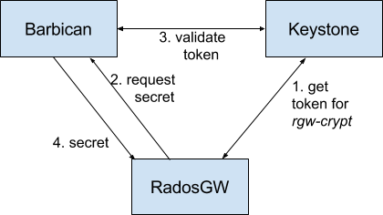

==============================
OpenStack Barbican Integration
==============================

OpenStack `Barbican`_ can be used as a secure key management service for
`Server-Side Encryption`_.

#. `Configure Keystone`_
#. `Create a Keystone user`_
#. `Configure the Ceph Object Gateway`_
#. `Create a key in Barbican`_

Configure Keystone
==================

Barbican depends on Keystone for authorization and access control of its keys.

See `OpenStack Keystone Integration`_.

Create a Keystone user
======================

Create a new user that will be used by the Ceph Object Gateway to retrieve
keys.

For example::

   user = rgwcrypt-user
   pass = rgwcrypt-password
   tenant = rgwcrypt

See OpenStack documentation for `Manage projects, users, and roles`_.

Create a key in Barbican
========================

See Barbican documentation for `How to Create a Secret`_. Requests to
Barbican must include a valid Keystone token in the ``X-Auth-Token`` header.

.. note:: Server-side encryption keys must be 256-bit long and base64 encoded.

Example request::

   POST /v1/secrets HTTP/1.1
   Host: barbican.example.com:9311
   Accept: */*
   Content-Type: application/json
   X-Auth-Token: 7f7d588dd29b44df983bc961a6b73a10
   Content-Length: 299
   
   {
       "name": "my-key",
       "expiration": "2016-12-28T19:14:44.180394",
       "algorithm": "aes",
       "bit_length": 256,
       "mode": "cbc",
       "payload": "6b+WOZ1T3cqZMxgThRcXAQBrS5mXKdDUphvpxptl9/4=",
       "payload_content_type": "application/octet-stream",
       "payload_content_encoding": "base64"
   }

Response::

   {"secret_ref": "http://barbican.example.com:9311/v1/secrets/d1e7ef3b-f841-4b7c-90b2-b7d90ca2d723"}

In the response, ``d1e7ef3b-f841-4b7c-90b2-b7d90ca2d723`` is the key id that
can be used in any `SSE-KMS`_ request.

This newly created key is not accessible by user ``rgwcrypt-user``. This
privilege must be added with an ACL. See `How to Set/Replace ACL`_ for more
details.

Example request (assuming that the Keystone id of ``rgwcrypt-user`` is
``906aa90bd8a946c89cdff80d0869460f``)::

   PUT /v1/secrets/d1e7ef3b-f841-4b7c-90b2-b7d90ca2d723/acl HTTP/1.1
   Host: barbican.example.com:9311
   Accept: */*
   Content-Type: application/json
   X-Auth-Token: 7f7d588dd29b44df983bc961a6b73a10
   Content-Length: 101

   {
       "read":{
       "users":[ "906aa90bd8a946c89cdff80d0869460f" ],
       "project-access": true
       }
   }

Response::

   {"acl_ref": "http://barbican.example.com:9311/v1/secrets/d1e7ef3b-f841-4b7c-90b2-b7d90ca2d723/acl"}

Configure the Ceph Object Gateway
=================================

Edit the Ceph configuration file to enable Barbican as a KMS and add information
about the Barbican server and Keystone user::

   rgw crypt s3 kms backend = barbican
   rgw barbican url = http://barbican.example.com:9311
   rgw keystone barbican user = rgwcrypt-user
   rgw keystone barbican password = rgwcrypt-password

When using Keystone API version 2::

   rgw keystone barbican tenant = rgwcrypt

When using API version 3::

   rgw keystone barbican project
   rgw keystone barbican domain

.. _Barbican: https://wiki.openstack.org/wiki/Barbican
.. _Server-Side Encryption: ../encryption
.. _OpenStack Keystone Integration: ../keystone
.. _Manage projects, users, and roles: https://docs.openstack.org/admin-guide/cli-manage-projects-users-and-roles.html#create-a-user
.. _How to Create a Secret: https://developer.openstack.org/api-guide/key-manager/secrets.html#how-to-create-a-secret
.. _SSE-KMS: http://docs.aws.amazon.com/AmazonS3/latest/dev/UsingKMSEncryption.html
.. _How to Set/Replace ACL: https://developer.openstack.org/api-guide/key-manager/acls.html#how-to-set-replace-acl
