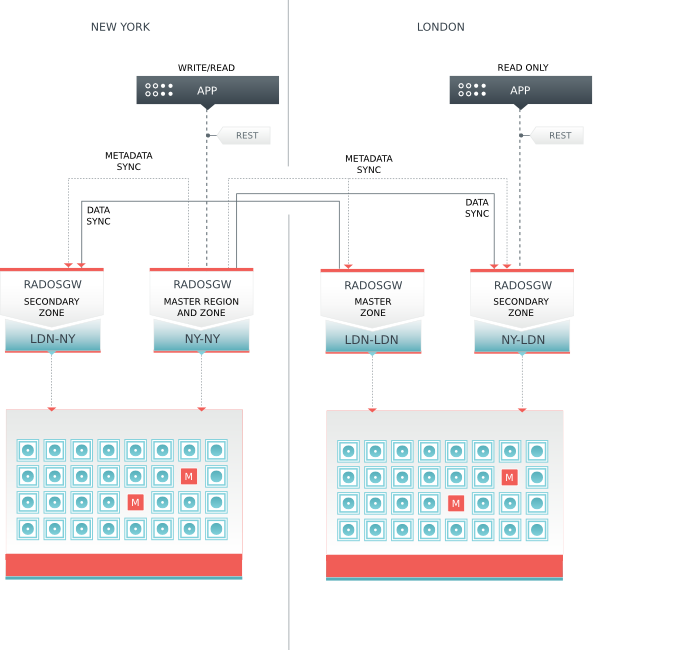

================================
 Configuring Federated Gateways
================================

.. versionadded:: 0.69

In Ceph version 0.69 and beyond, you may configure Ceph Object Gateways in a
federated architecture, spanning multiple geographic regions (read affinity and
failover), and with multiple zones within a region (disaster recovery).

- **Region**: A region represents a geographical area and contains one
  or more zones. A cluster with multiple regions must specify a master region.
  
- **Zone**: A zone is a logical grouping of one or more Ceph Object Gateway 
  instance(s). A region has a master zone that processes client requests.

When you deploy a :term:`Ceph Object Store` service that spans geographical
locales, configuring Ceph Object Gateway regions and metadata synchronization
agents enables the service to maintain a global namespace, even though Ceph
Object Gateway instances run in different geographic locales and potentially
on different Ceph Storage Clusters.

When you separate one or more Ceph Object Gateway instances within a region into
separate logical containers to maintain an extra copy (or copies) of the data,
configuring Ceph Object Gateway zones and data synchronization agents enables
the service to maintain one or more copy(ies) of the master zone's data. Extra
copies of the data are important for failover, backup and disaster recovery.

You may deploy a single Ceph Storage Cluster with a federated architecture
if you have low latency network connections (this isn't recommended). You may
also deploy one Ceph Storage Cluster per region with a separate set of 
pools for each zone (typical). You may also deploy a separate Ceph Storage
Cluster for each zone if your requirements and resources warrant this level
of redundancy.

Once you configure regions and zones, you must configure each instance of a
:term:`Ceph Object Gateway` to use the Ceph  Storage Cluster as the data storage
backend.

Configuring Regions and Zones
=============================

For each :term:`Ceph Node` that runs a :term:`Ceph
Object Gateway`, you must install Apache, FastCGI and the Ceph Object Gateway
daemon (``radosgw``). See `Install Apache, FastCGI and Gateway`_ for details.

Default Region and Zone
-----------------------

The Ceph Object Gateway can generate its own default gateway and zone. These
defaults are the master region and master zone for a cluster. When you configure
your cluster for regions and zones, you will be replacing (and likely deleting,
if it exists) the default region and zone.

Create a Region
---------------

#. Create a region called ``region1``.

   Set ``is_master`` to ``true``.  Copy the contents of the following example 
   to a text editor.  Replace ``{fqdn}`` with the fully-qualified domain name 
   of the endpoint. Then, save the file to ``region.json``. It will specify a 
   master zone as ``region1-zone1`` and list it in the ``zones`` list. 
   See `Configuration Reference - Regions`_ for details.::

	{ "name": "region1",
	  "api_name": "reg1",
	  "is_master": "true",
	  "endpoints": [
	        "http:\/\/{fqdn}:80\/"],
	  "master_zone": "region1-zone1",
	  "zones": [
	        { "name": "region1-zone1",
	          "endpoints": [
	                "http:\/\/{fqdn}:80\/"],
	          "log_meta": "false",
	          "log_data": "false"}],
	  "placement_targets": [],
	  "default_placement": ""}

#. To create ``region1``, execute:: 

	sudo radosgw-admin region set --infile region.json

#. Delete the default region. :: 

	rados -p .rgw.root rm region_info.default
	
#. Set the new region as the default region. :: 

	radosgw-admin region default --rgw-region=region1

#. Update the region map. :: 

	radosgw-admin regionmap update	

Create a Zone User
------------------

You need to create a user before configuring the zone. :: 

	sudo radosgw-admin user create --uid="region1-zone1" --display-name="Region-1 Zone-1"

Copy the ``access_key`` and ``secret_key`` fields for your zone configuration.

Create a Zone
-------------

#. Create a zone called ``region1-zone1``.

   Paste the contents of the ``access_key`` and ``secret_key`` fields from the
   step of creating a zone user into the ``system_key`` field. This 
   configuration uses pool names prepended with the region name and zone name.
   See `Configuration Reference - Pools`_ for details on gateway pools.
   See `Configuration Reference - Zones`_ for details on zones. ::

	{ "domain_root": ".region1-zone1.rgw",
	  "control_pool": ".region1-zone1.rgw.control",
	  "gc_pool": ".region1-zone1.rgw.gc",
	  "log_pool": ".region1-zone1.log",
	  "intent_log_pool": ".region1-zone1.intent-log",
	  "usage_log_pool": ".region1-zone1.usage",
	  "user_keys_pool": ".region1-zone1.users",
	  "user_email_pool": ".region1-zone1.users.email",
	  "user_swift_pool": ".region1-zone1.users.swift",
	  "user_uid_pool": ".region1-zone1.users.uid",
	  "system_key": { "access_key": "", "secret_key": ""}
	}

#. To create ``region1-zone1``, execute:: 

	sudo radosgw-admin zone set --rgw-zone=region1-zone1 --infile zone.json

#. Delete the default zone. :: 

	rados -p .rgw.root rm zone_info.default

#. Update the region map. :: 

	radosgw-admin regionmap update	

Create Pools
============

If the username(s) and key(s) that provide your Ceph Object Gateway with access
to the Ceph Storage Cluster do not have write capability to the :term:`Ceph
Monitor`, you must create the pools manually. See `Configuration Reference -
Pools`_ for details on the default pools for gateways. See `Pools`_ for
details on creating pools. For each pool name:

- ``.region1-zone1.rgw``
- ``.region1-zone1.rgw.control``
- ``.region1-zone1.rgw.gc``
- ``.region1-zone1.log``
- ``.region1-zone1.intent-log``
- ``.region1-zone1.usage``
- ``.region1-zone1.users``
- ``.region1-zone1.users.email``
- ``.region1-zone1.users.swift``
- ``.region1-zone1.users.uid``

Execute one of the following:: 

	rados mkpool {poolname}
	ceph osd pool create {poolname} {pg-num} {pgp-num}

Configuring a Gateway Instance
==============================

Before you configure a gateway instance, determine an ID for the instance.  You
can name a Ceph Object Gateway instance anything you like. In large clusters
with regions and zones, it may help to add region and zone names into your
instance name. For example::

	region1-zone1-instance1

When referring to your instance identifier in the Ceph configuration file, it 
is prepended with ``client.radosgw.``. For example, an instance named 
``region1-zone1-instance1`` will look like this:: 

	[client.radosgw.region1-zone1-instance1]

Similarly, the default data path for an instance named
``region1-zone1-instance1`` is prepended with ``{cluster}-radosgw.``. For
example::

	/var/lib/ceph/radosgw/ceph-radosgw.region1-zone1-instance1	
	

Create a Data Directory
-----------------------

Create a data directory on the node where you installed ``radosgw``. ::
	
	sudo mkdir -p /var/lib/ceph/radosgw/ceph-radosgw.region1-zone1-instance1
	

Create a Storage Cluster User
-----------------------------

When accessing the Ceph Storage Cluster, each instance of a Ceph Object Gateway
must provide the Ceph Storage Cluster with a user name and key. We recommend
setting up at least one user name and key for each zone. See `Cephx
Administration`_ for a discussion on adding keyrings and keys.

#. Create a keyring for the Ceph Object Gateway. For example:: 

	sudo ceph-authtool --create-keyring /etc/ceph/ceph.client.radosgw.region1-zone1.keyring
	sudo chmod +r /etc/ceph/ceph.client.radosgw.region1-zone1.keyring

#. Generate a key so that the Ceph Object Gateway can provide a user name and 
   key to authenticate itself with the Ceph Storage Cluster. Then, add 
   capabilities to the key. See `Configuration Reference - Pools`_ for details
   on the effect of write permissions for the monitor and creating pools. :: 

	sudo ceph-authtool /etc/ceph/ceph.client.radosgw.region1-zone1.keyring -n client.radosgw.region1-zone1 --gen-key
	sudo ceph-authtool -n client.radosgw.region1-zone1 --cap osd 'allow rwx' --cap mon 'allow rw' /etc/ceph/ceph.client.radosgw.region1-zone1.keyring

#. Once you have created a keyring and key to enable the Ceph Object Gateway  
   with access to the Ceph Storage Cluster, add it as an entry to your Ceph
   Storage Cluster. For example::

	sudo ceph -k /etc/ceph/ceph.client.admin.keyring auth add client.radosgw.region1-zone1 -i /etc/ceph/ceph.client.radosgw.region1-zone1.keyring
	

Create a Gateway Configuration
------------------------------

Create an ``rgw.conf`` file under the ``/etc/apache2/sites-available`` directory
on the host(s) where you installed the Ceph Object Gateway daemon(s). See below
for an exemplary embodiment of a gateway configuration as discussed in the
following text.

.. literalinclude:: rgw.conf
   :language: ini

#. Replace the ``{fqdn}`` entry with the fully-qualified domain name of the 
   server. 
   
#. Replace the ``{email.address}`` entry with the email address for the 
   server administrator.
   
#. Add a ``ServerAlias`` if you wish to use S3-style subdomains 
   (of course you do).

Enable the Configuration
------------------------

#. Enable the site for the gateway configuration (e.g., ``rgw.conf``). ::

	sudo a2ensite rgw.conf

#. Disable the default site. ::

	sudo a2dissite default

.. note:: Failure to disable the default site can lead to problems.

Add a FastCGI Script 
--------------------

FastCGI requires a script for the S3-compatible interface. To create the 
script, execute the following procedures on the server node. 

#. Go to the ``/var/www`` directory. :: 

	cd /var/www

#. Open an editor with the file name ``s3gw.fcgi``. :: 

	sudo vim s3gw.fcgi

#. Add a shell script with ``exec`` and the path to the gateway binary, 
   the path to the Ceph configuration file, and the user name (``-n``; 
   the same user name created in step 2 of `Create a Storage Cluster User`_. 
   Copy the following into the editor. ::

	#!/bin/sh
	exec /usr/bin/radosgw -c /etc/ceph/ceph.conf -n client.radosgw.region1-zone1

#. Save the file. 

#. Change the permissions on the file so that it is executable. :: 

	sudo chmod +x s3gw.fcgi

Add Configuration to Ceph Config
--------------------------------

Ceph Object Gateway instances read the `Ceph configuration file`_ (located at
``/etc/ceph/{cluster-name}.conf`` by default). The Ceph Object Gateway is a
client of the Ceph Storage Cluster, so you must place each instance under a
``[client]`` section that specifically refers to the ``radosgw`` daemon and the
instance ID. For example::

	[client.radosgw.region1-zone1-instance1]
			
			#Region Info
			rgw region = region1
			rgw region root pool = .region1.rgw.root
	
			#Zone Info
			rgw zone = region1-zone1
			rgw zone root pool = .region1-zone1.rgw.root
			keyring = /etc/ceph/ceph.client.radosgw.region1-zone1.keyring

			#DNS Info for S3 Subdomains
			rgw dns name = {hostname}
			
			#Ceph Node Info	
			rgw socket path = /tmp/$name.sock
			host = {host-name}
			

Add the foregoing setting (replacing values in braces where appropriate) to the
master copy of the Ceph configuration file you keep with your admin node. Then,
use ``ceph-deploy`` to push a fresh copy the configuration file from your admin
node Ceph Nodes. ::

	ceph-deploy --overwrite-conf config push {host-name [host-name]...}

Restart Services
================

Once you have redeployed your Ceph configuration files, we recommend restarting
your ``ceph`` service.

For Ubuntu, use the following:: 

	sudo restart ceph-all
	
For Red Hat/CentOS, use the following::

	sudo /etc/init.d/ceph restart
	
To ensure that all components have reloaded their configurations, for each 
gateway instance we recommend restarting the ``apache2`` service.  For example:: 	
	
	sudo service apache2 restart
	

Start 
=====

Start up the ``radosgw`` service. When starting the service with other than 
the default region and zone, you must specify them explicitly. ::
	
	sudo /etc/init.d/radosgw start --rgw-region={region}  --rgw-zone={zone}

Activate Metadata Agent
=======================

The metadata agent synchronizes metadata between two regions. The source region
is the master region for the cluster, and the destination region is the secondary
region that will receive metadata.

To configure the synchronization agent, retrieve the following from the master
zone of the the source and destination regions:

- Access Key
- Secret Key
- Hostname
- Port

Specify these values in a configuration file (e.g., ``region-md-sync.conf``),
and include a ``log_file`` name and a an identifier for the ``daemon_id``. For
example:

.. code-block:: ini

	src_access_key: {source-access-key}
	src_secret_key: {source-secret-key}
	src_host: {source-hostname}
	src_port: {source-port}
	src_zone: {source-zone}
	dest_access_key: {destination-access-key}
	dest_secret_key: {destination-secret-key}
	dest_host: {destination-hostname}
	dest_port: {destinatio-port}
	dest_zone: {destination-zone}
	log_file: {log.filename}
	daemon_id: {daemon-id}

To activate the metadata agent, execute the following::

	radosgw-agent -c region-md-sync.conf

.. _Install Apache, FastCGI and Gateway: ../manual-install
.. _Cephx Administration: ../../rados/operations/authentication/#cephx-administration
.. _Ceph configuration file: ../../rados/configuration/ceph-conf
.. _Configuration Reference - Pools: ../config-ref#pools
.. _Configuration Reference - Regions: ../config-ref#regions
.. _Configuration Reference - Zones: ../config-ref#zones
.. _Pools: ../../rados/operations/pools
.. _Simple Configuration: ../config