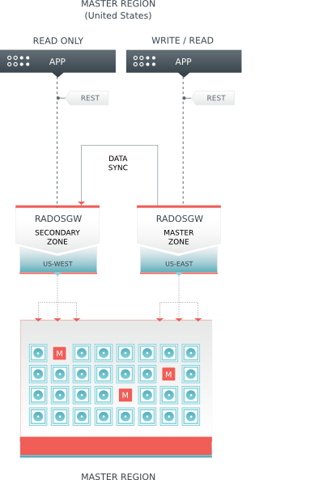

================================
 Configuring Federated Gateways
================================

.. versionadded:: 0.67 Dumpling

In Ceph version 0.67 Dumpling and beyond, you may configure each :term:`Ceph 
Object Gateway` to participate in a federated architecture, with multiple 
regions, and with multiple zones for a region.

- **Region**: A region represents a *logical* geographic area and contains one
  or more zones. A cluster with multiple regions must specify a master region.
  
- **Zone**: A zone is a *logical* grouping of one or more Ceph Object Gateway 
  instance(s). A region has a master zone that processes client requests.

.. important:: Only write objects to the master zone in a region. You may read
   objects from secondary zones. Currently, the Gateway does not prevent you
   from writing to a secondary zone, but **DON'T DO IT**.

Background
==========

When you deploy a :term:`Ceph Object Store` service that spans geographical
locales, configuring Ceph Object Gateway regions and metadata synchronization
agents enables the service to maintain a global namespace, even though Ceph
Object Gateway instances run in different geographic locales and potentially on
different Ceph Storage Clusters. When you separate one or more Ceph Object
Gateway instances within a region into separate logical containers to maintain
an extra copy (or copies) of the data, configuring Ceph Object Gateway zones and
data synchronization agents enables the service to maintain one or more
copy(ies) of the master zone's data. Extra copies of the data are important for
failover, backup and disaster recovery.

You may deploy a single Ceph Storage Cluster with a federated architecture if
you have low latency network connections (this isn't recommended). You may also
deploy one Ceph Storage Cluster per region with a separate set of  pools for
each zone (typical). You may also deploy a separate Ceph Storage Cluster for
each zone if your requirements and resources warrant this level of redundancy.

About this Guide
================

In the following sections, we will demonstrate how to configure a federated
cluster in two logical steps: 

- **Configure a Master Region:** This section of the guide describes how to 
  set up a region with multiple zones, and how to synchronize data between the
  master zone and the secondary zone(s) within the master region.
  
- **Configure a Secondary Region:**  This section of the guide describes how 
  to repeat the section on setting up a master region and multiple zones so 
  that you have two regions with intra-zone synchronization in each region. 
  Finally, you will learn how to set up a metadata synchronization agent so 
  that you can maintain a global namespace for the regions in your cluster.

Configure a Master Region
=========================

This section provides an exemplary procedure for setting up a region, and two
zones within the region. The cluster will comprise two gateway daemon
instances--one per zone. This region will serve as the master region.

Naming for the Master Region
----------------------------

Before configuring the cluster, defining region, zone and instance names will
help you manage your cluster. Let's assume the region represents the United
States, and we refer to it by its standard abbreviation. 

- United States: ``us``

Let's assume the zones represent the Eastern and Western United States. For
continuity, our naming convention will use ``{region name}-{zone name}`` format,
but you can use any naming convention you prefer.

- United States, East Region: ``us-east``
- United States, West Region: ``us-west``

Finally, let's assume that zones may have more than one Ceph Object Gateway 
instance per zone. For continuity, our naming convention will use 
``{region name}-{zone name}-{instance}`` format, but you can use any naming 
convention you prefer.

- United States Region, Master Zone, Instance 1: ``us-east-1``
- United States Region, Secondary Zone, Instance 1: ``us-west-1``

Create Pools
------------

You may have a Ceph Storage Cluster for the entire region or a Ceph Storage
Cluster for each zone.

For continuity, our naming convention will use ``{region name}-{zone name}``
format prepended to the pool name, but you can use any naming convention you
prefer. For example:

- ``.us-east.rgw.root``
- ``.us-east.rgw.control``
- ``.us-east.rgw.gc``
- ``.us-east.rgw.buckets``
- ``.us-east.rgw.buckets.index``
- ``.us-east.rgw.buckets.extra``
- ``.us-east.log``
- ``.us-east.intent-log``
- ``.us-east.usage``
- ``.us-east.users``
- ``.us-east.users.email``
- ``.us-east.users.swift``
- ``.us-east.users.uid``

| 

- ``.us-west.rgw.root``
- ``.us-west.rgw.control``
- ``.us-west.rgw.gc``
- ``.us-west.rgw.buckets``
- ``.us-west.rgw.buckets.index``
- ``.us-west.rgw.buckets.extra``
- ``.us-west.log``
- ``.us-west.intent-log``
- ``.us-west.usage``
- ``.us-west.users``
- ``.us-west.users.email``
- ``.us-west.users.swift``
- ``.us-west.users.uid``

See `Configuration Reference - Pools`_ for details on the default pools for
gateways. See `Pools`_ for details on creating pools. Execute the following 
to create a pool:: 

	ceph osd pool create {poolname} {pg-num} {pgp-num} {replicated | erasure} [{erasure-code-profile}]  {ruleset-name} {ruleset-number}

.. tip:: When adding a large number of pools, it may take some time for your 
   cluster to return to a ``active + clean`` state.

.. topic:: CRUSH Maps

	When deploying a Ceph Storage Cluster for the entire region, consider 
	using a CRUSH rule for the zone such that you do NOT have overlapping
	failure domains. See `CRUSH Map`_ for details.
	
	Ceph supports multiple CRUSH hierarchies and CRUSH rulesets, enabling 
	great flexibility in the way you configure your gateway. Pools such 
	as ``rgw.buckets.index`` may benefit from a modestly sized pool of SSDs 
	for fast performance. Backing storage may benefit from the increased economy
	of erasure-coded storage, and/or the improved performance from cache tiering.

When you have completed this step, execute the following to ensure that
you have created all of the foregoing pools::

	rados lspools

Create a Keyring
----------------

Each instance must have a user name and key to communicate with a Ceph Storage
Cluster. In the following steps, we use an admin node to create a keyring. 
Then, we create a client user name and key for each instance. Next, we add the 
keys to the Ceph Storage Cluster(s). Finally, we distribute the key ring to 
each node containing an instance.

#. Create a keyring. ::

	sudo ceph-authtool --create-keyring /etc/ceph/ceph.client.radosgw.keyring
	sudo chmod +r /etc/ceph/ceph.client.radosgw.keyring
	

#. Generate a Ceph Object Gateway user name and key for each instance. :: 

	sudo ceph-authtool /etc/ceph/ceph.client.radosgw.keyring -n client.radosgw.us-east-1 --gen-key
	sudo ceph-authtool /etc/ceph/ceph.client.radosgw.keyring -n client.radosgw.us-west-1 --gen-key

#. Add capabilities to each key. See `Configuration Reference - Pools`_ for details
   on the effect of write permissions for the monitor and creating pools. ::

	sudo ceph-authtool -n client.radosgw.us-east-1 --cap osd 'allow rwx' --cap mon 'allow rwx' /etc/ceph/ceph.client.radosgw.keyring
	sudo ceph-authtool -n client.radosgw.us-west-1 --cap osd 'allow rwx' --cap mon 'allow rwx' /etc/ceph/ceph.client.radosgw.keyring

#. Once you have created a keyring and key to enable the Ceph Object Gateway 
   with access to the Ceph Storage Cluster, add each key as an entry to your 
   Ceph Storage Cluster(s). For example:: 

	sudo ceph -k /etc/ceph/ceph.client.admin.keyring auth add client.radosgw.us-east-1 -i /etc/ceph/ceph.client.radosgw.keyring
	sudo ceph -k /etc/ceph/ceph.client.admin.keyring auth add client.radosgw.us-west-1 -i /etc/ceph/ceph.client.radosgw.keyring

.. note:: When you use this procedure to configure the secondary region, 
   replace ``us-`` with ``eu-``. You will have a total of four users **after** 
   you create the master region and the secondary region.

Install Apache/FastCGI
---------------------- 

For each :term:`Ceph Node` that runs a :term:`Ceph Object Gateway` daemon 
instance, you must install Apache, FastCGI, the Ceph Object Gateway daemon 
(``radosgw``) and the Ceph Object Gateway Sync Agent (``radosgw-agent``). 
See `Install Ceph Object Gateway`_ for details.

Create Data Directories
-----------------------

Create data directories for each daemon instance on their respective 
hosts. ::

	ssh {us-east-1}
	sudo mkdir -p /var/lib/ceph/radosgw/ceph-radosgw.us-east-1
	
	ssh {us-west-1}
	sudo mkdir -p /var/lib/ceph/radosgw/ceph-radosgw.us-west-1

.. note:: When you use this procedure to configure the secondary region, 
   replace ``us-`` with ``eu-``. You will have a total of four data directories 
   **after** you create the master region and the secondary region.
	

Create a Gateway Configuration
------------------------------

For each instance, create an Ceph Object Gateway configuration file under the
``/etc/apache2/sites-available`` directory on the host(s) where you installed
the Ceph Object Gateway daemon(s). See below for an exemplary embodiment of a
gateway configuration as discussed in the following text.

.. literalinclude:: rgw.conf
   :language: ini

#. Replace the ``/{path}/{socket-name}`` entry with path to the socket and
   the socket name. For example, 
   ``/var/run/ceph/client.radosgw.us-east-1.sock``. Ensure that you use the 
   same path and socket name in your ``ceph.conf`` entry.

#. Replace the ``{fqdn}`` entry with the fully-qualified domain name of the 
   server. 
   
#. Replace the ``{email.address}`` entry with the email address for the 
   server administrator.
   
#. Add a ``ServerAlias`` if you wish to use S3-style subdomains 
   (of course you do).

#. Save the configuration to a file (e.g., ``rgw-us-east.conf``).

Repeat the process for the secondary zone (e.g., ``rgw-us-west.conf``).

.. note:: When you use this procedure to configure the secondary region, 
   replace ``us-`` with ``eu-``. You will have a total of four gateway
   configuration files on the respective nodes **after** 
   you create the master region and the secondary region.

Finally, if you enabled SSL, make sure that you set the port to your SSL port
(usually 443) and your configuration file includes the following::

	SSLEngine on
	SSLCertificateFile /etc/apache2/ssl/apache.crt
	SSLCertificateKeyFile /etc/apache2/ssl/apache.key
	SetEnv SERVER_PORT_SECURE 443

Enable the Configuration
------------------------

For each instance, enable the gateway configuration and disable the
default site.

#. Enable the site for the gateway configuration. ::

	sudo a2ensite {rgw-conf-filename}

#. Disable the default site. ::

	sudo a2dissite default

.. note:: Failure to disable the default site can lead to problems.

Add a FastCGI Script 
--------------------

FastCGI requires a script for each Ceph Object Gateway instance to
enable the S3-compatible interface. To create the script, execute 
the following procedures. 

#. Go to the ``/var/www`` directory. :: 

	cd /var/www

#. Open an editor with the file name ``s3gw.fcgi``. **Note:** The configuration
   file specifies this filename. :: 

	sudo vim s3gw.fcgi

#. Add a shell script with ``exec`` and the path to the gateway binary, 
   the path to the Ceph configuration file, and the user name (``-n``; 
   the same user name created in step 2 of `Create a Keyring`_. 
   Copy the following into the editor. ::

	#!/bin/sh
	exec /usr/bin/radosgw -c /etc/ceph/ceph.conf -n client.radosgw.{ID}

   For example:: 

	#!/bin/sh
	exec /usr/bin/radosgw -c /etc/ceph/ceph.conf -n client.radosgw.us-east-1

#. Save the file. 

#. Change the permissions on the file so that it is executable. :: 

	sudo chmod +x s3gw.fcgi

Repeat the process for the secondary zone.

.. note:: When you use this procedure to configure the secondary region, 
   replace ``us-`` with ``eu-``. You will have a total of four FastCGI scripts
   **after** you create the master region and the secondary region.

Add Instances to Ceph Config File
---------------------------------

On an admin node, add an entry for each instance in the Ceph configuration file
for your Ceph Storage Cluster(s). For example:: 

	[global]
	rgw region root pool = .us.rgw.root     # Deprecated in Jewel
	rgw zonegroup root pool = .us.rgw.root  # From Jewel
	
	[client.radosgw.us-east-1]
	rgw region = us
	rgw zone = us-east
	rgw zone root pool = .us-east.rgw.root
	keyring = /etc/ceph/ceph.client.radosgw.keyring
	rgw dns name = {hostname}
	rgw socket path = /var/run/ceph/$name.sock
	host = {host-name}
	
	[client.radosgw.us-west-1]
	rgw region = us
	rgw zone = us-west
	rgw zone root pool = .us-west.rgw.root
	keyring = /etc/ceph/ceph.client.radosgw.keyring
	rgw dns name = {hostname}
	rgw socket path = /var/run/ceph/$name.sock
	host = {host-name}

Then, update each :term:`Ceph Node` with the updated Ceph configuration
file. For example:: 

	ceph-deploy --overwrite-conf config push {node1} {node2} {nodex}	

.. note:: When you use this procedure to configure the secondary region, 
   replace ``us`` with ``eu`` for the name, region, pools and zones. 
   You will have a total of four entries **after** 
   you create the master region and the secondary region.

Create a Region
---------------

#. Configure a region infile called ``us.json`` for the ``us`` region.

   Copy the contents of the following example to a text editor. Set 
   ``is_master`` to ``true``. Replace ``{fqdn}`` with the fully-qualified 
   domain name of the endpoint. It will specify a master zone as ``us-east`` 
   and list it in the ``zones`` list along with the ``us-west`` zone. 
   See `Configuration Reference - Regions`_ for details.::

	{ "name": "us",
	  "api_name": "us",
	  "is_master": "true",
	  "endpoints": [
	        "http:\/\/{fqdn}:80\/"],
	  "master_zone": "us-east",
	  "zones": [
	        { "name": "us-east",
	          "endpoints": [
	                "http:\/\/{fqdn}:80\/"],
	          "log_meta": "true",
	          "log_data": "true"},
	        { "name": "us-west",
	          "endpoints": [
	                "http:\/\/{fqdn}:80\/"],
	          "log_meta": "true",
	          "log_data": "true"}],
	  "placement_targets": [
	   {
	     "name": "default-placement",
	     "tags": []
	   }
	  ],
	  "default_placement": "default-placement"}

#. Create the ``us`` region using the ``us.json`` infile you just 
   created. :: 

	radosgw-admin region set --infile us.json --name client.radosgw.us-east-1

#. Delete the default region (if it exists). :: 

	rados -p .us.rgw.root rm region_info.default
	
#. Set the ``us`` region as the default region. :: 

	radosgw-admin region default --rgw-region=us --name client.radosgw.us-east-1

   Only one region can be the default region for a cluster.

#. Update the region map. :: 

	radosgw-admin regionmap update --name client.radosgw.us-east-1

If you use different Ceph Storage Cluster instances for regions, you  should
repeat steps 2, 4 and 5 in by executing them with ``--name
client.radosgw-us-west-1``. You may also export the region map from the initial
gateway instance and import it followed by updating the region map.

.. note:: When you use this procedure to configure the secondary region, 
   replace ``us`` with ``eu``. You will have a total of two regions **after** 
   you create the master region and the secondary region.

Create Zones
------------

#. Configure a zone infile called ``us-east.json`` for the 
   ``us-east`` zone.

   Copy the contents of the following example to a text editor.
   This configuration uses pool names prepended with the region name and 
   zone name. See `Configuration Reference - Pools`_ for additional details on
   gateway pools. See `Configuration Reference - Zones`_ for additional 
   details on zones. ::

	{ "domain_root": ".us-east.domain.rgw",
	  "control_pool": ".us-east.rgw.control",
	  "gc_pool": ".us-east.rgw.gc",
	  "log_pool": ".us-east.log",
	  "intent_log_pool": ".us-east.intent-log",
	  "usage_log_pool": ".us-east.usage",
	  "user_keys_pool": ".us-east.users",
	  "user_email_pool": ".us-east.users.email",
	  "user_swift_pool": ".us-east.users.swift",
	  "user_uid_pool": ".us-east.users.uid",
	  "system_key": { "access_key": "", "secret_key": ""},
	  "placement_pools": [
	    { "key": "default-placement",
	      "val": { "index_pool": ".us-east.rgw.buckets.index",
	               "data_pool": ".us-east.rgw.buckets"}
	    }
	  ]
	}

#. Add the ``us-east`` zone using the ``us-east.json`` infile you
   just created in both the east and west pools by specifying their respective
   user names (i.e., ``--name``). ::

	radosgw-admin zone set --rgw-zone=us-east --infile us-east.json --name client.radosgw.us-east-1
	radosgw-admin zone set --rgw-zone=us-east --infile us-east.json --name client.radosgw.us-west-1

   Repeat step 1 to create a zone infile for ``us-west``. Then add the zone 
   using the ``us-west.json`` infile in both the east and west pools by 
   specifying their respective user names (i.e., ``--name``). ::

	radosgw-admin zone set --rgw-zone=us-west --infile us-west.json --name client.radosgw.us-east-1
	radosgw-admin zone set --rgw-zone=us-west --infile us-west.json --name client.radosgw.us-west-1

#. Delete the default zone (if it exists). :: 

	rados -p .us-east.rgw.root rm zone_info.default
	rados -p .us-west.rgw.root rm zone_info.default

#. Update the region map. :: 

	radosgw-admin regionmap update --name client.radosgw.us-east-1

.. note:: When you use this procedure to configure the secondary region, 
   replace ``us-`` with ``eu-``. You will have a total of four zones **after** 
   you create the master zone and the secondary zone in each region.

Create Zone Users
-----------------

Ceph Object Gateway stores zone users in the zone pools. So you must create zone
users after configuring the zones. Copy the ``access_key`` and  ``secret_key``
fields for each user so you can update your zone configuration once you complete
this step. :: 

	radosgw-admin user create --uid="us-east" --display-name="Region-US Zone-East" --name client.radosgw.us-east-1 --system
	radosgw-admin user create --uid="us-west" --display-name="Region-US Zone-West" --name client.radosgw.us-west-1 --system

.. note:: When you use this procedure to configure the secondary region, 
   replace ``us-`` with ``eu-``. You will have a total of four zone users 
   **after** you create the master region and the secondary region and their
   zones. These users are different from the users created in `Create a 
   Keyring`_.

Update Zone Configurations
--------------------------

You must update the zone configuration with zone users so that
the synchronization agents can authenticate with the zones.

#. Open your ``us-east.json`` zone configuration file and paste the contents of 
   the ``access_key`` and ``secret_key`` fields from the step of creating 
   zone users into the ``system_key`` field of your zone configuration 
   infile. ::

	{ "domain_root": ".us-east.domain.rgw",
	  "control_pool": ".us-east.rgw.control",
	  "gc_pool": ".us-east.rgw.gc",
	  "log_pool": ".us-east.log",
	  "intent_log_pool": ".us-east.intent-log",
	  "usage_log_pool": ".us-east.usage",
	  "user_keys_pool": ".us-east.users",
	  "user_email_pool": ".us-east.users.email",
	  "user_swift_pool": ".us-east.users.swift",
	  "user_uid_pool": ".us-east.users.uid",
	  "system_key": { 
	    "access_key": "{paste-access_key-here}", 
	    "secret_key": "{paste-secret_key-here}"
	  	 },
	  "placement_pools": [
	    { "key": "default-placement",
	      "val": { "index_pool": ".us-east.rgw.buckets.index",
	               "data_pool": ".us-east.rgw.buckets"}
	    }
	  ]
	}

#. Save the ``us-east.json`` file. Then, update your zone configuration. :: 

	radosgw-admin zone set --rgw-zone=us-east --infile us-east.json --name client.radosgw.us-east-1
	radosgw-admin zone set --rgw-zone=us-east --infile us-east.json --name client.radosgw.us-west-1	
	
#. Repeat step 1 to update the zone infile for ``us-west``. Then, update 
   your zone configuration. :: 

	radosgw-admin zone set --rgw-zone=us-west --infile us-west.json --name client.radosgw.us-east-1
	radosgw-admin zone set --rgw-zone=us-west --infile us-west.json --name client.radosgw.us-west-1

.. note:: When you use this procedure to configure the secondary region, 
   replace ``us-`` with ``eu-``. You will have a total of four zones **after** 
   you create the master zone and the secondary zone in each region.

Restart Services
----------------

Once you have redeployed your Ceph configuration files, we recommend restarting
your Ceph Storage Cluster(s) and Apache instances.

For Ubuntu, use the following on each :term:`Ceph Node`:: 

	sudo restart ceph-all
	
For Red Hat/CentOS, use the following::

	sudo /etc/init.d/ceph restart
	
To ensure that all components have reloaded their configurations, for each 
gateway instance we recommend restarting the ``apache2`` service.  For example:: 	
	
	sudo service apache2 restart

Start Gateway Instances
-----------------------

Start up the ``radosgw`` service. ::
	
	sudo /etc/init.d/radosgw start

If you are running multiple instances on the same host, you must specify the
user name. ::

	sudo /etc/init.d/radosgw start --name client.radosgw.us-east-1

Open a browser and check the endpoints for each zone. A simple HTTP request
to the domain name should return the following: 

.. code-block:: xml

   <ListAllMyBucketsResult xmlns="http://s3.amazonaws.com/doc/2006-03-01/">
	   <Owner>
		   <ID>anonymous</ID>
		   <DisplayName/>
	   </Owner>
	   <Buckets/>
   </ListAllMyBucketsResult>

Configure a Secondary Region
============================

This section provides an exemplary procedure for setting up a cluster with
multiple regions. Configuring a cluster that spans regions requires maintaining
a global namespace, so that there are no namespace clashes among object names
stored across in different regions.

This section extends the procedure in `Configure a Master Region`_, but 
changes the region name and modifies a few procedures. See the following 
sections for details.

Naming for the Secondary Region
-------------------------------

Before configuring the cluster, defining region, zone and instance names will
help you manage your cluster. Let's assume the region represents the European
Union, and we refer to it by its standard abbreviation. 

- European Union: ``eu``

Let's assume the zones represent the Eastern and Western European Union. For
continuity, our naming convention will use ``{region name}-{zone name}`` 
format, but you can use any naming convention you prefer.

- European Union, East Region: ``eu-east``
- European Union, West Region: ``eu-west``

Finally, let's assume that zones may have more than one Ceph Object Gateway 
instance per zone. For continuity, our naming convention will use 
``{region name}-{zone name}-{instance}`` format, but you can use any naming 
convention you prefer.

- European Union Region, Master Zone, Instance 1: ``eu-east-1``
- European Union Region, Secondary Zone, Instance 1: ``eu-west-1``

Configuring a Secondary Region
------------------------------

Repeat the exemplary procedure of `Configure a Master Region`_
with the following differences: 

#. Use `Naming for the Secondary Region`_ in lieu of `Naming for
   the Master Region`_. 
   
#. `Create Pools`_ using ``eu`` instead of ``us``.

#. `Create a Keyring`_  and the corresponding keys using ``eu`` instead of 
   ``us``. You may use the same keyring if you desire, but ensure that you 
   create the keys on the Ceph Storage Cluster for that region (or region 
   and zone).

#. `Install Apache/FastCGI`_. 

#. `Create Data Directories`_ using ``eu`` instead of ``us``.

#. `Create a Gateway Configuration`_ using ``eu`` instead of ``us`` for
   the socket names.

#. `Enable the Configuration`_.

#. `Add a FastCGI Script`_ using ``eu`` instead of ``us`` for the user names.

#. `Add Instances to Ceph Config File`_ using ``eu`` instead of ``us`` for the 
   pool names. 

#. `Create a Region`_ using ``eu`` instead of ``us``. Set ``is_master`` to 
   ``false``. For consistency, create the master region in the secondary region
   too. ::

	radosgw-admin region set --infile us.json --name client.radosgw.eu-east-1

#. `Create Zones`_ using ``eu`` instead of ``us``. Ensure that you update the
   user name (i.e., ``--name``) so that you create the zones in the correct 
   cluster.
   
#. `Update Zone Configurations`_ using ``eu`` instead of ``us``. 

#. Create zones from master region in the secondary region. ::

	radosgw-admin zone set --rgw-zone=us-east --infile us-east.json --name client.radosgw.eu-east-1
	radosgw-admin zone set --rgw-zone=us-east --infile us-east.json --name client.radosgw.eu-west-1	
	radosgw-admin zone set --rgw-zone=us-west --infile us-west.json --name client.radosgw.eu-east-1
	radosgw-admin zone set --rgw-zone=us-west --infile us-west.json --name client.radosgw.eu-west-1	

#. Create zones from secondary region in the master region. ::

	radosgw-admin zone set --rgw-zone=eu-east --infile eu-east.json --name client.radosgw.us-east-1
	radosgw-admin zone set --rgw-zone=eu-east --infile eu-east.json --name client.radosgw.us-west-1	
	radosgw-admin zone set --rgw-zone=eu-west --infile eu-west.json --name client.radosgw.us-east-1
	radosgw-admin zone set --rgw-zone=eu-west --infile eu-west.json --name client.radosgw.us-west-1

#. `Restart Services`_.

#. `Start Gateway Instances`_.

Multi-Site Data Replication
===========================

The data synchronization agent replicates the data of a master zone to a
secondary zone. The master zone of a region is the source for the secondary zone
of the region and it gets selected automatically.

To configure the synchronization agent, retrieve the access key and secret for
the source and destination, and the destination URL and port.

You may use ``radosgw-admin zone list`` to get a list of zone names. You 
may use ``radosgw-admin zone get`` to identify the key and secret for the 
zone. You may refer to the gateway configuration file you created under
`Create a Gateway Configuration`_ to identify the port number.

You only need the hostname and port for a single instance (assuming all 
gateway instances in a region/zone access the same Ceph Storage Cluster). 
Specify these values in a configuration file 
(e.g., ``cluster-data-sync.conf``), and include a ``log_file`` name. 

For example:

.. code-block:: ini

	src_access_key: {source-access-key}
	src_secret_key: {source-secret-key}
	destination: https://zone-name.fqdn.com:port
	dest_access_key: {destination-access-key}
	dest_secret_key: {destination-secret-key}
	log_file: {log.filename}

A concrete example may look like this:

.. code-block:: ini

	src_access_key: DG8RE354EFPZBICHIAF0
	src_secret_key: i3U0HiRP8CXaBWrcF8bbh6CbsxGYuPPwRkixfFSb
	destination: https://us-west.storage.net:80
	dest_access_key: U60RFI6B08F32T2PD30G
	dest_secret_key: W3HuUor7Gl1Ee93pA2pq2wFk1JMQ7hTrSDecYExl
	log_file: /var/log/radosgw/radosgw-sync-us-east-west.log

To activate the data synchronization agent, open a terminal and
execute the following::

	radosgw-agent -c region-data-sync.conf

When the synchronization agent is running, you should see output
indicating that the agent is synchronizing shards of data. ::

	INFO:radosgw_agent.sync:Starting incremental sync
	INFO:radosgw_agent.worker:17910 is processing shard number 0
	INFO:radosgw_agent.worker:shard 0 has 0 entries after ''
	INFO:radosgw_agent.worker:finished processing shard 0
	INFO:radosgw_agent.worker:17910 is processing shard number 1
	INFO:radosgw_agent.sync:1/64 shards processed
	INFO:radosgw_agent.worker:shard 1 has 0 entries after ''
	INFO:radosgw_agent.worker:finished processing shard 1
	INFO:radosgw_agent.sync:2/64 shards processed
	...

.. note:: You must have an agent for each source-destination pair.

Inter-Region Metadata Replication
=================================

The data synchronization agent replicates the metadata of master zone in the
master region to a master zone in a secondary region. Metadata consists of
gateway users and buckets, but not the objects within the buckets--ensuring a
unified namespace across the cluster. The master zone of the master region is
the source for the master zone of the secondary region and it gets selected
automatically.

Follow the same steps in `Multi-Site Data Replication`_ by specifying the master
zone of the master region as the source zone and the master zone of the
secondary region as the secondary zone. When activating the ``radosgw-agent``,
specify ``--metadata-only`` so that it only copies metadata. For example:: 

	radosgw-agent -c inter-region-data-sync.conf --metadata-only

Once you have completed the foregoing procedure, you should have a cluster
consisting of a master region (``us``) and a secondary region (``eu``) where
there is a unified namespace between the two regions.

.. _CRUSH Map: ../../rados/operations/crush-map
.. _Install Ceph Object Gateway: ../../install/install-ceph-gateway
.. _Cephx Administration: ../../rados/operations/authentication/#cephx-administration
.. _Ceph configuration file: ../../rados/configuration/ceph-conf
.. _Configuration Reference - Pools: ../config-ref#pools
.. _Configuration Reference - Regions: ../config-ref#regions
.. _Configuration Reference - Zones: ../config-ref#zones
.. _Pools: ../../rados/operations/pools
.. _Simple Configuration: ../config
