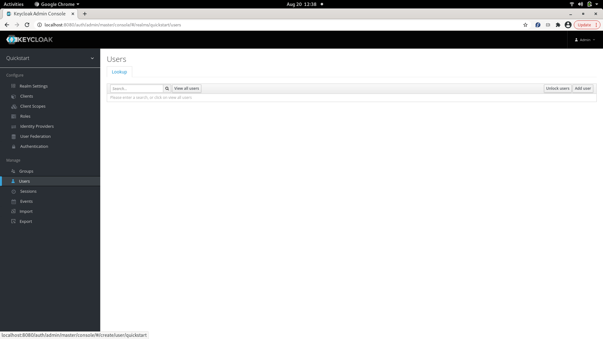
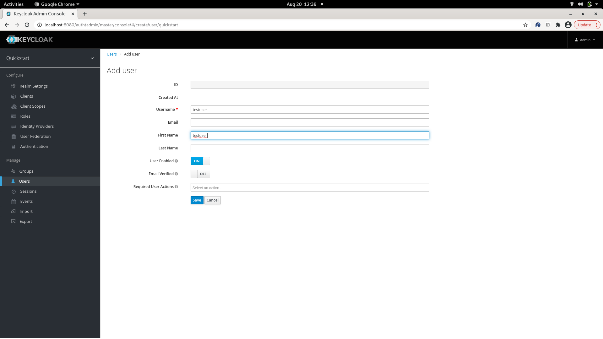
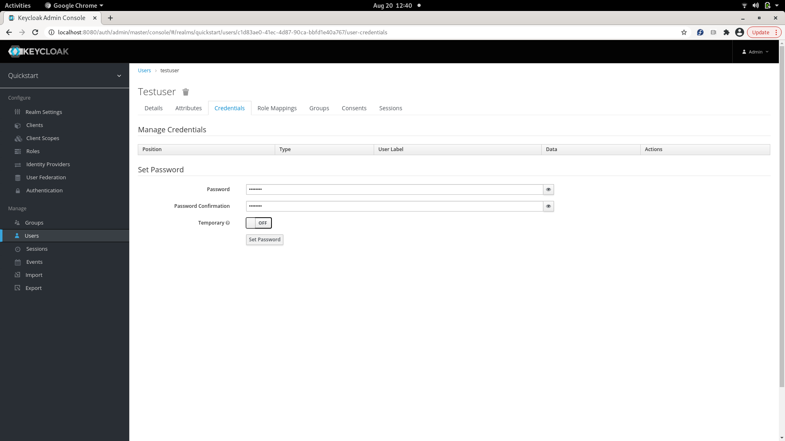
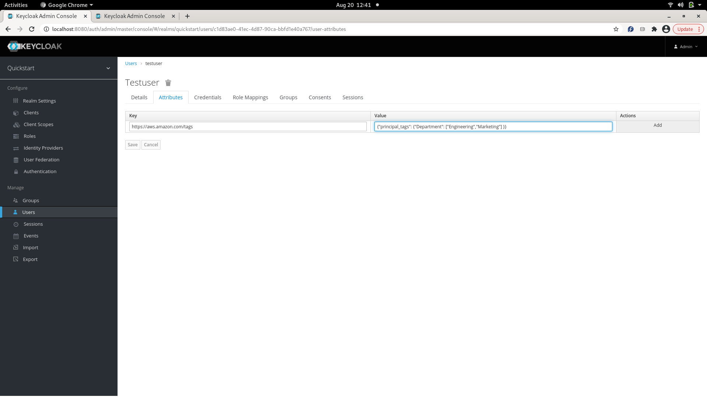
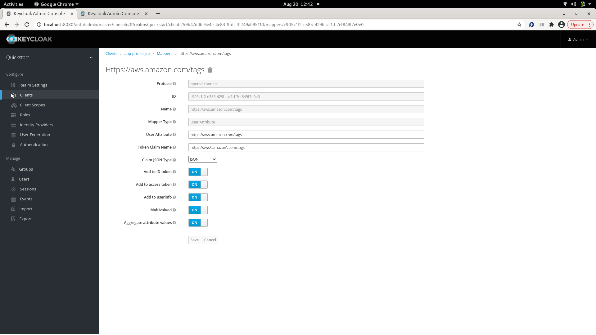

=================================
Keycloak integration with RadosGW
=================================

Keycloak can be setup as an OpenID Connect Identity Provider, which can be used by mobile/ web apps
to authenticate their users. The Web token returned as a result of authentication can be used by the
mobile/ web app to call AssumeRoleWithWebIdentity to get back a set of temporary S3 credentials,
which can be used by the app to make S3 calls.

Setting up Keycloak
====================

Installing and bringing up Keycloak can be found here: https://www.keycloak.org/docs/latest/server_installation/.

Configuring Keycloak to talk to RGW
===================================

The following configurables have to be added for RGW to talk to Keycloak::

  [client.radosgw.gateway]
  rgw sts key = {sts key for encrypting/ decrypting the session token}
  rgw s3 auth use sts = true

Example showing how to fetch a web token from Keycloak
======================================================

Several examples of apps authenticating with Keycloak are given here: https://github.com/keycloak/keycloak-quickstarts/blob/latest/docs/getting-started.md
Taking the example of app-profile-jee-jsp app given in the link above, its client id and client secret, can be used to fetch the
access token (web token) for an application using grant type 'client_credentials' as given below::

    KC_REALM=demo
    KC_CLIENT=<client id>
    KC_CLIENT_SECRET=<client secret>
    KC_SERVER=<host>:8080
    KC_CONTEXT=auth

    # Request Tokens for credentials
    KC_RESPONSE=$( \
    curl -k -v -X POST \
    -H "Content-Type: application/x-www-form-urlencoded" \
    -d "scope=openid" \
    -d "grant_type=client_credentials" \
    -d "client_id=$KC_CLIENT" \
    -d "client_secret=$KC_CLIENT_SECRET" \
    "http://$KC_SERVER/$KC_CONTEXT/realms/$KC_REALM/protocol/openid-connect/token" \
    | jq .
    )

    KC_ACCESS_TOKEN=$(echo $KC_RESPONSE| jq -r .access_token)

An access token can also be fetched for a particular user with grant type 'password', using client id, client secret, username and its password
as given below::

    KC_REALM=demo
    KC_USERNAME=<username>
    KC_PASSWORD=<userpassword>
    KC_CLIENT=<client id>
    KC_CLIENT_SECRET=<client secret>
    KC_SERVER=<host>:8080
    KC_CONTEXT=auth

   # Request Tokens for credentials
    KC_RESPONSE=$( \
    curl -k -v -X POST \
    -H "Content-Type: application/x-www-form-urlencoded" \
    -d "scope=openid" \
    -d "grant_type=password" \
    -d "client_id=$KC_CLIENT" \
    -d "client_secret=$KC_CLIENT_SECRET" \
    -d "username=$KC_USERNAME" \
    -d "password=$KC_PASSWORD" \
    "http://$KC_SERVER/$KC_CONTEXT/realms/$KC_REALM/protocol/openid-connect/token" \
    | jq .
    )

    KC_ACCESS_TOKEN=$(echo $KC_RESPONSE| jq -r .access_token)

KC_ACCESS_TOKEN can be used to invoke AssumeRoleWithWebIdentity as given in
:doc:`STS`.

Attaching tags to a user in Keycloak
====================================

We need to create a user in keycloak, and add tags to it as its attributes.

Add a user as shown below:

Add user details as shown below:

Add user credentials as shown below:

Add tags to the 'attributes' tab of the user as shown below:

Add a protocol mapper for the user attribute to a client as shown below:

After following the steps shown above, the tag 'Department' will appear in the JWT (web token), under 'https://aws.amazon.com/tags' namespace.
The tags can be verified using token introspection of the JWT. The command to introspect a token using client id and client secret is shown below::

    KC_REALM=demo
    KC_CLIENT=<client id>
    KC_CLIENT_SECRET=<client secret>
    KC_SERVER=<host>:8080
    KC_CONTEXT=auth

    curl -k -v \
    -X POST \
    -u "$KC_CLIENT:$KC_CLIENT_SECRET" \
    -d "token=$KC_ACCESS_TOKEN" \
    "http://$KC_SERVER/$KC_CONTEXT/realms/$KC_REALM/protocol/openid-connect/token/introspect" \
    | jq .
