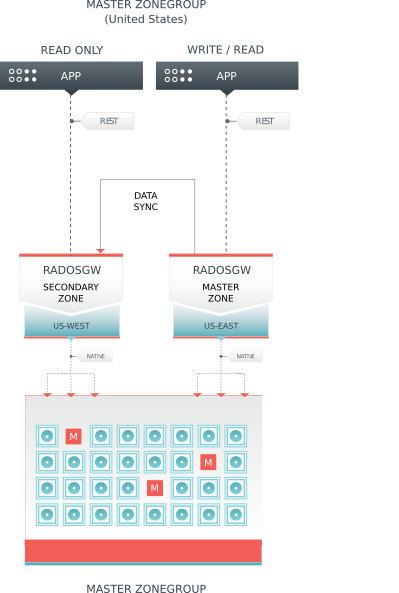

.. _multisite:

==========
Multi-Site
==========

.. versionadded:: Jewel

A single zone configuration typically consists of one zone group containing one
zone and one or more `ceph-radosgw` instances where you may load-balance gateway
client requests between the instances. In a single zone configuration, typically
multiple gateway instances point to a single Ceph storage cluster. However, Kraken
supports several multi-site configuration options for the Ceph Object Gateway:

- **Multi-zone:** A more advanced configuration consists of one zone group and
  multiple zones, each zone with one or more `ceph-radosgw` instances. Each zone
  is backed by its own Ceph Storage Cluster. Multiple zones in a zone group
  provides disaster recovery for the zone group should one of the zones experience
  a significant failure. In Kraken, each zone is active and may receive write
  operations. In addition to disaster recovery, multiple active zones may also
  serve as a foundation for content delivery networks.

- **Multi-zone-group:** Formerly called 'regions', Ceph Object Gateway can also
  support multiple zone groups, each zone group with one or more zones. Objects
  stored to zones in one zone group within the same realm as another zone
  group will share a global object namespace, ensuring unique object IDs across
  zone groups and zones.

- **Multiple Realms:** In Kraken, the Ceph Object Gateway supports the notion
  of realms, which can be a single zone group or multiple zone groups and
  a globally unique namespace for the realm. Multiple realms provide the ability
  to support numerous configurations and namespaces.

Replicating object data between zones within a zone group looks something
like this:

For additional details on setting up a cluster, see `Ceph Object Gateway for
Production <https://access.redhat.com/documentation/en-us/red_hat_ceph_storage/3/html/ceph_object_gateway_for_production/index/>`__.

Functional Changes from Infernalis
==================================

In Kraken, you can configure each Ceph Object Gateway to
work in an active-active zone configuration, allowing for writes to
non-master zones.

The multi-site configuration is stored within a container called a
"realm." The realm stores zone groups, zones, and a time "period" with
multiple epochs for tracking changes to the configuration. In Kraken,
the ``ceph-radosgw`` daemons handle the synchronization,
eliminating the need for a separate synchronization agent. Additionally,
the new approach to synchronization allows the Ceph Object Gateway to
operate with an "active-active" configuration instead of
"active-passive".

Requirements and Assumptions
============================

A multi-site configuration requires at least two Ceph storage clusters,
preferably given a distinct cluster name. At least two Ceph object
gateway instances, one for each Ceph storage cluster.

This guide assumes at least two Ceph storage clusters are in geographically
separate locations; however, the configuration can work on the same
site. This guide also assumes two Ceph object gateway servers named
``rgw1`` and ``rgw2``.

.. important:: Running a single Ceph storage cluster is NOT recommended unless you have 
               low latency WAN connections.

A multi-site configuration requires a master zone group and a master
zone. Additionally, each zone group requires a master zone. Zone groups
may have one or more secondary or non-master zones.

In this guide, the ``rgw1`` host will serve as the master zone of the
master zone group; and, the ``rgw2`` host will serve as the secondary zone
of the master zone group.

See `Pools`_ for instructions on creating and tuning pools for Ceph
Object Storage.

See `Sync Policy Config`_ for instructions on defining fine grained bucket sync
policy rules.

.. _master-zone-label:

Configuring a Master Zone
=========================

All gateways in a multi-site configuration will retrieve their
configuration from a ``ceph-radosgw`` daemon on a host within the master
zone group and master zone. To configure your gateways in a multi-site
configuration, choose a ``ceph-radosgw`` instance to configure the
master zone group and master zone.

Create a Realm
--------------

A realm contains the multi-site configuration of zone groups and zones
and also serves to enforce a globally unique namespace within the realm.

Create a new realm for the multi-site configuration by opening a command
line interface on a host identified to serve in the master zone group
and zone. Then, execute the following:

::

    # radosgw-admin realm create --rgw-realm={realm-name} [--default]

For example:

::

    # radosgw-admin realm create --rgw-realm=movies --default

If the cluster will have a single realm, specify the ``--default`` flag.
If ``--default`` is specified, ``radosgw-admin`` will use this realm by
default. If ``--default`` is not specified, adding zone-groups and zones
requires specifying either the ``--rgw-realm`` flag or the
``--realm-id`` flag to identify the realm when adding zone groups and
zones.

After creating the realm, ``radosgw-admin`` will echo back the realm
configuration. For example:

::

    {
        "id": "0956b174-fe14-4f97-8b50-bb7ec5e1cf62",
        "name": "movies",
        "current_period": "1950b710-3e63-4c41-a19e-46a715000980",
        "epoch": 1
    }

.. note:: Ceph generates a unique ID for the realm, which allows the renaming
          of a realm if the need arises.

Create a Master Zone Group
--------------------------

A realm must have at least one zone group, which will serve as the
master zone group for the realm.

Create a new master zone group for the multi-site configuration by
opening a command line interface on a host identified to serve in the
master zone group and zone. Then, execute the following:

::

    # radosgw-admin zonegroup create --rgw-zonegroup={name} --endpoints={url} [--rgw-realm={realm-name}|--realm-id={realm-id}] --master --default

For example:

::

    # radosgw-admin zonegroup create --rgw-zonegroup=us --endpoints=http://rgw1:80 --rgw-realm=movies --master --default

If the realm will only have a single zone group, specify the
``--default`` flag. If ``--default`` is specified, ``radosgw-admin``
will use this zone group by default when adding new zones. If
``--default`` is not specified, adding zones will require either the
``--rgw-zonegroup`` flag or the ``--zonegroup-id`` flag to identify the
zone group when adding or modifying zones.

After creating the master zone group, ``radosgw-admin`` will echo back
the zone group configuration. For example:

::

    {
        "id": "f1a233f5-c354-4107-b36c-df66126475a6",
        "name": "us",
        "api_name": "us",
        "is_master": "true",
        "endpoints": [
            "http:\/\/rgw1:80"
        ],
        "hostnames": [],
        "hostnames_s3webzone": [],
        "master_zone": "",
        "zones": [],
        "placement_targets": [],
        "default_placement": "",
        "realm_id": "0956b174-fe14-4f97-8b50-bb7ec5e1cf62"
    }

Create a Master Zone
--------------------

.. important:: Zones must be created on a Ceph Object Gateway node that will be
               within the zone.

Create a new master zone for the multi-site configuration by opening a
command line interface on a host identified to serve in the master zone
group and zone. Then, execute the following:

::

    # radosgw-admin zone create --rgw-zonegroup={zone-group-name} \
                                --rgw-zone={zone-name} \
                                --master --default \
                                --endpoints={http://fqdn}[,{http://fqdn}]

For example:

::

    # radosgw-admin zone create --rgw-zonegroup=us --rgw-zone=us-east \
                                --master --default \
                                --endpoints={http://fqdn}[,{http://fqdn}]

.. note:: The ``--access-key`` and ``--secret`` aren’t specified. These
          settings will be added to the zone once the user is created in the
          next section.

.. important:: The following steps assume a multi-site configuration using newly
               installed systems that aren’t storing data yet. DO NOT DELETE the
               ``default`` zone and its pools if you are already using it to store
               data, or the data will be deleted and unrecoverable.

Delete Default Zone Group and Zone
----------------------------------

Delete the ``default`` zone if it exists. Make sure to remove it from
the default zone group first.

::

    # radosgw-admin zonegroup remove --rgw-zonegroup=default --rgw-zone=default
    # radosgw-admin period update --commit
    # radosgw-admin zone rm --rgw-zone=default
    # radosgw-admin period update --commit
    # radosgw-admin zonegroup delete --rgw-zonegroup=default
    # radosgw-admin period update --commit

Finally, delete the ``default`` pools in your Ceph storage cluster if
they exist.

.. important:: The following step assumes a multi-site configuration using newly
               installed systems that aren’t currently storing data. DO NOT DELETE
               the ``default`` zone group if you are already using it to store
               data.

::

    # ceph osd pool rm default.rgw.control default.rgw.control --yes-i-really-really-mean-it
    # ceph osd pool rm default.rgw.data.root default.rgw.data.root --yes-i-really-really-mean-it
    # ceph osd pool rm default.rgw.gc default.rgw.gc --yes-i-really-really-mean-it
    # ceph osd pool rm default.rgw.log default.rgw.log --yes-i-really-really-mean-it
    # ceph osd pool rm default.rgw.users.uid default.rgw.users.uid --yes-i-really-really-mean-it

Create a System User
--------------------

The ``ceph-radosgw`` daemons must authenticate before pulling realm and
period information. In the master zone, create a system user to
facilitate authentication between daemons.

::

    # radosgw-admin user create --uid="{user-name}" --display-name="{Display Name}" --system

For example:

::

    # radosgw-admin user create --uid="synchronization-user" --display-name="Synchronization User" --system

Make a note of the ``access_key`` and ``secret_key``, as the secondary
zones will require them to authenticate with the master zone.

Finally, add the system user to the master zone.

::

    # radosgw-admin zone modify --rgw-zone=us-east --access-key={access-key} --secret={secret}
    # radosgw-admin period update --commit

Update the Period
-----------------

After updating the master zone configuration, update the period.

::

    # radosgw-admin period update --commit

.. note:: Updating the period changes the epoch, and ensures that other zones
          will receive the updated configuration.

Update the Ceph Configuration File
----------------------------------

Update the Ceph configuration file on master zone hosts by adding the
``rgw_zone`` configuration option and the name of the master zone to the
instance entry.

::

    [client.rgw.{instance-name}]
    ...
    rgw_zone={zone-name}

For example:

::

    [client.rgw.rgw1]
    host = rgw1
    rgw frontends = "civetweb port=80"
    rgw_zone=us-east

Start the Gateway
-----------------

On the object gateway host, start and enable the Ceph Object Gateway
service:

::

    # systemctl start ceph-radosgw@rgw.`hostname -s`
    # systemctl enable ceph-radosgw@rgw.`hostname -s`

.. _secondary-zone-label:

Configure Secondary Zones
=========================

Zones within a zone group replicate all data to ensure that each zone
has the same data. When creating the secondary zone, execute all of the
following operations on a host identified to serve the secondary zone.

.. note:: To add a third zone, follow the same procedures as for adding the
          secondary zone. Use different zone name.

.. important:: You must execute metadata operations, such as user creation, on a
               host within the master zone. The master zone and the secondary zone
               can receive bucket operations, but the secondary zone redirects
               bucket operations to the master zone. If the master zone is down,
               bucket operations will fail.

Pull the Realm
--------------

Using the URL path, access key and secret of the master zone in the
master zone group, pull the realm configuration to the host. To pull a
non-default realm, specify the realm using the ``--rgw-realm`` or
``--realm-id`` configuration options.

::

    # radosgw-admin realm pull --url={url-to-master-zone-gateway} --access-key={access-key} --secret={secret}

.. note:: Pulling the realm also retrieves the remote's current period
          configuration, and makes it the current period on this host as well.

If this realm is the default realm or the only realm, make the realm the
default realm.

::

    # radosgw-admin realm default --rgw-realm={realm-name}

Create a Secondary Zone
-----------------------

.. important:: Zones must be created on a Ceph Object Gateway node that will be
               within the zone.

Create a secondary zone for the multi-site configuration by opening a
command line interface on a host identified to serve the secondary zone.
Specify the zone group ID, the new zone name and an endpoint for the
zone. **DO NOT** use the ``--master`` or ``--default`` flags. In Kraken,
all zones run in an active-active configuration by
default; that is, a gateway client may write data to any zone and the
zone will replicate the data to all other zones within the zone group.
If the secondary zone should not accept write operations, specify the
``--read-only`` flag to create an active-passive configuration between
the master zone and the secondary zone. Additionally, provide the
``access_key`` and ``secret_key`` of the generated system user stored in
the master zone of the master zone group. Execute the following:

::

    # radosgw-admin zone create --rgw-zonegroup={zone-group-name}\
                                --rgw-zone={zone-name} --endpoints={url} \
                                --access-key={system-key} --secret={secret}\
                                --endpoints=http://{fqdn}:80 \
                                [--read-only]

For example:

::

    # radosgw-admin zone create --rgw-zonegroup=us --rgw-zone=us-west \
                                --access-key={system-key} --secret={secret} \
                                --endpoints=http://rgw2:80

.. important:: The following steps assume a multi-site configuration using newly
               installed systems that aren’t storing data. **DO NOT DELETE** the
               ``default`` zone and its pools if you are already using it to store
               data, or the data will be lost and unrecoverable.

Delete the default zone if needed.

::

    # radosgw-admin zone rm --rgw-zone=default

Finally, delete the default pools in your Ceph storage cluster if
needed.

::

    # ceph osd pool rm default.rgw.control default.rgw.control --yes-i-really-really-mean-it
    # ceph osd pool rm default.rgw.data.root default.rgw.data.root --yes-i-really-really-mean-it
    # ceph osd pool rm default.rgw.gc default.rgw.gc --yes-i-really-really-mean-it
    # ceph osd pool rm default.rgw.log default.rgw.log --yes-i-really-really-mean-it
    # ceph osd pool rm default.rgw.users.uid default.rgw.users.uid --yes-i-really-really-mean-it

Update the Ceph Configuration File
----------------------------------

Update the Ceph configuration file on the secondary zone hosts by adding
the ``rgw_zone`` configuration option and the name of the secondary zone
to the instance entry.

::

    [client.rgw.{instance-name}]
    ...
    rgw_zone={zone-name}

For example:

::

    [client.rgw.rgw2]
    host = rgw2
    rgw frontends = "civetweb port=80"
    rgw_zone=us-west

Update the Period
-----------------

After updating the master zone configuration, update the period.

::

    # radosgw-admin period update --commit

.. note:: Updating the period changes the epoch, and ensures that other zones
          will receive the updated configuration.

Start the Gateway
-----------------

On the object gateway host, start and enable the Ceph Object Gateway
service:

::

    # systemctl start ceph-radosgw@rgw.`hostname -s`
    # systemctl enable ceph-radosgw@rgw.`hostname -s`

Check Synchronization Status
----------------------------

Once the secondary zone is up and running, check the synchronization
status. Synchronization copies users and buckets created in the master
zone to the secondary zone.

::

    # radosgw-admin sync status

The output will provide the status of synchronization operations. For
example:

::

    realm f3239bc5-e1a8-4206-a81d-e1576480804d (earth)
        zonegroup c50dbb7e-d9ce-47cc-a8bb-97d9b399d388 (us)
             zone 4c453b70-4a16-4ce8-8185-1893b05d346e (us-west)
    metadata sync syncing
                  full sync: 0/64 shards
                  metadata is caught up with master
                  incremental sync: 64/64 shards
        data sync source: 1ee9da3e-114d-4ae3-a8a4-056e8a17f532 (us-east)
                          syncing
                          full sync: 0/128 shards
                          incremental sync: 128/128 shards
                          data is caught up with source

.. note:: Secondary zones accept bucket operations; however, secondary zones
          redirect bucket operations to the master zone and then synchronize
          with the master zone to receive the result of the bucket operations.
          If the master zone is down, bucket operations executed on the
          secondary zone will fail, but object operations should succeed.

Maintenance
===========

Checking the Sync Status
------------------------

Information about the replication status of a zone can be queried with::

    $ radosgw-admin sync status
            realm b3bc1c37-9c44-4b89-a03b-04c269bea5da (earth)
        zonegroup f54f9b22-b4b6-4a0e-9211-fa6ac1693f49 (us)
             zone adce11c9-b8ed-4a90-8bc5-3fc029ff0816 (us-2)
            metadata sync syncing
                  full sync: 0/64 shards
                  incremental sync: 64/64 shards
                  metadata is behind on 1 shards
                  oldest incremental change not applied: 2017-03-22 10:20:00.0.881361s
        data sync source: 341c2d81-4574-4d08-ab0f-5a2a7b168028 (us-1)
                          syncing
                          full sync: 0/128 shards
                          incremental sync: 128/128 shards
                          data is caught up with source
                  source: 3b5d1a3f-3f27-4e4a-8f34-6072d4bb1275 (us-3)
                          syncing
                          full sync: 0/128 shards
                          incremental sync: 128/128 shards
                          data is caught up with source

Changing the Metadata Master Zone
---------------------------------

.. important:: Care must be taken when changing which zone is the metadata
               master. If a zone has not finished syncing metadata from the current master
               zone, it will be unable to serve any remaining entries when promoted to
               master and those changes will be lost. For this reason, waiting for a
               zone's ``radosgw-admin sync status`` to catch up on metadata sync before
               promoting it to master is recommended.

               Similarly, if changes to metadata are being processed by the current master
               zone while another zone is being promoted to master, those changes are
               likely to be lost. To avoid this, shutting down any ``radosgw`` instances
               on the previous master zone is recommended. After promoting another zone,
               its new period can be fetched with ``radosgw-admin period pull`` and the
               gateway(s) can be restarted.

To promote a zone (for example, zone ``us-2`` in zonegroup ``us``) to metadata
master, run the following commands on that zone::

  $ radosgw-admin zone modify --rgw-zone=us-2 --master
  $ radosgw-admin zonegroup modify --rgw-zonegroup=us --master
  $ radosgw-admin period update --commit

This will generate a new period, and the radosgw instance(s) in zone ``us-2``
will send this period to other zones.

Failover and Disaster Recovery
==============================

If the master zone should fail, failover to the secondary zone for
disaster recovery.

1. Make the secondary zone the master and default zone. For example:

   ::

       # radosgw-admin zone modify --rgw-zone={zone-name} --master --default

   By default, Ceph Object Gateway will run in an active-active
   configuration. If the cluster was configured to run in an
   active-passive configuration, the secondary zone is a read-only zone.
   Remove the ``--read-only`` status to allow the zone to receive write
   operations. For example:

   ::

       # radosgw-admin zone modify --rgw-zone={zone-name} --master --default \
                                   --read-only=false

2. Update the period to make the changes take effect.

   ::

       # radosgw-admin period update --commit

3. Finally, restart the Ceph Object Gateway.

   ::

       # systemctl restart ceph-radosgw@rgw.`hostname -s`

If the former master zone recovers, revert the operation.

1. From the recovered zone, pull the latest realm configuration
   from the current master zone.

   ::

       # radosgw-admin realm pull --url={url-to-master-zone-gateway} \
                                  --access-key={access-key} --secret={secret}

2. Make the recovered zone the master and default zone.

   ::

       # radosgw-admin zone modify --rgw-zone={zone-name} --master --default

3. Update the period to make the changes take effect.

   ::

       # radosgw-admin period update --commit

4. Then, restart the Ceph Object Gateway in the recovered zone.

   ::

       # systemctl restart ceph-radosgw@rgw.`hostname -s`

5. If the secondary zone needs to be a read-only configuration, update
   the secondary zone.

   ::

       # radosgw-admin zone modify --rgw-zone={zone-name} --read-only

6. Update the period to make the changes take effect.

   ::

       # radosgw-admin period update --commit

7. Finally, restart the Ceph Object Gateway in the secondary zone.

   ::

       # systemctl restart ceph-radosgw@rgw.`hostname -s`

.. _rgw-multisite-migrate-from-single-site:

Migrating a Single Site System to Multi-Site
============================================

To migrate from a single site system with a ``default`` zone group and
zone to a multi site system, use the following steps:

1. Create a realm. Replace ``<name>`` with the realm name.

   ::

       # radosgw-admin realm create --rgw-realm=<name> --default

2. Rename the default zone and zonegroup. Replace ``<name>`` with the
   zonegroup or zone name.

   ::

       # radosgw-admin zonegroup rename --rgw-zonegroup default --zonegroup-new-name=<name>
       # radosgw-admin zone rename --rgw-zone default --zone-new-name us-east-1 --rgw-zonegroup=<name>

3. Configure the master zonegroup. Replace ``<name>`` with the realm or
   zonegroup name. Replace ``<fqdn>`` with the fully qualified domain
   name(s) in the zonegroup.

   ::

       # radosgw-admin zonegroup modify --rgw-realm=<name> --rgw-zonegroup=<name> --endpoints http://<fqdn>:80 --master --default

4. Configure the master zone. Replace ``<name>`` with the realm,
   zonegroup or zone name. Replace ``<fqdn>`` with the fully qualified
   domain name(s) in the zonegroup.

   ::

       # radosgw-admin zone modify --rgw-realm=<name> --rgw-zonegroup=<name> \
                                   --rgw-zone=<name> --endpoints http://<fqdn>:80 \
                                   --access-key=<access-key> --secret=<secret-key> \
                                   --master --default

5. Create a system user. Replace ``<user-id>`` with the username.
   Replace ``<display-name>`` with a display name. It may contain
   spaces.

   ::

       # radosgw-admin user create --uid=<user-id> --display-name="<display-name>"\
                                   --access-key=<access-key> --secret=<secret-key> --system

6. Commit the updated configuration.

   ::

       # radosgw-admin period update --commit

7. Finally, restart the Ceph Object Gateway.

   ::

       # systemctl restart ceph-radosgw@rgw.`hostname -s`

After completing this procedure, proceed to `Configure a Secondary
Zone <#configure-secondary-zones>`__ to create a secondary zone
in the master zone group.

Multi-Site Configuration Reference
==================================

The following sections provide additional details and command-line
usage for realms, periods, zone groups and zones.

Realms
------

A realm represents a globally unique namespace consisting of one or more
zonegroups containing one or more zones, and zones containing buckets,
which in turn contain objects. A realm enables the Ceph Object Gateway
to support multiple namespaces and their configuration on the same
hardware.

A realm contains the notion of periods. Each period represents the state
of the zone group and zone configuration in time. Each time you make a
change to a zonegroup or zone, update the period and commit it.

By default, the Ceph Object Gateway does not create a realm
for backward compatibility with Infernalis and earlier releases.
However, as a best practice, we recommend creating realms for new
clusters.

Create a Realm
~~~~~~~~~~~~~~

To create a realm, execute ``realm create`` and specify the realm name.
If the realm is the default, specify ``--default``.

::

    # radosgw-admin realm create --rgw-realm={realm-name} [--default]

For example:

::

    # radosgw-admin realm create --rgw-realm=movies --default

By specifying ``--default``, the realm will be called implicitly with
each ``radosgw-admin`` call unless ``--rgw-realm`` and the realm name
are explicitly provided.

Make a Realm the Default
~~~~~~~~~~~~~~~~~~~~~~~~

One realm in the list of realms should be the default realm. There may
be only one default realm. If there is only one realm and it wasn’t
specified as the default realm when it was created, make it the default
realm. Alternatively, to change which realm is the default, execute:

::

    # radosgw-admin realm default --rgw-realm=movies

.. note:: When the realm is default, the command line assumes
   ``--rgw-realm=<realm-name>`` as an argument.

Delete a Realm
~~~~~~~~~~~~~~

To delete a realm, execute ``realm delete`` and specify the realm name.

::

    # radosgw-admin realm delete --rgw-realm={realm-name}

For example:

::

    # radosgw-admin realm delete --rgw-realm=movies

Get a Realm
~~~~~~~~~~~

To get a realm, execute ``realm get`` and specify the realm name.

::

    #radosgw-admin realm get --rgw-realm=<name>

For example:

::

    # radosgw-admin realm get --rgw-realm=movies [> filename.json]

The CLI will echo a JSON object with the realm properties.

::

    {
        "id": "0a68d52e-a19c-4e8e-b012-a8f831cb3ebc",
        "name": "movies",
        "current_period": "b0c5bbef-4337-4edd-8184-5aeab2ec413b",
        "epoch": 1
    }

Use ``>`` and an output file name to output the JSON object to a file.

Set a Realm
~~~~~~~~~~~

To set a realm, execute ``realm set``, specify the realm name, and
``--infile=`` with an input file name.

::

    #radosgw-admin realm set --rgw-realm=<name> --infile=<infilename>

For example:

::

    # radosgw-admin realm set --rgw-realm=movies --infile=filename.json

List Realms
~~~~~~~~~~~

To list realms, execute ``realm list``.

::

    # radosgw-admin realm list

List Realm Periods
~~~~~~~~~~~~~~~~~~

To list realm periods, execute ``realm list-periods``.

::

    # radosgw-admin realm list-periods

Pull a Realm
~~~~~~~~~~~~

To pull a realm from the node containing the master zone group and
master zone to a node containing a secondary zone group or zone, execute
``realm pull`` on the node that will receive the realm configuration.

::

    # radosgw-admin realm pull --url={url-to-master-zone-gateway} --access-key={access-key} --secret={secret}

Rename a Realm
~~~~~~~~~~~~~~

A realm is not part of the period. Consequently, renaming the realm is
only applied locally, and will not get pulled with ``realm pull``. When
renaming a realm with multiple zones, run the command on each zone. To
rename a realm, execute the following:

::

    # radosgw-admin realm rename --rgw-realm=<current-name> --realm-new-name=<new-realm-name>

.. note:: DO NOT use ``realm set`` to change the ``name`` parameter. That
          changes the internal name only. Specifying ``--rgw-realm`` would
          still use the old realm name.

Zone Groups
-----------

The Ceph Object Gateway supports multi-site deployments and a global
namespace by using the notion of zone groups. Formerly called a region
in Infernalis, a zone group defines the geographic location of one or more Ceph
Object Gateway instances within one or more zones.

Configuring zone groups differs from typical configuration procedures,
because not all of the settings end up in a Ceph configuration file. You
can list zone groups, get a zone group configuration, and set a zone
group configuration.

Create a Zone Group
~~~~~~~~~~~~~~~~~~~

Creating a zone group consists of specifying the zone group name.
Creating a zone assumes it will live in the default realm unless
``--rgw-realm=<realm-name>`` is specified. If the zonegroup is the
default zonegroup, specify the ``--default`` flag. If the zonegroup is
the master zonegroup, specify the ``--master`` flag. For example:

::

    # radosgw-admin zonegroup create --rgw-zonegroup=<name> [--rgw-realm=<name>][--master] [--default]

.. note:: Use ``zonegroup modify --rgw-zonegroup=<zonegroup-name>`` to modify
          an existing zone group’s settings.

Make a Zone Group the Default
~~~~~~~~~~~~~~~~~~~~~~~~~~~~~

One zonegroup in the list of zonegroups should be the default zonegroup.
There may be only one default zonegroup. If there is only one zonegroup
and it wasn’t specified as the default zonegroup when it was created,
make it the default zonegroup. Alternatively, to change which zonegroup
is the default, execute:

::

    # radosgw-admin zonegroup default --rgw-zonegroup=comedy

.. note:: When the zonegroup is default, the command line assumes
          ``--rgw-zonegroup=<zonegroup-name>`` as an argument.

Then, update the period:

::

    # radosgw-admin period update --commit

Add a Zone to a Zone Group
~~~~~~~~~~~~~~~~~~~~~~~~~~

To add a zone to a zonegroup, execute the following:

::

    # radosgw-admin zonegroup add --rgw-zonegroup=<name> --rgw-zone=<name>

Then, update the period:

::

    # radosgw-admin period update --commit

Remove a Zone from a Zone Group
~~~~~~~~~~~~~~~~~~~~~~~~~~~~~~~

To remove a zone from a zonegroup, execute the following:

::

    # radosgw-admin zonegroup remove --rgw-zonegroup=<name> --rgw-zone=<name>

Then, update the period:

::

    # radosgw-admin period update --commit

Rename a Zone Group
~~~~~~~~~~~~~~~~~~~

To rename a zonegroup, execute the following:

::

    # radosgw-admin zonegroup rename --rgw-zonegroup=<name> --zonegroup-new-name=<name>

Then, update the period:

::

    # radosgw-admin period update --commit

Delete a Zone Group
~~~~~~~~~~~~~~~~~~~

To delete a zonegroup, execute the following:

::

    # radosgw-admin zonegroup delete --rgw-zonegroup=<name>

Then, update the period:

::

    # radosgw-admin period update --commit

List Zone Groups
~~~~~~~~~~~~~~~~

A Ceph cluster contains a list of zone groups. To list the zone groups,
execute:

::

    # radosgw-admin zonegroup list

The ``radosgw-admin`` returns a JSON formatted list of zone groups.

::

    {
        "default_info": "90b28698-e7c3-462c-a42d-4aa780d24eda",
        "zonegroups": [
            "us"
        ]
    }

Get a Zone Group Map
~~~~~~~~~~~~~~~~~~~~

To list the details of each zone group, execute:

::

    # radosgw-admin zonegroup-map get

.. note:: If you receive a ``failed to read zonegroup map`` error, run
          ``radosgw-admin zonegroup-map update`` as ``root`` first.

Get a Zone Group
~~~~~~~~~~~~~~~~

To view the configuration of a zone group, execute:

::

    radosgw-admin zonegroup get [--rgw-zonegroup=<zonegroup>]

The zone group configuration looks like this:

::

    {
        "id": "90b28698-e7c3-462c-a42d-4aa780d24eda",
        "name": "us",
        "api_name": "us",
        "is_master": "true",
        "endpoints": [
            "http:\/\/rgw1:80"
        ],
        "hostnames": [],
        "hostnames_s3website": [],
        "master_zone": "9248cab2-afe7-43d8-a661-a40bf316665e",
        "zones": [
            {
                "id": "9248cab2-afe7-43d8-a661-a40bf316665e",
                "name": "us-east",
                "endpoints": [
                    "http:\/\/rgw1"
                ],
                "log_meta": "true",
                "log_data": "true",
                "bucket_index_max_shards": 0,
                "read_only": "false"
            },
            {
                "id": "d1024e59-7d28-49d1-8222-af101965a939",
                "name": "us-west",
                "endpoints": [
                    "http:\/\/rgw2:80"
                ],
                "log_meta": "false",
                "log_data": "true",
                "bucket_index_max_shards": 0,
                "read_only": "false"
            }
        ],
        "placement_targets": [
            {
                "name": "default-placement",
                "tags": []
            }
        ],
        "default_placement": "default-placement",
        "realm_id": "ae031368-8715-4e27-9a99-0c9468852cfe"
    }

Set a Zone Group
~~~~~~~~~~~~~~~~

Defining a zone group consists of creating a JSON object, specifying at
least the required settings:

1. ``name``: The name of the zone group. Required.

2. ``api_name``: The API name for the zone group. Optional.

3. ``is_master``: Determines if the zone group is the master zone group.
   Required. **note:** You can only have one master zone group.

4. ``endpoints``: A list of all the endpoints in the zone group. For
   example, you may use multiple domain names to refer to the same zone
   group. Remember to escape the forward slashes (``\/``). You may also
   specify a port (``fqdn:port``) for each endpoint. Optional.

5. ``hostnames``: A list of all the hostnames in the zone group. For
   example, you may use multiple domain names to refer to the same zone
   group. Optional. The ``rgw dns name`` setting will automatically be
   included in this list. You should restart the gateway daemon(s) after
   changing this setting.

6. ``master_zone``: The master zone for the zone group. Optional. Uses
   the default zone if not specified. **note:** You can only have one
   master zone per zone group.

7. ``zones``: A list of all zones within the zone group. Each zone has a
   name (required), a list of endpoints (optional), and whether or not
   the gateway will log metadata and data operations (false by default).

8. ``placement_targets``: A list of placement targets (optional). Each
   placement target contains a name (required) for the placement target
   and a list of tags (optional) so that only users with the tag can use
   the placement target (i.e., the user’s ``placement_tags`` field in
   the user info).

9. ``default_placement``: The default placement target for the object
   index and object data. Set to ``default-placement`` by default. You
   may also set a per-user default placement in the user info for each
   user.

To set a zone group, create a JSON object consisting of the required
fields, save the object to a file (e.g., ``zonegroup.json``); then,
execute the following command:

::

    # radosgw-admin zonegroup set --infile zonegroup.json

Where ``zonegroup.json`` is the JSON file you created.

.. important:: The ``default`` zone group ``is_master`` setting is ``true`` by
               default. If you create a new zone group and want to make it the
               master zone group, you must either set the ``default`` zone group
               ``is_master`` setting to ``false``, or delete the ``default`` zone
               group.

Finally, update the period:

::

    # radosgw-admin period update --commit

Set a Zone Group Map
~~~~~~~~~~~~~~~~~~~~

Setting a zone group map consists of creating a JSON object consisting
of one or more zone groups, and setting the ``master_zonegroup`` for the
cluster. Each zone group in the zone group map consists of a key/value
pair, where the ``key`` setting is equivalent to the ``name`` setting
for an individual zone group configuration, and the ``val`` is a JSON
object consisting of an individual zone group configuration.

You may only have one zone group with ``is_master`` equal to ``true``,
and it must be specified as the ``master_zonegroup`` at the end of the
zone group map. The following JSON object is an example of a default
zone group map.

::

    {
        "zonegroups": [
            {
                "key": "90b28698-e7c3-462c-a42d-4aa780d24eda",
                "val": {
                    "id": "90b28698-e7c3-462c-a42d-4aa780d24eda",
                    "name": "us",
                    "api_name": "us",
                    "is_master": "true",
                    "endpoints": [
                        "http:\/\/rgw1:80"
                    ],
                    "hostnames": [],
                    "hostnames_s3website": [],
                    "master_zone": "9248cab2-afe7-43d8-a661-a40bf316665e",
                    "zones": [
                        {
                            "id": "9248cab2-afe7-43d8-a661-a40bf316665e",
                            "name": "us-east",
                            "endpoints": [
                                "http:\/\/rgw1"
                            ],
                            "log_meta": "true",
                            "log_data": "true",
                            "bucket_index_max_shards": 0,
                            "read_only": "false"
                        },
                        {
                            "id": "d1024e59-7d28-49d1-8222-af101965a939",
                            "name": "us-west",
                            "endpoints": [
                                "http:\/\/rgw2:80"
                            ],
                            "log_meta": "false",
                            "log_data": "true",
                            "bucket_index_max_shards": 0,
                            "read_only": "false"
                        }
                    ],
                    "placement_targets": [
                        {
                            "name": "default-placement",
                            "tags": []
                        }
                    ],
                    "default_placement": "default-placement",
                    "realm_id": "ae031368-8715-4e27-9a99-0c9468852cfe"
                }
            }
        ],
        "master_zonegroup": "90b28698-e7c3-462c-a42d-4aa780d24eda",
        "bucket_quota": {
            "enabled": false,
            "max_size_kb": -1,
            "max_objects": -1
        },
        "user_quota": {
            "enabled": false,
            "max_size_kb": -1,
            "max_objects": -1
        }
    }

To set a zone group map, execute the following:

::

    # radosgw-admin zonegroup-map set --infile zonegroupmap.json

Where ``zonegroupmap.json`` is the JSON file you created. Ensure that
you have zones created for the ones specified in the zone group map.
Finally, update the period.

::

    # radosgw-admin period update --commit

Zones
-----

Ceph Object Gateway supports the notion of zones. A zone defines a
logical group consisting of one or more Ceph Object Gateway instances.

Configuring zones differs from typical configuration procedures, because
not all of the settings end up in a Ceph configuration file. You can
list zones, get a zone configuration and set a zone configuration.

Create a Zone
~~~~~~~~~~~~~

To create a zone, specify a zone name. If it is a master zone, specify
the ``--master`` option. Only one zone in a zone group may be a master
zone. To add the zone to a zonegroup, specify the ``--rgw-zonegroup``
option with the zonegroup name.

::

    # radosgw-admin zone create --rgw-zone=<name> \
                    [--zonegroup=<zonegroup-name]\
                    [--endpoints=<endpoint>[,<endpoint>] \
                    [--master] [--default] \
                    --access-key $SYSTEM_ACCESS_KEY --secret $SYSTEM_SECRET_KEY

Then, update the period:

::

    # radosgw-admin period update --commit

Delete a Zone
~~~~~~~~~~~~~

To delete zone, first remove it from the zonegroup.

::

    # radosgw-admin zonegroup remove --zonegroup=<name>\
                                     --zone=<name>

Then, update the period:

::

    # radosgw-admin period update --commit

Next, delete the zone. Execute the following:

::

    # radosgw-admin zone rm --rgw-zone<name>

Finally, update the period:

::

    # radosgw-admin period update --commit

.. important:: Do not delete a zone without removing it from a zone group first.
               Otherwise, updating the period will fail.

If the pools for the deleted zone will not be used anywhere else,
consider deleting the pools. Replace ``<del-zone>`` in the example below
with the deleted zone’s name.

.. important:: Only delete the pools with prepended zone names. Deleting the root
               pool, such as, ``.rgw.root`` will remove all of the system’s
               configuration.

.. important:: Once the pools are deleted, all of the data within them are deleted
               in an unrecoverable manner. Only delete the pools if the pool
               contents are no longer needed.

::

    # ceph osd pool rm <del-zone>.rgw.control <del-zone>.rgw.control --yes-i-really-really-mean-it
    # ceph osd pool rm <del-zone>.rgw.data.root <del-zone>.rgw.data.root --yes-i-really-really-mean-it
    # ceph osd pool rm <del-zone>.rgw.gc <del-zone>.rgw.gc --yes-i-really-really-mean-it
    # ceph osd pool rm <del-zone>.rgw.log <del-zone>.rgw.log --yes-i-really-really-mean-it
    # ceph osd pool rm <del-zone>.rgw.users.uid <del-zone>.rgw.users.uid --yes-i-really-really-mean-it

Modify a Zone
~~~~~~~~~~~~~

To modify a zone, specify the zone name and the parameters you wish to
modify.

::

    # radosgw-admin zone modify [options]

Where ``[options]``:

- ``--access-key=<key>``
- ``--secret/--secret-key=<key>``
- ``--master``
- ``--default``
- ``--endpoints=<list>``

Then, update the period:

::

    # radosgw-admin period update --commit

List Zones
~~~~~~~~~~

As ``root``, to list the zones in a cluster, execute:

::

    # radosgw-admin zone list

Get a Zone
~~~~~~~~~~

As ``root``, to get the configuration of a zone, execute:

::

    # radosgw-admin zone get [--rgw-zone=<zone>]

The ``default`` zone looks like this:

::

    { "domain_root": ".rgw",
      "control_pool": ".rgw.control",
      "gc_pool": ".rgw.gc",
      "log_pool": ".log",
      "intent_log_pool": ".intent-log",
      "usage_log_pool": ".usage",
      "user_keys_pool": ".users",
      "user_email_pool": ".users.email",
      "user_swift_pool": ".users.swift",
      "user_uid_pool": ".users.uid",
      "system_key": { "access_key": "", "secret_key": ""},
      "placement_pools": [
          {  "key": "default-placement",
             "val": { "index_pool": ".rgw.buckets.index",
                      "data_pool": ".rgw.buckets"}
          }
        ]
      }

Set a Zone
~~~~~~~~~~

Configuring a zone involves specifying a series of Ceph Object Gateway
pools. For consistency, we recommend using a pool prefix that is the
same as the zone name. See
`Pools <http://docs.ceph.com/docs/master/rados/operations/pools/#pools>`__
for details of configuring pools.

To set a zone, create a JSON object consisting of the pools, save the
object to a file (e.g., ``zone.json``); then, execute the following
command, replacing ``{zone-name}`` with the name of the zone:

::

    # radosgw-admin zone set --rgw-zone={zone-name} --infile zone.json

Where ``zone.json`` is the JSON file you created.

Then, as ``root``, update the period:

::

    # radosgw-admin period update --commit

Rename a Zone
~~~~~~~~~~~~~

To rename a zone, specify the zone name and the new zone name.

::

    # radosgw-admin zone rename --rgw-zone=<name> --zone-new-name=<name>

Then, update the period:

::

    # radosgw-admin period update --commit

Zone Group and Zone Settings
----------------------------

When configuring a default zone group and zone, the pool name includes
the zone name. For example:

-  ``default.rgw.control``

To change the defaults, include the following settings in your Ceph
configuration file under each ``[client.radosgw.{instance-name}]``
instance.

+-------------------------------------+-----------------------------------+---------+-----------------------+
| Name                                | Description                       | Type    | Default               |
+=====================================+===================================+=========+=======================+
| ``rgw_zone``                        | The name of the zone for the      | String  | None                  |
|                                     | gateway instance.                 |         |                       |
+-------------------------------------+-----------------------------------+---------+-----------------------+
| ``rgw_zonegroup``                   | The name of the zone group for    | String  | None                  |
|                                     | the gateway instance.             |         |                       |
+-------------------------------------+-----------------------------------+---------+-----------------------+
| ``rgw_zonegroup_root_pool``         | The root pool for the zone group. | String  | ``.rgw.root``         |
+-------------------------------------+-----------------------------------+---------+-----------------------+
| ``rgw_zone_root_pool``              | The root pool for the zone.       | String  | ``.rgw.root``         |
+-------------------------------------+-----------------------------------+---------+-----------------------+
| ``rgw_default_zone_group_info_oid`` | The OID for storing the default   | String  | ``default.zonegroup`` |
|                                     | zone group. We do not recommend   |         |                       |
|                                     | changing this setting.            |         |                       |
+-------------------------------------+-----------------------------------+---------+-----------------------+

.. _`Pools`: ../pools
.. _`Sync Policy Config`: ../multisite-sync-policy
