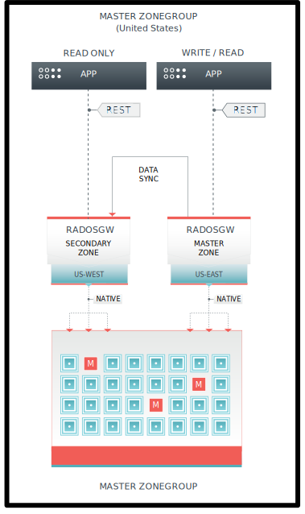

.. _multisite:

==========
Multi-Site
==========

Single-zone Configurations and Multi-site Configurations
========================================================

Single-zone Configurations
--------------------------

A single-zone configuration typically consists of two things:

#. One "zonegroup", which contains one zone. 
#. One or more `ceph-radosgw` instances that have `ceph-radosgw` client
   requests load-balanced between them. 

In a typical single-zone configuration, there are multiple `ceph-radosgw`
instances that make use of a single Ceph storage cluster.  

Varieties of Multi-site Configuration
-------------------------------------

.. versionadded:: Jewel

Since the Kraken release, Ceph has supported several multi-site configurations
for the Ceph Object Gateway:

- **Multi-zone:** The "multi-zone" configuration has a complex topology. A
  multi-zone configuration consists of one zonegroup and multiple zones. Each
  zone consists of one or more `ceph-radosgw` instances. **Each zone is backed
  by its own Ceph Storage Cluster.**
  
  The presence of multiple zones in a given zonegroup provides disaster
  recovery for that zonegroup in the event that one of the zones experiences a
  significant failure. Each zone is active and can receive write operations. A
  multi-zone configuration that contains multiple active zones enhances
  disaster recovery and can be used as a foundation for content-delivery
  networks. 

- **Multi-zonegroups:** Ceph Object Gateway supports multiple zonegroups (which
  were formerly called "regions"). Each zonegroup contains one or more zones.
  If two zones are in the same zonegroup and that zonegroup is in the same
  realm as a second zonegroup, then the objects stored in the two zones share a
  global object namespace. This global object namespace ensures unique object
  IDs across zonegroups and zones.

  Each bucket is owned by the zonegroup where it was created (except where
  overridden by the :ref:`LocationConstraint<s3_bucket_placement>` on
  bucket creation), and its object data will replicate only to other zones in
  that zonegroup. Any request for data in that bucket that is sent to other
  zonegroups will redirect to the zonegroup where the bucket resides.

  It can be useful to create multiple zonegroups when you want to share a
  namespace of users and buckets across many zones and isolate the object data
  to a subset of those zones. Maybe you have several connected sites that share
  storage but require only a single backup for purposes of disaster recovery.
  In such a case, you could create several zonegroups with only two zones each
  to avoid replicating all objects to all zones.

  In other cases, you might isolate data in separate realms, with each realm
  having a single zonegroup. Zonegroups provide flexibility by making it
  possible to control the isolation of data and metadata separately.

- **Multiple Realms:** Since the Kraken release, the Ceph Object Gateway
  supports "realms", which are containers for zonegroups. Realms make it
  possible to set policies that apply to multiple zonegroups. Realms have a
  globally unique namespace and can contain either a single zonegroup or
  multiple zonegroups. If you choose to make use of multiple realms, you can
  define multiple namespaces and multiple configurations (this means that each
  realm can have a configuration that is distinct from the configuration of
  other realms).

Diagram - Replication of Object Data Between Zones
--------------------------------------------------

The replication of object data between zones within a zonegroup looks
something like this:

At the top of this diagram, we see two applications (also known as "clients").
The application on the right is both writing and reading data from the Ceph
Cluster, by means of the RADOS Gateway (RGW). The application on the left is
only *reading* data from the Ceph Cluster, by means of an instance of RADOS
Gateway (RGW). In both cases (read-and-write and read-only), the transmssion of
data is handled RESTfully.

In the middle of this diagram, we see two zones, each of which contains an
instance of RADOS Gateway (RGW). These instances of RGW are handling the
movement of data from the applications to the zonegroup. The arrow from the
master zone (US-EAST) to the secondary zone (US-WEST) represents an act of data
synchronization.

At the bottom of this diagram, we see the data distributed into the Ceph
Storage Cluster.

For additional details on setting up a cluster, see `Ceph Object Gateway for
Production <https://access.redhat.com/documentation/en-us/red_hat_ceph_storage/3/html/ceph_object_gateway_for_production/index/>`__.

Functional Changes from Infernalis
==================================

Beginning with Kraken, each Ceph Object Gateway can be configured to work in an
active-active zone mode. This makes it possible to write to non-master zones.

The multi-site configuration is stored within a container called a "realm". The
realm stores zonegroups, zones, and a time "period" with multiple epochs (which
(the epochs) are used for tracking changes to the configuration). 

Beginning with Kraken, the ``ceph-radosgw`` daemons handle the synchronization
of data across zones, which eliminates the need for a separate synchronization
agent. This new approach to synchronization allows the Ceph Object Gateway to
operate with an "active-active" configuration instead of with an
"active-passive" configuration.

Requirements and Assumptions
============================

A multi-site configuration requires at least two Ceph storage clusters. The
multi-site configuration must have at least two Ceph object gateway instances
(one for each Ceph storage cluster).

This guide assumes that at least two Ceph storage clusters are in
geographically separate locations; however, the configuration can work on the
same site. This guide also assumes two Ceph object gateway servers named
``rgw1`` and ``rgw2``.

.. important:: Running a single geographically-distributed Ceph storage cluster
   is NOT recommended unless you have low latency WAN connections.

A multi-site configuration requires a master zonegroup and a master zone. Each
zonegroup requires a master zone. Zonegroups may have one or more secondary
or non-master zones.

In this guide, the ``rgw1`` host will serve as the master zone of the master
zonegroup; and, the ``rgw2`` host will serve as the secondary zone of the
master zonegroup.

See `Pools`_ for instructions on creating and tuning pools for Ceph Object
Storage.

See `Sync Policy Config`_ for instructions on defining fine-grained bucket sync
policy rules.

.. _master-zone-label:

Configuring a Master Zone
=========================

All gateways in a multi-site configuration retrieve their configurations from a
``ceph-radosgw`` daemon that is on a host within both the master zonegroup and
the master zone. To configure your gateways in a multi-site configuration,
choose a ``ceph-radosgw`` instance to configure the master zonegroup and
master zone.

Create a Realm
--------------

A realm contains the multi-site configuration of zonegroups and zones. The
realm enforces a globally unique namespace within itself.

#. Create a new realm for the multi-site configuration by opening a command
   line interface on a host that will serve in the master zonegroup and zone.
   Then run the following command:

   .. prompt:: bash #

      radosgw-admin realm create --rgw-realm={realm-name} [--default]

   For example:

   .. prompt:: bash #

      radosgw-admin realm create --rgw-realm=movies --default

   .. note:: If you intend the cluster to have a single realm, specify the ``--default`` flag.  

      If ``--default`` is specified, ``radosgw-admin`` uses this realm by default. 
      
      If ``--default`` is not specified, you must specify either the ``--rgw-realm`` flag or the ``--realm-id`` flag to identify the realm when adding zonegroups and zones.

#. After the realm has been created, ``radosgw-admin`` echoes back the realm
   configuration. For example:

   ::

       {
           "id": "0956b174-fe14-4f97-8b50-bb7ec5e1cf62",
           "name": "movies",
           "current_period": "1950b710-3e63-4c41-a19e-46a715000980",
           "epoch": 1
       }

   .. note:: Ceph generates a unique ID for the realm, which can be used to rename the realm if the need arises.

Create a Master Zonegroup
--------------------------

A realm must have at least one zonegroup which serves as the master zonegroup
for the realm.

#. To create a new master zonegroup for the multi-site configuration, open a
   command-line interface on a host in the master zonegroup and zone. Then
   run the following command:

   .. prompt:: bash #

      radosgw-admin zonegroup create --rgw-zonegroup={name} --endpoints={url} [--rgw-realm={realm-name}|--realm-id={realm-id}] --master --default

   For example:

   .. prompt:: bash #

      radosgw-admin zonegroup create --rgw-zonegroup=us --endpoints=http://rgw1:80 --rgw-realm=movies --master --default

   .. note:: If the realm will have only a single zonegroup, specify the ``--default`` flag. 

      If ``--default`` is specified, ``radosgw-admin`` uses this zonegroup by default when adding new zones. 
      
      If ``--default`` is not specified, you must use either the ``--rgw-zonegroup`` flag or the ``--zonegroup-id`` flag to identify the zonegroup when adding or modifying zones.

#. After creating the master zonegroup, ``radosgw-admin`` echoes back the
   zonegroup configuration. For example:

   ::
   
       {
           "id": "f1a233f5-c354-4107-b36c-df66126475a6",
           "name": "us",
           "api_name": "us",
           "is_master": "true",
           "endpoints": [
               "http:\/\/rgw1:80"
           ],
           "hostnames": [],
           "hostnames_s3website": [],
           "master_zone": "",
           "zones": [],
           "placement_targets": [],
           "default_placement": "",
           "realm_id": "0956b174-fe14-4f97-8b50-bb7ec5e1cf62"
       }

Create a Master Zone
--------------------

.. important:: Zones must be created on a Ceph Object Gateway node that will be
   within the zone.

Create a new master zone for the multi-site configuration by opening a command
line interface on a host that serves in the master zonegroup and zone. Then
run the following command:

.. prompt:: bash #

   radosgw-admin zone create --rgw-zonegroup={zone-group-name} \
                               --rgw-zone={zone-name} \
                               --master --default \
                               --endpoints={http://fqdn}[,{http://fqdn}]

For example:

.. prompt:: bash #

   radosgw-admin zone create --rgw-zonegroup=us --rgw-zone=us-east \
                               --master --default \
                               --endpoints={http://fqdn}[,{http://fqdn}]

.. note:: The ``--access-key`` and ``--secret`` aren’t specified. These
          settings will be added to the zone once the user is created in the
          next section.

.. important:: The following steps assume a multi-site configuration that uses
   newly installed systems that aren’t storing data yet. DO NOT DELETE the
   ``default`` zone and its pools if you are already using the zone to store
   data, or the data will be deleted and unrecoverable.

Delete Default Zonegroup and Zone
----------------------------------

#. Delete the ``default`` zone if it exists. Remove it from the default
   zonegroup first.

   .. prompt:: bash #

      radosgw-admin zonegroup delete --rgw-zonegroup=default --rgw-zone=default
      radosgw-admin period update --commit
      radosgw-admin zone delete --rgw-zone=default
      radosgw-admin period update --commit
      radosgw-admin zonegroup delete --rgw-zonegroup=default
      radosgw-admin period update --commit

#. Delete the ``default`` pools in your Ceph storage cluster if they exist.

   .. important:: The following step assumes a multi-site configuration that uses newly installed systems that aren’t currently storing data. DO NOT DELETE the ``default`` zonegroup if you are already using it to store data.

   .. prompt:: bash #
   
      ceph osd pool rm default.rgw.control default.rgw.control --yes-i-really-really-mean-it
      ceph osd pool rm default.rgw.data.root default.rgw.data.root --yes-i-really-really-mean-it
      ceph osd pool rm default.rgw.gc default.rgw.gc --yes-i-really-really-mean-it
      ceph osd pool rm default.rgw.log default.rgw.log --yes-i-really-really-mean-it
      ceph osd pool rm default.rgw.users.uid default.rgw.users.uid --yes-i-really-really-mean-it

Create a System User
--------------------

#. The ``ceph-radosgw`` daemons must authenticate before pulling realm and
   period information. In the master zone, create a "system user" to facilitate
   authentication between daemons.

   .. prompt:: bash #

      radosgw-admin user create --uid="{user-name}" --display-name="{Display Name}" --system

   For example:

   .. prompt:: bash #

      radosgw-admin user create --uid="synchronization-user" --display-name="Synchronization User" --system

#. Make a note of the ``access_key`` and ``secret_key``. The secondary zones
   require them to authenticate against the master zone.

#. Add the system user to the master zone:

   .. prompt:: bash #

      radosgw-admin zone modify --rgw-zone={zone-name} --access-key={access-key} --secret={secret}
      radosgw-admin period update --commit

Update the Period
-----------------

After updating the master zone configuration, update the period.

.. prompt:: bash #

   radosgw-admin period update --commit

.. note:: Updating the period changes the epoch, and ensures that other zones
          will receive the updated configuration.

Update the Ceph Configuration File
----------------------------------

Update the Ceph configuration file on master zone hosts by adding the
``rgw_zone`` configuration option and the name of the master zone to the
instance entry.

::

    [client.rgw.{instance-name}]
    ...
    rgw_zone={zone-name}

For example:

::

    [client.rgw.rgw1]
    host = rgw1
    rgw frontends = "civetweb port=80"
    rgw_zone=us-east

Start the Gateway
-----------------

On the object gateway host, start and enable the Ceph Object Gateway
service:

.. prompt:: bash #

   systemctl start ceph-radosgw@rgw.`hostname -s`
   systemctl enable ceph-radosgw@rgw.`hostname -s`

.. _secondary-zone-label:

Configuring Secondary Zones
===========================

Zones that are within a zonegroup replicate all data in order to ensure that
every zone has the same data. When creating a secondary zone, run the following
operations on a host identified to serve the secondary zone.

.. note:: To add a second secondary zone (that is, a second non-master zone
   within a zonegroup that already contains a secondary zone), follow :ref:`the
   same procedures that are used for adding a secondary
   zone<radosgw-multisite-secondary-zone-creating>`. Be sure to specify a
   different zone name than the name of the first secondary zone.

.. important:: Metadata operations (for example, user creation) must be
   run on a host within the master zone. Bucket operations can be received
   by the master zone or the secondary zone, but the secondary zone will
   redirect bucket operations to the master zone. If the master zone is down,
   bucket operations will fail.

Pulling the Realm Configuration
-------------------------------

The URL path, access key, and secret of the master zone in the master zone
group are used to pull the realm configuration to the host. When pulling the
configuration of a non-default realm, specify the realm using the
``--rgw-realm`` or ``--realm-id`` configuration options.

.. prompt:: bash #

   radosgw-admin realm pull --url={url-to-master-zone-gateway}
   --access-key={access-key} --secret={secret}

.. note:: Pulling the realm configuration also retrieves the remote's current
   period configuration, and makes it the current period on this host as well.

If this realm is the only realm, run the following command to make it the
default realm:

.. prompt:: bash #

   radosgw-admin realm default --rgw-realm={realm-name}

.. _radosgw-multisite-secondary-zone-creating:

Creating a Secondary Zone
-------------------------

.. important:: When a zone is created, it must be on a Ceph Object Gateway node
   within the zone.

In order to create a secondary zone for the multi-site configuration, open a
command line interface on a host identified to serve the secondary zone.
Specify the zonegroup ID, the new zone name, and an endpoint for the zone.
**DO NOT** use the ``--master`` or ``--default`` flags. Beginning in Kraken,
all zones run in an active-active configuration by default, which means that a
gateway client may write data to any zone and the zone will replicate the data
to all other zones within the zonegroup.  If you want to prevent the secondary
zone from accepting write operations, include the ``--read-only`` flag in the
command in order to create an active-passive configuration between the master
zone and the secondary zone. In any case, don't forget to provide the
``access_key`` and ``secret_key`` of the generated system user that is stored
in the master zone of the master zonegroup. Run the following command:

.. prompt:: bash #

   radosgw-admin zone create --rgw-zonegroup={zone-group-name} \
                                --rgw-zone={zone-name} \
                                --access-key={system-key} --secret={secret} \
                                --endpoints=http://{fqdn}:80 \
                                [--read-only]

For example:
    
    
.. prompt:: bash #

   radosgw-admin zone create --rgw-zonegroup=us --rgw-zone=us-west \
                                --access-key={system-key} --secret={secret} \
                                --endpoints=http://rgw2:80

.. important:: The following steps assume a multi-site configuration that uses
   newly installed systems that have not yet begun storing data. **DO NOT
   DELETE the** ``default`` **zone or its pools** if you are already using it
   to store data, or the data will be irretrievably lost.

Delete the default zone if needed:

.. prompt:: bash #

   radosgw-admin zone delete --rgw-zone=default

Finally, delete the default pools in your Ceph storage cluster if needed:

.. prompt:: bash #

   ceph osd pool rm default.rgw.control default.rgw.control --yes-i-really-really-mean-it
   ceph osd pool rm default.rgw.data.root default.rgw.data.root --yes-i-really-really-mean-it
   ceph osd pool rm default.rgw.gc default.rgw.gc --yes-i-really-really-mean-it
   ceph osd pool rm default.rgw.log default.rgw.log --yes-i-really-really-mean-it
   ceph osd pool rm default.rgw.users.uid default.rgw.users.uid --yes-i-really-really-mean-it
   
Updating the Ceph Configuration File
------------------------------------

To update the Ceph configuration file on the secondary zone hosts, add the
``rgw_zone`` configuration option and the name of the secondary zone to the
instance entry.

::

    [client.rgw.{instance-name}]
    ...
    rgw_zone={zone-name}

For example:

::

    [client.rgw.rgw2]
    host = rgw2
    rgw frontends = "civetweb port=80"
    rgw_zone=us-west

Updating the Period
-------------------

After updating the master zone configuration, update the period:

.. prompt:: bash #

   radosgw-admin period update --commit

.. note:: Updating the period changes the epoch, and ensures that other zones
   will receive the updated configuration.
          
Starting the Gateway
--------------------

To start the gateway, start and enable the Ceph Object Gateway service by
running the following commands on the object gateway host:

.. prompt:: bash #

   systemctl start ceph-radosgw@rgw.`hostname -s`
   systemctl enable ceph-radosgw@rgw.`hostname -s`

If the ``cephadm`` command was used to deploy the cluster, you will not be able
to use ``systemctl`` to start the gateway because no services will exist on
which ``systemctl`` could operate. This is due to the containerized nature of
the ``cephadm``-deployed Ceph cluster. If you have used the ``cephadm`` command
and you have a containerized cluster, you must run a command of the following
form to start the gateway:

.. prompt:: bash #

   ceph orch apply rgw <name> --realm=<realm> --zone=<zone> --placement --port

Checking Synchronization Status
-------------------------------

After the secondary zone is up and running, you can check the synchronization
status. The process of synchronization will copy users and buckets that were
created in the master zone from the master zone to the secondary zone.

.. prompt:: bash #

   radosgw-admin sync status

The output reports the status of synchronization operations. For example:

::

    realm f3239bc5-e1a8-4206-a81d-e1576480804d (earth)
        zonegroup c50dbb7e-d9ce-47cc-a8bb-97d9b399d388 (us)
             zone 4c453b70-4a16-4ce8-8185-1893b05d346e (us-west)
    metadata sync syncing
                  full sync: 0/64 shards
                  metadata is caught up with master
                  incremental sync: 64/64 shards
        data sync source: 1ee9da3e-114d-4ae3-a8a4-056e8a17f532 (us-east)
                          syncing
                          full sync: 0/128 shards
                          incremental sync: 128/128 shards
                          data is caught up with source

.. note:: Secondary zones accept bucket operations; however, secondary zones
   redirect bucket operations to the master zone and then synchronize with the
   master zone to receive the result of the bucket operations. If the master
   zone is down, bucket operations executed on the secondary zone will fail,
   but object operations should succeed.
          
          
Verifying an Object
-------------------

By default, after the successful synchronization of an object there is no
subsequent verification of the object. However, you can enable verification by
setting :confval:`rgw_sync_obj_etag_verify` to ``true``. After this value is
set to true, an MD5 checksum is used to verify the integrity of the data that
was transferred from the source to the destination. This ensures the integrity
of any object that has been fetched from a remote server over HTTP (including
multisite sync). This option may decrease the performance of your RGW because
it requires more computation.

Maintenance
===========

Checking the Sync Status
------------------------

Information about the replication status of a zone can be queried with:

.. prompt:: bash $

   radosgw-admin sync status

::

            realm b3bc1c37-9c44-4b89-a03b-04c269bea5da (earth)
        zonegroup f54f9b22-b4b6-4a0e-9211-fa6ac1693f49 (us)
             zone adce11c9-b8ed-4a90-8bc5-3fc029ff0816 (us-2)
            metadata sync syncing
                  full sync: 0/64 shards
                  incremental sync: 64/64 shards
                  metadata is behind on 1 shards
                  oldest incremental change not applied: 2017-03-22 10:20:00.0.881361s
        data sync source: 341c2d81-4574-4d08-ab0f-5a2a7b168028 (us-1)
                          syncing
                          full sync: 0/128 shards
                          incremental sync: 128/128 shards
                          data is caught up with source
                  source: 3b5d1a3f-3f27-4e4a-8f34-6072d4bb1275 (us-3)
                          syncing
                          full sync: 0/128 shards
                          incremental sync: 128/128 shards
                          data is caught up with source

The output might be different, depending on the sync status. During sync, the
shards are of two types:

- **Behind shards** are shards that require a data sync (either a full data
  sync or an incremental data sync) in order to be brought up to date.

- **Recovery shards** are shards that encountered an error during sync and have
  been marked for retry. The error occurs mostly on minor issues, such as
  acquiring a lock on a bucket. Errors of this kind typically resolve on their
  own.

Check the logs
--------------

For multi-site deployments only, you can examine the metadata log (``mdlog``),
the bucket index log (``bilog``), and the data log (``datalog``).  You can list
them and also trim them. Trimming is not needed in most cases because
:confval:`rgw_sync_log_trim_interval` is set to 20 minutes by default. It
should not be necessary to trim the logs unless
:confval:`rgw_sync_log_trim_interval` has been manually set to 0.

Changing the Metadata Master Zone
---------------------------------

.. important:: Care must be taken when changing the metadata master zone by
   promoting a zone to master. A zone that isn't finished syncing metadata from
   the current master zone will be unable to serve any remaining entries if it
   is promoted to master, and those metadata changes will be lost. For this
   reason, we recommend waiting for a zone's ``radosgw-admin sync status`` to
   complete the process of synchronizing the metadata before promoting the zone
   to master.

Similarly, if the current master zone is processing changes to metadata at the
same time that another zone is being promoted to master, these changes are
likely to be lost. To avoid losing these changes, we recommend shutting down
any ``radosgw`` instances on the previous master zone. After the new master
zone has been promoted, the previous master zone's new period can be fetched
with ``radosgw-admin period pull`` and the gateway(s) can be restarted.

To promote a zone to metadata master, run the following commands on that zone
(in this example, the zone is zone ``us-2`` in zonegroup ``us``):

.. prompt:: bash $

   radosgw-admin zone modify --rgw-zone=us-2 --master
   radosgw-admin zonegroup modify --rgw-zonegroup=us --master
   radosgw-admin period update --commit

This generates a new period, and the radosgw instance(s) in zone ``us-2`` sends
this period to other zones.

Failover and Disaster Recovery
==============================

Setting Up Failover to the Secondary Zone
-----------------------------------------

If the master zone fails, you can fail over to the secondary zone for
disaster recovery by following these steps:

#. Make the secondary zone the master and default zone. For example:

   .. prompt:: bash #

      radosgw-admin zone modify --rgw-zone={zone-name} --master --default

   By default, Ceph Object Gateway runs in an active-active
   configuration. However, if the cluster is configured to run in an
   active-passive configuration, the secondary zone is a read-only zone.
   To allow the secondary zone to receive write
   operations, remove its ``--read-only`` status. For example:

   .. prompt:: bash #

      radosgw-admin zone modify --rgw-zone={zone-name} --master --default \
                                   --read-only=false

#. Update the period to make the changes take effect.

   .. prompt:: bash #

      radosgw-admin period update --commit

#. Finally, restart the Ceph Object Gateway.

   .. prompt:: bash #

      systemctl restart ceph-radosgw@rgw.`hostname -s`

Reverting from Failover
-----------------------

If the former master zone recovers, you can revert the failover operation by following these steps:

#. From within the recovered zone, pull the latest realm configuration
   from the current master zone:

   .. prompt:: bash #

      radosgw-admin realm pull --url={url-to-master-zone-gateway} \
                                  --access-key={access-key} --secret={secret}

#. Make the recovered zone the master and default zone:

   .. prompt:: bash #

      radosgw-admin zone modify --rgw-zone={zone-name} --master --default

#. Update the period so that the changes take effect:

   .. prompt:: bash #

      radosgw-admin period update --commit

#. Restart the Ceph Object Gateway in the recovered zone:

   .. prompt:: bash #

       systemctl restart ceph-radosgw@rgw.`hostname -s`

#. If the secondary zone needs to be a read-only configuration, update
   the secondary zone:

   .. prompt:: bash #

      radosgw-admin zone modify --rgw-zone={zone-name} --read-only

#. Update the period so that the changes take effect:

   .. prompt:: bash #

      radosgw-admin period update --commit

#. Restart the Ceph Object Gateway in the secondary zone:

   .. prompt:: bash #

      systemctl restart ceph-radosgw@rgw.`hostname -s`

.. _rgw-multisite-migrate-from-single-site:

Migrating a Single-Site Deployment to Multi-Site
=================================================

To migrate from a single-site deployment with a ``default`` zonegroup and zone
to a multi-site system, follow these steps:

1. Create a realm. Replace ``<name>`` with the realm name:

   .. prompt:: bash #

      radosgw-admin realm create --rgw-realm=<name> --default

2. Rename the default zonegroup and zone. Replace ``<name>`` with the zone name
   or zonegroup name:

   .. prompt:: bash #

      radosgw-admin zonegroup rename --rgw-zonegroup default --zonegroup-new-name=<name>
      radosgw-admin zone rename --rgw-zone default --zone-new-name us-east-1 --rgw-zonegroup=<name>

3. Rename the default zonegroup's ``api_name``. Replace ``<name>`` with the zonegroup name:

   .. prompt:: bash #

      radosgw-admin zonegroup modify --api-name=<name> --rgw-zonegroup=<name>

4. Configure the master zonegroup. Replace ``<name>`` with the realm name or
   zonegroup name. Replace ``<fqdn>`` with the fully qualified domain name(s)
   in the zonegroup:

   .. prompt:: bash #

      radosgw-admin zonegroup modify --rgw-realm=<name> --rgw-zonegroup=<name> --endpoints http://<fqdn>:80 --master --default

5. Configure the master zone. Replace ``<name>`` with the realm name, zone
   name, or zonegroup name. Replace ``<fqdn>`` with the fully qualified domain
   name(s) in the zonegroup:

   .. prompt:: bash #

      radosgw-admin zone modify --rgw-realm=<name> --rgw-zonegroup=<name> \
                                --rgw-zone=<name> --endpoints http://<fqdn>:80 \
                                --access-key=<access-key> --secret=<secret-key> \
                                --master --default

6. Create a system user. Replace ``<user-id>`` with the username.  Replace
   ``<display-name>`` with a display name. The display name is allowed to
   contain spaces:

   .. prompt:: bash #

      radosgw-admin user create --uid=<user-id> \
      --display-name="<display-name>" \ 
      --access-key=<access-key> \ 
      --secret=<secret-key> --system

7. Commit the updated configuration:

   .. prompt:: bash #

      radosgw-admin period update --commit

8. Restart the Ceph Object Gateway:

   .. prompt:: bash #

      systemctl restart ceph-radosgw@rgw.`hostname -s`

After completing this procedure, proceed to `Configure a Secondary
Zone <#configure-secondary-zones>`_ and create a secondary zone
in the master zonegroup.

Multi-Site Configuration Reference
==================================

The following sections provide additional details and command-line
usage for realms, periods, zonegroups and zones.

For more details on every available configuration option, see
``src/common/options/rgw.yaml.in``.  

Alternatively, go to the :ref:`mgr-dashboard` configuration page (found under
`Cluster`), where you can view and set all of the options. While on the page,
set the level to ``advanced`` and search for RGW to see all basic and advanced
configuration options. 

.. _rgw-realms:

Realms
------

A realm is a globally unique namespace that consists of one or more zonegroups.
Zonegroups contain one or more zones. Zones contain buckets. Buckets contain
objects. 

Realms make it possible for the Ceph Object Gateway to support multiple
namespaces and their configurations on the same hardware.

Each realm is associated with a "period". A period represents the state
of the zonegroup and zone configuration in time. Each time you make a
change to a zonegroup or zone, you should update and commit the period.

To ensure backward compatibility with Infernalis and earlier releases, the Ceph
Object Gateway does not by default create a realm. However, as a best practice,
we recommend that you create realms when creating new clusters.

Create a Realm
~~~~~~~~~~~~~~

To create a realm, run ``realm create`` and specify the realm name.
If the realm is the default, specify ``--default``.

.. prompt:: bash #

   radosgw-admin realm create --rgw-realm={realm-name} [--default]

For example:

.. prompt:: bash #

   radosgw-admin realm create --rgw-realm=movies --default

By specifying ``--default``, the realm will be called implicitly with
each ``radosgw-admin`` call unless ``--rgw-realm`` and the realm name
are explicitly provided.

Make a Realm the Default
~~~~~~~~~~~~~~~~~~~~~~~~

One realm in the list of realms should be the default realm. There may be only
one default realm. If there is only one realm and it wasn’t specified as the
default realm when it was created, make it the default realm. Alternatively, to
change which realm is the default, run the following command:

.. prompt:: bash #

   radosgw-admin realm default --rgw-realm=movies

.. note:: When the realm is default, the command line assumes
   ``--rgw-realm=<realm-name>`` as an argument.

Delete a Realm
~~~~~~~~~~~~~~

To delete a realm, run ``realm rm`` and specify the realm name:

.. prompt:: bash #

   radosgw-admin realm rm --rgw-realm={realm-name}

For example:

.. prompt:: bash #
   
   radosgw-admin realm rm --rgw-realm=movies

Get a Realm
~~~~~~~~~~~

To get a realm, run ``realm get`` and specify the realm name:

.. prompt:: bash #

   radosgw-admin realm get --rgw-realm=<name>

For example:

.. prompt:: bash #

   radosgw-admin realm get --rgw-realm=movies [> filename.json]

::

    {
        "id": "0a68d52e-a19c-4e8e-b012-a8f831cb3ebc",
        "name": "movies",
        "current_period": "b0c5bbef-4337-4edd-8184-5aeab2ec413b",
        "epoch": 1
    }

Set a Realm
~~~~~~~~~~~

To set a realm, run ``realm set``, specify the realm name, and use the
``--infile=`` option (make sure that  the ``--infile`` option has an input file
name as an argument):

.. prompt:: bash #

   radosgw-admin realm set --rgw-realm=<name> --infile=<infilename>

For example:

.. prompt:: bash #

   radosgw-admin realm set --rgw-realm=movies --infile=filename.json

List Realms
~~~~~~~~~~~

To list realms, run ``realm list``:

.. prompt:: bash #

   radosgw-admin realm list

List Realm Periods
~~~~~~~~~~~~~~~~~~

To list realm periods, run ``realm list-periods``:

.. prompt:: bash #

   radosgw-admin realm list-periods

Pull a Realm
~~~~~~~~~~~~

To pull a realm from the node that contains both the master zonegroup and
master zone to a node that contains a secondary zonegroup or zone, run ``realm
pull`` on the node that will receive the realm configuration:

.. prompt:: bash #

   radosgw-admin realm pull --url={url-to-master-zone-gateway} --access-key={access-key} --secret={secret}

Rename a Realm
~~~~~~~~~~~~~~

A realm is not part of the period. Consequently, any renaming of the realm is
applied only locally, and will therefore not get pulled when you run ``realm
pull``. If you are renaming a realm that contains multiple zones, run the
``rename`` command on each zone. 

To rename a realm, run the following:

.. prompt:: bash #

   radosgw-admin realm rename --rgw-realm=<current-name> --realm-new-name=<new-realm-name>

.. note:: DO NOT use ``realm set`` to change the ``name`` parameter. Doing so
   changes the internal name only. If you use ``realm set`` to change the
   ``name`` parameter, then ``--rgw-realm`` still expects the realm's old name.

Zonegroups
-----------

Zonegroups make it possible for the Ceph Object Gateway to support multi-site
deployments and a global namespace. Zonegroups were formerly called "regions"
(in releases prior to and including Infernalis). 

A zonegroup defines the geographic location of one or more Ceph Object Gateway
instances within one or more zones.

The configuration of zonegroups differs from typical configuration procedures,
because not all of the zonegroup configuration settings are stored to a
configuration file. 

You can list zonegroups, get a zonegroup configuration, and set a zonegroup
configuration.

Creating a Zonegroup
~~~~~~~~~~~~~~~~~~~~

Creating a zonegroup consists of specifying the zonegroup name. Newly created
zones reside in the default realm unless a different realm is specified by
using the option ``--rgw-realm=<realm-name>``. 

If the zonegroup is the default zonegroup, specify the ``--default`` flag. If
the zonegroup is the master zonegroup, specify the ``--master`` flag. For
example:

.. prompt:: bash #

   radosgw-admin zonegroup create --rgw-zonegroup=<name> [--rgw-realm=<name>][--master] [--default]

.. note:: Use ``zonegroup modify --rgw-zonegroup=<zonegroup-name>`` to modify
          an existing zonegroup’s settings.

Making a Zonegroup the Default
~~~~~~~~~~~~~~~~~~~~~~~~~~~~~~

One zonegroup in the list of zonegroups must be the default zonegroup.  There
can be only one default zonegroup. In the case that there is only one zonegroup
which was not designated the default zonegroup when it was created, use the
following command to make it the default zonegroup. Commands of this form can
be used to change which zonegroup is the default. 

#. Designate a zonegroup as the default zonegroup:

   .. prompt:: bash #

      radosgw-admin zonegroup default --rgw-zonegroup=comedy

   .. note:: When the zonegroup is default, the command line assumes that the name of the zonegroup will be the argument of the ``--rgw-zonegroup=<zonegroup-name>`` option. (In this example, ``<zonegroup-name>`` has been retained for the sake of consistency and legibility.)

#. Update the period:

   .. prompt:: bash #

      radosgw-admin period update --commit

Adding a Zone to a Zonegroup
~~~~~~~~~~~~~~~~~~~~~~~~~~~~

This procedure explains how to add a zone to a zonegroup.

#. Run the following command to add a zone to a zonegroup: 

   .. prompt:: bash #

      radosgw-admin zonegroup add --rgw-zonegroup=<name> --rgw-zone=<name>

#. Update the period:

   .. prompt:: bash #

      radosgw-admin period update --commit

Removing a Zone from a Zonegroup
~~~~~~~~~~~~~~~~~~~~~~~~~~~~~~~~

#. Run this command to remove a zone from a zonegroup:

   .. prompt:: bash #

      radosgw-admin zonegroup remove --rgw-zonegroup=<name> --rgw-zone=<name>

#. Update the period:

   .. prompt:: bash #

      radosgw-admin period update --commit

Renaming a Zonegroup
~~~~~~~~~~~~~~~~~~~~

#. Run this command to rename the zonegroup:

   .. prompt:: bash #

      radosgw-admin zonegroup rename --rgw-zonegroup=<name> --zonegroup-new-name=<name>

#. Update the period:

   .. prompt:: bash #
   
      radosgw-admin period update --commit

Deleting a Zonegroup
~~~~~~~~~~~~~~~~~~~~

#. To delete a zonegroup, run the following command:

   .. prompt:: bash #
   
      radosgw-admin zonegroup delete --rgw-zonegroup=<name>

#. Update the period:

   .. prompt:: bash #
   
      radosgw-admin period update --commit

Listing Zonegroups
~~~~~~~~~~~~~~~~~~

A Ceph cluster contains a list of zonegroup. To list the zonegroups, run
this command:

.. prompt:: bash #
   
   radosgw-admin zonegroup list

The ``radosgw-admin`` returns a JSON formatted list of zonegroups.

::

    {
        "default_info": "90b28698-e7c3-462c-a42d-4aa780d24eda",
        "zonegroups": [
            "us"
        ]
    }

Getting a Zonegroup Map
~~~~~~~~~~~~~~~~~~~~~~~~

To list the details of each zonegroup, run this command:

.. prompt:: bash #
   
   radosgw-admin zonegroup-map get

.. note:: If you receive a ``failed to read zonegroup map`` error, run
   ``radosgw-admin zonegroup-map update`` as ``root`` first.

Getting a Zonegroup
~~~~~~~~~~~~~~~~~~~~

To view the configuration of a zonegroup, run this command:

.. prompt:: bash #
   
   radosgw-admin zonegroup get [--rgw-zonegroup=<zonegroup>]

The zonegroup configuration looks like this:

::

    {
        "id": "90b28698-e7c3-462c-a42d-4aa780d24eda",
        "name": "us",
        "api_name": "us",
        "is_master": "true",
        "endpoints": [
            "http:\/\/rgw1:80"
        ],
        "hostnames": [],
        "hostnames_s3website": [],
        "master_zone": "9248cab2-afe7-43d8-a661-a40bf316665e",
        "zones": [
            {
                "id": "9248cab2-afe7-43d8-a661-a40bf316665e",
                "name": "us-east",
                "endpoints": [
                    "http:\/\/rgw1"
                ],
                "log_meta": "true",
                "log_data": "true",
                "bucket_index_max_shards": 0,
                "read_only": "false"
            },
            {
                "id": "d1024e59-7d28-49d1-8222-af101965a939",
                "name": "us-west",
                "endpoints": [
                    "http:\/\/rgw2:80"
                ],
                "log_meta": "false",
                "log_data": "true",
                "bucket_index_max_shards": 0,
                "read_only": "false"
            }
        ],
        "placement_targets": [
            {
                "name": "default-placement",
                "tags": []
            }
        ],
        "default_placement": "default-placement",
        "realm_id": "ae031368-8715-4e27-9a99-0c9468852cfe"
    }

Setting a Zonegroup
~~~~~~~~~~~~~~~~~~~~

The process of defining a zonegroup consists of creating a JSON object and
specifying the required settings. Here is a list of the required settings:

1. ``name``: The name of the zonegroup. Required.

2. ``api_name``: The API name for the zonegroup. Optional.

3. ``is_master``: Determines whether the zonegroup is the master zonegroup.
   Required. **note:** You can only have one master zonegroup.

4. ``endpoints``: A list of all the endpoints in the zonegroup. For example,
   you may use multiple domain names to refer to the same zonegroup. Remember
   to escape the forward slashes (``\/``). You may also specify a port
   (``fqdn:port``) for each endpoint. Optional.

5. ``hostnames``: A list of all the hostnames in the zonegroup. For example,
   you may use multiple domain names to refer to the same zonegroup. Optional.
   The ``rgw dns name`` setting will be included in this list automatically.
   Restart the gateway daemon(s) after changing this setting.

6. ``master_zone``: The master zone for the zonegroup. Optional. Uses
   the default zone if not specified. **note:** You can only have one
   master zone per zonegroup.

7. ``zones``: A list of all zones within the zonegroup. Each zone has a name
   (required), a list of endpoints (optional), and a setting that determines
   whether the gateway will log metadata and data operations (false by
   default).

8. ``placement_targets``: A list of placement targets (optional). Each
   placement target contains a name (required) for the placement target
   and a list of tags (optional) so that only users with the tag can use
   the placement target (that is, the user’s ``placement_tags`` field in
   the user info).

9. ``default_placement``: The default placement target for the object index and
   object data. Set to ``default-placement`` by default. It is  also possible
   to set a per-user default placement in the user info for each user.

Setting a Zonegroup - Procedure
~~~~~~~~~~~~~~~~~~~~~~~~~~~~~~~

#. To set a zonegroup, create a JSON object that contains the required fields,
   save the object to a file (for example, ``zonegroup.json``), and run the
   following command:

   .. prompt:: bash #
   
      radosgw-admin zonegroup set --infile zonegroup.json

   Where ``zonegroup.json`` is the JSON file you created.

   .. important:: The ``default`` zonegroup ``is_master`` setting is ``true`` by default. If you create an additional zonegroup and want to make it the master zonegroup, you must either set the ``default`` zonegroup ``is_master`` setting to ``false`` or delete the ``default`` zonegroup.

#. Update the period:

   .. prompt:: bash #
   
      radosgw-admin period update --commit

Setting a Zonegroup Map
~~~~~~~~~~~~~~~~~~~~~~~~

The process of setting a zonegroup map comprises (1) creating a JSON object
that consists of one or more zonegroups, and (2) setting the
``master_zonegroup`` for the cluster. Each zonegroup in the zonegroup map
consists of a key/value pair where the ``key`` setting is equivalent to the
``name`` setting for an individual zonegroup configuration and the ``val`` is
a JSON object consisting of an individual zonegroup configuration.

You may only have one zonegroup with ``is_master`` equal to ``true``, and it
must be specified as the ``master_zonegroup`` at the end of the zonegroup map.
The following JSON object is an example of a default zonegroup map:

::

    {
        "zonegroups": [
            {
                "key": "90b28698-e7c3-462c-a42d-4aa780d24eda",
                "val": {
                    "id": "90b28698-e7c3-462c-a42d-4aa780d24eda",
                    "name": "us",
                    "api_name": "us",
                    "is_master": "true",
                    "endpoints": [
                        "http:\/\/rgw1:80"
                    ],
                    "hostnames": [],
                    "hostnames_s3website": [],
                    "master_zone": "9248cab2-afe7-43d8-a661-a40bf316665e",
                    "zones": [
                        {
                            "id": "9248cab2-afe7-43d8-a661-a40bf316665e",
                            "name": "us-east",
                            "endpoints": [
                                "http:\/\/rgw1"
                            ],
                            "log_meta": "true",
                            "log_data": "true",
                            "bucket_index_max_shards": 0,
                            "read_only": "false"
                        },
                        {
                            "id": "d1024e59-7d28-49d1-8222-af101965a939",
                            "name": "us-west",
                            "endpoints": [
                                "http:\/\/rgw2:80"
                            ],
                            "log_meta": "false",
                            "log_data": "true",
                            "bucket_index_max_shards": 0,
                            "read_only": "false"
                        }
                    ],
                    "placement_targets": [
                        {
                            "name": "default-placement",
                            "tags": []
                        }
                    ],
                    "default_placement": "default-placement",
                    "realm_id": "ae031368-8715-4e27-9a99-0c9468852cfe"
                }
            }
        ],
        "master_zonegroup": "90b28698-e7c3-462c-a42d-4aa780d24eda",
        "bucket_quota": {
            "enabled": false,
            "max_size_kb": -1,
            "max_objects": -1
        },
        "user_quota": {
            "enabled": false,
            "max_size_kb": -1,
            "max_objects": -1
        }
    }

#. To set a zonegroup map, run the following command:

   .. prompt:: bash #
   
      radosgw-admin zonegroup-map set --infile zonegroupmap.json

   In this command, ``zonegroupmap.json`` is the JSON file you created. Ensure
   that you have zones created for the ones specified in the zonegroup map.

#. Update the period:

   .. prompt:: bash #
   
      radosgw-admin period update --commit

.. _radosgw-zones:

Zones
-----

A zone defines a logical group that consists of one or more Ceph Object Gateway
instances. All RGWs in a given zone serve S3 objects that are backed by RADOS objects that are stored in the same set of pools in the same cluster. Ceph Object Gateway supports zones.

The procedure for configuring zones differs from typical configuration
procedures, because not all of the settings end up in a Ceph configuration
file. 

Zones can be listed. You can "get" a zone configuration and "set" a zone
configuration.

Creating a Zone
~~~~~~~~~~~~~~~

To create a zone, specify a zone name. If you are creating a master zone,
specify the ``--master`` flag. Only one zone in a zonegroup may be a master
zone. To add the zone to a zonegroup, specify the ``--rgw-zonegroup`` option
with the zonegroup name.

.. prompt:: bash #
   
   radosgw-admin zone create --rgw-zone=<name> \
                    [--zonegroup=<zonegroup-name]\
                    [--endpoints=<endpoint>[,<endpoint>] \
                    [--master] [--default] \
                    --access-key $SYSTEM_ACCESS_KEY --secret $SYSTEM_SECRET_KEY

After you have created the zone, update the period:

.. prompt:: bash #
   
   radosgw-admin period update --commit

Deleting a Zone
~~~~~~~~~~~~~~~

To delete a zone, first remove it from the zonegroup:

.. prompt:: bash #
   
   radosgw-admin zonegroup remove --zonegroup=<name>\
                                     --zone=<name>

Then, update the period:

.. prompt:: bash #
   
   radosgw-admin period update --commit

Next, delete the zone:

.. prompt:: bash #
   
   radosgw-admin zone delete --rgw-zone<name>

Finally, update the period:

.. prompt:: bash #
   
   radosgw-admin period update --commit

.. important:: Do not delete a zone without removing it from a zonegroup first.
               Otherwise, updating the period will fail.

If the pools for the deleted zone will not be used anywhere else,
consider deleting the pools. Replace ``<del-zone>`` in the example below
with the deleted zone’s name.

.. important:: Only delete the pools with prepended zone names. Deleting the
   root pool (for example, ``.rgw.root``) will remove all of the system’s
   configuration.

.. important:: When the pools are deleted, all of the data within them are
   deleted in an unrecoverable manner. Delete the pools only if the pool's
   contents are no longer needed.

.. prompt:: bash #
   
   ceph osd pool rm <del-zone>.rgw.control <del-zone>.rgw.control --yes-i-really-really-mean-it
   ceph osd pool rm <del-zone>.rgw.meta <del-zone>.rgw.meta --yes-i-really-really-mean-it
   ceph osd pool rm <del-zone>.rgw.log <del-zone>.rgw.log --yes-i-really-really-mean-it
   ceph osd pool rm <del-zone>.rgw.otp <del-zone>.rgw.otp --yes-i-really-really-mean-it
   ceph osd pool rm <del-zone>.rgw.buckets.index <del-zone>.rgw.buckets.index --yes-i-really-really-mean-it
   ceph osd pool rm <del-zone>.rgw.buckets.non-ec <del-zone>.rgw.buckets.non-ec --yes-i-really-really-mean-it
   ceph osd pool rm <del-zone>.rgw.buckets.data <del-zone>.rgw.buckets.data --yes-i-really-really-mean-it

Modifying a Zone
~~~~~~~~~~~~~~~~

To modify a zone, specify the zone name and the parameters you wish to
modify.

.. prompt:: bash #
   
   radosgw-admin zone modify [options]

Where ``[options]``:

- ``--access-key=<key>``
- ``--secret/--secret-key=<key>``
- ``--master``
- ``--default``
- ``--endpoints=<list>``

Then, update the period:

.. prompt:: bash #
   
   radosgw-admin period update --commit

Listing Zones
~~~~~~~~~~~~~

As ``root``, to list the zones in a cluster, run the following command:

.. prompt:: bash #
   
   radosgw-admin zone list

Getting a Zone
~~~~~~~~~~~~~~

As ``root``, to get the configuration of a zone, run the following command:

.. prompt:: bash #
   
   radosgw-admin zone get [--rgw-zone=<zone>]

The ``default`` zone looks like this:

::

    { "domain_root": ".rgw",
      "control_pool": ".rgw.control",
      "gc_pool": ".rgw.gc",
      "log_pool": ".log",
      "intent_log_pool": ".intent-log",
      "usage_log_pool": ".usage",
      "user_keys_pool": ".users",
      "user_email_pool": ".users.email",
      "user_swift_pool": ".users.swift",
      "user_uid_pool": ".users.uid",
      "system_key": { "access_key": "", "secret_key": ""},
      "placement_pools": [
          {  "key": "default-placement",
             "val": { "index_pool": ".rgw.buckets.index",
                      "data_pool": ".rgw.buckets"}
          }
        ]
      }

Setting a Zone
~~~~~~~~~~~~~~

Configuring a zone involves specifying a series of Ceph Object Gateway
pools. For consistency, we recommend using a pool prefix that is the
same as the zone name. See
`Pools <http://docs.ceph.com/en/latest/rados/operations/pools/#pools>`__
for details of configuring pools.

To set a zone, create a JSON object consisting of the pools, save the
object to a file (e.g., ``zone.json``); then, run the following
command, replacing ``{zone-name}`` with the name of the zone:

.. prompt:: bash #
   
   radosgw-admin zone set --rgw-zone={zone-name} --infile zone.json

Where ``zone.json`` is the JSON file you created.

Then, as ``root``, update the period:

.. prompt:: bash #
   
   radosgw-admin period update --commit

Renaming a Zone
~~~~~~~~~~~~~~~

To rename a zone, specify the zone name and the new zone name.

.. prompt:: bash #
   
   radosgw-admin zone rename --rgw-zone=<name> --zone-new-name=<name>

Then, update the period:

.. prompt:: bash #
   
   radosgw-admin period update --commit

Zonegroup and Zone Settings
----------------------------

When configuring a default zonegroup and zone, the pool name includes
the zone name. For example:

-  ``default.rgw.control``

To change the defaults, include the following settings in your Ceph
configuration file under each ``[client.radosgw.{instance-name}]``
instance.

+-------------------------------------+-----------------------------------+---------+-----------------------+
| Name                                | Description                       | Type    | Default               |
+=====================================+===================================+=========+=======================+
| ``rgw_zone``                        | The name of the zone for the      | String  | None                  |
|                                     | gateway instance.                 |         |                       |
+-------------------------------------+-----------------------------------+---------+-----------------------+
| ``rgw_zonegroup``                   | The name of the zonegroup for     | String  | None                  |
|                                     | the gateway instance.             |         |                       |
+-------------------------------------+-----------------------------------+---------+-----------------------+
| ``rgw_zonegroup_root_pool``         | The root pool for the zonegroup.  | String  | ``.rgw.root``         |
+-------------------------------------+-----------------------------------+---------+-----------------------+
| ``rgw_zone_root_pool``              | The root pool for the zone.       | String  | ``.rgw.root``         |
+-------------------------------------+-----------------------------------+---------+-----------------------+
| ``rgw_default_zone_group_info_oid`` | The OID for storing the default   | String  | ``default.zonegroup`` |
|                                     | zonegroup. We do not recommend    |         |                       |
|                                     | changing this setting.            |         |                       |
+-------------------------------------+-----------------------------------+---------+-----------------------+

.. _`Pools`: ../pools
.. _`Sync Policy Config`: ../multisite-sync-policy
