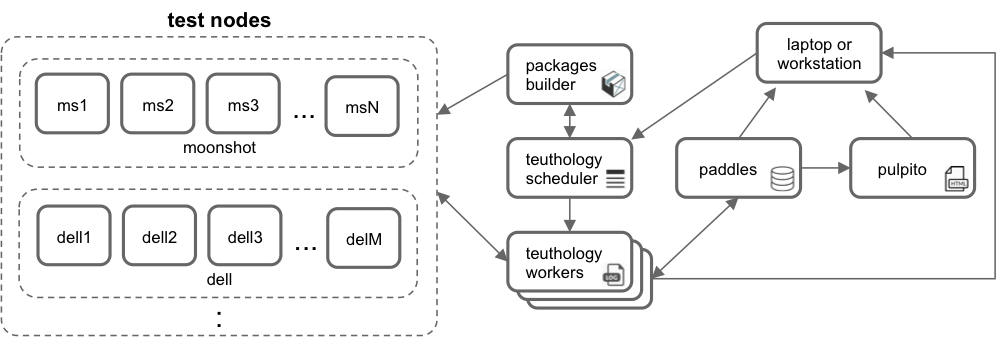

===================
Ceph Lab Components
===================

The distinct hardware/software components that a lab is composed of and the way
they interact between them is described here. In general, a lab is composed of
a scheduler (a.k.a. master node), worker(s), package builder
(`gitbuilder <http://ceph.com/gitbuilder.cgi>`__), job database (`paddles
<https://github.com/ceph/paddles>`__), job archive, a web UI (`pulpito
<https://github.com/ceph/pulpito>`__) and test nodes.

|
|

|
|

In the figure above, every service appears on a separate machine but this is
not a requirement (see :ref:`lab_setup` for an alternative setup). Jobs are
submitted to the scheduler, which are then picked up by dispatcher and
processesed by job supervisors. One supervisor processes and keeps track of a
job (one at a time). The output of the job (logs and files associated to an
execution) is stored in the archive, which is a path in the file system where
the dispatcher is running. The job database contains information about the status
of jobs and test nodes, as well as results of executions (# of tests passed,
failed, etc.). All this information can be visualized in ``pulpito``, the web
UI. For an example, see Ceph community's Lab `here <http://pulpito.ceph.com>`__.

Test nodes can be grouped in classes (referred to as ``machine-type``),
allowing teuthology schedule jobs across multiple hardware setups,
provided they're visible to the master node.

Life of a Teuthology Job
========================

The teuthology scheduler exposes a work queue (using `beanstalkd
<https://kr.github.io/beanstalkd/>`__) where jobs are submitted. The life of a
job begins when ``teuthology-suite`` is executed, which is when a job is
prepared and queued (``teuthology-schedule`` is implicitly invoked). When a job
is created (or whenever the status of a job is changed, e.g. from queued to
started), information about the job is recorded in ``paddles``'s internal
database. Depending on the priority of the job, the scheduler eventually
determines when a job can get executed. At this point, the master communicates
with ``teuthology-dispatcher``, checks the lock status of the requested
machines by querying ``paddles``, acquires locks of the
nodes if they are available, and invokes ``teuthology-dispatcher`` in
``supervisor`` mode. ``supervisor`` reimages the target machines and invokes
``teuthology`` (the command). ``teuthology`` proceeds to execute the job
(execute every task in the YAML job description). After the execution is
completed (ie ``teuthology`` process exits), ``supervisor`` unlocks or nukes
the target machines depending on the status of the job. If the requested
machines are not available, the ``dispatcher`` waits for the machines to be
available before running anymore jobs. Results from the job are stored in the
archive directory of the worker for forensic analysis.

Since `QA suites <https://github.com/ceph/ceph-qa-suite>`__ usually
specify ``install`` and ``ceph`` tasks, we briefly describe what they do. When
a suite is scheduled (via ``teuthology-suite``), the branch that is being
worked against has to be specified (e.g. a git ``SHA`` or ``ref``). Packages
for the given branch and distro are probed on gitbuilder to see if they exist.
Once this and other sanity checks pass, the job is created and scheduled. Once
the job initializes, the ``install`` task pulls and installs Ceph packages from
``gitbuilder``. The installation task might also be preceded by a ``kernel``
task which first reboots testnodes (and optionally installs) into a specified
kernel. The ``ceph`` task subsequently configures and launches the cluster. At
this point, Ceph is ready to receive requests from other tasks (such as
``rados``).
