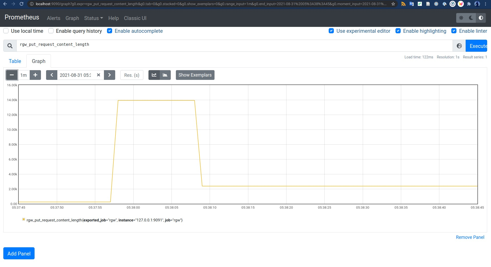

# Introduction

This directory contains an example `prometheus_adapter.lua` on how to
use [Lua Scripting](https://docs.ceph.com/en/latest/radosgw/lua-scripting/)
to push metrics from the RGW requests to [Prometheus](https://prometheus.io/), 
specifically to collect information on object sizes.

## Prometheus

As every single run of a lua script is short-lived,
so [Pushgateway](https://github.com/prometheus/pushgateway)
should be used as an intermediate service to enable Prometheus to scrape data
from RGW.

* Install and run Pushgateway using docker:

```bash
docker pull prom/pushgateway
docker run -p 9091:9091 -it prom/pushgateway
```

* Install and run Prometheus using docker:

```bash
docker pull prom/prometheus
docker run --network host -v ${CEPH_DIR}/examples/lua/config/prometheus.yml:/etc/prometheus/prometheus.yml prom/prometheus
```

[Full documentation for Prometheus installation](https://prometheus.io/docs/prometheus/latest/installation/)

## Usage

* Upload the script:

```bash
radosgw-admin script put --infile=prometheus_adapter.lua --context=postRequest
```

* Add the packages used in the script:

```bash
radosgw-admin script-package add --package='luasocket' --allow-compilation
```

* Restart radosgw.

* Send a request:
```bash
s3cmd --host=localhost:8000 --host-bucket="localhost:8000/%(bucket)" --access_key=0555b35654ad1656d804 --secret_key=h7GhxuBLTrlhVUyxSPUKUV8r/2EI4ngqJxD7iBdBYLhwluN30JaT3Q== mb s3://mybucket
s3cmd --host=localhost:8000 --host-bucket="localhost:8000/%(bucket)" --access_key=0555b35654ad1656d804 --secret_key=h7GhxuBLTrlhVUyxSPUKUV8r/2EI4ngqJxD7iBdBYLhwluN30JaT3Q== put -P /etc/hosts s3://mybucket
curl http://localhost:8000/mybucket/hosts
```

* Open `http://localhost:9090` by browser and search for `rgw_request_content_length`


## Requirements
* Lua 5.3 or higher

