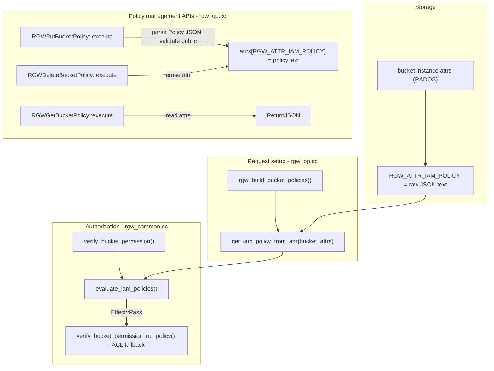
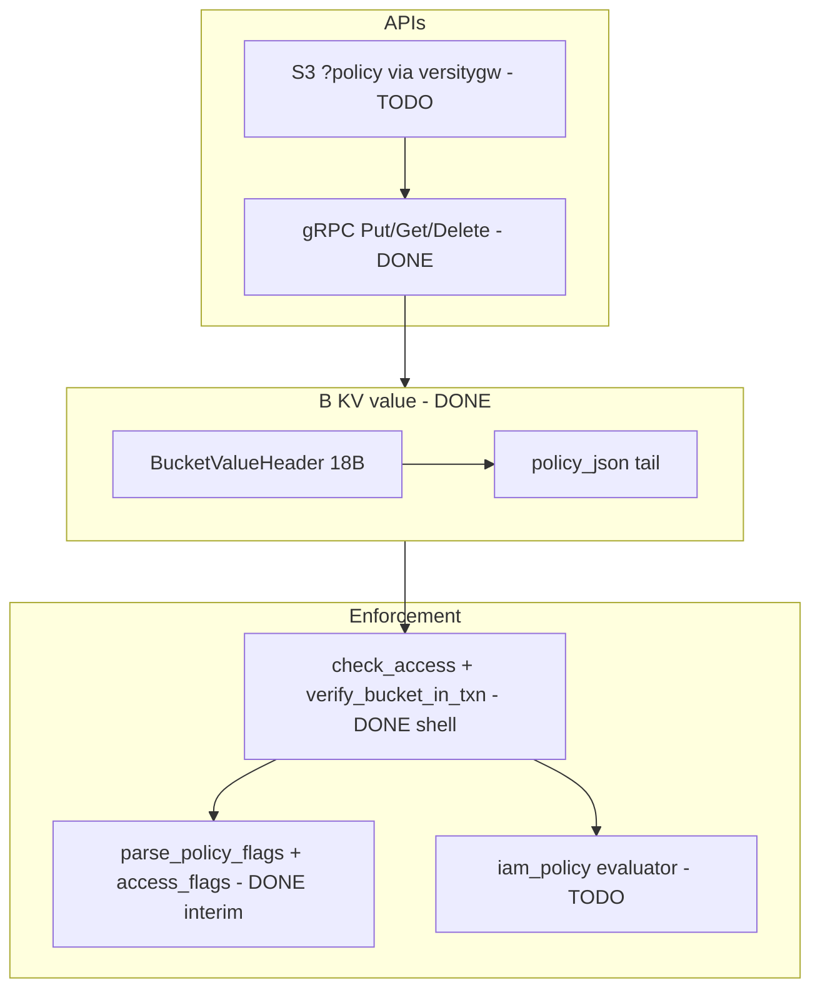

<!-- 6f375b7f-91b8-435d-be86-81382c875132 -->
---
todos:
  - id: "s3-policy-routing"
    content: "Wire Put/Get/DeleteBucketPolicy through versitygw frontend (backend_kvrgw.go) — gRPC already exists"
    status: pending
  - id: "iam-policy-module"
    content: "Add iam_policy.hpp/cpp: full IAM JSON evaluator (Principal/Action/Resource); replace or layer on parse_policy_flags"
    status: pending
  - id: "wire-iam-evaluator"
    content: "Integrate iam_policy evaluator into check_access, verify_bucket_in_txn, and PutBucketPolicy validation"
    status: pending
  - id: "docs-bucket-policy"
    content: "Create bucket-policy.md; cross-link poc_as_built.md, architecture.md, cpp-data-structures.md"
    status: pending
  - id: "tests-bucket-policy"
    content: "Unit tests for IAM evaluator + S3-routed integration tests (extend TEST_PLAN.md)"
    status: pending
isProject: false
---
# POC Bucket Policy Support Plan

> **Updated** with as-built corrections from [poc_as_built.md](file:///home/gbenhano/docs/nextgen/poc_as_built.md), [architecture.md](file:///home/gbenhano/docs/nextgen/architecture.md), and [cpp-data-structures.md](file:///home/gbenhano/docs/nextgen/cpp-data-structures.md).

## What AWS Says

S3 bucket policies are **resource-based IAM policies** attached to a bucket (not users). Key semantics:

| Topic | AWS behavior |
|---|---|
| **Format** | JSON document, `Version: "2012-10-17"`, array of `Statement` objects |
| **Fields** | `Effect` (Allow/Deny), `Principal`, `Action` (e.g. `s3:GetObject`), `Resource` (bucket ARN and/or `bucket/*`), optional `Condition`, `Sid` |
| **APIs** | `PutBucketPolicy` (204), `GetBucketPolicy` (JSON body), `DeleteBucketPolicy` (204), `GetBucketPolicyStatus` (is public) |
| **Evaluation** | Identity policies + resource (bucket) policies both evaluated; **explicit Deny wins**; Allow from either can grant if no Deny; implicit deny otherwise |
| **Propagation** | Documented as eventual (seconds to minutes); POC uses 3s TTL + refresh-before-reject (stricter) |
| **Root bypass** | Bucket owner's account root can always call Put/Get/DeleteBucketPolicy even if policy denies root (unless blocked by org/VPC endpoint policy) |
| **Public access** | `BlockPublicPolicy` / `RestrictPublicBuckets` can reject public policies at Put time |

References: [S3 bucket policies](https://docs.aws.amazon.com/AmazonS3/latest/userguide/security_iam_service-with-iam.html), [IAM evaluation logic](https://docs.aws.amazon.com/IAM/latest/UserGuide/reference_policies_evaluation-logic_policy-eval-basics.html), [PutBucketPolicy API](https://docs.aws.amazon.com/cli/latest/reference/s3api/put-bucket-policy.html)

**POC MVP scope (confirmed):** bucket policy only — no IAM user policies, no ACL fallback. Owner/admin bypass for policy management APIs.

---

## What RGW Does Today (`~/ceph/src/rgw/`)



### Storage
- Bucket policy stored as **raw JSON string** in bucket instance attribute `RGW_ATTR_IAM_POLICY` ([`rgw_op.cc` PutBucketPolicy ~9430](file:///home/gbenhano/ceph/src/rgw/rgw_op.cc))
- Parsed at read time into `rgw::IAM::Policy` ([`get_iam_policy_from_attr`](file:///home/gbenhano/ceph/src/rgw/rgw_common.cc) ~3254)

### Policy engine ([`rgw_iam_policy.h` / `.cc`](file:///home/gbenhano/ceph/src/rgw/rgw_iam_policy.h))
- Full JSON parser (rapidjson), `Statement` with Principal/Action/Resource/Condition
- `Policy::eval()` per statement; `evaluate_iam_policies()` combines identity + resource + session policies
- RGW maps S3 ops to bitflags (`s3GetObject`, `s3PutBucketPolicy`, etc.)

### Request flow
1. `rgw_build_bucket_policies()` loads `s->iam_policy` from bucket attrs on every bucket-scoped request (~682 in `rgw_op.cc`)
2. `verify_bucket_permission()` calls `evaluate_iam_policies()` with bucket policy + identity policies
3. If policy returns `Pass`, falls back to bucket ACL ([`rgw_common.cc`](file:///home/gbenhano/ceph/src/rgw/rgw_common.cc) ~1395)

### Put/Get/Delete specifics ([`rgw_op.cc`](file:///home/gbenhano/ceph/src/rgw/rgw_op.cc) ~9360–9552)
- **Put**: read body → parse `Policy` → optional `BlockPublicPolicy` check → store JSON in attrs
- **Get**: return stored JSON; 404 `NoSuchBucketPolicy` if missing/empty
- **Delete**: erase `RGW_ATTR_IAM_POLICY` (+ remove-self-access attr)
- **Root bypass**: bucket owner's root principal skips policy check for Put/Get/Delete unless `RGW_ATTR_IAM_POLICY_REMOVE_SELF_ACCESS` set

---

## POC As-Built State (current)

Per [poc_as_built.md](file:///home/gbenhano/docs/nextgen/poc_as_built.md), [architecture.md](file:///home/gbenhano/docs/nextgen/architecture.md), [cpp-data-structures.md](file:///home/gbenhano/docs/nextgen/cpp-data-structures.md):

### Architecture

```
S3 client → nginx GW (:9080) → versitygw frontend(s) (:9081+) → gRPC (Unix /tmp/kvrgw-{i}.sock)
  → C++ KvRgwServiceImpl → FDB (metadata) + local FS (STORAGE tier blobs)
```

- Frontend is **versitygw** (Go), not gofakes3 — thin S3-to-gRPC adapter in `frontend/backend_kvrgw.go`
- Backend is the single source of truth; frontend has no metadata cache
- All KV values are **binary packed structs** (`#pragma pack(1)`), not JSON

### B value — already includes policy JSON

```cpp
struct BucketValueHeader {          // 18 bytes fixed
  uint8_t bucket_id[8];            // offset 0
  int64_t created_at_unix;         // offset 8
  uint8_t access_flags;            // offset 16 — kDenyRead|kDenyWrite|kDenyList|kDenyDeleteBucket
  uint8_t versioning_state;        // offset 17 — VersioningState enum
};
// Full B: value = BucketValueHeader (18B) + optional policy JSON (variable)
```

Source: [object_value.hpp](backend/src/object_value.hpp), [cpp-data-structures.md § BucketValueHeader](file:///home/gbenhano/docs/nextgen/cpp-data-structures.md)

### Bucket policy module — already exists

| Component | Status | Location |
|---|---|---|
| `read_bucket_state()` | **Done** — fresh FDB `Get(B)`, returns `BucketState` | `bucket_policy.cpp` |
| `check_access(flag)` | **Done** — cache-first + refresh-before-reject | `bucket_policy.cpp` |
| `verify_bucket_in_txn()` | **Done** — in-txn bucket existence + access_flags check | `bucket_policy.cpp` |
| `parse_policy_flags()` | **Done** — extracts `access_flags` bitmask from policy JSON | `bucket_policy.cpp` |
| `BucketCacheEntry` | **Done** — `bucket_id` + `access_flags` + `cached_at` (3s TTL) | `bucket_policy.hpp` |
| gRPC `PutBucketPolicy` | **Done**, tested | `service_impl.cpp` + `kvrgw.proto` |
| gRPC `GetBucketPolicy` | **Done**, tested | `service_impl.cpp` + `kvrgw.proto` |
| gRPC `DeleteBucketPolicy` | **Done**, tested | `service_impl.cpp` + `kvrgw.proto` |
| S3 HTTP routing (`?policy`) | **Not done** — gRPC-only today | needs `backend_kvrgw.go` |
| Full IAM evaluator | **Not done** — `parse_policy_flags` only | needs `iam_policy.cpp` |

### Current enforcement model (interim)

The POC does **not** evaluate Principal/Action/Resource. Instead:

1. `PutBucketPolicy` stores raw policy JSON in B value tail
2. `parse_policy_flags(policy_json)` extracts a **4-bit `access_flags` bitmask** from the JSON
3. `check_access(kDenyRead|kDenyWrite|kDenyList|kDenyDeleteBucket)` enforces flags on object/bucket ops
4. `verify_bucket_in_txn(tr, ..., flag)` re-reads B inside FDB txn for hard enforcement on writes

Operations already wired:
- GetObject/HeadObject → `check_access(kDenyRead)`
- PutObject/DeleteObject/DeleteMulti/CopyObject/tagging → `verify_bucket_in_txn(..., kDenyWrite)`
- ListObjects → `read_bucket_state()` fresh + `kDenyList` check
- DeleteBucket → `read_bucket_state()` fresh + `kDenyDeleteBucket` check

This is a **stepping stone**, not AWS-parity IAM evaluation.

### Gap vs design docs

Design docs ([bucket_cache.md](file:///home/gbenhano/docs/nextgen/bucket_cache.md), [Bucket-State-Management.md](file:///home/gbenhano/docs/nextgen/Bucket-State-Management.md)) describe `policy_denies(client, operation, B.policy)` with Principal/Action/Resource semantics. The as-built POC implements a simpler deny-flags model until the IAM evaluator lands.

---

## Target Architecture (remaining work)



---

## Implementation Plan (revised)

### ~~1. Extend B value encoding~~ — DONE

Already implemented as `BucketValueHeader` (18B) + variable policy JSON tail. No further work unless adding an `owner` field for root-bypass (deferred).

### 2. IAM policy parser and evaluator (new module)

**New files:** `backend/src/iam_policy.hpp`, `iam_policy.cpp`

**Extend** (not replace wholesale) the existing `bucket_policy` module. `parse_policy_flags()` may remain as a fast path for POC test policies that encode deny flags directly, or be retired once the IAM evaluator handles the same cases via standard `Effect: Deny` statements.

**MVP evaluator** — do not link full RGW yet (heavy Ceph deps). Implement a focused subset:

| Support in MVP | Defer |
|---|---|
| `Version: 2012-10-17` | `2008-10-17` conditions edge cases |
| `Effect: Allow/Deny` | Session policies, STS roles |
| `Principal: "*"` and `{"AWS": "arn:..."}` | Federated principals, service principals |
| `Action`: exact `s3:*` and POC-used actions (`GetObject`, `PutObject`, `DeleteObject`, `ListBucket`, `GetBucketPolicy`, `PutBucketPolicy`, `DeleteBucketPolicy`, tagging, CopyObject) | Full 100+ S3 actions |
| `Resource`: `arn:aws:s3:::bucket` and `arn:aws:s3:::bucket/*` | Cross-region ARN variants |
| Basic `StringEquals` / `StringLike` on `s3:prefix` | Full condition operator set |

**Evaluation logic (bucket-policy-only MVP):**

```
function allows(client, action, bucket_arn, object_key):
  if no policy_json: return ALLOW   // open bucket (current POC default)
  policy = parse(policy_json)
  env = build_env(client, bucket, object_key)

  for stmt in policy.statements:
    if stmt.effect == Deny and stmt.matches(env, client, action, resource):
      return DENY

  for stmt in policy.statements:
    if stmt.effect == Allow and stmt.matches(env, client, action, resource):
      return ALLOW

  return DENY   // implicit deny when policy exists but no Allow matches
```

**Semantic transition:** Today, absent policy = allow all. With full IAM evaluator, absent policy still = allow all; present policy = implicit deny for non-matching principals (AWS default). The interim `access_flags` model can coexist during migration — evaluator takes precedence when policy JSON contains standard IAM statements.

**Validation on Put:** reject malformed JSON (400 `MalformedPolicy`); validate Resource ARNs reference the target bucket name. Reuse RGW-compatible raw JSON storage (already done).

**Later:** extract/port `rgw_iam_policy.cc` into a standalone library.

### 3. Wire IAM evaluator into request path

**Files:** `backend/src/bucket_policy.hpp`, `bucket_policy.cpp`, `service_impl.cpp`

Extend existing functions (do not rewrite from scratch):

| Function | Current | Change |
|---|---|---|
| `check_access(flag)` | Checks `access_flags` bitmask | Add IAM path: map S3 op → `s3:Action`, call `iam_policy::allows()`; keep refresh-before-reject |
| `verify_bucket_in_txn()` | Checks `access_flags` in txn | Same IAM check against fresh B inside txn |
| `read_bucket_state()` | Returns `policy_json` | No change; optionally pre-parse into `BucketState` |
| `BucketCacheEntry` | `bucket_id` + `access_flags` | Optionally cache parsed `Policy` object to avoid re-parse within TTL |

Map gRPC operations to IAM actions (align with RGW `rgw_iam_policy.h` enum names).

**Owner bypass for policy mgmt:** skip IAM check for Put/Get/DeleteBucketPolicy when caller is bucket owner (field TBD — may use versitygw identity).

### 4. S3 HTTP routing via versitygw — TODO

**gRPC is done.** Remaining work is frontend only.

**Files:** `frontend/backend_kvrgw.go`, `proto/kvrgw.proto` (verify RPC messages match)

Wire versitygw `backend.Backend` methods (or S3 sub-resource handlers):

| S3 request | gRPC call |
|---|---|
| `PUT /{bucket}?policy` | `PutBucketPolicy` |
| `GET /{bucket}?policy` | `GetBucketPolicy` |
| `DELETE /{bucket}?policy` | `DeleteBucketPolicy` |

Response codes: 204 on Put/Delete, 404 `NoSuchBucketPolicy` on Get when absent, 403 on denied, 400 on malformed JSON.

GetBucketPolicy should use always-fresh read (backend `read_bucket_state()` already does this).

### 5. Documentation updates

**New file:** `~/docs/nextgen/bucket-policy.md` — AWS semantics, as-built interim model, IAM evaluator target, MVP limitations

**Update:**
- [poc_as_built.md](file:///home/gbenhano/docs/nextgen/poc_as_built.md) — add IAM evaluator section when landed; note S3 routing status
- [S3-Operations-Over-KV.md](file:///home/gbenhano/docs/nextgen/S3-Operations-Over-KV.md) — Put/Get/DeleteBucketPolicy operation sections
- [bucket_cache.md](file:///home/gbenhano/docs/nextgen/bucket_cache.md) — align `policy_denies()` with actual `check_access` / IAM evaluator
- [cpp-data-structures.md](file:///home/gbenhano/docs/nextgen/cpp-data-structures.md) — add `iam_policy` structs when added

### 6. Tests

**Already passing (gRPC):** Put/Get/DeleteBucketPolicy via TEST_PLAN.md (per poc_as_built.md).

**Add:**

Manual (AWS CLI through nginx :9080):

```bash
aws --endpoint-url http://127.0.0.1:9080 s3api put-bucket-policy --bucket b --policy file://public-read.json
aws --endpoint-url http://127.0.0.1:9080 s3api get-bucket-policy --bucket b
aws --endpoint-url http://127.0.0.1:9080 s3 cp file s3://b/key   # allowed principal
aws --endpoint-url http://127.0.0.1:9080 s3api delete-bucket-policy --bucket b
```

**Unit tests** (`backend/tests/iam_policy_test.cpp`):
- Parse valid/invalid JSON
- Allow `s3:GetObject` for principal on `bucket/*`
- Deny overrides Allow
- Implicit deny when policy exists but principal not listed
- `s3:prefix` condition on ListBucket
- Migration: policies that worked via `parse_policy_flags` still work via IAM evaluator

**Integration:** extend [TEST_PLAN.md](file:///home/gbenhano/docs/nextgen/TEST_PLAN.md) with S3-routed policy phase.

---

## Phased Delivery (revised)

| Phase | Deliverable | Status |
|---|---|---|
| **P0** | B value + policy JSON storage | **Done** |
| **P0** | gRPC Put/Get/DeleteBucketPolicy | **Done** |
| **P0** | `access_flags` interim enforcement (`parse_policy_flags`, `check_access`, `verify_bucket_in_txn`) | **Done** |
| **P1** | `iam_policy` parser/evaluator + unit tests | **TODO** |
| **P2** | Wire IAM evaluator into `check_access` + `verify_bucket_in_txn` | **TODO** |
| **P3** | S3 HTTP routing via versitygw (`?policy`) | **TODO** |
| **P4** | `bucket-policy.md` + design doc alignment | **TODO** |

**Out of scope for MVP** (document as follow-ups):
- **Full tenant support** — tenant provisioning API (create tenant, assign users), user-to-tenant registry, frontend identity→tenant resolution. Current POC uses a fixed default tenant for all users.
- IAM user/role identity policies
- Bucket ACL fallback
- Public Access Block (`BlockPublicPolicy`)
- `GetBucketPolicyStatus`
- Policy conditions beyond `s3:prefix`
- Multisite policy replication
- `ConfirmRemoveSelfBucketAccess` / root self-lockout protection

---

## Key Reference Files

### POC (as-built)

| Purpose | Path |
|---|---|
| As-built reference | [poc_as_built.md](file:///home/gbenhano/docs/nextgen/poc_as_built.md) |
| Architecture | [architecture.md](file:///home/gbenhano/docs/nextgen/architecture.md) |
| C++ structs | [cpp-data-structures.md](file:///home/gbenhano/docs/nextgen/cpp-data-structures.md) |
| Bucket policy module | `backend/src/bucket_policy.hpp`, `bucket_policy.cpp` |
| B value encoding | `backend/src/object_value.hpp` |
| gRPC handlers | `backend/src/service_impl.cpp` |
| Frontend adapter | `frontend/backend_kvrgw.go` |
| Proto | `proto/kvrgw.proto` |

### RGW (target parity)

| Purpose | Path |
|---|---|
| Put/Get/Delete handlers | [`src/rgw/rgw_op.cc`](file:///home/gbenhano/ceph/src/rgw/rgw_op.cc) ~9360–9552 |
| Policy load from attrs | [`src/rgw/rgw_common.cc`](file:///home/gbenhano/ceph/src/rgw/rgw_common.cc) `get_iam_policy_from_attr` |
| Evaluation | [`src/rgw/rgw_common.cc`](file:///home/gbenhano/ceph/src/rgw/rgw_common.cc) `evaluate_iam_policies`, `verify_bucket_permission` |
| Policy AST + parser | [`src/rgw/rgw_iam_policy.h`](file:///home/gbenhano/ceph/src/rgw/rgw_iam_policy.h), [`rgw_iam_policy.cc`](file:///home/gbenhano/ceph/src/rgw/rgw_iam_policy.cc) |
