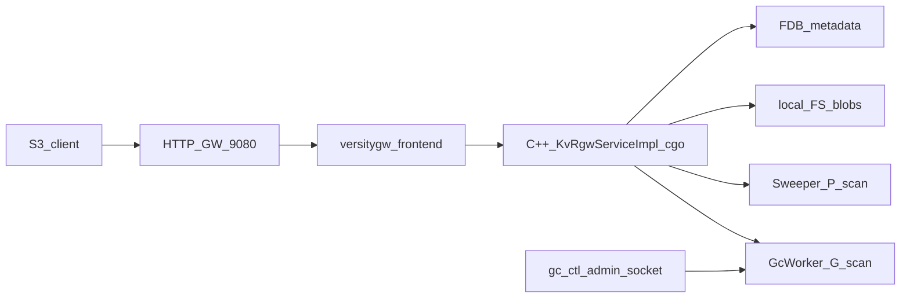

# KV-RGW POC — As-Built Reference

Combined as-built reference for the POC implementation (M1 + M2 scope, plus post-M2 extensions verified in the test plan). Describes **current behavior** — not a milestone-by-milestone history.

**Base design corpus:** [KV-Based-Design-For-RGW.md](KV-Based-Design-For-RGW.md), [S3-Operations-Over-KV.md](S3-Operations-Over-KV.md), [Listing-and-Key-Scheme.md](Listing-and-Key-Scheme.md)

**Decision record:** [milestone2_design_decisions.md](milestone2_design_decisions.md)

**Verification gate:** [TEST_PLAN.md](TEST_PLAN.md) — 10 phases (0–9), 100% pass required (last full run ~40 min). Plus 203 ceph-rgw S3 compatibility tests ([ceph_rgw_tests.md](ceph_rgw_tests.md)).

**M1 archive:** [milestone.info.md](milestone.info.md)

---

## 1. Overview

Multi-instance S3-compatible object store (N ≥ 1):

```
S3 client (aws / s3cmd / s5cmd)
  → HTTP GW (nginx, :9080)
  → versitygw frontend(s) (Go, :9081 .. :9080+N)
  → cgo C ABI (libkvrgw.so in the same process)
  → C++ KvRgwServiceImpl
  → shared FoundationDB (metadata) + shared local filesystem (KVRGW_DATA blobs)
```

**GW always on `:9080`.** Frontends never bind `:9080`. Single-instance mode uses GW → one frontend on `:9081`.

**Multi-instance guide:** [docs/multi-instance.md](docs/multi-instance.md)

```bash
./scripts/reload.sh --clean 3   # 3 frontend processes (in-process C++) + GW
./scripts/install_lb.sh         # nginx (required for GW)
```

Background threads in the C++ backend:

- **Sweeper** — scans `P:` namespace; cleans stale `P:O` entries and orphan blobs
- **GcWorker** — scans `G:` namespace; removes blob files and deletes `G:O` keys
- **AdminServer** — Unix socket for runtime GC policy ([gc_admin.md](gc_admin.md))
- **ErrInsertion** — fault injection framework; data member of `KvRgwServiceImpl`; controlled via admin socket (`set-error`, `clear-error`)



### POC constants

| Constant | Value | Notes |
|----------|-------|-------|
| `tenant_id` | 1 (default) | **`tenant_name` (`kv-poc`) → `:T:` lookup → numeric id**; all bucket/object RPCs use resolved id |
| `shard_count` | 1 | **Fixed; multi-shard merge not implemented** |
| `shard_id` | 0 | **Fixed** |

### Tier configuration (env vars)

| Env var | Default | Description |
|---------|---------|-------------|
| `KVRGW_MAX_INLINE` | 256 (scripts), 0 (binary) | Max object size for INLINE tier. 0 = disabled |
| `KVRGW_MAX_KV_STORE` | 4096 (scripts/default), 0 (binary) | Max object size for KV_STORE tier. 0 = disabled |
| `KVRGW_KV_STORE_COALESCING` | 0 | When 1, KV_STORE deletes defer to G:O for batched cleanup |
| `KVRGW_BATCH_SIZE` | 1 | PUT batch coalescing: N objects per FDB transaction. 1 = disabled |
| `KVRGW_BATCH_TIMEOUT_US` | 1000 | Max wait time (microseconds) before flushing a partial batch |
| `KVRGW_BATCH_THREADS` | 8 | Number of committer threads in the batch queue thread pool |

Invariant: `max_kv_store > max_inline || (max_kv_store == 0 && max_inline == 0)`.

Tier selection (for `size > 0`):
```
if size <= max_inline      → INLINE
else if size <= max_kv_store → KV_STORE
else                         → STORAGE
```

Binary defaults (0, 0) = all objects go to STORAGE. Scripts default to (256, 4096) for test coverage.

Configuration source precedence: YAML file (`KVRGW_CONFIG_FILE`, default `kvrgw.yaml`) → env var override → binary defaults. Online change via admin socket: `set-tier-config` / `get-tier-config` / `query-tier-config`.

| Namespace bytes | `B`, `T`, `S`+`O`, `P`+`O`/`G`, `G`+`O`/`G`, **`D`**, **`L`**, **`R`**, **`C`** | Prose: `:O:`, `P:O`, `G:O`, `D:`; **`T` = tenant metadata (POC: name-keyed)**; **`D` = Tier 2 KV data**; **`L` = counters / system maps**; **`R` = storage-tier ref-count (CopyObject data sharing)**; **`C` = child KV entries (tags, annotations)**; **Group P:O** category `'G'` (batch coordination); **Group G:O** category `'G'` (batch GC) |

### Binary data structures

All KV values are binary packed structs (`#pragma pack(1)`, big-endian multi-byte fields via `htobe64`/`htonl`/`htons`). No JSON, no text serialization in the KV layer.

| Value | Struct | Size | Location |
|-------|--------|------|----------|
| O: (object) | `ObjectValueHeader` + content_type + inline_data + tags + metadata | 62B fixed + variable | [object_value.hpp](backend/src/object_value.hpp) |
| G:O (GC) | `GcValueHeader` | 14B | [object_value.hpp](backend/src/object_value.hpp) |
| P:O (pending) | `PoValueHeader` | 12B | [object_value.hpp](backend/src/object_value.hpp) |
| B: (bucket) | `BucketValueHeader` + policy JSON | 18B header + variable | [object_value.hpp](backend/src/object_value.hpp) |
| D: (tier 2 data) | raw bytes | 0–8KB | value = object data |
| L: (counters) | uint64 LE | 8B | counter value |
| R: (ref-count) | uint64 BE + chunk_descriptor | 8B + variable | ref_count for storage-tier data sharing ([ref_count.hpp](backend/src/ref_count.hpp)) |
| C:T (tags) | tag payload (binary packed) | 0–5120B | value = encoded tag set |

O: value layout (62B header):
```
[ref_tag 12B][etag_part_count 2B BE][annotations_count 2B BE]  (offset 0)
...
[version_id 4B BE][next_vid 4B BE]                              (offset 52)
[metadata_count 2B BE]                                          (offset 60)
[etag 16B]                                                      (offset 16)
[size 8B BE][last_modified_sec 4B BE][last_modified_nsec 4B BE] (offset 32)
[chunk 1B][flags 1B][tags_count 1B][content_type_len 1B]        (offset 48)
[version_id 4B BE][next_vid 4B BE]                              (offset 52)
[metadata_count 2B BE]                                          (offset 60)
[content_type 0–255B]                                           (offset 62)
[inline_data]                                                   (offset 62+ct_len)
[tag_payload 0–256B]                                            (if tags_count > 0 && !kFlagExternalTags)
[metadata_payload]                                              (if metadata_count > 0)
```

Metadata payload uses the same binary format as tags: `[key_len 2B BE][key][val_len 2B BE][val]` repeated `metadata_count` times. Keys sorted lexicographically. Encoded after tags section.

Flags byte: bit 0 = `kFlagExtendedAttrs`, bit 1 = `kFlagFenced` (delete marker), bit 2 = `kFlagSharedData` (CopyObject ref-sharing), bit 3 = `kFlagExternalTags` (tags in C:T child KV), bit 4 = `kFlagExternalAnnotations` (annotations in child KV).

G:O value layout (14B): `[ChunkDescriptor 1B][flags 1B][object_size 8B BE][mtime 4B BE]`

P:O value layout (12B): `[estimated_size 8B BE][created_at_unix 4B BE]`

Group P:O value layout: `[count 2B BE][ref_tag 12B + size 8B BE]×N[created_at 4B BE]` (per-entry = 20 bytes). Stores `estimated_size` from PUT request. Functions: `make_group_po_value()`, `parse_group_po_value()`.

Group G:O value layout: `[count 2B BE][ref_tag 12B + chunk 1B + flags 1B + size 8B BE]×N` (per-entry = 22 bytes). Functions: `make_group_gc_value()`, `parse_group_gc_value()`.

### Zero-allocation key/value buffers

Keys use `KeyBuf` (1100B stack buffer); values use `OValueBuf` (827B stack buffer). No heap allocation on the PUT/GET/DELETE hot path. Packed header structs with constructors handle BE conversion; variable-length tails appended via `memcpy`.

Constants: `kRefTagSize=12`, `kEtagSize=16`, `kMaxContentTypeLen=255`. All `memcpy` uses `sizeof(field)` — no hardcoded sizes.

**RefTag type:** `using RefTag = std::array<uint8_t, 12>` (defined in `ref_tag.hpp`). Replaces `std::string ref_tag` in parse structs (`PoKeyParts`, `GoKeyParts`, `DKeyParts`), `BatchCommitEntry`, `PutObjectRequest`, and `PutInTxnParams`. Helper: `ref_tag_view(const RefTag&) → std::string_view`.

Implementation: [key_buf.hpp](backend/src/key_buf.hpp), [object_value.hpp](backend/src/object_value.hpp), [service_impl.cpp](backend/src/service_impl.cpp), [ref_tag.hpp](backend/src/ref_tag.hpp)

---

## 2. Supported S3 operations

| Operation | AWS surface | Backend RPC | Tested |
|-----------|-------------|-------------|--------|
| CreateBucket | `s3 mb` | `CreateBucket` | yes |
| ListBuckets | `s3 ls` (no bucket) | `ListBuckets` | yes |
| HeadBucket | `HEAD /bucket`, `s3api head-bucket` | internal `BucketExists` | yes |
| DeleteBucket | `s3 rb` (empty bucket) | `DeleteBucket` | yes |
| PutObject | `s3 cp` upload | `PutObject` | yes |
| GetObject | `s3 cp` download / `get-object` | `GetObject` | yes |
| GetObject byte-range | `get-object --range` / HTTP 206 | `GetObject` + range | yes |
| HeadObject | `head-object` / `s3cmd info` | `HeadObject` | yes |
| ListObjectsV2 | `s3 ls` / `list-objects-v2` | `ListObjects` | yes |
| DeleteObject | `s3 rm` | `DeleteObject` | yes |
| DeleteMulti | `delete-objects` / `rb --force` | `DeleteMulti` | yes |
| CopyObject | `s3 cp` (server-side) / `copy-object` | `CopyObject` | yes |
| PutObjectTagging | `put-object-tagging` | `PutObjectTagging` | yes |
| GetObjectTagging | `get-object-tagging` | `GetObjectTagging` | yes |
| DeleteObjectTagging | `delete-object-tagging` | `DeleteObjectTagging` | yes |
| GET `?acl` | `s3cmd info` | Go middleware stub (static response) | yes |
| PutBucketPolicy | `s3api put-bucket-policy` | `PutBucketPolicy` | yes |
| GetBucketPolicy | `s3api get-bucket-policy` | `GetBucketPolicy` | yes |
| DeleteBucketPolicy | `s3api delete-bucket-policy` | `DeleteBucketPolicy` | yes |

| PutBucketVersioning | `put-bucket-versioning` | `PutBucketVersioning` | yes |
| GetBucketVersioning | `get-bucket-versioning` | `GetBucketVersioning` | yes |
| ListObjectVersions | `list-object-versions` | `ListObjectVersions` | yes |
| DeleteObject (versioned) | `delete-object --version-id` | `DeleteObjectVersion` | yes |

Frontend wiring: [frontend/backend_kvrgw.go](frontend/backend_kvrgw.go) (`mapErrorCode()` maps proto `KvrgwErrorCode` to Go S3 errors). gRPC contract: [proto/kvrgw.proto](proto/kvrgw.proto).

**Conditional writes:** PutObject supports `if-match` / `if-none-match` (ETag preconditions). DeleteObject/DeleteObjectVersion support `if-match` + `if-match-last-modified-time` + `if-match-size`. CopyObject supports source conditionals (`if-match`/`if-none-match`) and destination conditionals (`dst-if-match`/`dst-if-none-match`). Precondition failures return `PreconditionFailed` (HTTP 412).

**Not supported:** multipart upload, encryption, object lock, lifecycle, bucket ACLs (disabled — `DisableACLs: true`).


### Multi-user and bucket policy enforcement

The frontend supports multiple S3 identities via **IAMDir** (`iam/users.json`). Root user (access=`test`) has full access. Non-root users are subject to bucket policy evaluation by versitygw's built-in IAM engine:

- `auth.VerifyAccess()` calls `be.GetBucketPolicy()` → parses JSON → evaluates Principal/Action/Resource
- Root/admin bypass: policy checks skipped for root account
- No policy = implicit deny for non-root (falls through to ACL, which is disabled → deny)
- `tenantForCtx()` always returns the configured tenant (`KVRGW_TENANT_NAME`, default `kv-poc`) — all users share one tenant namespace

Backend retains `access_flags` enforcement as a secondary deny layer (only activates for `Effect: Deny` + `Principal: *` policies via `parse_policy_flags`).

### Bucket Versioning

Full bucket versioning with three states:

| State | PutObject creates | DeleteObject creates | version_id reported |
|---|---|---|---|
| DISABLED (default) | null version, no V: entry | removes object | no |
| ENABLED | real version (kFirstVersionId, decrementing) | delete marker | yes |
| SUSPENDED | null version (kNullVersion) | null delete marker | no |

- Null version = `kNullVersion = 0xFFFFFFFF` (max_uint32)
- First real version = `kFirstVersionId = 0xFFFFFFFE` (decrementing per key)
- V: keys use `\x00` separator between object_name and version_id (prevents prefix collision)
- Delete markers signaled to frontend via `error_detail` field `"DeleteMarker:<vid>:<mtime>"`
- One-null-version rule enforced in SUSPENDED displace: existing V:<kNullVersion> destroyed

### AWS S3 Feature Support Matrix

**Full support:**

| Feature | Notes |
|---|---|
| CreateBucket / DeleteBucket / HeadBucket / ListBuckets | Single region, DNS-compliant names, paginated |
| PutObject / GetObject / HeadObject | 3-tier storage, streaming, conditional writes |
| GetObject byte-range | HTTP 206, arbitrary offset/length |
| ListObjectsV2 / ListObjectsV1 | Prefix, delimiter, continuation token, max-keys |
| DeleteObject / DeleteObjects (multi) | Conditional delete (if-match + mtime + size), batched txns, partial success |
| CopyObject | Same/cross-bucket, ref-counted data sharing, metadata replace |
| User Metadata (`x-amz-meta-*`) | Set on PUT/COPY, returned on GET/HEAD; COPY mode preserves, REPLACE mode uses request metadata |
| Object Tagging (Put/Get/Delete) | Up to 10 tags, inline or external C:T storage; PutObject `x-amz-tagging` header for inline tag creation |
| HeadObject `x-amz-tagging-count` | Returned when object has tags |
| Bucket Versioning (Put/Get) | Enable/Suspend, version IDs, delete markers, null-version rules |
| ListObjectVersions | Merged O: + V: scan, key/version-id markers |
| DeleteObjectVersion | Removes specific version, promotes next-current |
| Bucket Policy (Put/Get/Delete) | S3-routed, JSON stored in B value, versitygw evaluation |
| Conditional GET | If-Match, If-None-Match, If-Modified-Since, If-Unmodified-Since |
| Conditional PUT | If-Match, If-None-Match (ETag preconditions) |
| Conditional DELETE / DeleteVersion | If-Match (ETag) + If-Match-Last-Modified-Time + If-Match-Size |
| Conditional COPY | Source: if-match/if-none-match; Destination: dst-if-match/dst-if-none-match |
| Pre-signed URLs | Handled by versitygw SigV4 |

**Partial support:**

| Feature | Works | Missing |
|---|---|---|
| Bucket Policy evaluation | Allow/Deny for standard actions via Principal matching | Advanced conditions (ExistingObjectTag, x-amz-copy-source, IfExists), NotPrincipal |
| ACL | Static `?acl` response for s3cmd | Real ACL storage/evaluation disabled (`DisableACLs: true`) |
| Multi-user | Root + alt user via IAMDir, policy-based access | No user-to-tenant mapping, no IAM hierarchy, no cross-account |

**Not supported:**

| Feature |
|---|
| Multipart Upload (CreateMultipartUpload, UploadPart, CompleteMultipartUpload, AbortMultipartUpload, ListParts) |
| Server-Side Encryption (SSE-S3, SSE-KMS, SSE-C) |
| Object Lock (Governance/Compliance retention, legal hold) |
| Lifecycle Management (expiration, transitions, abort incomplete multipart) |
| Bucket Notifications (SNS/SQS/Lambda) |
| S3 Select (SelectObjectContent) |
| Storage Classes (single tier externally) |
| Bucket/Object ACLs (disabled) |
| IAM Users/Roles API |
| STS / Temporary Credentials |
| CORS, Website Hosting, Logging, Metrics, Analytics, Intelligent Tiering |
| Multi-tenant routing (single fixed tenant; no `tenant:bucket` syntax) |

---

## 3. As-built vs base design

Deviations from the base design docs and early milestone drafts appear in **bold**.

| Area | Base / first-rev docs | POC as-built |
|------|----------------------|--------------|
| Shard model | Multi-shard headers; per-shard scans and merge | **Fixed `shard_count=1`, `shard_id=0`** |
| B bucket value | Rich metadata, policies, `shard_count` in value | **17 B header: `bucket_id` (8) + `created_at_unix` (8) + `access_flags` (1) + variable-length policy JSON; `shard_count` is global, not stored in B** |
| ref_tag encoding | Mixed hex in JSON vs binary in keys (early drafts) | **12 B binary in all KV keys and `:O:` values; hex only at gRPC / FS filename boundary** |
| DELETE / overwrite txn | Optimistic read-outside-txn in early M2 draft | **Single FDB txn move-to-G for DeleteObject and PutObject Phase 3 overwrite** |
| DeleteBucket empty check | Some drafts scan `:O:` and `P:O` | **Pre-scan `:O:` (limit 1) + `:P:` count; txn force-aborts `:P:` → `G:O` before `delete(B)`** ([bucket_delete.md](bucket_delete.md)) |
| G:O value | Stripped manifest, child flags, chunk refs | **Binary `[ChunkDescriptor 1B][object_size 4B BE][mtime 4B BE]` = 9 bytes; copied from O: at delete/overwrite** |
| Storage tier | RADOS; ref_tag-conditional delete | **`DataStore` abstract interface; `FileDataStore` (local FS `<data_root>/<ref_tag_hex>`); `PerfDataStore` (no-op I/O, `--perf` mode); unconditional `remove(ref_tag)`** |
| ListObjectsV2 | Multi-shard merge; fenced-entry filter for versions | **Single-shard range scan; delimiter `/` only; no `:V:` / delete markers** |
| List pagination token | Various “last returned key” formulations | **Base64(`start_after`) of last scanned object name** (may differ from last returned when delimiter collapses keys) |
| Byte-range GET | Manifest/chunk-level reads; extended-value cache | **`DataStore::read(ref_tag, offset, len)` from local FS; HTTP 206 via frontend** — **post-M2 extension** |
| DeleteMulti | Not in base M2 spec | **Chunked FDB txns (10 keys); per-key fallback on chunk commit failure; single-key mode after >3 chunk failures** |
| Namespaces | `:V:`, `:M:`, `:C:` | **`:V:` implemented (versioning); `:C:` implemented (object tags — `C:T` child type); `:M:` not implemented (planned M4+)** |
| CopyObject | Metadata-only copy, ref_tag sharing across S3 objects | **Implemented: INLINE byte-copy, D: ref_count, R: ref_count for STORAGE; no cross-shard** |
| Conditional writes | Not in base design (vendor extension) | **Implemented: if_match/if_none_match on PUT; if_match+mtime+size on DELETE; source+dest on CopyObject** |
| GC control | Background worker env vars only | **Admin Unix socket + double-buffer policy** ([gc_admin.md](gc_admin.md)) |
| HeadBucket | Listed as dedicated gRPC RPC in some drafts | **HTTP only; backend uses internal `BucketExists` gRPC** |
| Bucket Policy routing | gRPC-only in early POC | **S3-routed via versitygw (`?policy`); versitygw evaluates policy JSON (Principal/Action/Resource); backend stores in B value** |
| ACL | Full ACL support in base design | **Disabled (`DisableACLs: true`); static `?acl` stub only; bucket policies replace ACL** |
| Multi-user | Per-account owner from bucket metadata | **IAMDir file-based accounts; all users share one tenant; `tenantForCtx()` returns fixed `KVRGW_TENANT_NAME`** |
| ListBuckets Owner | Per-account owner from bucket metadata | **Owner field ignored; all users list same tenant's buckets** |
| PutObject Phase 1 size | Unspecified in early drafts | **Proto `content_length` → `P:O` `estimated_size`** |
| BucketNotEmpty | Unspecified mapping | **`FailedPrecondition` → S3 BucketNotEmpty in frontend** |
| ID counters | M1: well-known keys with `\x00` prefix | **`L N <name>` binary keys** — see [Listing-and-Key-Scheme.md](Listing-and-Key-Scheme.md) `:L:` |
| String→id maps | Not in base design | **Deferred to M2.5: `L I <name>` (e.g. compression-algorithm)** |

Full red-team record: [milestone2_design_decisions.md](milestone2_design_decisions.md).

### `:L:` namespace (local / system keys)

Binary layout: `[L 1B][type 1B][name 1–64B]`. Full spec: [Listing-and-Key-Scheme.md](Listing-and-Key-Scheme.md) (`type` = `key[1]`, `name` = `key[2:]`).

**Type `N` — counters (POC):**

| Key | Value | Allocation |
|-----|-------|------------|
| `L N tenant_id` | uint64 LE | Transactional read-modify-write in AddTenant txn → **uint32** tenant id; ID 0 = NULL |
| `L N bucket_id` | uint64 LE | Transactional read-modify-write in CreateBucket txn → **8 B** bucket_id; ID 0 = NULL |
| `L N rgw_id` | uint64 LE | Transactional read-modify-write once per backend boot → **uint32** rgw_id; ID 0 = NULL |

**Type `I` — string→id maps (M2.5, not implemented):** `L I <name>` → uint32 id.

Key helper: `make_l_key(type, name)` in [backend/src/keys.cpp](backend/src/keys.cpp).

Migration: **`reload.sh --clean` wipes FDB** — no in-place rename from legacy ASCII `L:…:ID` or `\x00…_counter` keys.

---

## 4. Internal features (non-S3)

### AddTenant (`PUT /_admin/tenant/{name}`)

POC tenant registry. **As-built delta:** [Listing-and-Key-Scheme.md](Listing-and-Key-Scheme.md) documents `T` + numeric `tenant_id`; POC uses **`T` + tenant_name** (variable key).

| Key | Value |
|-----|-------|
| `T` + `tenant_name` (1–63 B) | `tenant_id` (4 B BE) + `created_at_unix` (8 B BE) |

Transaction (same pattern as CreateBucket): `Get(T)` → absent → transactional read-modify-write `L N tenant_id` → `Put(T)` → commit. **CreateBucket fails with `NoSuchTenant` if `:T:` row missing.**

Startup: `reload.sh --clean` calls `PUT /_admin/tenant/kv-poc` (override via `KVRGW_TENANT_NAME`). Frontend passes **`tenant_name`** on all gRPC calls; backend resolves to numeric id (cached).

### Bucket cache and access control

Process-local bucket cache with **3-second TTL** (`kBucketCacheTtl`). Cached entry stores `bucket_id` + `access_flags`.

`read_bucket_state(tenant_id, bucket_name)` replaces the former `resolve_bucket_id` — always performs a fresh FDB `Get(B)` and returns the full `BucketState` (bucket_id, created_at, access_flags, policy_json).

`check_access(flag)` uses the cached entry first; if the flag is denied, it performs a **refresh-before-reject** — re-reads B from FDB. If the fresh read still denies, it returns `PermissionDenied`.

`verify_bucket_in_txn(tr, tenant, bucket, id, flag)` reads B inside the FDB transaction to ensure both bucket existence and access-flag compliance atomically with the data mutation.

### Sweeper

Scans `P:` prefix on an interval (`KVRGW_SWEEPER_INTERVAL_SEC`, default 2s). For each `P:O` older than `KVRGW_SWEEPER_MIN_AGE_SEC` (default 60s):

- If committed `:O:` exists with the **same ref_tag** → txn delete `P:O` only
- Else → txn `put(G:O)` + `delete(P:O)` via `move_po_to_go()`; GcWorker frees blob

Source: [backend/src/sweeper.cpp](backend/src/sweeper.cpp), [backend/src/gc_value.cpp](backend/src/gc_value.cpp)

### GcWorker

Scans all `G:O` keys (all size tiers). Before each entry: apply pending GC policy if `active_age != pending_age`. If not suspended: `data_store.remove(ref_tag)` → `del(G:O)`. Rate-limited by `max_objects_per_sec` and `max_mb_per_sec`. When suspended, sleeps 100ms and breaks sleep on policy change.

After each full G:O deletion (not ref-count decrement), if `flags & kFlagExternalTags`: `range_clear(C:<ref_tag>, C:<ref_tag>\xFF)` removes all child KV entries (tags, future annotations).

Startup defaults: `KVRGW_GC_INTERVAL_SEC` (10), `KVRGW_GC_MAX_OBJECTS_PER_SEC`, `KVRGW_GC_MAX_MB_PER_SEC` (0 = unlimited).

Source: [backend/src/gc_worker.cpp](backend/src/gc_worker.cpp)

### GC admin API

Unix socket (default `/tmp/kvrgw-admin.sock`, env `KVRGW_ADMIN_SOCKET`). Not on gRPC or HTTP.

| Command | Purpose |
|---------|---------|
| `SET key=value …` | Stage GC policy; returns `OK HANDLE=N` or `BUSY` |
| `QUERY` | Returns `ACTIVE_AGE=N` |
| `GET` | Full active + pending config snapshot |

Double-buffer: client polls until `active_age == handle` after SET. Detail: [gc_admin.md](gc_admin.md).

### gc_ctl CLI

Built as `build/gc_ctl`; wrapper `scripts/gc_ctl.sh`.

| Command | Path |
|---------|------|
| `set-gc-config`, `query-active-age`, `get-gc-config`, `wait-applied` | Admin socket |
| `count`, `count-by-tier`, `list`, `list-by-size` | Direct FDB scan of pending `G:O` |

Source: [backend/tools/gc_ctl.cpp](backend/tools/gc_ctl.cpp)

### DataStore abstraction

`DataStore` is an abstract interface (`virtual` methods: `write`, `read`, `remove`, `path_for`). Two implementations:

| Class | Mode | Behavior |
|---|---|---|
| `FileDataStore` | Normal (default) | Real file I/O to `KVRGW_DATA` directory |
| `PerfDataStore` | `--perf` mode | No disk I/O; configurable per-op sleep (`set-sim-disk-write-us`, `set-sim-disk-read-us`) |

`--perf` mode selects `PerfDataStore` automatically. All service code, GC worker, and sweeper use the `DataStore&` reference — unaware of which implementation is active.

Source: [backend/src/data_store.hpp](backend/src/data_store.hpp), [backend/src/data_store.cpp](backend/src/data_store.cpp)

### ErrInsertion (fault injection)

Fault injection class in `err_insertion.hpp/cpp`. Data member of `KvRgwServiceImpl`. Two-level cache-friendly layout: `flags_[kFaultTypeCount]` (hot, one byte per fault) + `FaultPayload payload_[]` (cold). `is_error_active(FaultType)` is inline with `[[likely]]`.

Modes: fixed (0x01), counter-based/periodic (0x02), time-based/periodic (0x03). Burst support.

Admin socket commands: `set-error <name> [period=N] [burst=N] [interval_us=N]`, `clear-error <name>`.

Initial FaultType enum: `kAbortAfterBatchPhase2`, `kAbortAfterSinglePhase2`, `kAbortSweeperAfterPutGo`, `kAbortGcWorkerMidGroup`.

White-box test: `scripts/test_white_box.sh` — injects fault via admin socket → PUT fails after Phase 2 → verifies orphan blob exists → sweeper + GcWorker clean up.

### Test instrumentation

- **DataStore filter** — pass/drop/wait on blob writes (sweeper crash tests)
- **Test filter server** — drives filter from external process

---

## 5. Key schema (as-built)

Binary keys; fields at fixed offsets. Namespace byte at offset 0.

```
B   [B 1B][tenant_id 4B BE][bucket_name 1–63B]
    value: bucket_id (8B) + created_at_unix (8B) + access_flags (1B) + policy JSON (variable)

S:O [S 1B][shard_count 2B][shard_id 2B][bucket_id 8B][O 1B][object_name]
    value: JSON ObjectValue { ref_tag (12B binary), etag, size, last_modified_unix, content_type }

P:O [P 1B][shard 4B][bucket_id 8B][O 1B][object_name][ref_tag 12B]
    value: JSON { estimated_size, content_type_hint, created_at_unix }

G:O [G 1B][size_tier 1B][shard 4B][bucket_id 8B][O 1B][ref_tag 12B]
    value: [ChunkDescriptor 1B][flags 1B][object_size 8B BE][mtime 4B BE]

G:G [G 1B][size_tier 1B][shard 4B][bucket_id 8B][G 1B][group_ref_tag 12B]
    value: [count 2B BE][ref_tag 12B + chunk 1B + flags 1B + size 8B BE]×N (22B per entry)

R:  [R 1B][ref_tag 12B]
    value: [ref_count 8B BE][chunk_descriptor variable]

C:T [S 1B][shard_count 2B][shard_id 2B][bucket_id 8B][C 1B][ref_tag 12B][T 1B]
    value: encoded tag payload (binary packed key/value pairs)
```

- **`size_tier`** = `clamp(floor(log2(size)) - 10, 0, 34)` — unchanged from design ([keys.cpp](backend/src/keys.cpp))
- **`make_go_key`**: copies `shard_count`, `shard_id`, `bucket_id` from parsed `:O:` key; embeds ref_tag and computed size_tier
- **`C:T`** = child KV entry for object tags; keyed under parent object's ref_tag

---

## 6. Per-operation pseudocode

Template fields: KV namespaces, storage tier, `P:O` usage, transactions, background/GC, deviations (**bold** = change from base docs).

---

### CreateBucket

```
S3 / RPC:  s3 mb  →  CreateBucket(tenant_id, bucket_name)

KV:        B, L:N
Storage:   none
P:O:       no

Transaction (pipelined reads: B: + L:N issued together, retry up to 10 on FDB conflict):
  txn:
    kv_async_get(B) + kv_async_get(L N bucket_id)   # pipelined
    if kv_wait_get(B) exists → BucketAlreadyExists
    bucket_id = kv_wait_get(L N bucket_id) + 1       # read-modify-write
    kv_put(L N bucket_id, bucket_id)
    kv_put(B, bucket_id + now_unix)
    commit
  put bucket_id in process-local cache

Background / GC:  none
```

---

### ListBuckets

```
S3 / RPC:  s3 ls  →  ListBuckets(tenant_id)

KV:        B
Storage:   none
P:O:       no

Transaction:  none
  rows = range_scan(B prefix for tenant)
  for each row: parse name + creation_date_unix

Background / GC:  none
```

---

### HeadBucket

```
S3:        HEAD /bucket (`aws s3api head-bucket`)
Internal:  gRPC BucketExists — not an AWS API

KV:        B
Storage:   none

Transaction:  none
  state = read_bucket_state(tenant_id, bucket_name)   # always FDB Get(B); returns full state
  if state → put_bucket_cache; exists=true → HTTP 200
  else → invalidate_bucket_cache; exists=false → HTTP 404

HTTP returns: status only (200 or 404). No body or bucket_id to client.
gRPC returns: exists (bool), bucket_id (8 B, internal).
```

---

### PutObject

```
S3 / RPC:  s3 cp upload  →  PutObject (streaming gRPC)

Three-tier data storage — tier selected by size at PUT time:
  Tier 1 (INLINE):    size < 256B   → data in O: value, single txn
  Tier 2 (KV_STORE):  256B–8KB      → data in D: entry, single txn
  Tier 3 (STORAGE):   > 8KB         → blob on FS, three-phase protocol

--- Tier 1 + 2: single-txn PUT (no P:O) ---

txn (retry up to 10 on FDB conflict):
  verify_bucket_in_txn(B, kDenyWrite)   # bucket must exist + not deny writes
  existing = Get(S:O)
  if condition (if_match/if_none_match):
    check_put_condition(existing, condition) → PreconditionFailed on mismatch
  if existing and different ref_tag:
    move_to_G_or_clean(existing)
  Put(S:O, ObjectValue { chunk.type=INLINE|KV_STORE, ... })
  if KV_STORE: Put(D:<key>, blob_data)
  commit

--- Tier 3: three-phase PUT ---

KV:        B, P:O, S:O, G:O (on overwrite)
Storage:   Phase 2 writes blob to data_root/<ref_tag_hex>
P:O:       yes — crash-recovery anchor for entire upload

Phase 1 — blocking write (no transaction):
  ref_tag = ref_tag_generator.next()
  bucket_id = get_bucket_id_cached(tenant_id, bucket_name)
  store_.set(P:O, { estimated_size, content_type_hint, created_at_unix })   # blocking commit

Phase 2 — no KV:
  stream chunks from gRPC; MD5 etag
  data_store.write(ref_tag, full_body)

Phase 3 — txn (retry up to 10 on FDB conflict):
  verify_bucket_in_txn(B, kDenyWrite)     # bucket must exist + not deny writes
  if get(P:O) missing:                    # retry / failure path
    if Get(S:O).ref_tag == ref_tag → OK
    else if Get(B) missing → NoSuchBucket
    else → InternalFailure
  existing = Get(S:O)
  if condition (if_match/if_none_match):
    check_put_condition(existing, condition) → PreconditionFailed on mismatch
  if existing.ref_tag == ref_tag:
    del(P:O); commit; return
  if existing and different ref_tag:
    move_to_G_or_clean(existing)
  Put(S:O, ObjectValue { chunk.type=STORAGE })
  del(P:O)
  commit

--- move_to_G_or_clean (inside txn) ---

  must_defer_to_gc = CHUNK_STORAGE or CHUNK_STORAGE_REF
                     or has_external_annotations()
                     or kv_store_coalescing
  if must_defer_to_gc:
    Put(G:O, GcValueHeader{chunk, flags, object_size, mtime})
    del(S:O)
  else:                              # inline cleanup — all non-deferred tiers
    if CHUNK_CHILD_D:     decrement_or_del_child_d(D:, size, shared)
    if CHUNK_CHILD_D_REF: decrement_or_del_child_d(D:owner, size, shared)
    if kFlagExternalTags: del(C:T)
    if kFlagExtendedAttrs: range_clear(C:prefix)
    del(S:O)

Background / GC:
  Sweeper moves stale P:O → G:O if Phase 3 never committed
  GcWorker: STORAGE → removes blob; KV_STORE → removes D: entry; INLINE → noop (only annotations)

D: key schema:
  [D 1B][shard_count 2B][shard_id 2B][bucket_id 8B][size_tier 1B][hash_prefix 1B][mtime 4B][ref_tag 12B] = 31B
  size_tier = floor(log2(size))
  hash_prefix = FNV-1a(ref_tag) % 32
  mtime = last_modified_unix (seconds, uint32)

Deviations:
  **Phase 3: missing P:O → check :O: ref_tag, then B, else InternalFailure**
  **Phase 3 reads S:O inside txn (not optimistic read-outside)**
  **No :V: entry on overwrite — old object goes to G:O only**
  **PutObject uses tenant_name → tenant_id resolution on all paths**
  **Phase 2 buffers entire body in memory before FS write**
```

---

### GetObject

```
S3 / RPC:  s3 cp / get-object  →  GetObject (+ optional byte range)

KV:        B (cache), S:O, D: (for KV_STORE tier)
Storage:   read(ref_tag, offset, length) — for STORAGE tier only
P:O:       no

Transaction (snapshot read for INLINE/KV_STORE):
  bucket_id = cache/Get(B)
  check_access(kDenyRead)                # refresh-before-reject on cache deny
  object = Get(S:O) → NoSuchKey
  if chunk.type == INLINE:
    body = object.inline_data
  else if chunk.type == KV_STORE:
    d_key = make_d_key(bucket_id, d_size_tier(size), ref_tag, mtime)
    body = Get(D:<d_key>)
  else (STORAGE):
    body = data_store.read(ref_tag, 0, object.size)
  if range_requested:
    body = body[offset..offset+length]
  stream metadata + 64 KiB chunks to gRPC client

Background / GC:  none

Deviations:
  **No extended-value / manifest / chunk-level range reads**
```

---

### HeadObject

```
S3 / RPC:  head-object / s3cmd info (HEAD)  →  HeadObject

KV:        B (cache), S:O
Storage:   none (metadata only)
P:O:       no

Transaction:  none
  bucket_id = cache/Get(B)
  check_access(kDenyRead)                # refresh-before-reject on cache deny
  object = Get(S:O) → NoSuchKey
  return etag, size, last_modified, content_type

Background / GC:  none
```

---

### ListObjects

```
S3 / RPC:  s3 ls / list-objects-v2  →  ListObjects

KV:        B (cache), S:O
Storage:   none
P:O:       no — pending uploads not listed

Transaction:  none
  state = read_bucket_state(tenant_id, bucket_name)  # fresh FDB read, no cache
  check kDenyList flag → PermissionDenied if set
  decode continuation_token = base64(bucket_id + start_after) if present
  scan_begin = object prefix OR object_key(start_after) OR object_key(list_prefix)
  loop range_scan(S:O prefix, batch_limit):
    filter: skip keys <= start_after; apply list_prefix
    if delimiter == "/":
      emit common_prefixes (deduped); keys under prefix not returned
    else:
      emit object keys until max_keys budget
  if truncated: next_token = base64(last_scanned or last_returned)

Background / GC:  none

Deviations:
  **Single shard scan only**
  **Delimiter "/" only; other delimiter treated as omitted**
  **max_keys default 1000; shared budget for keys + common prefixes**
  **Continuation token encodes last scanned key, not always last returned key**
  **Hardcoded tenant_id=1**
```

---

### DeleteObject

```
S3 / RPC:  s3 rm  →  DeleteObject

KV:        B (cache), S:O → G:O
Storage:   blob removed asynchronously by GcWorker
P:O:       no

Conditional fields (optional):
  if_match              — ETag must match
  if_match_last_modified_time — mtime must match (unix seconds)
  if_match_size         — size must match (with has_if_match_size flag)

Transaction (pipelined reads: B: + S:O issued together):
  txn:
    delete_prepare(tr, tenant_id, bucket, key, need_bucket=true)
      → kv_async_get(B:) + kv_async_get(S:O)   # both issued before any resolve
    delete_verify_bucket(tr, ctx, need_bucket=true)
      → kv_wait_get(B:) → verify access
    delete_apply(tr, ctx, bucket_state, cond)
      → kv_wait_get(S:O) → if missing: success (idempotent)
      → if condition set: check if_match, mtime, size → PreconditionFailed
      → move_to_G(existing)    # Put G:O, del S:O
    commit

  delete_single wrapper calls all three in sequence.

Background / GC:
  GcWorker: data_store.remove(ref_tag); del(G:O)

Deviations:
  **No :C: child cleanup; G value is {} stub**
  **No ref_tag re-verify fence — key removal is the fence**
```

---

### DeleteMulti

```
S3 / RPC:  delete-objects / rb --force  →  DeleteMulti(keys[])

KV:        same as DeleteObject per key
Storage:   async GC per deleted key
P:O:       no

Transaction (pipelined reads: B: + N×S:O issued in one round-trip):
  chunk keys in groups of 10:
    try single txn:
      delete_prepare(tr, tenant_id, bucket, key[0], need_bucket=true)
        → kv_async_get(B:) + kv_async_get(S:O[0])
      for key[1..N-1]:
        delete_prepare(tr, tenant_id, bucket, key[i], need_bucket=false)
          → kv_async_get(S:O[i]) only
      delete_verify_bucket(tr, ctx[0], need_bucket=true)
        → kv_wait_get(B:) → verify access (once per chunk)
      for each key:
        delete_apply(tr, ctx[i], bucket_state, cond)
          → kv_wait_get(S:O[i]) → conditional check → move_to_G
      commit
    on chunk commit failure:
      txn_failures++
      retry each key in chunk individually (delete_single per key)
      if txn_failures > 3 → switch to single-key mode for remainder
  record per-key Deleted or Error in response

Background / GC:  same as DeleteObject

Deviations:
  **Chunk size 10 and fallback strategy are POC-specific**
  **Partial success: some keys in deleted[], failures in errors[]**
  **1 FDB round-trip for B: + N×S:O reads via future pipelining**
```

---

### DeleteBucket

```
S3 / RPC:  s3 rb  →  DeleteBucket(tenant_id, bucket_name)

KV:        B, S:O (empty check), P:O (pre-scan + force-abort)
Storage:   none
P:O:       force-aborted in DeleteBucket txn → G:O

Pre-scan (no txn):
  state = read_bucket_state(tenant_id, bucket_name)  # fresh read
  check_access(kDenyDeleteBucket) → PermissionDenied if set
  range_scan(S:O prefix, limit=1) → BucketNotEmpty if hit
  range_scan(P:O prefix for bucket, limit=1001) → BucketTooActive if >1000

Transaction:
  if read_bucket_state(B) missing → success (idempotent)
  txn:
    range_scan(P:O for bucket, limit=1000) → move_po_to_go each entry
    if range_scan(S:O prefix, limit=1) non-empty → BucketNotEmpty
    if Get(B) missing → success
    del(B)
    commit
  invalidate bucket cache

Background / GC:
  Force-aborted P:O → G:O drained by GcWorker

Deviations:
  **Does not scan :M: (multipart) — not implemented**
  **Idempotent if B already deleted**
```

Protocol detail: [bucket_delete.md](bucket_delete.md)

---

### CopyObject

```
S3 / RPC:  s3 cp (server-side) / copy-object  →  CopyObject

KV:        B (src+dst cache), S:O (src read, dst write), D: (ref_count), R: (ref_count), G:O (on overwrite)
Storage:   none (data shared by reference)
P:O:       no — single transaction, no storage-tier write

Transaction (retry up to 10 on FDB conflict):
  verify_bucket_in_txn(dst_B, kDenyWrite)
  src = read S:O (or V:<vid> if src_version_id set) → NotFound if missing/DM
  if source conditionals (if_match/if_none_match):
    check against src.etag → PreconditionFailed on mismatch
  dst_existing = Get(dst S:O)
  if destination conditionals (dst_if_match/dst_if_none_match):
    check against dst_existing.etag → PreconditionFailed on mismatch
  if self-copy (same bucket + same key + no version_id):
    if replace_metadata: in-place metadata update (rewrite O: with new content_type + new metadata); return
    else: reject (InvalidRequest)

  Build new ObjectValue from src (copy etag, size, timestamps or override content_type)

  Tag handling:
    if !replace_metadata && src has tags:
      if src inline tags: copy tags to new value
      if src external tags: read C:T(src), write C:T(dst) with same payload
    if replace_metadata: no tags copied (AWS REPLACE behavior)

  Data sharing by tier:
    INLINE:         byte-copy inline_data into new value
    CHILD_D:        read D: entry; increment ref_count (append flags+count suffix);
                    set kFlagSharedData on src O: and dst O:; dst chunk = CHILD_D_REF
    CHILD_D_REF:    read D: entry; increment existing ref_count;
                    set kFlagSharedData on dst; dst chunk = CHILD_D_REF
    STORAGE:        create R:<ref_tag> with count=2 + chunk_descriptor;
                    set kFlagSharedData on src O: and dst O:; dst chunk = STORAGE_REF
    STORAGE_REF:    read R:<ref_tag>; increment count;
                    set kFlagSharedData on dst; dst chunk = STORAGE_REF

  if dst_existing and different ref_tag:
    displace_old_object(versioning_state, dst_existing)
  Put(dst S:O, new ObjectValue)
  commit

Background / GC:
  On overwrite of dst: displaced entry → G:O
  GcWorker handles shared entries via ref_count decrement (see GcWorker loop)

Deviations:
  **No cross-bucket data copy — ref_tag sharing only (same-cluster assumption)**
  **No P:O needed — no storage-tier write in CopyObject**
  **dst_if_match/dst_if_none_match enforced in backend but not wired from frontend S3 headers**
```

---

### PutObjectTagging

```
S3 / RPC:  put-object-tagging  →  PutObjectTagging

KV:        B (cache), S:O, C:T (if external)
Storage:   none
P:O:       no

Validation:
  tags.size() ≤ 10, each key 1–128B, each value 0–256B, aggregate ≤ 5120B
  Tags sorted lexicographically by key before storage

Transaction (retry 10x):
  verify_bucket_in_txn(B, kDenyWrite)
  get(S:O) → NOT_FOUND if missing or delete marker
  encode new tag payload; compute payload_size

  Case A — was inline/none, new fits inline:
    Rebuild O: with inline tags + tags_count
    put(S:O)

  Case B — was inline/none, new exceeds threshold:
    Rebuild O: with kFlagExternalTags, tags_count
    put(S:O); put(C:T, payload)

  Case C — was external, new exceeds threshold:
    put(C:T, payload); update tags_count in O:
    put(S:O)

  Case D — was external, new fits inline:
    del(C:T); clear kFlagExternalTags
    Rebuild O: with inline tags + tags_count
    put(S:O)

  commit
```

---

### GetObjectTagging

```
S3 / RPC:  get-object-tagging  →  GetObjectTagging

KV:        B (cache), S:O, C:T (if external)
Storage:   none
P:O:       no

Snapshot transaction:
  check_access(kDenyRead)
  get(S:O) → NOT_FOUND if missing or delete marker
  if tags_count == 0: return empty
  if inline: return decoded tags from O: tail
  if external: get(C:T) → return decoded payload
  Tags returned sorted lexicographically by key
```

---

### DeleteObjectTagging

```
S3 / RPC:  delete-object-tagging  →  DeleteObjectTagging

KV:        B (cache), S:O, C:T (if external)
Storage:   none
P:O:       no

Transaction (retry 10x):
  verify_bucket_in_txn(B, kDenyWrite)
  get(S:O) → NOT_FOUND if missing or delete marker
  if external: del(C:T)
  Rebuild O: with tags_count=0, clear kFlagExternalTags
  put(S:O)
  commit
```

---

### GET ?acl (frontend only)

```
S3 / RPC:  GET bucket/object?acl  →  aclMiddleware (Go)

KV:        none
Storage:   none
P:O:       no

Returns minimal static AccessControlPolicy XML for s3cmd info compatibility.
Not a real ACL store.

Source: frontend/acl_middleware.go
```

---

## 7. Background pipelines

### Sweeper loop

```
every interval_sec:
  rows = range_scan(P: prefix)
  for each P:O:
    if now - created_at_unix < min_age_sec: skip
    object = Get(S:O for same bucket_id + object_name)
    if object.ref_tag == P:O.ref_tag:
      del(P:O)                         # completed upload, orphan P:O
    else:
      data_store.remove(ref_tag)
      del(P:O)                         # abandoned upload
```

### GcWorker loop

```
loop until shutdown:
  maybe_apply_pending()              # promote pending_policy → active_policy
  if active_policy.suspended:
    sleep 100ms (break early on policy change)
    continue
  rows = range_scan(G: prefix)
  for each G:O:
    maybe_apply_pending()            # between entries only
    if suspended: return
    ref_tag = parse_go_key(row.key)
    chunk_type = parse_gc_value(row.value).chunk.type
    shared = parse_gc_value(row.value).flags & kFlagSharedData

    if (STORAGE or STORAGE_REF):
      if shared:
        r_val = Get(R:<ref_tag>)
        if r_val.ref_count > 1:
          Put(R:<ref_tag>, count-1)   # decrement only
          del(G:O); commit; continue
        del(R:<ref_tag>)              # last reference — remove R: entry
      rate_limit(objects/sec, mb/sec)
      data_store.remove(ref_tag)
      del(G:O)

    else if (CHILD_D or CHILD_D_REF):
      if shared:
        d_val = Get(D:<key>)
        dref = read_d_ref_count(d_val, object_size)
        if dref.ref_count > 1:
          Put(D:<key>, data + decremented ref_count)
          del(G:O); commit; continue
      del(D:<key>); del(G:O)          # last reference or non-shared

    else (INLINE):
      del(G:O)                         # no data to free (only if annotations existed)

  sleep interval_sec (break early on policy change)
```

---

## 8. Error handling — KvrgwErrorCode model, no exceptions

The C++ backend uses `KvrgwErrorCode` (proto enum) as the single error type for all application-level errors. No `grpc::Status` for error signaling — all RPC handlers return `grpc::Status::OK` always, with errors communicated via the `error_code` field in the response proto. No exceptions are thrown or caught during normal S3 operations.

### Error code ranges

| Range | Category | Examples |
|-------|----------|---------|
| 0 | Success | `KVRGW_ERR_OK` |
| 100–110 | S3 application errors | `NO_SUCH_KEY`, `NO_SUCH_BUCKET`, `BUCKET_ALREADY_EXISTS`, `PRECONDITION_FAILED`, `ACCESS_DENIED` |
| 200–206 | FDB retriable (not committed) | `FDB_CONFLICT` (1020), `FDB_PROCESS_BEHIND` (1037), `FDB_FUTURE_VERSION` (1009), `FDB_TRANSACTION_TOO_OLD` (1007), `FDB_COMMIT_UNKNOWN` (1021) |
| 300–302 | FDB permanent | `FDB_KEY_TOO_LARGE`, `FDB_VALUE_TOO_LARGE`, `FDB_TRANSACTION_TOO_LARGE` |
| 400–405 | Internal errors | `INTERNAL`, `CORRUPT_VALUE`, `BUCKET_ID_MISMATCH`, `TRANSACTION_CONFLICT`, `MAX_RETRIES_EXCEEDED` |

### Error propagation by layer

| Layer | Error type | Propagation |
|-------|-----------|-------------|
| FDB operations | `std::expected<T, fdb_error_t>` | `fdb_to_error()` maps to `KvrgwErrorCode` at the caller |
| DataStore I/O | `std::error_code` (virtual interface) | POSIX errno via `std::system_category` (`FileDataStore`); always-success (`PerfDataStore`) |
| Internal functions | `KvrgwErrorCode` or `std::expected<T, KvrgwErrorCode>` | Typed error codes, no string matching |
| RPC handlers | `grpc::Status::OK` always | Application errors in `response.error_code` field |
| Background workers (Sweeper, GC) | Best-effort | Errors logged or skipped; worker continues |

### FDB error mapping

`fdb_to_error(fdb_error_t)` replaces the former `fdb_internal()`. Named FDB constants in `kvrgw::fdb::` namespace eliminate magic numbers (`kConflict=1020`, `kProcessBehind=1037`, etc.). Defined in [error_codes.hpp](backend/src/error_codes.hpp).

### Retry helpers (switch-based, no range checks)

- `is_retriable(KvrgwErrorCode)` — union of the two below
- `is_retriable_idempotent(KvrgwErrorCode)` — definitely NOT committed (safe to retry unconditionally)
- `is_retriable_not_idempotent(KvrgwErrorCode)` — commit outcome unknown (`FDB_COMMIT_UNKNOWN` only)

### ErrorStats

`ErrorStats` struct with `std::atomic<int64_t> counts[KvrgwErrorCode_ARRAYSIZE]` — O(1) index by enum value. Every error return in the backend records via `error_stats_.record(ec)`. Admin socket commands: `get-error-stats`, `reset-error-stats`.

### Frontend error mapping

`mapErrorCode(resp.GetErrorCode())` reads the proto enum directly (no string parsing). Replaces the former `mapGrpcErr()` which switched on `grpc::StatusCode`. Delete marker signaling uses the `error_detail` field: `"DeleteMarker:<vid>:<mtime>"`.

### Exceptions

Zero throws or catches in `backend/src/`. Exceptions remain only in:
- **`gc_ctl` CLI** — admin/debug tool, not the backend server.

Startup errors use return codes:
- `KvStore::create()` — factory returning `std::expected<KvStore, fdb_error_t>`. `main()` checks and exits on failure.
- `AdminServer::run()` — returns `bool` (false = socket setup failed). Logged to stderr.

Corrupt KV data (should never occur) is fenced:
- `move_object_to_g` — returns `false` on corrupt object key; caller returns `KVRGW_ERR_CORRUPT_VALUE`.
- `delete_apply` — returns `unexpected(KVRGW_ERR_CORRUPT_VALUE)` on corrupt object value; logged to stderr.

KV wrapper functions (`kv_get`, `kv_put`, `kv_del`, `kv_range_scan`, `kv_range_clear`, `kv_async_get`, `kv_wait_get`) return `std::expected<T, fdb_error_t>` directly — callers convert via `fdb_to_error()` when needed.

---

## 9. References

| Document | Purpose |
|----------|---------|
| [milestone2_design_decisions.md](milestone2_design_decisions.md) | Red-team decision record (Issues 1–12) |
| [bucket_delete.md](bucket_delete.md) | PUT / DeleteBucket bucket-lifetime protocol |
| [gc_admin.md](gc_admin.md) | GC admin socket protocol |
| [TEST_PLAN.md](TEST_PLAN.md) | Integration test phases and pass criteria |
| [milestone.info.md](milestone.info.md) | M1-era implementation archive |
| [milestone1.md](milestone1.md) | M1 specification (historical) |
| [milestone2.md](milestone2.md) | M2 specification (historical) |

### Source modules

| Module | Files |
|--------|-------|
| gRPC service | [backend/src/service_impl.cpp](backend/src/service_impl.cpp) |
| DataStore (abstract + impls) | [backend/src/data_store.hpp](backend/src/data_store.hpp), [backend/src/data_store.cpp](backend/src/data_store.cpp) |
| Error codes | [backend/src/error_codes.hpp](backend/src/error_codes.hpp), [backend/src/error_codes.cpp](backend/src/error_codes.cpp) |
| Keys | [backend/src/keys.cpp](backend/src/keys.cpp) |
| KvStore (`run_transaction`) | [backend/src/kv_store.hpp](backend/src/kv_store.hpp) |
| Object / bucket values | [backend/src/object_value.cpp](backend/src/object_value.cpp) |
| GC / P values | [backend/src/gc_value.cpp](backend/src/gc_value.cpp) |
| Ref-counting (CopyObject) | [backend/src/ref_count.hpp](backend/src/ref_count.hpp) |
| Byte range | [backend/src/byte_range.cpp](backend/src/byte_range.cpp) |
| Sweeper / GC worker | [backend/src/sweeper.cpp](backend/src/sweeper.cpp), [backend/src/gc_worker.cpp](backend/src/gc_worker.cpp) |
| Bucket policy | [backend/src/bucket_policy.cpp](backend/src/bucket_policy.cpp), [backend/src/bucket_policy.hpp](backend/src/bucket_policy.hpp) |
| Tag encoding | [backend/src/tag_value.hpp](backend/src/tag_value.hpp), [backend/src/tag_value.cpp](backend/src/tag_value.cpp) |
| Admin | [backend/src/admin_server.cpp](backend/src/admin_server.cpp), [backend/src/gc_config_state.cpp](backend/src/gc_config_state.cpp) |
| Frontend | [frontend/main.go](frontend/main.go) |
| Proto | [proto/kvrgw.proto](proto/kvrgw.proto) |
