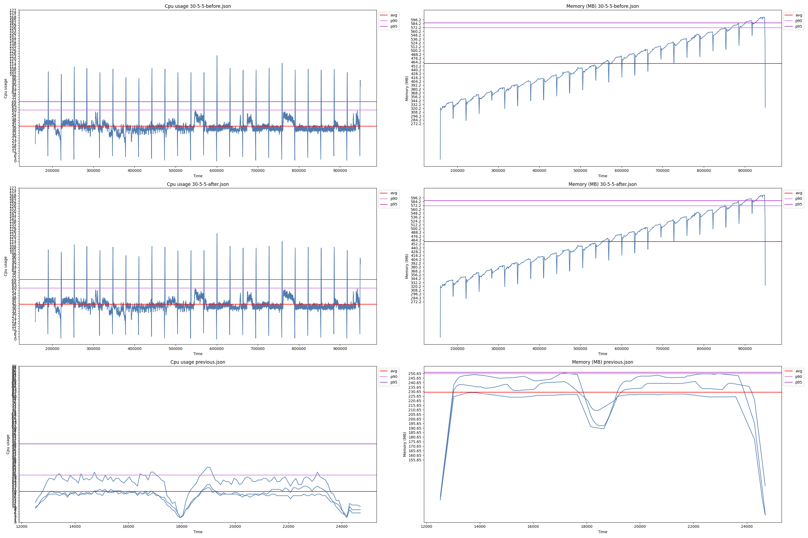

# vstart simple benchmark tool

This tool is basically a collector of data for all osds.

Currently it collects per osd process:
- CPU (% usage)
- Memory utilization (MBs)

A simple use for this tool would be collect data for a range of time, let's say 30 seconds:

`python3.11 ~/tester/benchmarker.py --period 30`

Instead of tracking by a period of time, you can run a benchmark tool for a number `number=samples*iterations` so that in he background we tracks osd information while the benchmarks runs:

`python3.11 ../src/test/objectstore/bench/benchmarker.py -n --period 30 --bench="bin/rados bench -p test 5 write" --samples 1 --iterations 5 # from build folder if you want to deploy vstart`
`python3.11 ../src/test/objectstore/bench/benchmarker.py -n --period 30 --bench="fio ..." --samples 1 --iterations 5`

If you want to plot previous runs you can plot as many as you want with the same command

`python ../src/test/objectstore/bench/benchmarker.py compare 1699023315.json previous.json anotherone.json`

output:
`benchmark.png` > plots

`previous.json` > last's run data

`1699023315.json` > data associated to a timestamp

Current ugly plot:

It plots a line for each osd.
