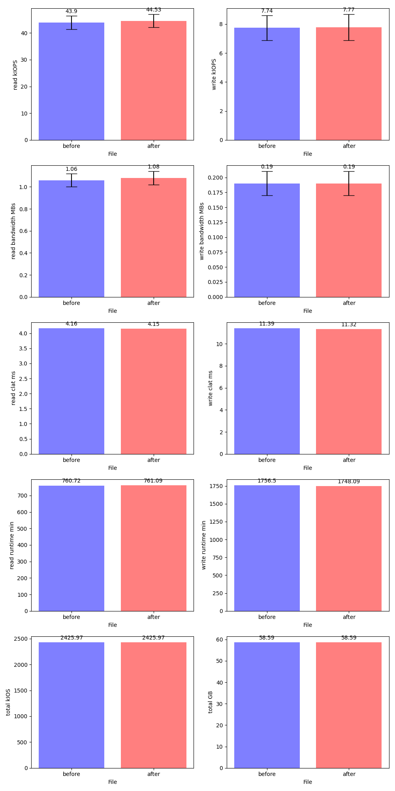

# vstart simple benchmark tool

This tool will create a cluster with test pool and then start running `rados bench` in the background while in the foreground, we collect data from all osds.
A previous.json with data related to the previous run will be generated, there will exist the same file with a different name with the timestamp. If you save 
one of those files in `last_bench.json` the next time you run the command it will plot the difference with of a new run with that one.

`python ../src/test/objectstore/bench/benchmarker.py --period 5 --osds 3 --rados_bench_args "-t 4 --concurrent-ios=50"`

output:
`benchmark.png` > plots

`previous.json` > last's run data

`1699023315.json` > data associated to a timestamp

Current ugly plot:

It plots a line for each osd.
