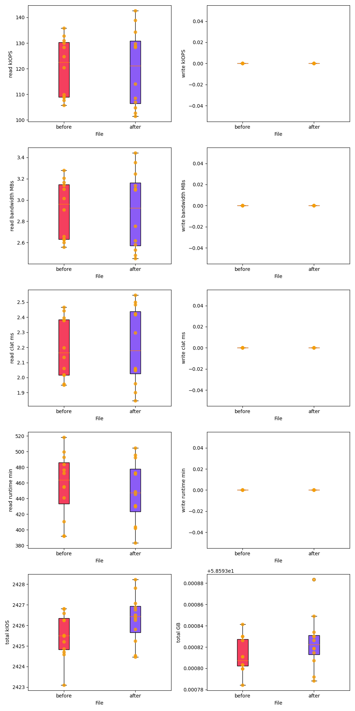
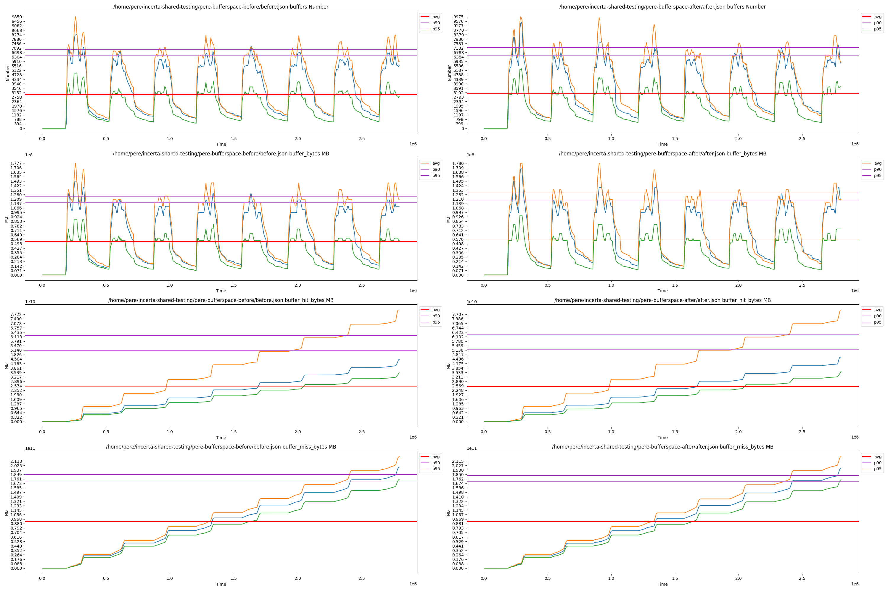

# vstart simple benchmark tool


## Configuration
This tool is basically a collector of data for all osds.

Currently it collects per osd process:
- CPU (% usage)
- Memory utilization (MBs)

A simple use for this tool would be collect data for a range of time, let's say 30 seconds:

`python3.11 ~/tester/benchmarker.py --period 30`

Instead of tracking by a period of time, you can run a benchmark tool for a number `number=samples*iterations` so that in he background we tracks osd information while the benchmarks runs:

`python3.11 ../src/test/objectstore/bench/benchmarker.py -n --period 30 --bench="bin/rados bench -p test 5 write" --samples 1 --iterations 5 # from build folder if you want to deploy vstart`
`python3.11 ../src/test/objectstore/bench/benchmarker.py -n --period 30 --bench="fio ..." --samples 1 --iterations 5`

If you want to plot previous runs you can plot as many as you want with the same command

`python ../src/test/objectstore/bench/benchmarker.py compare 1699023315.json previous.json anotherone.json`

**vstart configuration**
`do_vstart.sh` contains the vstart.sh command it will run, if you want to modify it, go ahead and do it manually

output:
`benchmark.png` > plots

`previous.json` > last's run data

`1699023315.json` > data associated to a timestamp

## Plot examples

**system plot**


**fio plot**


**perf dump plot**



## Extra examples
### Incerta testing

```bash
#!/bin/bash

DIR=$1 # incerta run directory 1
DIR2=$2 # incerta run directory 2
OUT=$3 # output of files

TEMP=$(mktemp -d)
TEMP2=$(mktemp -d)

# reformat files to correct json
for file in $(ls $DIR/*.fio)
do
    name=$(basename $file .fio)
    sed -n '/^{/,/^}/p' $file > $TEMP/$name-fio.json
done

for file in $(ls $DIR2/*.fio)
do
    name=$(basename $file .fio)
    sed -n '/^{/,/^}/p' $file > $TEMP2/$name-fio.json
done

# generate plots for each workload separately and group before files and after files separately
python3.11 ~/tester/benchmarker.py --outplot $OUT/randread --testname randread compare --type fio empty --group $(ls -d $TEMP/*.json | grep randread | grep -v 11 | xargs) --group $(ls -d $TEMP2/*.json | grep randread | grep -v 11 | xargs) --group-names before after
python3.11 ~/tester/benchmarker.py --outplot $OUT/randwrite --testname randwrite compare --type fio empty --group $(ls -d $TEMP/*.json | grep randwrite | grep -v 11 | xargs) --group $(ls -d $TEMP2/*.json | grep randwrite | grep -v 11 | xargs) --group-names before after
python3.11 ~/tester/benchmarker.py --outplot $OUT/randrw --testname randrw compare --type fio empty --group $(ls -d $TEMP/*.json | grep randrw | grep -v 11 | xargs) --group $(ls -d $TEMP2/*.json | grep randrw | grep -v 11 | xargs) --group-names before after

# generate plots for all workloads together and group before files and after files separately
python3.11 ~/tester/benchmarker.py --outplot $OUT/allrw --testname randrw compare --type fio empty --group $(ls -d $TEMP/*.json | grep -v 11 | xargs) --group $(ls -d $TEMP2/*.json | grep -v 11 | xargs) --group-names before after
```